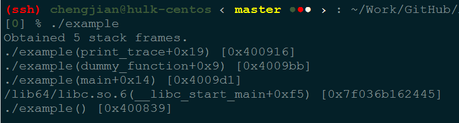
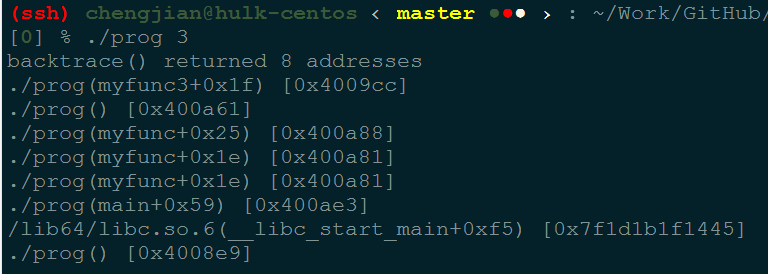
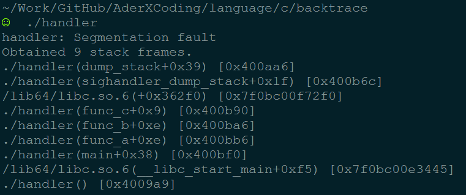
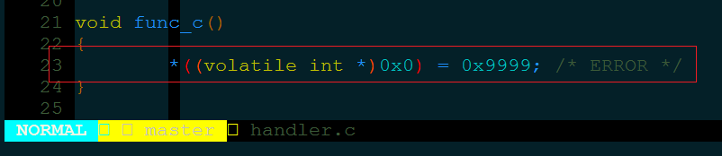
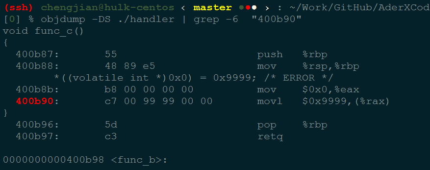

---

title: 用户态使用 glibc/backtrace 追踪函数调用堆栈定位段错误
date: 2018-09-02 18:40
author: gatieme
tags: linux
categories:
        - debug
thumbnail:
blogexcerpt: 一般用户态程序出现段错误, 而我们想要察看函数运行时堆栈, 常用的方法是使用GDB(bt命令)之类的外部调试器,但是有些时候为了分析程序的BUG,(主要针对长时间运行程序的分析),在程序出错时打印出函数的调用堆栈是非常有用的. C 库中提供了一些堆栈 backtrace 的函数用于跟踪函数的堆栈信息, 我们也可以通过注册异常处理函数来实现函数异常时自动打印调用栈.

---

| CSDN | GitHub | Hexo |
|:----:|:------:|:----:|
| [用户态使用 glibc/backtrace 追踪函数调用堆栈定位段错误](https://blog.csdn.net/gatieme/article/details/84189280) | [`AderXCoding/language/c/backtrace`](https://github.com/gatieme/AderXCoding/tree/master/language/c/backtrace) | [KernelShow(gatieme.github.io)](https://gatieme.github.io/2018/09/30/2018/09/0003-qemu_use_9pnet_virtio_fs_to_share_folder/index) |

<br>

<a rel="license" href="http://creativecommons.org/licenses/by-nc-sa/4.0/"></a>

本作品采用<a rel="license" href="http://creativecommons.org/licenses/by-nc-sa/4.0/">知识共享署名-非商业性使用-相同方式共享 4.0 国际许可协议</a>进行许可, 转载请注明出处, 谢谢合作

因本人技术水平和知识面有限, 内容如有纰漏或者需要修正的地方, 欢迎大家指正, 也欢迎大家提供一些其他好的调试工具以供收录, 鄙人在此谢谢啦

<br>


一般察看函数运行时堆栈的方法是使用 `GDB(bt命令)` 之类的外部调试器, 但是, 有些时候为了分析程序的 `BUG`,(主要针对长时间运行程序的分析),在程序出错时打印出函数的调用堆栈是非常有用的.


#1	glibc 获取堆栈信息的接口
-------


在 `glibc` 头文件 `execinfo.h` 中声明了三个函数用于获取当前线程的函数调用堆栈.


#1.1
-------

```cpp
#include <execinfo.h>

/* Store up to SIZE return address of the current program state in
   ARRAY and return the exact number of values stored.  */
int backtrace(void **array, int size);

/* Return names of functions from the backtrace list in ARRAY in a newly
   malloc()ed memory block.  */
char **backtrace_symbols(void *const *array, int size);

/* This function is similar to backtrace_symbols() but it writes the
   result immediately to a file.  */
void backtrace_symbols_fd(void *const *array, int size, int fd);
```

使用它们的时候有一下几点需要我们注意的地方：

*	backtrace的实现依赖于栈指针(fp寄存器), 在gcc编译过程中任何非零的优化等级（-On参数）或加入了栈指针优化参数 `-fomit-frame-pointer` 后多将不能正确得到程序栈信息;

*	backtrace_symbols的实现需要符号名称的支持, 在gcc编译过程中需要加入 `-rdynamic` 参数

*	内联函数没有栈帧, 它在编译过程中被展开在调用的位置；

*	尾调用优化(Tail-call Optimization)将复用当前函数栈, 而不再生成新的函数栈, 这将导致栈信息不能正确被获取。


##1.2	backtrace
-------

```cpp
int backtrace(void **buffer,int size)
```

该函数用于获取当前线程的调用堆栈,

参数:
	获取的信息将会被存放在 `buffer` 中,它是一个指针列表.
	参数 `size` 用来指定 `buffer` 中可以保存多少个 `void*` 元素.

函数返回值:
	实际获取的指针个数, 最大不超过 `size`大小.

在 `buffer` 中的指针实际是从堆栈中获取的返回地址, 每一个堆栈框架有一个返回地址

注意:某些编译器的优化选项对获取正确的调用堆栈有干扰,另外内联函数没有堆栈框架;删除框架指针也会导致无法正确解析堆栈内容

##1.3	backtrace_symbols
-------

```cpp
char ** backtrace_symbols (void *const *buffer, int size)
```

`backtrace_symbols` 将从 `backtrace` 函数获取的信息转化为一个字符串数组.

参数:
	`buffer` 应该是从 `backtrace` 函数获取的指针数组
	`size` 是该数组中的元素个数(`backtrace` 的返回值)

函数返回值:
	一个指向字符串数组的指针, 它的大小同 `buffer` 相同.
	每个字符串包含了一个相对于buffer中对应元素的可打印信息.
	它包括函数名，函数的偏移地址,和实际的返回地址

现在, 只有使用ELF二进制格式的程序才能获取函数名称和偏移地址. 在其他系统,只有16进制的返回地址能被获取.
另外,你可能需要传递相应的符号给链接器,以能支持函数名功能
>(比如,在使用GNU ld链接器的系统中,你需要传递(-rdynamic)， -rdynamic可用来通知链接器将所有符号添加到动态符号表中，如果你的链接器支持-rdynamic的话，建议将其加上！)

该函数的返回值是通过malloc函数申请的空间,因此调用者必须使用free函数来释放指针.

>注意 : 如果不能为字符串获取足够的空间函数的返回值将会为NULL

##1.4	backtrace_symbols_fd
-------

```cpp
void backtrace_symbols_fd (void *const *buffer, int size, int fd)
```

`backtrace_symbols_fd` 与 `backtrace_symbols` 函数具有相同的功能, 不同的是它不会给调用者返回字符串数组,而是将结果写入文件描述符为 `fd` 的文件中, 每个函数对应一行.它不需要调用malloc函数,因此适用于有可能调用该函数会失败的情况


#2	示例
-------


##2.1	简单用例(glibc 提供)
-------

下面是 `glibc` 中的实例：

```cpp
// http://www.gnu.org/software/libc/manual/html_node/Backtraces.html
#include <execinfo.h>
#include <stdio.h>
#include <stdlib.h>

/* Obtain a backtrace and print it to @code{stdout}. */
void print_trace (void)
{
	void    * array[10];
	size_t  size;
	char    ** strings;
	size_t  i;

	size = backtrace(array, 10);
	strings = backtrace_symbols (array, size);
	if (NULL == strings)
	{
		perror("backtrace_symbols");
		exit(EXIT_FAILURE);
	}

	printf ("Obtained %zd stack frames.\n", size);

	for (i = 0; i < size; i++)
		printf ("%s\n", strings[i]);

	free (strings);
	strings = NULL;
}

/* A dummy function to make the backtrace more interesting. */
void dummy_function (void)
{
	print_trace();
}

int main (int argc, char *argv[])
{
	dummy_function();
	return 0;
}
```


输出如下：


```cpp
gcc -c example.c -o example.o    -rdynamic -g
gcc example.o -o example  -rdynamic -g

#./example

Obtained 5 stack frames.
./example(print_trace+0x19) [0x400916]
./example(dummy_function+0x9) [0x4009bb]
./example(main+0x14) [0x4009d1]
/lib64/libc.so.6(__libc_start_main+0xf5) [0x7fb5e7f49445]
./example() [0x400839]
```



##2.2	简单使用(man手册)
-------

```cpp
//http://man7.org/linux/man-pages/man3/backtrace.3.html
#include <execinfo.h>
#include <stdio.h>
#include <stdlib.h>
#include <unistd.h>

	void
myfunc3(void)
{
	int j, nptrs;
#define SIZE 100
	void *buffer[100];
	char **strings;

	nptrs = backtrace(buffer, SIZE);
	printf("backtrace() returned %d addresses\n", nptrs);

	/* The call backtrace_symbols_fd(buffer, nptrs,
	 * STDOUT_FILENO)
	 *               would produce similar output to the
	 *               following: */

	strings = backtrace_symbols(buffer, nptrs);
	if (strings == NULL) {
		perror("backtrace_symbols");
		exit(EXIT_FAILURE);
	}

	for (j = 0; j < nptrs; j++)
		printf("%s\n", strings[j]);

	free(strings);
}

static void   /* "static" means don't export the symbol... */
myfunc2(void)
{
	myfunc3();
}

void
myfunc(int ncalls)
{
	if (ncalls > 1)
		myfunc(ncalls - 1);
	else
		myfunc2();
}

```

编译运行程序

```cpp
gcc -c prog.c -o prog.o    -rdynamic -g
gcc prog.o -o prog  -rdynamic -g


#./prog 3

backtrace() returned 8 addresses
./prog(myfunc3+0x1f) [0x4009cc]
./prog() [0x400a61]
./prog(myfunc+0x25) [0x400a88]
./prog(myfunc+0x1e) [0x400a81]
./prog(myfunc+0x1e) [0x400a81]
./prog(main+0x59) [0x400ae3]
/lib64/libc.so.6(__libc_start_main+0xf5) [0x7f1d1b1f1445]
./prog() [0x4008e9]

```




##2.3	段错误时自动触发 `call trace`
-------

我们还可以利用这 `backtrace` 来定位段错误位置.

通常情况系, 程序发生段错误时系统会发送 `SIGSEGV` 信号给程序, 缺省处理是退出函数.

我们可以使用 `signal(SIGSEGV, &your_function);` 函数来接管 `SIGSEGV` 信号的处理,
程序在发生段错误后, 自动调用我们准备好的函数, 从而在那个函数里来获取当前函数调用栈.


```cpp
#include <stdio.h>
#include <stdlib.h>
#include <stddef.h>
#include <execinfo.h>
#include <signal.h>

/* Obtain a backtrace and print it to stdout. */
#define ARRAY_SIZE(x) (sizeof(x)/sizeof(x[0]))
void dump_stack(void)
{
	void *array[30] = { 0 };
	size_t size = backtrace(array, ARRAY_SIZE(array));
	char **strings = backtrace_symbols(array, size);
	size_t i;

	if (strings == NULL)
	{
		perror("backtrace_symbols.");
		exit(EXIT_FAILURE);
	}

	printf("Obtained %zd stack frames.\n", size);

	for (i = 0; i < size; i++)
		printf("%s\n", strings[i]);

	free(strings);
	strings = NULL;

	exit(EXIT_SUCCESS);
}

void sighandler_dump_stack(int sig)
{
	psignal(sig, "handler");
	dump_stack();
	signal(sig, SIG_DFL);
	raise(sig);
}

void func_c()
{
	*((volatile int *)0x0) = 0x9999; /* ERROR */
}

void func_b()
{
	func_c();
}

void func_a()
{
	func_b();
}


int main(int argc, const char *argv[])
{
	if (signal(SIGSEGV, sighandler_dump_stack) == SIG_ERR)
		perror("can't catch SIGSEGV");

	func_a();

	return 0;
}
```

编译该程序

```cpp
cc -c handler.c -o handler.o    -rdynamic
cc handler.o -o handler  -rdynamic
```

接着运行.

```cpp
#./handler

handler: Segmentation fault
Obtained 9 stack frames.
./handler(dump_stack+0x39) [0x400aa6]
./handler(sighandler_dump_stack+0x1f) [0x400b6c]
/lib64/libc.so.6(+0x362f0) [0x7f0bc00f72f0]
./handler(func_c+0x9) [0x400b90]
./handler(func_b+0xe) [0x400ba6]
./handler(func_a+0xe) [0x400bb6]
./handler(main+0x38) [0x400bf0]
/lib64/libc.so.6(__libc_start_main+0xf5) [0x7f0bc00e3445]
./handler() [0x4009a9]
```



可以看出, 真正出异常的函数位置在 `./handler(func_c+0x9) [0x400b90]`.

我们可以看下这个位置位于哪里:

*	使用 `addr2line`

```cpp
addr2line -C -f -e  ./handler 0x400b90
```


对应错误的行号.



*	使用 `objdump`

使用 objdump 将函数的指令信息 dump 出来.
其中  -D 参数表示显示所有汇编代码, -S 表示将对应的源码也显示出来
最后用 grep 显示地址 0x400b90 处前后 6 行的信息

```cpp
objdump -DS ./handler | grep -6  "400b90"
```




参考代码:

>[a user-space simulated dump_stack(), based on mips.](https://github.com/castoz/backtrace)
>
>[kernel perf source dump_stack](https://elixir.bootlin.com/linux/v4.19.2/source/tools/perf/util/debug.c#L260)


#3	参考资料
-------

[Stack backtrace 的实现](https://www.douban.com/group/topic/54568167/)


[backtrace.c：Code Content](http://en.verysource.com/code/6087935_1/backtrace.c.html)


[一个glibc中abort不能backtrace的问题](https://www.xuebuyuan.com/2867142.html)


[在Linux中如何利用backtrace信息解决问题](https://blog.csdn.net/jxgz_leo/article/details/53458366)

<br>

*	本作品/博文 ( [AderStep-紫夜阑珊-青伶巷草 Copyright ©2013-2017](http://blog.csdn.net/gatieme) ), 由 [成坚(gatieme)](http://blog.csdn.net/gatieme) 创作.

*	采用<a rel="license" href="http://creativecommons.org/licenses/by-nc-sa/4.0/"></a><a rel="license" href="http://creativecommons.org/licenses/by-nc-sa/4.0/">知识共享署名-非商业性使用-相同方式共享 4.0 国际许可协议</a>进行许可. 欢迎转载、使用、重新发布, 但务必保留文章署名[成坚gatieme](http://blog.csdn.net/gatieme) ( 包含链接: http://blog.csdn.net/gatieme ), 不得用于商业目的.

*	基于本文修改后的作品务必以相同的许可发布. 如有任何疑问，请与我联系.
