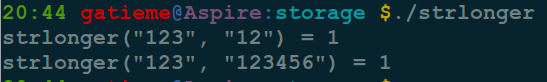

有符号数和无符号数
=======


#1	有符号数和无符号数的表示
-------


三者的最高位均为符号位.

我以前一直没弄明白的是为何8位补码的表示范围是-128~127, 今天查阅了相关资料，于此记下。

仍然以8位为例：


**原码**

原码的表示范围`-127~-0`, `+0~+127`, 共256个数字。

正0的原码是0000 0000, 负0的原码是1000 0000, 有正0负0之分, 不符合人的习惯, 待解决.

**反码**

除符号位, 原码其余位取反而得
+0：0000 0000，-0：1111 1111 仍然有正0负0之分。

**补码**

在反码的基础上加1而得

对原码的两种0同时末位加1

+0：0000 0000，-0：0000 0000(因为溢出导致8位全0)

消除了正0负0之别, 如此一来, 便节省出一个数值表示方式1000 0000, 不能浪费, 用来表示-128, -128特殊之处在于没有相应的反码原码。也可以这样考虑:

```cpp
-1：   1111 1111
-2：   1111 1110（在-1的基础上减1，直接将补码减1即可）
-3：   1111 1101（在-2补码基础上减1，以下类似）
-4：   1111 1100
……
-127：1000 0001
-128：1000 0000
```


如此以来：8位补码表示范围是-128~+127因为0只有一种形式所以，仍然是256个数

若8位代表无符号数, 则表示范围是 : 0~255, 这就是为什么高级语言讲到数据类型，

比如C++中的short类型时（16位长）说其表示范围是：-32768~+32767，而unsigned short表示的范围则是：0~65535


#2	有符号和无符号数的表示
-------

<font color=0x00ffff>
在计算机中无符号数用原码表示, 有符号数用补码表示
</font>


w位补码表示的值为:

$-x_{w-1}2^{w-1}+{\sum_{i=1}^{w-2}x_{i}2^{i}}$ ($x_i$为补码的第i位, i从0开始)

最高位 也称符号位，1表示负数，0表示正数，符号位为0时，和无符号数的表示是相同的，以下是4位补码的示例：

$0101 = -0*2^{3} + 1*2^{2} + 0*2^{1} + 1*2^{0} = 5$

$1101 = -1*2^{3} + 1*2^{2} + 0*2^{1} + 1*2^{0} = -3$

w位的补码表示的数值范围是[-2w-1, 2w-1-1]

如4位的补码表示的最小值是-8(1000), 最大值是7(0111).


只有理解了有符号数的补码表示, 才能真正理解无符号数和有符号数的转换、有符号数的截断和溢出等问题.


#3	陷阱
-------


在C语言中，如果一个运算包含一个有符号数和一个无符号数，那么C语言会隐式地将有符号数转换为无符号数，这对于标准的算术运算没什么问题，但是对于 < 和 > 这样的关系运算符来说，它会出现非直观的结果，这种非直观的特性经常会导致程序中难以察觉的错误

看下面的例子：

```cpp
int strlonger(char *s, char *t)
{
    return strlen(s) - strlen(t) > 0;
}
```




上面的函数看起来似乎没什么问题, 实际上当s比t短时，函数的返回值也是1, 为什么会出现这种情况呢?


原来strlen的返回值类型为size_t，C语言中将size_t定义为unsigned int，当s比t短时,strlen(s) - strlen(t)为负数，但无符号数的运算结果隐式转换为无符号数就变成了很大的无符号数.


为了让函数正确工作，代码应该修改如下 :

>return strlen(s) > strlen(t);

2002年, 从事FreeBSD开源操作系统项目的程序员意识到，他们对`getpeername`函数的实现存在安全漏洞.代码的简化版本如下：

```cpp
//void *memcpy(void *dest, void *src,  size_t n);

#define KSIZE 1024
char kbuf[KSIZE];


int copy_from_kernel(void *user_dest, int maxlen)
{
    int len = KSIZE < maxlen ? KSIZE : maxlen;
    memcpy(user_dest, kbuf, len);
    retn len;
}
```

你看出了问题所在吗？


#4	扩展、截断和溢出
-------

##4.1	转换
-------


当数据类型转换时，同时需要在不同数据大小，以及无符号和有符号之间转换时，C语言标准要求先进行数据大小的转换，之后再进行无符号和有符号之间的转换.


C语言中的强制类型转换保持二进制位值不变，只是改变解释位的方式

看以下代码：

```cpp
short int v = -12345;
unsigned short uv = (unsigned short)v;
printf("v = %d, uv = %u\n”, u, uv);
```

输出如下：

>v = -12345, uv = 53191

由于-12345的16位补码表示与53191的16位无符号表示是完全一样的，所以会得到以上输出。

无符号数和有符号数之间的转换是一一对应的关系，w位的有符号数s转换无符号数u的对应关系为：


如4位有符号数7（0111）转换为无符号数也是7，而4位有符号数-1（1111）转换为无符号数是15。

类似地，w位的无符号数u转换为有符号数s的对应关系为：


如4位无符号数5（0101）转换为无符号数也是5，而4位无符号数13（1101）转换为无符号数为-3。

其实只要知道无符号数和有符号数对二进制位的解释方式，无需记住上述的对应关系，也能算出转换后的值。


##4.2	扩展
-------

*	将无符号数转换为更大的数据类型时, 只需简单地在开头添加0，这种运算称为0扩展

*	将有符号数转换为更大的数据类型需要执行符号扩展，规则是将符号位扩展至所需要的位数


同样对于如下的例子

```cpp
//  如果是char, 那么系统认为最高位是符号位, 而int可能是16或者32位, 那么会对最高位进行扩展
signed char c7_1 = 0xff;
//  如果是unsigned char, 那么不会扩展.
unsigned char c7_2 = 0xff;
//  最高位若为0时, 二者没有区别, 若为1时，则有区别
printf("signed   %08x, %d\n", c7_1, c7_1);
printf("unsigned %08x, %d\n", c7_2, c7_2);
```

<font color=0x00ffff>
*	如果是char, 那么系统认为最高位是符号位, 而int可能是16或者32位, 那么会对最高位进行扩展, 因此0xff在从signed char转换为unsigned char时认为最高位1是符号位, 进行了扩展, 被扩展为0xffffffff, 值为-1

*	如果是unsigned char, 那么不会扩展, 0xff仍然成为0x000000ff, 值为255

最高位若为0时, 二者没有区别, 若为1时，则有区别
</font>


示例程序

```cpp
#include <stdio.h>
#include <stdlib.h>

///
int main(void)
{
    printf("=======test         -1=======\n");
    //  如果是char, 那么系统认为最高位是符号位, 而int可能是16或者32位, 那么会对最高位进行扩展
    signed char c7_1 = 0x00ff; //int i7_1 = (int)c7_1;
    //  如果是unsigned char, 那么不会扩展.
    unsigned char c7_2 = 0x00ff; //int i7_2 = (int)c7_2;
    //  最高位若为0时, 二者没有区别, 若为1时，则有区别
    printf("signed   %08x, %d\n", c7_1, c7_1);
    printf("unsigned %08x, %d\n", c7_2, c7_2);


    printf("\n=======test high bit 1=======\n");
    //  最高位为1
    signed char cc1 = 0x80;
    unsigned char cc2 = 0x80;
    printf("signed   %08x, %d\n", cc1, cc1);
    printf("unsigned %08x, %d\n", cc2, cc2);

    printf("\n=======test high bit 0=======\n");
    //  最高位为0
    signed char cc3 = 0x7f;
    unsigned char cc4 = 0x7f;
    printf("signed   %08x, %d\n", cc3, cc3);
    printf("unsigned %08x, %d\n", cc4, cc4);


    return EXIT_SUCCESS;
}
```


如将4位的二进制数1001(-7)扩展为8位的结果为11111001(-7).

##4.3	截断
-------

将一个大的数据类型转换为小的数据类型时，不管是无符号数还是有符号数都是简单地进行位**截断**

无符号数的数值大小可能因截断而变化，而有符号数不仅数值大小可能变化，符号位也可能发生改变，如8位二进制数00011001(25)转换为4位数截断的结果是1001(-7).

##4.4	溢出
-------

在进行整数的算术运算时，当结果变量的位数不足以存放实际实际结果的位数时，运算的结果就会因截断而产生溢出，如果4位二进制数运算1011(-5) + 1011(-5) = 10110(-10)， 但如果结果也采用4位二进制存放就会截断为0110（6），产生溢出。


