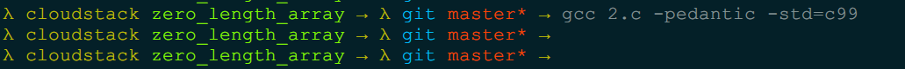

GDB实用插件(peda, gef, gdbinit)全解
=======

| CSDN | GitHub |
|:----:|:------:|
| [GDB实用插件(peda, gef, gdbinit)全解](http://blog.csdn.net/gatieme/article/details/63254211) | [`AderXCoding/system/tools/gdb/plugin`](https://github.com/gatieme/AderXCoding/tree/master/system/tools/gdb/plugin) |


<br>
<a rel="license" href="http://creativecommons.org/licenses/by-nc-sa/4.0/"></a>
本作品采用<a rel="license" href="http://creativecommons.org/licenses/by-nc-sa/4.0/">知识共享署名-非商业性使用-相同方式共享 4.0 国际许可协议</a>进行许可, 转载请注明出处, 谢谢合作
<br>


#1  零长度数组概念
-------


众所周知, `GNU/GCC` 在标准的 `C/C++` 基础上做了有实用性的扩展, 零长度数组（`Arrays of Length Zero`） 就是其中一个知名的扩展.

多数情况下,  其应用在变长数组中, 其定义如下


```cpp
struct Packet
{
    int state;
    int len;
    char cData[0]; //这里的0长结构体就为变长结构体提供了非常好的支持
};
```

首先对 `0长度数组`, 也叫柔性数组 做一个解释 ：

*   用途 : 长度为0的数组的主要用途是为了满足需要变长度的结构体

*   用法 : 在一个结构体的最后, 申明一个长度为0的数组, 就可以使得这个结构体是可变长的. 对于编译器来说, 此时长度为0的数组并不占用空间, 因为数组名本身不占空间, 它只是一个偏移量,  数组名这个符号本身代表了一个不可修改的地址常量 

>(注意 : 数组名永远都不会是指针!), 但对于这个数组的大小, 我们可以进行动态分配
>
>
>注意 ：如果结构体是通过calloc、malloc或 者new等动态分配方式生成，在不需要时要释放相应的空间。
>
>优点 ：比起在结构体中声明一个指针变量、再进行动态分 配的办法，这种方法效率要高。因为在访问数组内容时，不需要间接访问，避免了两次访存。
>
>缺点 ：在结构体中，数组为0的数组必须在最后声明，使 用上有一定限制。


**对于编译器而言, 数组名仅仅是一个符号, 它不会占用任何空间, 它在结构体中, 只是代表了一个偏移量, 代表一个不可修改的地址常量!**


#2	0长度数组的用途
-------


我们设想这样一个场景, 我们在网络通信过程中使用的数据缓冲区, 缓冲区包括一个len字段和data字段, 分别标识数据的长度和传输的数据, 我们常见的有几种设计思路

*	定长数据缓冲区, 设置一个足够大小 `MAX_LENGTH` 的数据缓冲区

*	设置一个指向实际数据的指针, 每次使用时, 按照数据的长度动态的开辟数据缓冲区的空间.

我们从实际场景中应用的设计来考虑他们的优劣. 主要考虑的有, 缓冲区空间的开辟, 释放和访问.


##2.1  定长包(开辟空间, 释放, 访问)
-------


比如我要发送 `1024` 字节的数据, 如果用**定长包**, 假设定长包的长度 `MAX_LENGTH` 为 `2048`, 就会浪费 `1024` 个字节的空间, 也会造成不必要的流量浪费.

*	数据结构定义

```cpp
//  定长缓冲区
struct max_buffer
{
    int     len;
    char    data[MAX_LENGTH];
};
```

*	数据结构大小

考虑对齐, 那么数据结构的大小 `>= sizeof(int) + sizeof(char) * MAX_LENGTH`

由于考虑到数据的溢出, 变长数据包中的 `data`  数组长度一般会设置得足够长足以容纳最大的数据, 因此 `max_buffer` 中的 `data` 数组很多情况下都没有填满数据, 因此造成了浪费

*	数据包的构造

假如我们要发送 `CURR_LENGTH = 1024` 个字节, 我们如何构造这个数据包呢:

一般来说, 我们会返回一个指向缓冲区数据结构 `max_buffer` 的指针.

```cpp
    ///  开辟
    if ((mbuffer = (struct max_buffer *)malloc(sizeof(struct max_buffer))) != NULL)
    {
        mbuffer->len = CURR_LENGTH;
        memcpy(mbuffer->data, "Hello World", CURR_LENGTH);


        printf("%d, %s\n", mbuffer->len, mbuffer->data);
    }
```

*	访问

这段内存要分两部分使用

前部分 `4` 个字节 `p->len`, 作为包头(就是多出来的那部分)，这个包头是用来描述紧接着包头后面的数据部分的长度，这里是 `1024`, 所以前四个字节赋值为 `1024` (既然我们要构造不定长数据包，那么这个包到底有多长呢，因此，我们就必须通过一个变量来表明这个数据包的长度，这就是len的作用)，

而紧接其后的内存是真正的数据部分, 通过 `p->data`, 最后, 进行一个 `memcpy()` 内存拷贝, 把要发送的数据填入到这段内存当中


*	释放

那么当使用完毕释放数据的空间的时候, 直接释放就可以了

```cpp
    /// 销毁
    free(mbuffer);
    mbuffer = NULL;
```

*	小结


1.	使用定长数组, 作为数据缓冲区, 为了避免造成缓冲区溢出, 数组的大小一般设为足够的空间 `MAX_LENGTH`, 而实际使用过程中, 达到 `MAX_LENGTH` 长度的数据很少, 那么多数情况下, 缓冲区的大部分空间都是浪费掉的.

2.	但是使用过程很简单, 数据空间的开辟和释放简单, 无需程序员考虑额外的操作


##2.2  指针数据包(开辟空间, 释放, 访问)
-------

如果你将上面的长度为 `MAX_LENGTH` 的定长数组换为**指针**, 每次使用时动态的开辟 `CURR_LENGTH` 大小的空间, 那么就避免造成 `MAX_LENGTH - CURR_LENGTH`  空间的浪费, 只浪费了一个指针域的空间.

*	数据包定义

```cpp
struct point_buffer
{
    int     len;
    char    *data;
};
```

*	数据结构大小

考虑对齐, 那么数据结构的大小 `>= sizeof(int) + sizeof(char *)`


*	空间分配

但是也造成了使用在分配内存时，需采用两步

```cpp
    // =====================
    // 指针数组  占用-开辟-销毁
    // =====================
    ///  占用
    printf("the length of struct test3:%d\n",sizeof(struct point_buffer));
    ///  开辟
    if ((pbuffer = (struct point_buffer *)malloc(sizeof(struct point_buffer))) != NULL)
    {
        pbuffer->len = CURR_LENGTH;
        if ((pbuffer->data = (char *)malloc(sizeof(char) * CURR_LENGTH)) != NULL)
        {
            memcpy(pbuffer->data, "Hello World", CURR_LENGTH);


            printf("%d, %s\n", pbuffer->len, pbuffer->data);
        }
    }
```


1.	首先, 需为结构体分配一块内存空间;

2.	其次再为结构体中的成员变量分配内存空间.

这样两次分配的内存是不连续的, 需要分别对其进行管理. 当使用长度为的数组时, 则是采用一次分配的原则, 一次性将所需的内存全部分配给它.

*	释放

相反, 释放时也是一样的.

```cpp
    /// 销毁
    free(pbuffer->data);
    free(pbuffer);
    pbuffer = NULL;
```

*	小结

1.	使用指针结果作为缓冲区, 只多使用了一个指针大小的空间, 无需使用 `MAX_LENGTH` 长度的数组, 不会造成空间的大量浪费.

2.	但那是开辟空间时, 需要额外开辟数据域的空间, 施放时候也需要显示释放数据域的空间, 但是实际使用过程中, 往往在函数中开辟空间, 然后返回给使用者指向 `struct point_buffer` 的指针, 这时候我们并不能假定使用者了解我们开辟的细节, 并按照约定的操作释放空间, 因此使用起来多有不便, 甚至造成内存泄漏


##2.3  变长数据缓冲区(开辟空间, 释放, 访问)
-------

定长数组使用方便, 但是却浪费空间, 指针形式只多使用了一个指针的空间, 不会造成大量空间分浪费, 但是使用起来需要多次分配, 多次释放, 那么有没有一种实现方式能够既不浪费空间, 又使用方便的呢?


`GNU C` 的0长度数组, 也叫变长数组, 柔性数组就是这样一个扩展. 对于**0长数组**的这个特点，很容易构造出变成结构体，如缓冲区，数据包等等：

*	数据结构定义

```cpp
//  0长度数组
struct zero_buffer
{
    int     len;
    char    data[0];
};
```

*	数据结构大小

这样的变长数组常用于网络通信中构造不定长数据包, 不会浪费空间浪费网络流量, 因为`char    data[0];` 只是个数组名, 是不占用存储空间的,

即 `sizeof(struct zero_buffer) = sizeof(int)`


*	开辟空间

那么我们使用的时候, 只需要开辟一次空间即可

```cpp
    ///  开辟
    if ((zbuffer = (struct zero_buffer *)malloc(sizeof(struct zero_buffer) + sizeof(char) * CURR_LENGTH)) != NULL)
    {
        zbuffer->len = CURR_LENGTH;
        memcpy(zbuffer->data, "Hello World", CURR_LENGTH);


        printf("%d, %s\n", zbuffer->len, zbuffer->data);
    }
```

*	释放空间

释放空间也是一样的, 一次释放即可

```cpp
    ///  销毁
    free(zbuffer);
    zbuffer = NULL;
```

##2.4 总结


```cpp
// zero_length_array.c
#include <stdio.h>
#include <stdlib.h>


#define MAX_LENGTH      1024
#define CURR_LENGTH      512

//  0长度数组
struct zero_buffer
{
    int     len;
    char    data[0];
}__attribute((packed));


//  定长数组
struct max_buffer
{
    int     len;
    char    data[MAX_LENGTH];
}__attribute((packed));


//  指针数组
struct point_buffer
{
    int     len;
    char    *data;
}__attribute((packed));

int main(void)
{
    struct zero_buffer  *zbuffer = NULL;
    struct max_buffer   *mbuffer = NULL;
    struct point_buffer *pbuffer = NULL;


    // =====================
    // 0长度数组  占用-开辟-销毁
    // =====================
    ///  占用
    printf("the length of struct test1:%d\n",sizeof(struct zero_buffer));
    ///  开辟
    if ((zbuffer = (struct zero_buffer *)malloc(sizeof(struct zero_buffer) + sizeof(char) * CURR_LENGTH)) != NULL)
    {
        zbuffer->len = CURR_LENGTH;
        memcpy(zbuffer->data, "Hello World", CURR_LENGTH);


        printf("%d, %s\n", zbuffer->len, zbuffer->data);
    }
    ///  销毁
    free(zbuffer);
    zbuffer = NULL;


    // =====================
    // 定长数组  占用-开辟-销毁
    // =====================
    ///  占用
    printf("the length of struct test2:%d\n",sizeof(struct max_buffer));
    ///  开辟
    if ((mbuffer = (struct max_buffer *)malloc(sizeof(struct max_buffer))) != NULL)
    {
        mbuffer->len = CURR_LENGTH;
        memcpy(mbuffer->data, "Hello World", CURR_LENGTH);


        printf("%d, %s\n", mbuffer->len, mbuffer->data);
    }
    /// 销毁
    free(mbuffer);
    mbuffer = NULL;

    // =====================
    // 指针数组  占用-开辟-销毁
    // =====================
    ///  占用
    printf("the length of struct test3:%d\n",sizeof(struct point_buffer));
    ///  开辟
    if ((pbuffer = (struct point_buffer *)malloc(sizeof(struct point_buffer))) != NULL)
    {
        pbuffer->len = CURR_LENGTH;
        if ((pbuffer->data = (char *)malloc(sizeof(char) * CURR_LENGTH)) != NULL)
        {
            memcpy(pbuffer->data, "Hello World", CURR_LENGTH);


            printf("%d, %s\n", pbuffer->len, pbuffer->data);
        }
    }
    /// 销毁
    free(pbuffer->data);
    free(pbuffer);
    pbuffer = NULL;


    return EXIT_SUCCESS;
}
```


*	长度为0的数组并不占有内存空间, 而指针方式需要占用内存空间.

*	对于长度为0数组, 在申请内存空间时, 采用一次性分配的原则进行; 对于包含指针的结构体, 才申请空间时需分别进行, 释放时也需分别释放.

*	对于长度为的数组的访问可采用数组方式进行


#3	GNU Document中 变长数组的支持
-------

>参见
>
>[6.17 Arrays of Length Zero](https://gcc.gnu.org/onlinedocs/gcc/Zero-Length.html)
>
>[C Struct Hack – Structure with variable length array](http://frankchang0125.blogspot.com/2013/01/c-struct-hack-structure-with-variable.html)

在 `C90` 之前, 并不支持0长度的数组, 0长度数组是 `GNU C` 的一个扩展, 因此早期的编译器中是无法通过编译的

对于 `GNU C` 增加的扩展, `GCC` 提供了编译选项来明确的标识出他们

1、`-pedantic` 选项，那么使用了扩展语法的地方将产生相应的警告信息

2、`-Wall` 使用它能够使GCC产生尽可能多的警告信息

3、`-Werror`, 它要求GCC将所有的警告当成错误进行处理


```cpp
// 1.c
#include <stdio.h>
#include <stdlib.h>


int main(void)
{
    char a[0];
    printf("%ld", sizeof(a));
    return EXIT_SUCCESS;
}
```
我们来编译

```cpp
gcc 1.c -Wall	# 显示所有警告
#none warning and error

gcc 1.c -Wall -pedantic  # 对GNU C的扩展显示警告
1.c: In function ‘main’:
1.c:7: warning: ISO C forbids zero-size array ‘a’


gcc 1.c -Werror -Wall -pedantic # 显示所有警告同时GNU C的扩展显示警告, 将警告用error显示
cc1: warnings being treated as errors
1.c: In function ‘main’:
1.c:7: error: ISO C forbids zero-size array ‘a’
```

0长度数组其实就是灵活的运用的数组指向的是其后面的连续的内存空间

```cpp
struct buffer
{
    int     len;
    char    data[0];
};
```
在早期没引入0长度数组的时候, 大家是通过定长数组和指针的方式来解决的, 但是

*	定长数组定义了一个足够大的缓冲区, 这样使用方便, 但是每次都造成空间的浪费
*	指针的方式, 要求程序员在释放空间是必须进行多次的free操作, 而我们在使用的过程中往往在函数中返回了指向缓冲区的指针, 我们并不能保证每个人都理解并遵从我们的释放方式


所以 `GNU` 就对其进行了0长度数组的扩展. 当使用data[0]的时候, 也就是0长度数组的时候，0长度数组作为数组名, 并不占用存储空间.

在`C99`之后，也加了类似的扩展，只不过用的是 `char payload[]`这种形式（所以如果你在编译的时候确实需要用到`-pedantic`参数，那么你可以将`char payload[0]`类型改成`char payload[]`, 这样就可以编译通过了，当然你的编译器必须支持C99标准的，如果太古老的编译器，那可能不支持了)

```cpp
// 2.c payload
#include <stdio.h>
#include <stdlib.h>

struct payload
{
    int   len;
    char  data[];
};

int main(void)
{
    struct payload pay;
    printf("%ld", sizeof(pay));
    return EXIT_SUCCESS;
}
```
使用 `-pedantic` 编译后, 不出现警告, 说明这种语法是 `C` 标准的

```cpp
gcc 2.c -pedantic -std=c99
```


所以结构体的末尾, 就是指向了其后面的内存数据。因此我们可以很好的将该类型的结构体作为数据报文的头格式，并且最后一个成员变量，也就刚好是数据内容了.


GNU手册还提供了另外两个结构体来说明，更容易看懂意思：


```cpp
struct f1 {
    int x;
    int y[];
} f1 = { 1, { 2, 3, 4 } };

struct f2 {
    struct f1 f1;
    int data[3];
} f2 = { { 1 }, { 5, 6, 7 } };
```

我把f2里面的2,3,4改成了5,6,7以示区分。如果你把数据打出来。即如下的信息：

```cpp
f1.x = 1
f1.y[0] = 2
f1.y[1] = 3
f1.y[2] = 4
```

也就是f1.y指向的是{2,3,4}这块内存中的数据。所以我们就可以轻易的得到，f2.f1.y指向的数据也就是正好f2.data的内容了。打印出来的数据：

```cpp
f2.f1.x = 1
f2.f1.y[0] = 5
f2.f1.y[1] = 6
f2.f1.y[2] = 7
```

如果你不是很确认其是否占用空间. 你可以用sizeof来计算一下。就可以知道sizeof(struct f1)=4,也就是int y[]其实是不占用空间的。但是这个0长度的数组，必须放在结构体的末尾。如果你没有把它放在末尾的话。编译的时候，会有如下的错误：

```cpp
main.c:37:9: error: flexible array member not at end of struct
     int y[];
         ^
```

到这边，你可能会有疑问，如果将struct f1中的int y[]替换成int *y，又会是如何？这就涉及到数组和指针的问题了. 有时候吧，这两个是一样的，有时候又有区别。

首先要说明的是，支持0长度数组的扩展，重点在数组，也就是不能用int *y指针来替换。sizeof的长度就不一样了。把struct f1改成这样：

```cpp
struct f3 {
    int x;
    int *y;
};
```
在32/64位下, `int`均是4个字节, `sizeof(struct f1)=4`，而`sizeof(struct f3)=16`

因为 `int *y` 是指针, 指针在`64`位下, 是`64`位的， `sizeof(struct f3) = 16`, 如果在`32`位环境的话, `sizeof(struct f3)` 则是 `8` 了, `sizeof(struct f1)` 不变. 所以 `int *y` 是不能替代 `int y[]` 的.

代码如下

```cpp
// 3.c
#include <stdio.h>
#include <stdlib.h>


struct f1 {
    int x;
    int y[];
} f1 = { 1, { 2, 3, 4 } };

struct f2 {
    struct f1 f1;
    int data[3];
} f2 = { { 1 }, { 5, 6, 7 } };


struct f3
{
    int x;
    int *y;
};

int main(void)
{
    printf("sizeof(f1) = %d\n", sizeof(struct f1));
    printf("sizeof(f2) = %d\n", sizeof(struct f2));
    printf("szieof(f3) = %d\n\n", sizeof(struct f3));

    printf("f1.x = %d\n", f1.x);
    printf("f1.y[0] = %d\n", f1.y[0]);
    printf("f1.y[1] = %d\n", f1.y[1]);
    printf("f1.y[2] = %d\n", f1.y[2]);


    printf("f2.f1.x = %d\n", f1.x);
    printf("f2.f1.y[0] = %d\n", f2.f1.y[0]);
    printf("f2.f1.y[1] = %d\n", f2.f1.y[1]);
    printf("f2.f1.y[2] = %d\n", f2.f1.y[2]);

    return EXIT_SUCCESS;
}
```


#4	0长度数组的其他特征
-------


http://blog.csdn.net/pngynghay/article/details/24802719
http://blog.csdn.net/ssdsafsdsd/article/details/8234736


0长度数组与指针实现有什么区别呢, 为什么0长度数组不占用存储空间呢?


其实本质上涉及到的是一个C语言里面的数组和指针的区别问题. `char a[1]`里面的`a`和`char *b`的`b`相同吗？

《 Programming Abstractions in C》（Roberts, E. S.，机械工业出版社，2004.6）82页里面说


> "arr is defined to be identical to &arr[0]".

也就是说，char a[1]里面的a实际是一个常量，等于&a[0]。而char *b是有一个实实在在的指针变量b存在。 所以，a=b是不允许的，而b=a是允许的。 两种变量都支持下标式的访问，那么对于a[0]和b[0]本质上是否有区别？我们可以通过一个例子来说明。


```cpp
// 2.c
#include <stdio.h>
#include <stdlib.h>

int main()
{
    char a[0];
    char *b;

    printf("%d %d\n", sizeof(a), sizeof(b));
}
```




http://blog.csdn.net/pngynghay/article/details/24802719


#参考
-------

[结构体中的指针与零长度数组](http://blog.csdn.net/pngynghay/article/details/24802719)

[零长度数组的妙用](http://blog.chinaunix.net/uid-20196318-id-28810.html)


[C语言中长度为0的数组](http://blog.csdn.net/zhaqiwen/article/details/7904515)

[C/C++ 中的0长数组（柔性数组）](http://blog.csdn.net/yby4769250/article/details/7294696)


[GNU C中的零长度数组](http://blog.csdn.net/ssdsafsdsd/article/details/8234736)


[C语言变长数组data[0]【总结】](http://www.cnblogs.com/Anker/p/3744127.html)


[长度为0的数组——C语言的非标准用法之一](https://www.douban.com/note/213324492/)


[长度为0的数组的size为什么不一定是0？](http://www.oschina.net/question/1470892_151368?sort=time)

[有关C语言占位符](http://bbs.csdn.net/topics/290045267)

[C语言技巧之长度为0的数组](http://liangqiu.blog.51cto.com/4461709/1175742)


[零长度数组使用 ](http://blog.chinaunix.net/uid-14113486-id-81440.html)


[使用零长度数组](http://www.2cto.com/kf/200906/39206.html)

[零长度数组](http://blog.csdn.net/encourage2011/article/details/51971509)


[C/C++ 中长度为0的数组](http://www.cnblogs.com/tangxin-blog/p/5560699.html)


[GCC 中零长数组与变长数组](http://www.cnblogs.com/hazir/p/variable_length_array.html)

[零长度数组的妙用](http://elkpi.com/topics/zero-length-arrays.html)


[Multiple 0-length arrays have the same address?](http://stackoverflow.com/questions/42883326/multiple-0-length-arrays-have-the-same-address/42883763#42883763)

<br><br>
<a rel="license" href="http://creativecommons.org/licenses/by-nc-sa/4.0/"></a>本作品采用<a rel="license" href="http://creativecommons.org/licenses/by-nc-sa/4.0/">知识共享署名-非商业性使用-相同方式共享 4.0 国际许可协议</a>进行许可, 转载请注明出处, 谢谢合作.


