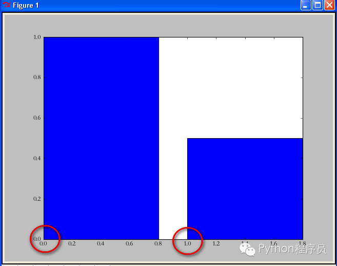
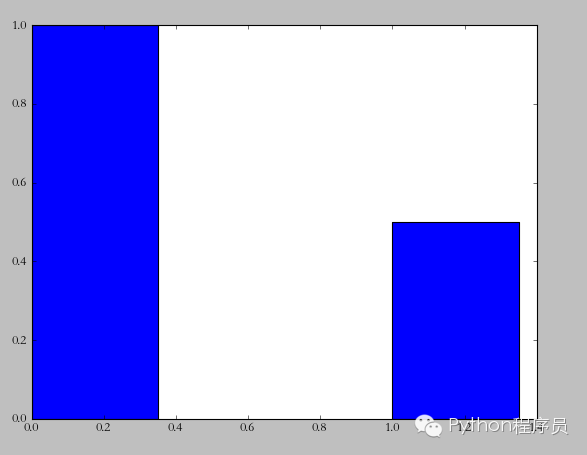
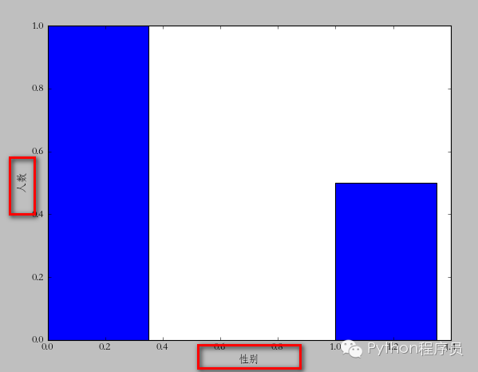
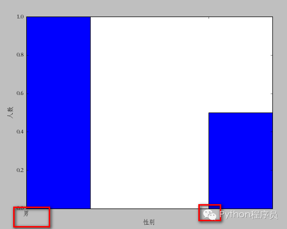
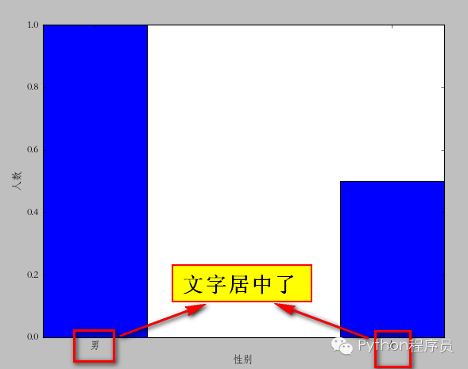
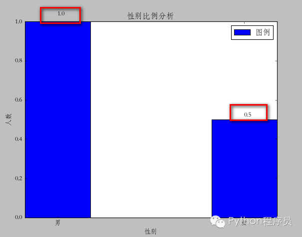
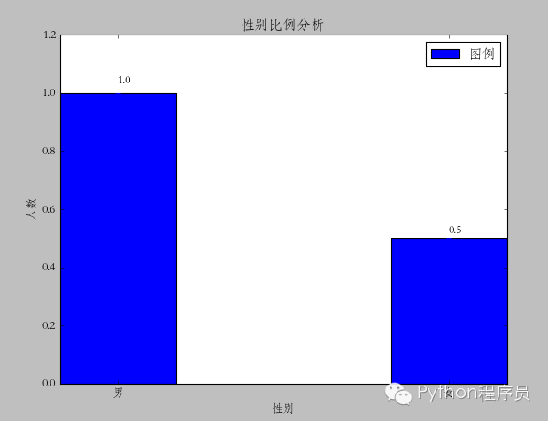

matplotlib(Python)画柱状图详解
=======


| CSDN | GitHub |
|:----:|:------:|
| [matplotlib(Python)画柱状图详解](http://blog.csdn.net/gatieme/article/details/56844125) | [`AderXCoding/language/python/matplotlib/barplot`](https://github.com/gatieme/AderXCoding/tree/master/language/python/matplotlib/barplot) |


<br>
<a rel="license" href="http://creativecommons.org/licenses/by-nc-sa/4.0/"></a>
本作品采用<a rel="license" href="http://creativecommons.org/licenses/by-nc-sa/4.0/">知识共享署名-非商业性使用-相同方式共享 4.0 国际许可协议</a>进行许可, 转载请注明出处
<br>


转载自 
[Python画柱状图详解(matplotlib)](http://www.cnblogs.com/qianlifeng/archive/2012/02/13/2350086.html)


`matplotlib` 是 `python` 最著名的绘图库，它提供了一整套和matlab相似的命令API，十分适合交互式地进行制图。而且也可以方便地将它作为绘图控件，嵌入GUI应用程序中。它的文档相当完备，并且[Gallery页面](http://matplotlib.org/gallery.html)中有上百幅缩略图，打开之后都有源程序。因此如果你需要绘制某种类型的图，只需要在这个页面中浏览/复制/粘贴一下，基本上都能搞定。 -----引用自：http://hyry.dip.jp/pydoc/matplotlib_intro.html

你可以从 http://www.lfd.uci.edu/~gohlke/pythonlibs/#matplotlib 下载安装matplotlib。

这篇我们用matplotlib从构造最简单的bar一步一步向复杂的bar前行。什么是最简单的bar，看如下语句你就知道她有多么简单了：


```cpp
import matplotlib.pyplot as plt 

plt.bar(left = 0,height = 1)
plt.show()
```

执行效果


是的，三句话就可以了，是我见过最简单的绘图语句。首先我们import了matplotlib.pyplot ，然后直接调用其bar方法，最后用show显示图像。我解释一下bar中的两个参数：

left：柱形的左边缘的位置，如果我们指定1那么当前柱形的左边缘的x值就是1.0了

height：这是柱形的高度，也就是Y轴的值了

left，height除了可以使用单独的值（此时是一个柱形），也可以使用元组来替换（此时代表多个矩形）。例如，下面的例子：

```cpp
import matplotlib.pyplot as plt 

plt.bar(left = (0,1),height = (1,0.5))
plt.show()
```


可以看到 left = (0,1)的意思就是总共有两个矩形，第一个的左边缘为0，第二个的左边缘为1。height参数同理。

当然，可能你还觉得这两个矩形“太胖”了。此时我们可以通过指定bar的width参数来设置它们的宽度。

```cpp
import matplotlib.pyplot as plt 

plt.bar(left = (0,1),height = (1,0.5),width = 0.35)
plt.show()
```




此时又来需求了，我需要标明x，y轴的说明。比如x轴是性别，y轴是人数。实现也很简单，看代码：

```cpp
import matplotlib.pyplot as plt 

plt.xlabel(u"性别")
plt.ylabel(u"人数")
plt.bar(left = (0,1),height = (1,0.5),width = 0.35)
plt.show()
```



注意这里的中文一定要用u（3.0以上好像不用，我用的2.7），因为matplotlib只支持unicode。接下来，让我们在x轴上的每个bar进行说明。比如第一个是“男”，第二个是“女”。


```cpp
import matplotlib.pyplot as plt 

plt.xlabel(u"性别")
plt.ylabel(u"人数")

plt.xticks((0,1),(u"男",u"女"))

plt.bar(left = (0,1),height = (1,0.5),width = 0.35)

plt.show()
```



plt.xticks的用法和我们前面说到的left,height的用法差不多。如果你有几个bar，那么就是几维的元组。第一个是文字的位置，第二个是具体的文字说明。不过这里有个问题，很显然我们指定的位置有些“偏移”，最理想的状态应该在每个矩形的中间。你可以更改(0,1)=>( (0+0.35)/2 ,(1+0.35)/2 )不过这样比较麻烦。我们可以通过直接指定bar方法里面的align="center"就可以让文字居中了。


```cpp
import matplotlib.pyplot as plt 

plt.xlabel(u"性别")
plt.ylabel(u"人数")

plt.xticks((0,1),(u"男",u"女"))

plt.bar(left = (0,1),height = (1,0.5),width = 0.35,align="center")

plt.show()
```



接下来，我们还可以给图标加入标题。

```cpp
plt.title(u"性别比例分析")
```


当然，还有图例也少不掉:


```cpp
import matplotlib.pyplot as plt 

plt.xlabel(u"性别")
plt.ylabel(u"人数")


plt.title(u"性别比例分析")
plt.xticks((0,1),(u"男",u"女"))
rect = plt.bar(left = (0,1),height = (1,0.5),width = 0.35,align="center")

plt.legend((rect,),(u"图例",))

plt.show()
```


注意这里的legend方法，里面的参数必须是元组。即使你只有一个图例，不然显示不正确。

接下来，我们还可以在每个矩形的上面标注它具体点Y值。这里，我们需要用到一个通用的方法：

```cpp
def autolabel(rects): 
for rect in rects:
height = rect.get_height()
plt.text(rect.get_x()+rect.get_width()/2., 1.03*height, "%s" % float(height))
```



其中plt.text的参数分别是：x坐标，y坐标，要显示的文字。所以，调用代码如下：

```cpp
import matplotlib.pyplot as plt 

def autolabel(rects):
for rect in rects:
height = rect.get_height()
plt.text(rect.get_x()+rect.get_width()/2., 1.03*height, "%s" % float(height))

plt.xlabel(u"性别")
plt.ylabel(u"人数")


plt.title(u"性别比例分析")
plt.xticks((0,1),(u"男",u"女"))
rect = plt.bar(left = (0,1),height = (1,0.5),width = 0.35,align="center")

plt.legend((rect,),(u"图例",))
autolabel(rect)

plt.show()
```




到这里这个图形已经基本完备了，不过可以看到你一个矩形紧靠这顶部，不是很好看。最好能够空出一段距离出来就好了。这个设置我没有找到具体的属性。不过，我还是通过一个小技巧来实现了。就是bar属性的yerr参数。一旦设置了这个参数，那么对应的矩形上面就会有一个竖着的线，我不知道他是干什么的。不过当我把这个值设置的很小的时候，上面的空白就自动空出来了。如图：

```cpp
rect = plt.bar(left = (0,1),height = (1,0.5),width = 0.35,align="center",yerr=0.000001)
```


对于左右两边能否空出空白来暂时还没有找到（xerr参数不行）


<a rel="license" href="http://creativecommons.org/licenses/by-nc-sa/4.0/"></a>
<br>
本作品采用<a rel="license" href="http://creativecommons.org/licenses/by-nc-sa/4.0/">知识共享署名-非商业性使用-相同方式共享 4.0 国际许可协议</a>进行许可
