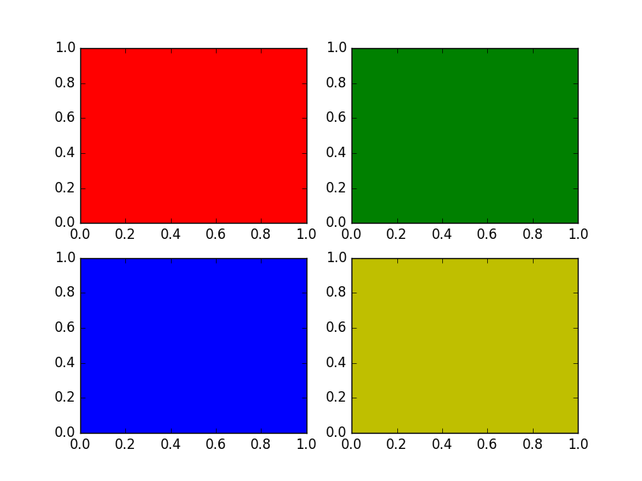
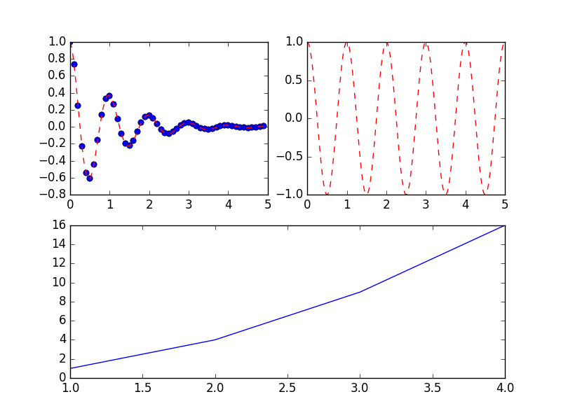
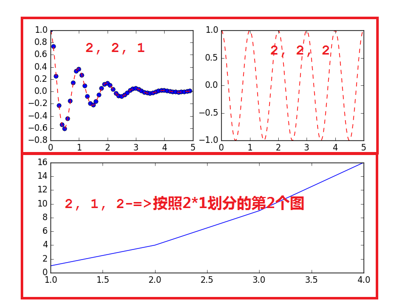

python使用matplotlib:subplot绘制多个子图
=======


| CSDN | GitHub |
|:----:|:------:|
| [python使用matplotlib:subplot绘制多个子图](http://blog.csdn.net/gatieme/article/details/61416645) | [`AderXCoding/language/python/matplotlib/subplot`](https://github.com/gatieme/AderXCoding/tree/master/language/python/matplotlib/subplot) |


<br>
<a rel="license" href="http://creativecommons.org/licenses/by-nc-sa/4.0/"></a>
本作品采用<a rel="license" href="http://creativecommons.org/licenses/by-nc-sa/4.0/">知识共享署名-非商业性使用-相同方式共享 4.0 国际许可协议</a>进行许可, 转载请注明出处
<br>


#1	问题描述
-------

`matploglib` 能够绘制出精美的图表, 有些时候, 我们希望把一组图放在一起进行比较, 有没有什么好的方法呢?


`matplotlib` 中提供的 `subplot` 可以很好的解决这个问题


#2 subplot函数介绍
-------


`matplotlib`下, 一个 `Figure` 对象可以包含多个子图(`Axes`), 可以使用 `subplot()` 快速绘制, 其调用形式如下 :

```cpp
subplot(numRows, numCols, plotNum)
```

*	图表的整个绘图区域被分成 `numRows` 行和 `numCols` 列

*	然后按照从左到右，从上到下的顺序对每个子区域进行编号，左上的子区域的编号为1

*	`plotNum` 参数指定创建的 `Axes` 对象所在的区域

如果 `numRows ＝ 2, numCols ＝ 3`, 那整个绘制图表样式为 `2X3` 的图片区域, 用坐标表示为

```cpp
(1, 1), (1, 2), (1, 3)
(2, 1), (2, 2), (2, 3)
```

这时, 当 `plotNum ＝ 3` 时, 表示的坐标为(1, 3), 即第一行第三列的子图


*	如果 `numRows`, `numCols` 和 `plotNum` 这三个数都小于 `10` 的话, 可以把它们缩写为一个整数, 例如 `subplot(323)` 和 `subplot(3,2,3)` 是相同的.

*	`subplot`在 `plotNum` 指定的区域中创建一个轴对象. 如果新创建的轴和之前创建的轴重叠的话，之前的轴将被删除.


#3 示例程序
-------

##3.1  规则划分成3*3的
-------


```cpp
#!/usr/bin/env python
#!encoding=utf-8

import matplotlib
import matplotlib.pyplot as plt

if __name__ == '__main__':
    for i,color in enumerate("rgby"):
        plt.subplot(221+i, axisbg=color)

    plt.show()
```




##3.2 不规则划分
-------

但是有时候我们的划分并不是规则的, 比如如下的形式




这种应该怎么划分呢?

将整个表按照 `2*2` 划分
前两个简单, 分别是 `(2, 2, 1)` 和 `(2, 2, 2)`

但是第三个图呢, 他占用了 `(2, 2, 3)` 和 `(2, 2, 4)`

显示需要对其重新划分, 按照 `2 * 1` 划分

前两个图占用了 `(2, 1, 1)` 的位置

因此第三个图占用了 `(2, 1, 2)` 的位置




代码如下, 参照[matplotlib绘制多个子图——subplot](http://blog.csdn.net/sunshihua12829/article/details/52786144)

```c
#!/usr/bin/env python
#!encoding=utf-8

import matplotlib.pyplot as plt
import numpy as np


def f(t):
    return np.exp(-t) * np.cos(2 * np.pi * t)

if __name__ == '__main__' :
    t1 = np.arange(0, 5, 0.1)
    t2 = np.arange(0, 5, 0.02)

    plt.figure(12)
    plt.subplot(221)
    plt.plot(t1, f(t1), 'bo', t2, f(t2), 'r--')

    plt.subplot(222)
    plt.plot(t2, np.cos(2 * np.pi * t2), 'r--')

    plt.subplot(212)
    plt.plot([1, 2, 3, 4], [1, 4, 9, 16])

    plt.show()
```

<a rel="license" href="http://creativecommons.org/licenses/by-nc-sa/4.0/"></a>
<br>
本作品采用<a rel="license" href="http://creativecommons.org/licenses/by-nc-sa/4.0/">知识共享署名-非商业性使用-相同方式共享 4.0 国际许可协议</a>进行许可
