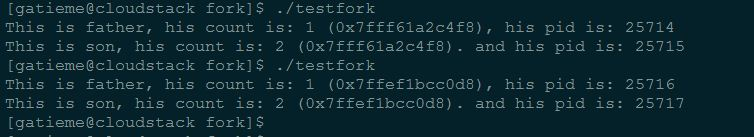
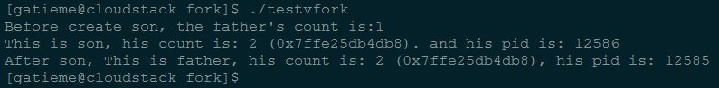
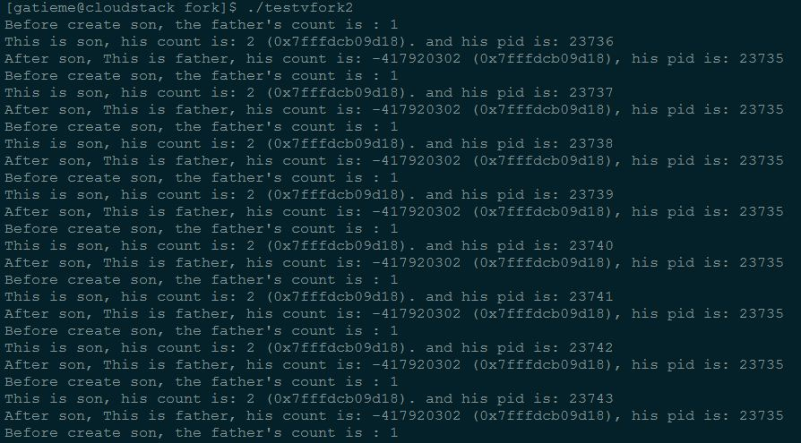
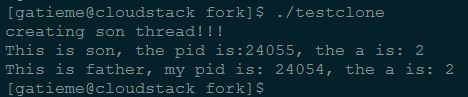

#fork，vfork，clone
-------

Unix标准的复制进程的系统调用时fork（即分叉），但是Linux，BSD等操作系统并不止实现这一个，确切的说linux实现了三个，fork,vfork,clone（确切说vfork创造出来的是轻量级进程，也叫线程，是共享资源的进程）

| 系统调用 | 描述 |
|:-------------:|:-------------:|
| fork | fork创造的子进程是父进程的完整副本，复制了父亲进程的资源，包括内存的内容task_struct内容 |
| vfork | vfork创建的子进程与父进程共享数据段,而且由vfork()创建的子进程将先于父进程运行 |
| clone | Linux上创建线程一般使用的是pthread库  实际上linux也给我们提供了创建线程的系统调用，就是clone |

#fork
-------
```c
#include <stdio.h>
#include <stdlib.h>

#include <sys/types.h>
#include <unistd.h>


int main(void)
{
    int count = 1;
    int child;

    child = fork( );

    if(child < 0)
    {
        perror("fork error : ");
    }
    else if(child == 0)     //  fork return 0 in the child process because child can get hid PID by getpid( )
    {
        printf("This is son, his count is: %d (%p). and his pid is: %d\n", ++count, &count, getpid());
    }
    else                    //  the PID of the child process is returned in the parent’s thread of execution
    {
        printf("This is father, his count is: %d (%p), his pid is: %d\n", count, &count, getpid());
    }

    return EXIT_SUCCESS;
}
```



从运行结果里面可以看出父子两个进程的pid不同，堆栈和数据资源都是完全的复制

子进程改变了count的值，而父进程中的count没有被改变。

子进程与父进程count的地址（虚拟地址）是相同的（注意他们在内核中被映射的物理地址不同）

#写时复制
-------

有人认为这样大批量的复制会导致执行效率过低。其实在复制过程中，linux采用了写时复制的策略。

子进程复制了父进程的task_struct，系统堆栈空间和页面表，这意味着上面的程序，我们没有执行count++前，其实子进程和父进程的count指向的是同一块内存。而当子进程改变了变量时候（即对变量进行了写操作），会通过copy_on_write的手段为所涉及的页面建立一个新的副本。

所以当我们执行++count后，这时候子进程才新建了一个页面复制原来页面的内容，基本资源的复制是必须的，而且是高效的。整体看上去就像是父进程的独立存储空间也复制了一遍。

**写入时复制(Copy-on-write)**是一个被使用在程式设计领域的最佳化策略。其基础的观念是，如果有多个呼叫者(callers)同时要求相同资源，他们会共同取得相同的指标指向相同的资源，直到某个呼叫者(caller)尝试修改资源时，系统才会真正复制一个副本(private copy)给该呼叫者，以避免被修改的资源被直接察觉到，这过程对其他的呼叫只都是通透的(transparently)。此作法主要的优点是如果呼叫者并没有修改该资源，就不会有副本(private copy)被建立。

第一代Unix系统实现了一种傻瓜式的进程创建：当发出fork()系统调用时，内核原样复制父进程的整个地址空间并把复制的那一份分配给子进程。这种行为是非常耗时的，因为它需要：

*	为子进程的页表分配页帧

*	为子进程的页分配页帧

*	初始化子进程的页表

*	把父进程的页复制到子进程相应的页中

 这种创建地址空间的方法涉及许多内存访问，消耗许多CPU周期，并且完全破坏了高速缓存中的内容。在大多数情况下，这样做常常是毫无意义的，因为许多子进程通过装入一个新的程序开始它们的执行，这样就完全丢弃了所继承的地址空间。

现在的Linux内核采用一种更为有效的方法，称之为写时复制（Copy On Write，COW）。这种思想相当简单：父进程和子进程共享页帧而不是复制页帧。然而，只要页帧被共享，它们就不能被修改，即页帧被保护。无论父进程还是子进程何时试图写一个共享的页帧，就产生一个异常，这时内核就把这个页复制到一个新的页帧中并标记为可写。原来的页帧仍然是写保护的：当其他进程试图写入时，内核检查写进程是否是这个页帧的唯一属主，如果是，就把这个页帧标记为对这个进程是可写的。

当进程A使用系统调用fork创建一个子进程B时,由于子进程B实际上是父进程A的一个拷贝,

因此会拥有与父进程相同的物理页面.为了节约内存和加快创建速度的目标,fork()函数会让子进程B以只读方式共享父进程A的物理页面.同时将父进程A对这些物理页面的访问权限也设成只读.

这样,当父进程A或子进程B任何一方对这些已共享的物理页面执行写操作时,都会产生页面出错异常(page_fault int14)中断,此时CPU会执行系统提供的异常处理函数do_wp_page()来解决这个异常.

do_wp_page()会对这块导致写入异常中断的物理页面进行取消共享操作,为写进程复制一新的物理页面,使父进程A和子进程B各自拥有一块内容相同的物理页面.最后,从异常处理函数中返回时,CPU就会重新执行刚才导致异常的写入操作指令,使进程继续执行下去.


#vfork
-------
如果fork简单的vfork()的做法更加火爆，内核连子进程的虚拟地址空间结构也不创建了，直接共享了父进程的虚拟空间，当然了，这种做法就顺水推舟的共享了父进程的物理空间

```c
#include <stdio.h>
#include <stdlib.h>

#include <sys/types.h>
#include <unistd.h>


int main(void)
{
    int count = 1;
    int child;

   // child = vfork( );

    printf("Before create son, the father's count is:%d\n", count);

    if((child = vfork())< 0)
    {
        perror("fork error : ");
    }
    else if(child == 0)     //  fork return 0 in the child process because child can get hid PID by getpid( )
    {
        printf("This is son, his count is: %d (%p). and his pid is: %d\n", ++count, &count, getpid());
        exit(0);
    }
    else                    //  the PID of the child process is returned in the parent’s thread of execution
    {
        printf("After son, This is father, his count is: %d (%p), his pid is: %d\n", ++count, &count, getpid());
        exit(0);
    }

    return EXIT_SUCCESS;
}
```



从运行结果可以看到vfork创建出的子进程（线程）共享了父进程的count变量，2者的count指向了同一个内存，所以子进程修改了count变量，父进程的 count变量同样受到了影响。

>参见 [man-vfork(2)](http://linux.die.net/man/2/vfork)

*	由vfork创造出来的子进程还会导致父进程挂起，除非子进程exit或者execve才会唤起父进程

*	由vfok创建出来的子进程共享了父进程的所有内存，包括栈地址，直至子进程使用execve启动新的应用程序为止

*	由vfork创建出来得子进程不应该使用return返回调用者，或者使用exit()退出，但是它可以使用_exit()函数来退出


如果我们使用return来退出，你会发现程序陷入一种逻辑混乱的重复vfork状态

参见下面的代码

```c
#include <stdio.h>
#include <stdlib.h>

#include <sys/types.h>
#include <unistd.h>


int main(void)
{
   int count = 1;
    int child;

   // child = vfork( );

    printf("Before create son, the father's count is : %d\n", count);

    if((child = vfork())< 0)
    {
        perror("fork error : ");
    }
    else if(child == 0)     //  fork return 0 in the child process because child can get hid PID by getpid( )
    {
        printf("This is son, his count is: %d (%p). and his pid is: %d\n", ++count, &count, getpid());

    }
    else                    //  the PID of the child process is returned in the parent’s thread of execution
    {
        printf("After son, This is father, his count is: %d (%p), his pid is: %d\n", count, &count, getpid());
        sleep(2);
    }

    return EXIT_SUCCESS;
}
```

我们会发现vfork的子进程在使用return后，返回到了调用处，因此父进程又创建出一个新的vfork进程，



解决这种问题的方法就是不要在进程中使用return，而是使用exit或者_exit来代替


#fork与vfork
-------

##区别与联系
-------

vfork()用法与fork()相似.但是也有区别,具体区别归结为以下3点

1.	fork()	子进程拷贝父进程的数据段，代码段.
	vfork()	子进程与父进程共享数据段.|

2.	fork()	父子进程的执行次序不确定.
	vfork():保证子进程先运行，

vfork()保证子进程先运行，在她调用exec或_exit之后父进程才可能被调度运行。如果在
调用这两个函数之前子进程依赖于父进程的进一步动作，则会导致死锁。

在调用exec或_exit之前与父进程数据是共享的,在它调用exec或_exit之后父进程才可能被调度运行。如果在调用这两个函数之前子进程依赖于父进程的进一步动作，则会导致死锁。当需要改变共享数据段中变量的值，则拷贝父进程

vfork用于创建一个新进程，而该新进程的目的是exec一个新进程，vfork和fork一样都创建一个子进程，但是它并不将父进程的地址空间完全复制到子进程中，不会复制页表。因为子进程会立即调用exec，于是也就不会存放该地址空间。不过在子进程中调用exec或exit之前，他在父进程的空间中运行。

如果在调用vfork时子进程依赖于父进程的进一步动作，则会导致死锁。由此可见，这个系统调用是用来启动一个新的应用程序。其次，子进程在vfork()返回后直接运行在父进程的栈空间，并使用父进程的内存和数据。这意味着子进程可能破坏父进程的数据结构或栈，造成失败。

为了避免这些问题，需要确保一旦调用vfork()，子进程就不从当前的栈框架中返回，并且如果子进程改变了父进程的数据结构就不能调用exit函数。

子进程还必须避免改变全局数据结构或全局变量中的任何信息，因为这些改变都有可能使父进程不能继续。通常，如果应用程序不是在fork()之后立即调用exec()，就有必要在fork()被替换成vfork()之前做仔细的检查。

##为什么会有vfork
-------

因为以前的fork当它创建一个子进程时，将会创建一个新的地址空间，并且拷贝父进程的资源，而往往在子进程中会执行exec调用，这样，前面的拷贝工作就是白费力气了，这种情况下，聪明的人就想出了vfork，它产生的子进程刚开始暂时与父进程共享地址空间（其实就是线程的概念了），因为这时候子进程在父进程的地址空间中运行，所以子进程不能进行写操作，

并且在儿子“霸占”着老子的房子时候，要委屈老子一下了，让他在外面歇着（阻塞），一旦儿子执行了exec或者exit后，相当于儿子买了自己的房子了，这时候就相当于分家了。此时vfork保证子进程先运行，在她调用exec或exit之后父进程才可能被调度运行。

>因此vfork设计用以子进程创建后立即执行execve系统调用加载新程序的情形。在子进程退出或开始新程序之前，内核保证了父进程处于阻塞状态

用vfork函数创建子进程后，子进程往往要调用一种exec函数以执行另一个程序，当进程调用一种exec函数时，该进程完全由新程序代换，而新程序则从其main函数开始执行，因为调用exec并不创建新进程，所以前后的进程id 并未改变，exec只是用另一个新程序替换了当前进程的正文，数据，堆和栈段。


#clone
---------

>参见
>
>[man手册](http://linux.die.net/man/2/clone)

clone函数功能强大，带了众多参数，因此由他创建的进程要比前面2种方法要复杂。

clone可以让你有选择性的继承父进程的资源，你可以选择想vfork一样和父进程共享一个虚存空间，从而使创造的是线程，你也可以不和父进程共享，你甚至可以选择创造出来的进程和父进程不再是父子关系，而是兄弟关系。

先有必要说下这个函数的结构
···c
int clone(int (*fn)(void *), void *child_stack, int flags, void *arg);
···

这里fn是函数指针，我们知道进程的4要素，这个就是指向程序的指针，就是所谓的“剧本", child_stack明显是为子进程分配系统堆栈空间（在linux下系统堆栈空间是2页面，就是8K的内存，其中在这块内存中，低地址上放入了值，这个值就是进程控制块task_struct的值）,flags就是标志用来描述你需要从父进程继承那些资源， arg就是传给子进程的参数）。下面是flags可以取的值


| 牛客OJ | 九度OJ | CSDN题解 | GitHub代码 |
| ------------- |:-------------:| -----:|
| 标志 | 含义 |
| CLONE_PARENT | 创建的子进程的父进程是调用者的父进程，新进程与创建它的进程成了“兄弟”而不是“父子”|
| CLONE_FS | 子进程与父进程共享相同的文件系统，包括root、当前目录、umask |
| CLONE_FILES | 子进程与父进程共享相同的文件描述符（file descriptor）表 |
| CLONE_NEWNS | 在新的namespace启动子进程，namespace描述了进程的文件hierarchy |
| CLONE_SIGHAND | 子进程与父进程共享相同的信号处理（signal handler）表 |
| CLONE_PTRACE | 若父进程被trace，子进程也被trace |
| CLONE_VFORK | 父进程被挂起，直至子进程释放虚拟内存资源 |
| CLONE_VM | 子进程与父进程运行于相同的内存空间 |
| CLONE_PID | 子进程在创建时PID与父进程一致 |
| CLONE_THREAD | Linux 2.4中增加以支持POSIX线程标准，子进程与父进程共享相同的线程群 |

下面的例子是创建一个线程（子进程共享了父进程虚存空间，没有自己独立的虚存空间不能称其为进程）。父进程被挂起当子线程释放虚存资源后再继续执行。

```c
#include <stdio.h>
#include <malloc.h>

#include <sched.h>
#include <signal.h>

#include <sys/types.h>
#include <unistd.h>


#define FIBER_STACK 8192
int a;
void * stack;

int do_something()
{
    printf("This is son, the pid is:%d, the a is: %d\n", getpid(), ++a);
    free(stack); //这里我也不清楚，如果这里不释放，不知道子线程死亡后，该内存是否会释放，知情者可以告诉下,谢谢
    exit(1);
}

int main()
{
    void * stack;
    a = 1;
    stack = malloc(FIBER_STACK);//为子进程申请系统堆栈

    if(!stack)
    {
        printf("The stack failed\n");
        exit(0);
    }
    printf("creating son thread!!!\n");

    clone(&do_something, (char *)stack + FIBER_STACK, CLONE_VM|CLONE_VFORK, 0);//创建子线程

    printf("This is father, my pid is: %d, the a is: %d\n", getpid(), a);
    exit(1);
}
```




#clone, fork, vfork区别与联系
-------

>[实现参见](http://lxr.free-electrons.com/source/kernel/fork.c#L1785)

**实现方式思路**

系统调用服务例程sys_clone, sys_fork, sys_vfork三者最终都是调用do_fork函数完成.

do_fork的参数与clone系统调用的参数类似, 不过多了一个regs(内核栈保存的用户模式寄存器). 实际上其他的参数也都是用regs取的

**具体实现的参数不同**

*	*	clone:
    clone的API外衣, 把fn, arg压入用户栈中, 然后引发系统调用. 返回用户模式后下一条指令就是fn.
    sysclone: parent_tidptr, child_tidptr都传到了 do_fork的参数中
    sysclone: 检查是否有新的栈, 如果没有就用父进程的栈 (开始地址就是regs.esp)

*	fork, vfork:
    服务例程就是直接调用do_fork, 不过参数稍加修改
    clone_flags:
    sys_fork: SIGCHLD, 0, 0, NULL, NULL, 0
    sys_vfork: CLONE_VFORK | CLONE_VM | SIGCHLD, 0, 0, NULL, NULL, 0
    用户栈: 都是父进程的栈.
    parent_tidptr, child_ctidptr都是NULL.
