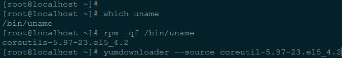

使用linux的过程中，我们会熟悉各种命令，偶尔我们不禁会问，这些命令是怎么实现的，学习他们其实是学习linux高级系统编程很快捷的方法。


这些命令的源码肯定是存放在相应的包里面，但是是哪些包呢？

发行版的包管理器为我们提供了很方便的命令接口，供我们查找我们指定命令所在的包

比如我们以最普通的uname命令来说明，

*	使用我们使用whereis或者which命令可以查找命令的绝对位置

*	通过rpm或者dpkg命令搜索命令所属的包信息

*	下载并安装对应的源码source包，即可得到源码

#CentOS等rpm包管理器
-------

##搜索斌下载命令所属包
-------

怎么查看某个命令的源代码
比如想查看uname这个命令的源代码

```shell
## 查看命令
which uname   
## /bin/uname

##查看命令所属的包   
rpm -qf /bin/uname

##下载对应的xxx.src.rpm源码包
yumdownloader --source coreutils-版本号
```



>**[问题1]**
>
>没有yumdownloader 的话可以这样子安装
>
>```
>yum install yum-utils
>```
>
>**[问题2]**
>
>如果提示No Match for argument coreutil-5.97-23.el5_4.2
>
>说明源中可能没有这个包，那么我们只能手动下载
>
>去包站点http://vault.centos.org下载对应版本的包即可
>
>**注意**
>
>我们需要的是源码包，因此下载的应该是xxx.src.rpm的包。


##安装或则解压源码包得到源码
-------

下载了源码包以后有两种方法可以查看到源码包,

第一种方法
```
rpm -qpl coreutils-8.5-7.fc14.src.rpm | grep tar ##查询rpm中的tar文件，源码一般放在这里

##从rpm包中提取指定的文件

rpm2cpio coreutils-8.5-7.fc14.src.rpm | cpio -idv coreutils-8.5.tar.xz

tar xjvf coreutils-8.5.tar.xz
##到解压出来的coreutils-8.5/src/中就能找到相关的源码了
```

第二种方法：安装源码包
```
rpm -i coreutils-8.5-7.fc14.src.rpm ##安装源码包
```

>centos和rhel一般安装后的源码在/usr/src/redhat下的各个目录下,但fedora是在~/rpmbuild/SOURCES/

可以通过locate命令查询代码包被安装到哪里了

locate *coreutils*tar*
/home/workhard/tmp/coreutils-8.5.tar.xz
/home/workhard/rpmbuild/SOURCES/coreutils-8.5.tar.xz
cd /home/workhard/rpmbuild/SOURCES/c

```
tar Jxvf coreutils-8.5.tar.xz
cd coreutils-8.5/src/
ll uname*
```

安装*.src.rpm后怎么卸载
```
cd /home/gatieme/rpmbuild/SOURCES
rpmbuild --rmsource --rmspec coreutils.spec
```

##相关说明
-------

###yumdownloader
-------
yumdownloader comes from the yum-utils package, if you don't have that installed already.

>yum install yum-utils

###RPM用法
-------

rpm {-i|--install} [install-options] PACKAGE_FILE ...
-f, --file FILE
Query package owning FILE.
-p, --package PACKAGE_FILE
Query an (uninstalled) package PACKAGE_FILE.
-l, --list
List files in package.
－qf：查找指定文件属于哪个RPM软件包
－qpl：列出RPM软件包内的文件信息；

###rpm2cpio
-------
Extract cpio archive from RPM Package Manager (RPM) package.
顾名思义，rpm2cpio是将rpm包文件转换成cpio归档文件

##CPIO用法
-------

cpio - copy files to and from archives
-i 抽取的意思，和"--extract"等同
-d 建立目录，和"--make-directories"等同
-v 冗余信息输出，和"--verbose"等同

###rpmbuild用法
-------

--rmsource
Remove the sources after the build
--rmspec
Remove the spec file after the build


#Ubuntu等deb包
-------

与RedHat系列的rpm包不同，Ubuntu使用的是Debian的deb包，因此搜索和安装的方式略有不同，但是思路是一样的

找到想看源码的命令属于哪个包：
```
dpkg -S `which cp`
```
coreutils: /bin/cp

下载源码：
```
apt-get -d source "coreutils"
```