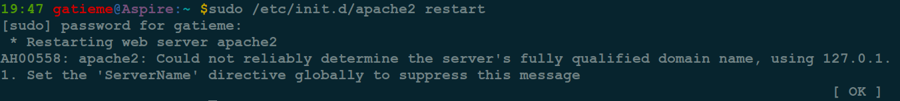
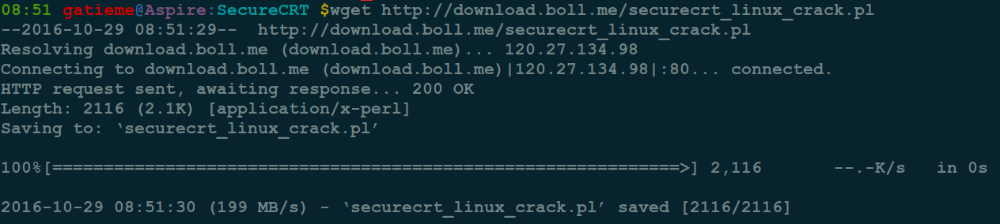
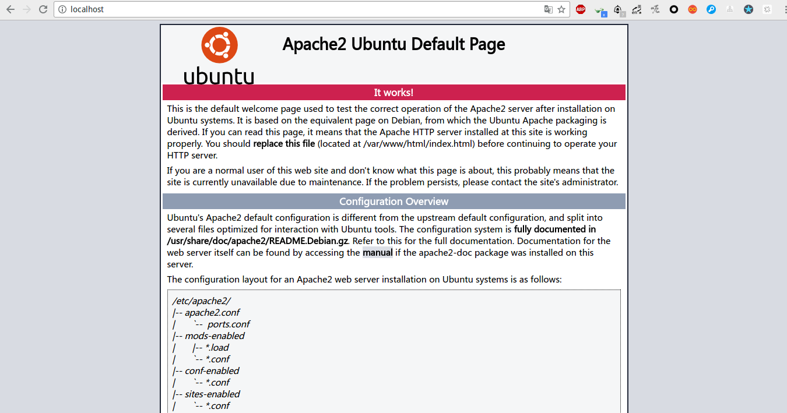

Ubuntu下apache的安装与配置
=======

| CSDN | GitHub |
|:----:|:------:|
| [Ubuntu下apache的安装与配置](http://blog.csdn.net/gatieme) | [`AderXCoding/system/tools`](https://github.com/gatieme/AderXCoding/tree/master/system/tools) |


<br>
<a rel="license" href="http://creativecommons.org/licenses/by-nc-sa/4.0/"></a>
本作品采用<a rel="license" href="http://creativecommons.org/licenses/by-nc-sa/4.0/">知识共享署名-非商业性使用-相同方式共享 4.0 国际许可协议</a>进行许可, 转载请注明出处
<br>


#1	安装apache
-------

在 `Ubuntu` 上安装 `Apache`，有两种方式


1.	使用源中的软件包安装, 例如使用apt-get命令

2.	从源码构建Apache


我们直接使用源中的软件包进行安装, 安装apache，在命令行终端中输入一下命令：

```cpp
sudo apt-get install apache2
```


#2	配置apache
-------


##2.1	启动apache服务
-------

安装完成后，重启apache服务，在命令行终端中输入一下命令：

```cpp
sudo /etc/init.d/apache2 [start | stop | restart | status ]
```

或者

```cpp
service apache2  [start | stop | restart | status ]
```

##2.2	开机不启动apache服务
-------

由于我们不是服务器, 安装了 `apache` 并不是一直开启的, 我们期望的是需要的时候手动开启, 因此希望设置开始不启动apache服务

Ubuntu有如下几种方法配置, 但是都是异曲同工, 他们都是修改了启动初始化脚本rcS等配置文件

**启动项管理工具sysv-rc-conf**

```cpp
sudo install sysv-rc-conf #或者使用带gui的工具bum
sudo sysv-rc-conf
```

1~6分别是运行级别, 具体配置参见[Ubuntu下使用sysv-rc-conf管理服务](http://blog.csdn.net/gatieme/article/details/45251389)

只需要将apache对应运行界别的`[X]`(运行)修改为`[]`(不启动)即可


**update-rc.d命令详解**


从所有的运行级别中删除指定启动项


```cpp
update-rc.d -f remove
```

按指定顺序、在指定运行级别中启动或关闭

```cpp
update-rc.d start|stop
```

>实例：update-rc.d apachectl start 20 2 3 4 5 . stop 20 0 1 6 .

解析：表示在2、3、4、5这五个运行级别中，由小到大，第20个开始运行apachectl;在 0 1 6这3个运行级别中，第20个关闭apachectl。这是合并起来的写法，注意它有2个点号，效果等于下面方法：

```cpp
update-rc.d apachectl defaults
```

A启动后B才能启动，B关闭后A才关闭

```cpp
update-rc.d A defaults 80 20
update-rc.d B defaults 90 10
```

启动和关闭顺序为90，级别默认


#3	问题
-------


##3.1	apache2 [warn] NameVirtualHost *:80 has no VirtualHosts
-------


**问题描述**


```cpp
apache2 [warn] NameVirtualHost *:80 has no VirtualHosts
```


**问题原因**


出现上述问题的原因 : 定义了多个 `NameVirtualHost`, 故将 `/etc/apache2/ports.conf` 中的 `NameVirtualHost *:80` 注释掉即可


**问题解决**


`Ubuntu`之前的版本定义在 `/etc/apache2/sites-available/default`, 8.04后在`/etc/apache2/ports.conf`

故可以将 `/etc/apache2/ports.conf` 中的`NameVirtualHost *:80` 注释掉

这个问题的本质是在没有定义域名是一个端口只能对应一个虚拟主机，将NameVirtualHost *:80改为其他端口也可以解决

如果有多个不同的域名的话，用同样的端口也可以


##3.2	using 127.0.1.1 for ServerName
-------


**问题描述**


可能会出现的问题2： Could not reliably determine the server's fully qualified domain name, using 127.0.1.1 for ServerName





**问题原因**

根据提示，无法可靠的确定服务器的有效域名，使用127.0.1.1作为服务器域名。应此，在下面的测试中，应该使用127.0.1.1，而不是127.0.0.1!


**问题解决**


*	方法1, 修改httpd.conf

修改 `/etc/apache2/httpd.conf`, 在文件中添加,

```cpp
ServerName localhost:80
```

一般来说 `httpd.conf` 是个空文件, 直接添加即可, 如果 `httpd.conf` 文件不存在, 则新建它, 并检查 `/etc/apache2/apache2.conf` 中是否包含了 `httpd.conf`, 如果没有使用如下语句包含

```cpp
# Include httpd to listen on @/etc/apache2/apache2.conf
Include httpd.conf
```


或者

*	方法二

修改 `/etc/apache2/sites-available/default`

在最顶端加入

```cpp
ServerName 127.0.0.1
```

注意, 第二种方法修改 `default` 的时候, 必须写在顶部, 否则重启apache服务, 会提示如下错误




再次重启apache2, 就可以使用127.0.0.1来访问web服务器啦!

测试：

在浏览器里输入

http://localhost

或者是

http://127.0.0.1




`Apache` 的默认安装, `Apache` 的默认安装，会在`/var` 下建立一个名为 `www` 的目录, 这个就是`Web` 目录了, 所有要能过浏览器访问的Web文件都要放到这个目录里.


