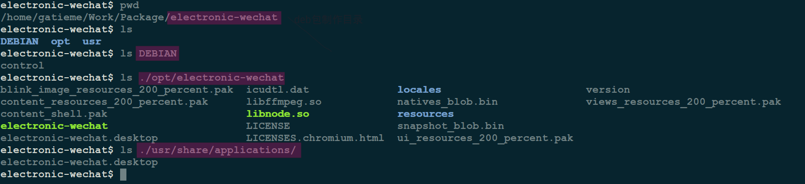
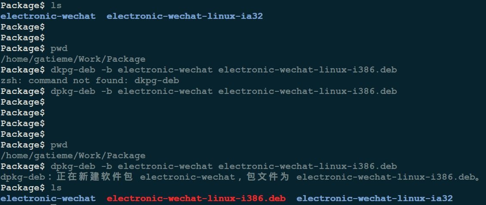
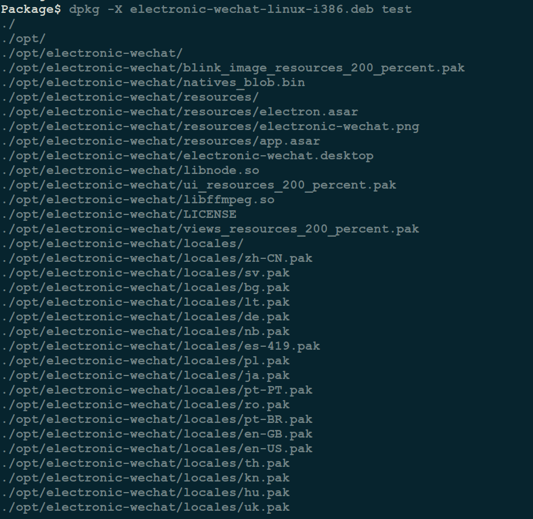
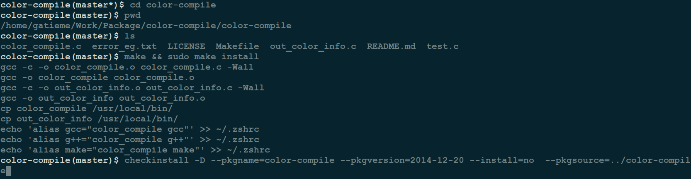
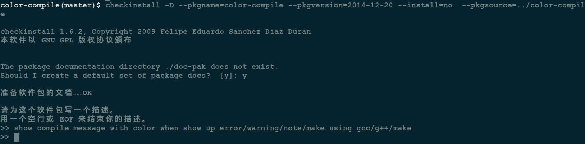
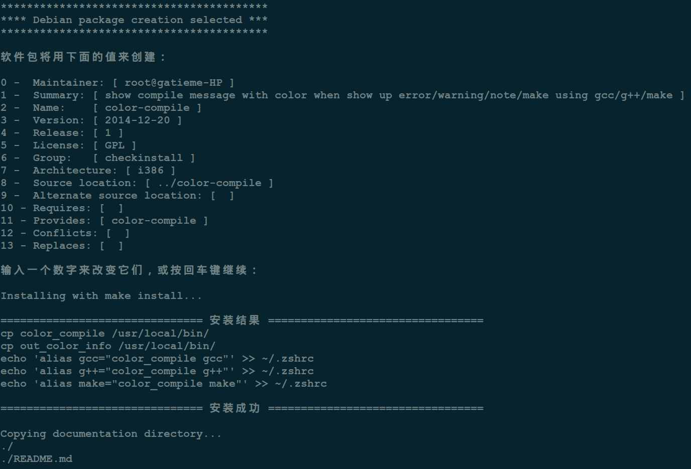
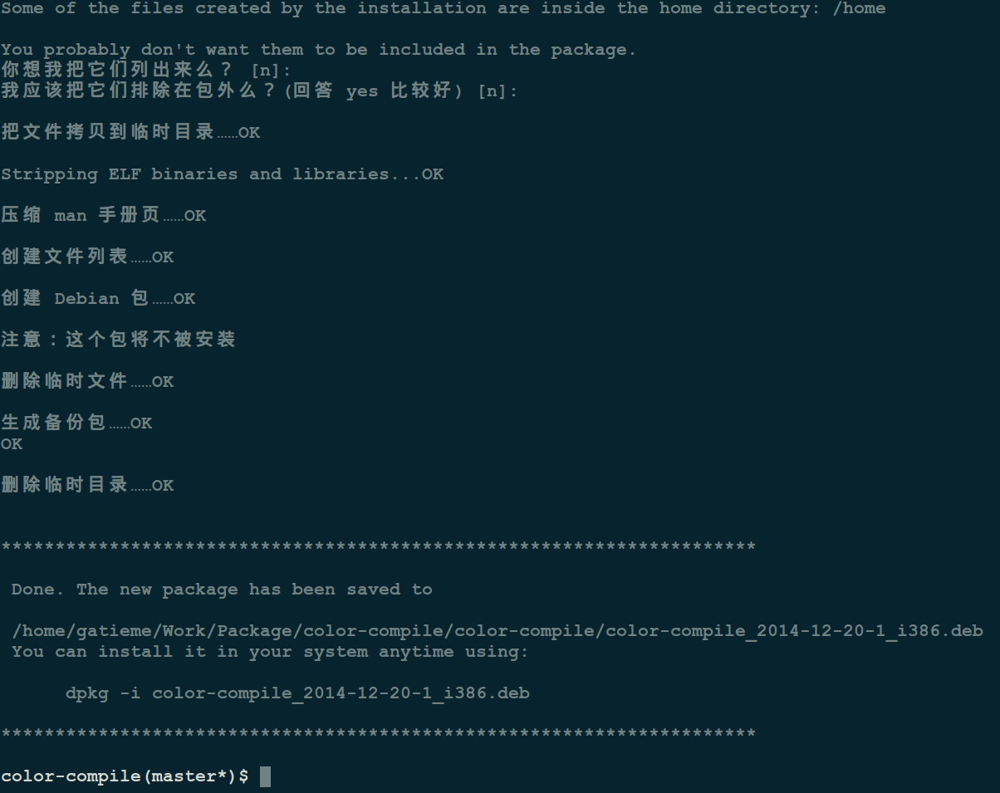
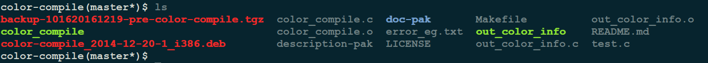

Ubuntu下制作deb包的方法详解
=======


| CSDN | GitHub |
|:----:|:------:|
| [Ubuntu下制作deb包的方法详解](http://blog.csdn.net/gatieme/article/details/52829907) | [`AderXCoding/system/tools/build_deb`](https://github.com/gatieme/AderXCoding/tree/master/system/tools/build_deb) |


<br>
<a rel="license" href="http://creativecommons.org/licenses/by-nc-sa/4.0/"></a>
本作品采用<a rel="license" href="http://creativecommons.org/licenses/by-nc-sa/4.0/">知识共享署名-非商业性使用-相同方式共享 4.0 国际许可协议</a>进行许可
<br>


#1	认识deb包
-------

##1.1	认识deb包
-------

`deb`是`Unix`系统(其实主要是`Linux`)下的安装包，基于 tar 包，因此本身会记录文件的权限(读/写/可执行)以及所有者/用户组。
由于 Unix 类系统对权限、所有者、组的严格要求，而 deb 格式安装包又经常会涉及到系统比较底层的操作，所以权限等的设置尤其重要。

##1.2	使用deb包
-------

*	查看deb包含有哪些文件(不安装)

```CPP
dpkg -c xxx.deb // 安装前根据deb文件查看
dpkg -L debname // 安装后根据包名查看
```


*	安装deb包

```cpp
dpkg -i xxx.deb
```

注意，如果提示错误，可以加参数—force-all强制安装，但不推荐这样做

*	移除deb包


```cpp
dpkg -r debname
```

*	查看某个文件属于哪个deb包

```cpp
dpkg -S filepath
```


*	释放安装内容到dirname目录中

```cpp
dpkg -X xxx.deb dirname
```

*	释放控制信息到当前目录下的DEBIAN子目录中

```cpp
dpkg -e xxx.deb
```


##1.3	deb包的组成结构
-------

`deb`包本身有三部分组成：

1.	数据包，包含实际安装的程序数据，文件名为 data.tar.XXX；

2.	安装信息及控制脚本包, 包含`deb`的安装说明，标识，脚本等，文件名为 control.tar.gz；

3.	最后一个是`deb`文件的一些二进制数据，包括文件头等信息，一般看不到，在某些软件中打开可以看到。

>`deb`本身可以使用不同的压缩方式. `tar`格式并不是一种压缩格式，而是直接把分散的文件和目录集合在一起，并记录其权限等数据信息。之前提到过的 data.tar.XXX，这里 XXX 就是经过压缩后的后缀名. deb默认使用的压缩格式为gzip格式，所以最常见的就是 data.tar.gz。常有的压缩格式还有 bzip2 和 lzma，其中 lzma 压缩率最高，但压缩需要的 CPU 资源和时间都比较长

*	data.tar.gz包含的是实际安装的程序数据，而在安装过程中，该包里的数据会被直接解压到根目录(即 / )，因此在打包之前需要根据文件所在位置设置好相应的文件/目录树。


*	control.tar.gz则包含了一个 deb 安装的时候所需要的控制信息.

一般有 5 个文件：

|  控制文件 | 描述 |
|:-------:|:----:|
| control | 用了记录软件标识，版本号，平台，依赖信息等数据 |
| preinst | 在解包`data.tar.gz`前运行的脚本 |
| postinst | 在解包数据后运行的脚本 |
| prerm | 卸载时，在删除文件之前运行的脚本 |
| postrm | 在删除文件之后运行的脚本 |


#2	制作deb包
-------

首先我们需要准备好我们待打包的软件, 这里我们采用了


*	下载示例软件包, 直接对二进制包或者进行打包

*	对源码编译后进行打包需要有make的编译脚本, 或者对于自己写的代码制做deb包, 建议用autoconf, automake生成编译脚本


##2.1	最基础的方式dpkg-deb
-------


最基础的方式需要我们自己编写和创建脚本, 不使用其他辅助工具, 而只使用标准的`dpkg-deb`打包命令

我们以之前的微信电脑版的代码为例子, 为其创建一个deb安装包

首先我们为我们创建一个工作目录`electronic-wechat`

然后我们创建一个名为EBIAN的目录, 用于存放控制信息

然后我们创建对应的二进制包安装安装完成后的路径信息放置在DEBIAN的同级目录下, 也就是说我们把当前的目录当成根目录, 制作完成后安装时, 当前目录下除DEBIAN目录的其他目录都会被默认安装到系统的/目录下




在DEBIAN里新建一个文本文档, 名为control, 编码为utf-8, 内容如下所示

```cpp
Package: electronic-wechat
Version: 1.4.0-2016.08.24
Section: BioInfoServ
Priority: optional
Depends:
Suggests:
Architecture: i386
Installed-Size: 4096
Maintainer: gatieme
Provides: bioinfoserv-arb
Description: A better WeChat on macOS and Linux. Built with Electron by Zhongyi Tong
```

然后我们回到工作目录上级, 使用dpkg-deb命令创建deb包

使用`dpkg-deb --help`查看使用帮助的信息, 可以使用`-b`选项生成`deb`包

```cpp
dpkg-deb -b electronic-wechat electronic-wechat-linux-i386.deb
```





验证打包好的deb,　我们可以使用dpkg -i安装或者dpkg -X解压命令验证我们的deb包





##2.2	方法二: 使用checkinstall方法创建deb包
-------

如果你已经从它的源码运行"make install"安装了linux程序. 想完整移除它将变得真的很麻烦, 除非程序的开发者在`Makefile`里提供了`uninstall`的目标设置. 否则你必须在安装前后比较你系统里文件的完整列表，然后手工移除所有在安装过程中加入的文件. 这时候Checkinstall就可以派上使用。Checkinstall会跟踪install命令行所创建或修改的所有文件的路径(例如："make install"、"make install_modules"等)并建立一个标准的二进制包，让你能用你发行版的标准包管理系统安装或卸载它，(例如Red Hat的yum或者Debian的apt-get命令)


```cpp
apt-get install checkinstall
```


可以使用`checkinstall --help`来查看帮助信息


`checkinstall`不仅可以生成deb包, 还可以生成rpm包，使用简单，但是不灵活，功能粗糙，只做介绍，不推荐使用


但是他适合从源代码直接构建我们的deb包, 我们下载到待打包的源代码以后, 先使用make和make install编译安装, 然后运行checkinstall即可完成deb的打包

```cpp
git clone git@github.com:chinaran/color-compile.git   # 下载源代码
cd color-compile   
make && make install # 构建
```



```cpp
checkinstall -D --pkgname=color-compile --pkgversion=2014-12-20 --install=no  --pkgsource=../color-compile  # 制作deb
```


首先提示输入安装包的描述信息




接着checkinstall提示用户填入或者修改deb的控制信息, 其本质就是control文件的内容




最后等待生成deb完成



此时当前目录下生成了`deb`包




##2.3	方法三: 使用dh_make方法创建deb包
-------


deb包所需的默认信息


```cpp
dh_make -s -e gatieme@163.com -p color-compile_2014-12-20  -f ./color-compile_2014-12-20.tar.gz # 生成制作
```


此时当前目录下生成了`debian`目录, 此时通常修改两个文件:

*	修改`debian/control`文件，配置你的信息，具体字段见参考部分

*	修改`debian/rules`脚本，它决定编译参数(也可以不改)

`dpkg`是最基本的制作`deb`包的方法, 推荐使用

```cpp
dpkg-buildpackage -rfakeroot
```

此时可以看到，上层目录中已建立了deb包


##2.4	方法四: 修改已有deb包
-------

自己创建deb所需目录结构(控制信息和安装内容)，然后打包，一般使用这种方法来修改已有的deb包，而不是新建deb包，命令如下：

```cpp
dpkg -X xxx.deb test #  解包安装内容
cd test
dpkg -e ../xxx.deb #  解包控制信息
```
修改其中内容

```cpp
cd ../
dpkg -b dirname xxx_new.deb #  重新打包
```

#3	参考
-------


1. debian/control文件中信息说明


```cpp
1) Package 包名
2) Version 版本
3) Architecture 目标机架构（i386, arm等）
4) Maintainer 维护者
5) Depends 依赖软件包
6) Description 描述
```

[checkinstall详细例程](http://www.ibm.com/developerworks/cn/linux/l-cn-checkinstall/index.html)

[自己制作deb包例程](http://blog.chinaunix.net/u2/78998/showart.php?id=1404403)

[官方的debian制作手册（比较长）](http://www.debian.org/doc/manuals/maint-guide/index.zh-cn.html)

[linux/ubuntu中制作deb安装包](http://blog.csdn.net/mountzf/article/details/51863859)

[制作Ubuntu的deb格式包 从Hello World做起](http://www.linuxidc.com/Linux/2011-02/32714.htm)
