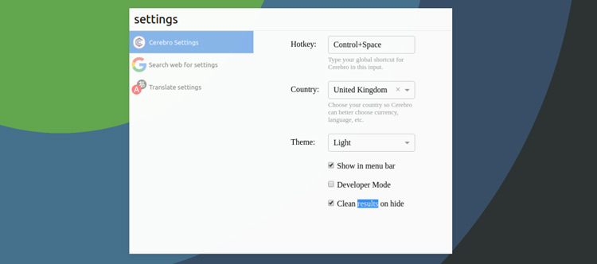
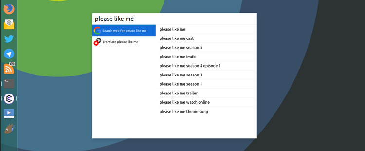
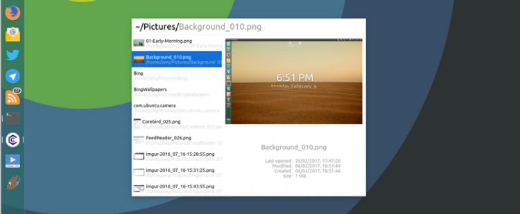
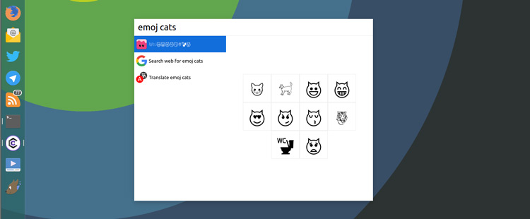

| CSDN | GitHub |
|:----:|:------:|
| [Cerebro 一个跨平台的桌面快捷使用工具](http://blog.csdn.net/gatieme/article/details/60368999) | [`AderXCoding/system/tools/cerebro`](https://github.com/gatieme/AderXCoding/tree/master/system/tools/cerebro) |


<br>
<a rel="license" href="http://creativecommons.org/licenses/by-nc-sa/4.0/"></a>
本作品采用<a rel="license" href="http://creativecommons.org/licenses/by-nc-sa/4.0/">知识共享署名-非商业性使用-相同方式共享 4.0 国际许可协议</a>进行许可, 转载请注明出处
<br>


#1	CereBro简介
-------


[`Cerebro`](https://github.com/KELiON/cerebro) 是扩平台(同时支持 `Linux`, `Winsows`, `MacOSX`) 的桌面快捷工具, 可用于执行命令, 打开应用(类似与`Launch`), 打开网页, 快捷翻译, 搜索. 支持插件, 有很多插件可以使用. 其功能类似与 `MacOS` 下的 `Spotlight` 和 `Alfred`, 以及 `Linux` 下  `Synapse`, `Kupfer`, `Ulauncher`, `GNOME Do` 等工具.

它被称为 `productivity booster with a brain`


#2	安装
-------

官网 : https://cerebroapp.com
GitHub : https://github.com/KELiON/cerebro
下载 : https://github.com/KELiON/cerebro/releases


下载后安装即可


```cpp
wget https://github.com/KELiON/cerebro/releases/download/0.2.7/cerebro_0.2.7_amd64.deb
```

安装

```cpp
sudo dpkg -i cerebro_0.2.7_amd64.deb
```


#3	使用
-------

默认使用`Ctrl+Space`来调用应用, 可以使用setting修改配置信息和快捷键





##3.1  核心功能
-------


*   搜索信息(目前只支持google搜索)



*   搜索并启动应用程序


*   搜索并打开制定文件




*   计算器和单位转换器


以上功能是核心功能, 可以通过安装插件的方式增加和使用其他功能或者小工具


##3.2  安装插件
-------


键入`plugin` 可以搜索到插件, 选择插件后, 单击 `install` 即可安装插件.


##3.3  全平台适用的插件
-------


| 插件 | 描述 |
|:----:|:----:|
| [Caniuse](https://github.com/KELiON/cerebro-caniuse) | quick access to [caniuse.com](http://caniuse.com) database; |
| [Devdocs](https://github.com/KELiON/cerebro-devdocs) | search in dev. documentations provided by [devdocs.io](http://devdocs.io) |
| [DuckDuckGo](https://github.com/tiagoamaro/cerebro-duck-duck-go) | Use DuckDuckGo as your search engine; |
| [Emoj](https://github.com/KELiON/cerebro-emoj) | search for relevant emoji, like `emoj this is awesome`; |
| [Gif](https://github.com/KELiON/cerebro-gif) | search for relevant gif, i.e. `gif luck`, `how i met your mother gif`; |
| [Github](https://github.com/tenorz007/cerebro-github) | search for trending, repos or users on github; |
| [Google Knowledge Graph](https://github.com/Kageetai/cerebro-gkg) | Get info from the [Google Knowledge Graph](https://www.google.com/intl/bn/insidesearch/features/search/knowledge.html) for your query; |
| [Hash](https://github.com/codingmatty/cerebro-plugin-hash) | hash input text with popular hash algorithms (i.e. md5, sha1, etc); |
| [IMDB](https://github.com/KELiON/cerebro-imdb) | search for films on imdb.com with rating and details, like `imdb star wars`; |
| [IP](https://github.com/KELiON/cerebro-ip) | show your local & external IP address; |
| [Lipsum](https://github.com/codingmatty/cerebro-plugin-lipsum) | generate lorem ipsum text from [lipsum.com](http://www.lipsum.com); |
| [Shell](https://github.com/KELiON/cerebro-shell) | exec shell commands without running terminal; |
| [Stackoverflow](https://github.com/BrainMaestro/cerebro-stackoverflow) | search for answers to questions on stackoverflow; |
| [NPM](https://github.com/JordanAdams/cerebro-npm) | search for NPM packages |


##3.4  仅macOSX适用的插件
-------

| 插件 | 描述 | 
|:----:|:----:|
| [macOS Contacts](https://github.com/KELiON/cerebro-osx-contacts) | search in contacts.app; |
| [macOS Define](https://github.com/KELiON/cerebro-osx-define) | define in OSx built-in dictionary; |
| [macOS Eject](https://github.com/codingmatty/cerebro-plugin-osx-eject) | safely eject mounted volume drives; |
| [macOS System](https://github.com/KELiON/cerebro-osx-system) | system commands: i.e. `sleep`, `lock`, `restart`, `empty trash` or open system directories, like `trash` or `airdrop`; |
| [Kill](https://github.com/KELiON/cerebro-kill) | kill process by name, i.e. `kill cerebro`; |




##3.5  仅Windows适用的插件
-------

| 插件 | 描述 |
|:----:|:----:|
| [Windows System](https://github.com/BrainMaestro/cerebro-windows-system) | system commands: i.e. `shutdown`, `sleep`, `lock`, `restart`, `empty trash`, or adjust volume and brightness; |


<a rel="license" href="http://creativecommons.org/licenses/by-nc-sa/4.0/"></a>本作品采用<a rel="license" href="http://creativecommons.org/licenses/by-nc-sa/4.0/">知识共享署名-非商业性使用-相同方式共享 4.0 国际许可协议</a>进行许可

