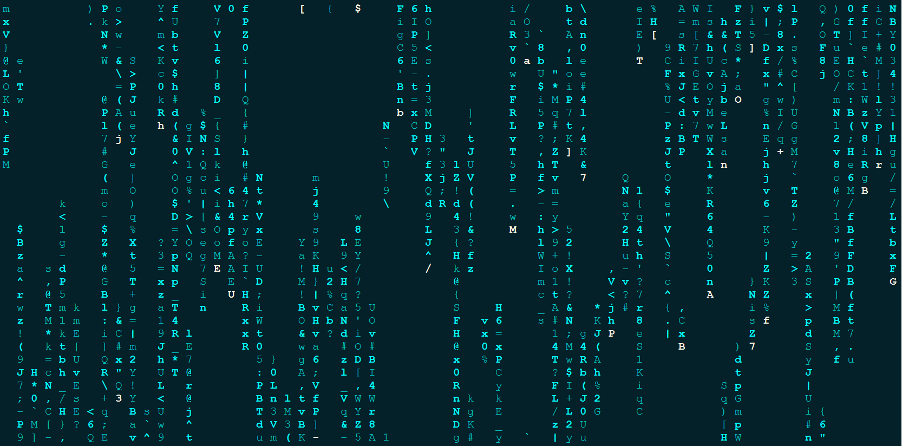

| CSDN | GitHub |
|:----:|:------:|
| [Aderstep--紫夜阑珊-青伶巷草](http://blog.csdn.net/gatieme) | [`AderXCoding/system/tools`](https://github.com/gatieme/AderXCoding/tree/master/system/tools) |

 

本作品采用<a rel="license" href="http://creativecommons.org/licenses/by-nc-sa/4.0/">知识共享署名-非商业性使用-相同方式共享 4.0 国际许可协议</a>进行许可, 转载请注明出处
 

#1    Cmatrix 简介
-------

还记得 黑客帝国 中的代码雨么, cmatrix 就是Linux 终端下的代码雨, 虽然没有黑客帝国里面那么酷炫, 但是这条命令运行起来充满了未来的科技感.

主页 : https://github.com/abishekvashok/cmatrix

#2    Cmatrix 使用
-------

##2.1    安装
-------

``cpp
sudo apt-get install cmatrix
``

##2.2    使用
-------

| 选项 | 描述 |
|:---:|:----:|
|  -a | 异步滚动效果(默认效果) Asynchronous scroll |
| -b | 随机粗体  Bold characters on |
| -B | 全部粗体 All bold characters (overrides -b) |
| -f | 强制使用当前终端的样式 Force the linux $TERM type to be on |
| -l | 使用 matrix 字体 Linux mode (uses matrix console font) |
| -o | 使用旧的滚动方式 Use old-style scrolling |
| -h | 帮助菜单 Print usage and exit |
| -n | 不使用粗体 No bold characters (overrides -b and -B, default) |
| -s | 屏幕保护模式, 按任意键即退出 "Screensaver" mode, exits on first keystroke |
| -x | X window 模式 X window mode, use if your xterm is using mtx.pcf |
| -V | 显示版本号 Print version information and exit |
| -u | 刷新频率, 0-9, 也就是滚动的快慢（值越小越快）delay (0 - 10, default 4): Screen update delay |
| -C | 指定字体的显示颜色 [color]: Use this color for matrix (default green) |

##2.3    使用
-------

``cpp
cmatrix -s -b -C cyan
``

*	本作品/博文 ( [AderStep-紫夜阑珊-青伶巷草 Copyright ©2013-2017](http://blog.csdn.net/gatieme) ), 由 [成坚(gatieme)](http://blog.csdn.net/gatieme) 创作,

*	采用<a rel="license" href="http://creativecommons.org/licenses/by-nc-sa/4.0/">知识共享署名-非商业性使用-相同方式共享 4.0 国际许可协议</a>进行许可. 欢迎转载、使用、重新发布, 但务必保留文章署名[成坚gatieme](http://blog.csdn.net/gatieme) ( 包含链接: http://blog.csdn.net/gatieme ), 不得用于商业目的,

*	基于本文修改后的作品务必以相同的许可发布. 如有任何疑问，请与我联系.

