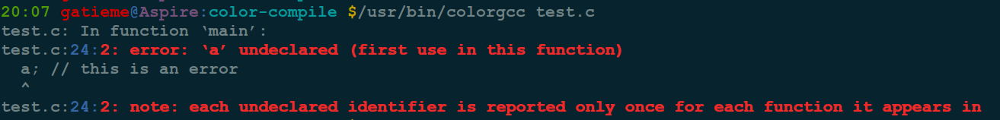
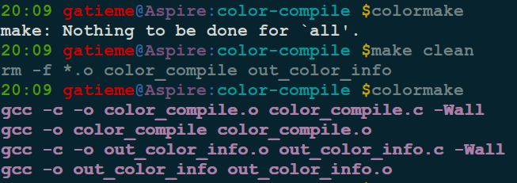
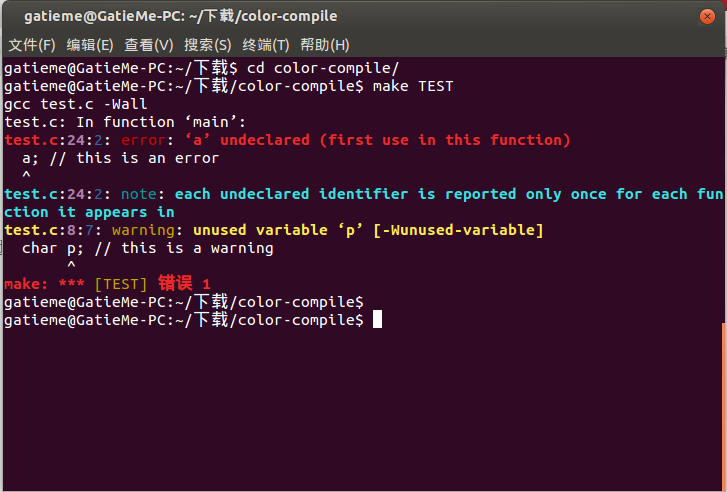

#1	gcc4.9.0原生的高亮
-------

gcc4.9.0是支持诊断信息支持彩色显示
但是很多发行版源中的gcc版本都太低
如果我们直接源码安装比较麻烦
下面我们介绍一个比较简易的方法


#2	使用`colorgcc`和`colormake`
-------


`colorgcc`和`colormake`是GNU的编译高亮工具

*	`colorgcc`让编译器的输出信息彩色高亮, 

*	`colormake` 则可以为make增加高亮色彩


```cpp
sudo apt-get install colormake colorgcc
```







#3	color-compile项目
-------


项目地址：https://github.com/chinaran/color-compile/


##3.1	下载源码
-------
```
git clone https://github.com/chinaran/color-compile/
```

##3.2	开始编译安装
-------


```
cd color-compile
/make
sudo /make install
```
>其实安装方法可以参见README.md
https://github.com/chinaran/color-compile/blob/master/README.md

##3.3	测试
-------


```cpp
cd color-compile
make TEST
```





##3.4	卸载
-------

Makefile中没有make uninstall命令
查看Makefile中install命令的执行操作，我们可以猜测出卸载的途径


```cpp
install:
	cp color_compile /usr/local/bin/
	cp out_color_info /usr/local/bin/

	echo 'alias gcc="color_compile gcc"' >> $(ALIAS_FILE)
	echo 'alias g++="color_compile g++"' >> $(ALIAS_FILE)
	echo 'alias make="color_compile make"' >> $(ALIAS_FILE)
```

卸载命令

删掉或者注释掉$(ALIAS_FILE)即~/.bashrc中以下几行

```cpp
alias gcc="color_compile gcc"
alias g++="color_compile g++"
alias make="color_compile make"
```


彻底卸载可以删除二进制文件


```cpp
rm -rf /usr/local/bin/color_compile
rm -rf /usr/local/bin/out_color_info
```

