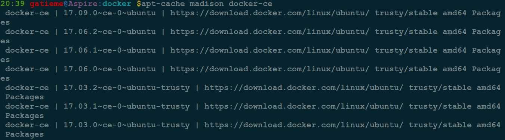
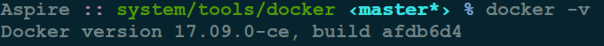
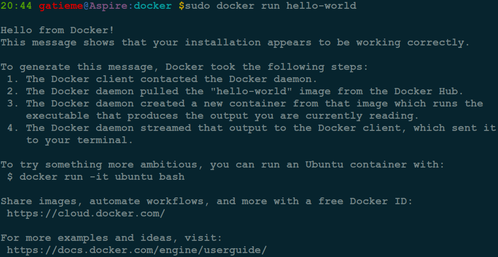

Ubuntu 14.04 安装 Docker
=======

| CSDN | GitHub |
|:----:|:------:|
| [`Ubuntu 14.04` 安装 `Docker`](http://blog.csdn.net/gatieme/article/details/78177983) | [`AderXCoding/system/tools`](https://github.com/gatieme/AderXCoding/tree/master/system/tools) |

<br>

<a rel="license" href="http://creativecommons.org/licenses/by-nc-sa/4.0/"></a>

本作品采用<a rel="license" href="http://creativecommons.org/licenses/by-nc-sa/4.0/">知识共享署名-非商业性使用-相同方式共享 4.0 国际许可协议</a>进行许可, 转载请注明出处, 谢谢合作

因本人技术水平和知识面有限, 内容如有纰漏或者需要修正的地方, 欢迎大家指正, 也欢迎大家提供一些其他好的调试工具以供收录, 鄙人在此谢谢啦

<br>

#1	Docker简介
-------

Docker 是一个开源的应用容器引擎，让开发者可以打包他们的应用以及依赖包到一个可移植的容器中，然后发布到任何流行的 Linux 机器上，也可以实现虚拟化。容器是完全使用沙箱机制，相互之间不会有任何接口。

#2	安装
-------

>参见
>
>[Install Docker EE on Ubuntu](https://docs.docker.com/engine/installation/linux/docker-ee/ubuntu/)
>
>[`Ubuntu16.04` 安装 `docker`](http://www.cnblogs.com/lighten/p/6034984.html)
>
>[`ubuntu` 环境下 `docker` 安装步骤](http://www.cnblogs.com/zzcit/p/5845717.html)

##2.1	通过系统自带包安装(可能不是最新版)
-------

```cpp
sudo apt-get update
sudo apt-get install -y docker.io
```

#2	通过Docker源安装最新版本
-------

##2.1	官方方案
-------

###2.1.1	添加 `GPG Key`
-------


```cpp
 curl -fsSL https://download.docker.com/linux/ubuntu/gpg | sudo apt-key add -
```

使用如下命令检查 `GPG Key` 的信息是否正确


```
sudo apt-key fingerprint 0EBFCD88
```

`GPG Key` 的信息如下 :

```cpp
pub   4096R/0EBFCD88 2017-02-22
      Key fingerprint = 9DC8 5822 9FC7 DD38 854A  E2D8 8D81 803C 0EBF CD88
uid                  Docker Release (CE deb) <docker@docker.com>
sub   4096R/F273FCD8 2017-02-22
```


###2.1.2	添加源信息
-------

```cpp
#将源信息直接写入/etc/apt/sources.list
sudo add-apt-repository \
   "deb [arch=amd64] https://download.docker.com/linux/ubuntu \
   $(lsb_release -cs) \
   stable"
```

OR

```cpp
#单独创建docker的source.list
sudo bash -c "deb [arch=amd64] https://download.docker.com/linux/ubuntu trusty stable > /etc/apt/sources.list.d/docker.list"
```

更新源信息

```cpp
sudo apt-get update
```


由于系统中默认带有旧的docker源, 确认docker的源信息是否正确,  新的源是否添加成功

```cpp
apt-cache madison docker-ce
```




###2.1.3	安装
-------
```cpp
sudo apt-get install docker-ce
```

###2.1.4	验证安装
-------

使用以下命令验证安装 :

```cpp
docker -v
```




###2.1.5	测试docker运行
-------

开启 `docker` 后台进程

```cpp
sudo service docker start
```

校验docker是否安装成功

```cpp
sudo docker run hello-world
```

这个命令会下载一个测试镜像, 并且运行在一个容器中. 当容器运行时, 他会打印一些信息, 并且退出.





##2.2	网络上其他方案：
-------

[`Ubuntu` 下安装 `Docker`](http://blog.csdn.net/hankai945/article/details/54342679)


```cpp
sudo apt-key adv --keyserver hkp://p80.pool.sks-keyservers.net:80 --recv-keys 58118E89F3A912897C070ADBF76221572C52609D
sudo bash -c "deb https://apt.dockerproject.org/repo ubuntu-trusty main > /etc/apt/sources.list.d/docker.list"
sudo apt-get update
sudo apt-get install lxc-docker
```

或者
[`Ubuntu14.04` 下安装 `docker`](http://www.cnblogs.com/xiaoluosun/p/5520510.html)

```cpp
sudo apt-get install apt-transport-https 
sudo apt-key adv --keyserver hkp://keyserver.ubuntu.com:80 --recv-keys 36A1D7869245C8950F966E92D8576A8BA88D21E9 
sudo bash -c "echo deb https://get.docker.io/ubuntu docker main > /etc/apt/sources.list.d/docker.list"
sudo apt-get update
sudo apt-get install lxc-docker
```


>备注: Docker没有为所有架构提供代码包 .你可以找到 nightly built binaries in [https://master.dockerproject.org](https://master.dockerproject.org/). To install docker on a multi-architecture system, add an [arch=...] clause to the entry. 详细内容参考 Debian Multiarch wiki .

```cpp
sudo echo 'deb https://apt.dockerproject.org/repo ubuntu-trusty main' > /etc/apt/sources.list.d/docker.list
```


<br>

*	本作品/博文 ( [AderStep-紫夜阑珊-青伶巷草 Copyright ©2013-2017](http://blog.csdn.net/gatieme) ), 由 [成坚(gatieme)](http://blog.csdn.net/gatieme) 创作, 

*	采用<a rel="license" href="http://creativecommons.org/licenses/by-nc-sa/4.0/"></a><a rel="license" href="http://creativecommons.org/licenses/by-nc-sa/4.0/">知识共享署名-非商业性使用-相同方式共享 4.0 国际许可协议</a>进行许可. 欢迎转载、使用、重新发布, 但务必保留文章署名[成坚gatieme](http://blog.csdn.net/gatieme) ( 包含链接: http://blog.csdn.net/gatieme ), 不得用于商业目的

*	基于本文修改后的作品务必以相同的许可发布. 如有任何疑问，请与我联系.