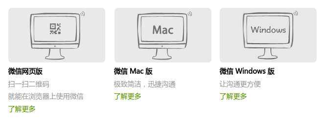
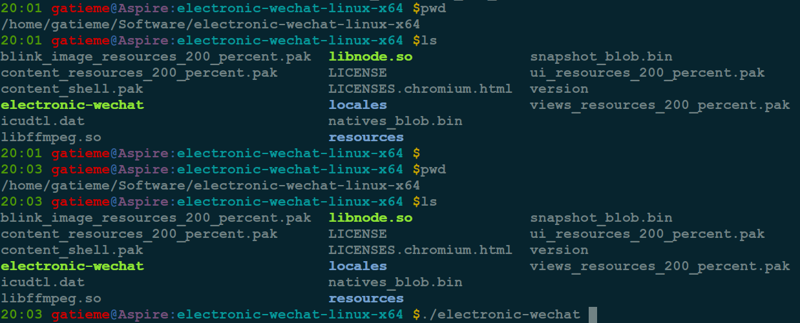
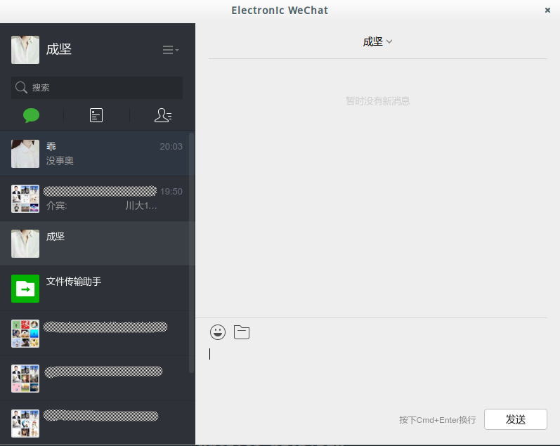

Linux和Mac下的微信电脑版electronic-wechat(非官方)
=======


| CSDN | GitHub |
|:----:|:------:|
| [Linux和Mac下的微信电脑版electronic-wechat(非官方)](http://blog.csdn.net/gatieme/article/details/52800015) | [`AderXCoding/system/tools/electronic_wechat`](https://github.com/gatieme/AderXCoding/tree/master/system/tools/electronic_wechat) |


<br>
<a rel="license" href="http://creativecommons.org/licenses/by-nc-sa/4.0/"></a>
本作品采用<a rel="license" href="http://creativecommons.org/licenses/by-nc-sa/4.0/">知识共享署名-非商业性使用-相同方式共享 4.0 国际许可协议</a>进行许可
<br>


#1	electronic-wechat
-------


微信的出现和QQ一样极大的方便了我们的社交网络, 但是按照鹅厂一贯的风格, 微信推出了电脑版[`WeChat for Windows`](http://weixin.qq.com/cgi-bin/readtemplate?t=win_weixin&lang=zh_CN)和[`WeChat for Mac`](http://weixin.qq.com/cgi-bin/readtemplate?t=weixin_faq&faq=mac_2), 当然自然也少不了[`WeChat网页版`](https://wx.qq.com/)但是却迟迟不推出Linux版本





为此社区退出了`Electronic WeChat`开源项目. 网页版微信是其中重要的一部分, 但请注意这是一个社区发布的产品, 而不是官方微信团队发布的产品.


Electronic WeChat

>开源地址
>
>https://github.com/geeeeeeeeek/electronic-wechat
>
>下载地址
>
>https://github.com/geeeeeeeeek/electronic-wechat/releases

该微信客户端基于Electronic技术开发, Electron提供了丰富的本地(操作系统)的API,使你能够使用纯JavaScript来创建桌面应用程序, 支持Mac, Linux, Windows可谓是全平台, 项目使用MIT许可


#2	应用特性
-------


*	Electronic WeChat v.s. Mac 官方微信客户端

来自网页版微信的更现代的界面和更完备的功能

拖入图片、文件即可发送

阻止其他人撤回消息

没有原生客户端万年不修复的bug


*	Electronic WeChat v.s. 网页版微信客户端

能够显示贴纸消息

原生应用的体验，独立于浏览器

OS X中的dock未读消息计数和消息通知

直接打开微信重定向的链接 (如 taobao.com)

*	Electronic WeChat v.s. Linux 官方微信客户端


#3	安装 & 使用
-------


在下载和运行这个项目之前，你需要在电脑上安装Git和Node.js(来自npm).


##3.1	源码编译安装
-------


**下载仓库**

```cpp
# Clone this repository
git clone https://github.com/geeeeeeeeek/electronic-wechat.git
```

**进入仓库**

```cpp
cd electronic-wechat
```

**安装依赖, 运行应用**

```cpp
npm install && npm start
```


**根据你的平台打包应用**

```cpp
npm run build:osx
npm run build:linux
npm run build:win
```


##3.2	直接下载应用(二进制包)
-------


如果你希望开箱即用，你可以在[`release`](https://github.com/geeeeeeeeek/electronic-wechat/releases)中下载到最新的稳定版本.

```cpp
wget https://github.com/geeeeeeeeek/electronic-wechat/releases/download/v1.4.0/linux-x64.tar.gz
```




运行的话, 直接双击可执行程序`electronic-wechat `即可





##3.3	创建桌面启动器(快捷方式)
-------


每次都在终端中启动微信实在太麻烦了, 所以我决定给微信添加一个桌面启动器, 就是就是windows下面的快捷方式

`Ubuntu`下`dash home`中每个图标对应`/usr/share/applications`当中的一个配置文件(文件后缀为.desktop), 所以要在dash home中 添加一个自定义程序启动器, 需要在该文件目录下创建对应的配置文件


首先下载图标

```cpp
wget https://raw.githubusercontent.com/geeeeeeeeek/electronic-wechat/master/assets/icon.png -O electronic-wechat.png
```


然后把应用程序包和图标拷贝到系统中的合适的目录下, 比如`/usr`等, 我放在了`/opt`下面


接着我们创建一个微信电脑版的桌面启动器,保存在`/usr/share/applications/electronic-wechat.desktop`中

```cpp
[Desktop Entry]
Name=Electronic Wechat
Name[zh_CN]=微信电脑版
Name[zh_TW]=微信电脑版
Exec=/opt/electronic-wechat/electronic-wechat
Icon=/opt/electronic-wechat/resources/electronic-wechat.png
Terminal=false
X-MultipleArgs=false
Type=Application
Encoding=UTF-8
Categories=Application;Utility;Network;InstantMessaging;
StartupNotify=false
```

示例中我们讲我们的`electronic-wechat`应用程序包放在了`/opt/electronic-wechat`目录下, 而启动器对应`/usr/share/applications`, 这是全局有效的, 而如果我们只是期望对本用户有效, 可以讲应用程序包放在自己的$HOME(~)下面, 而启动器则放到`~/.local/share/applications`目录下

