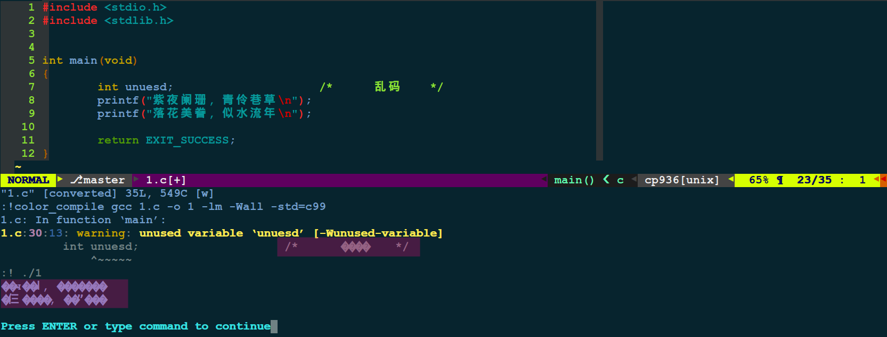
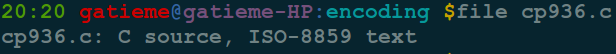
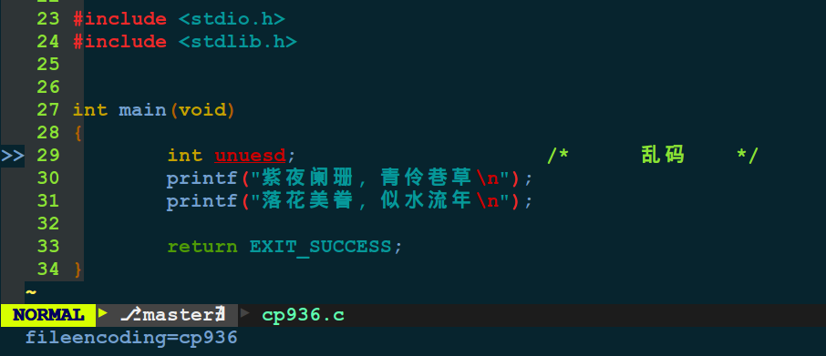
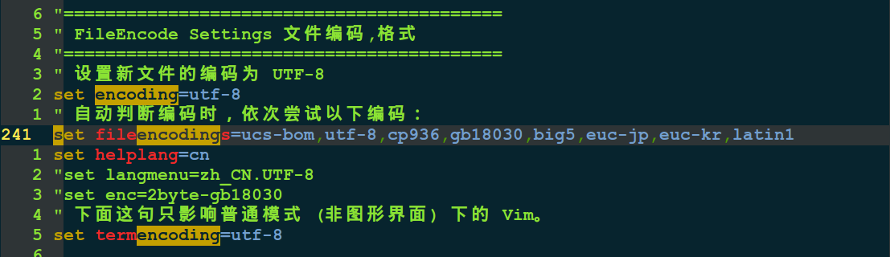

Ubuntu下apache的安装与配置
=======

| CSDN | GitHub |
|:----:|:------:|
| [Ubuntu下apache的安装与配置](http://blog.csdn.net/gatieme) | [`AderXCoding/system/tools`](https://github.com/gatieme/AderXCoding/tree/master/system/tools) |


http://liulanmi.com/zt/10306.html

<br>
<a rel="license" href="http://creativecommons.org/licenses/by-nc-sa/4.0/"></a>
本作品采用<a rel="license" href="http://creativecommons.org/licenses/by-nc-sa/4.0/">知识共享署名-非商业性使用-相同方式共享 4.0 国际许可协议</a>进行许可, 转载请注明出处, 谢谢
<br>


#1.	问题描述--(linux下经常遇到的编码问题)
--------


师兄在 `windows` 下写的一段程序(`C/C++` 编写), 传给我在 `Linux` 下面运行, 编译和运行的时候输出的时候中文乱码了



#2.	原因解析
-------

如果你需要在 `Linux` 中操作 `windows` 下的文件, 那么你可能会经常遇到文件编码转换的问题.

`Windows` 中默认的文件格式是 `cp936`(通常被视为等同 `GBK`), 而 `Linux` 一般都是 `UTF-8`


#3.	背景知识(什么是编码？)
-------

关于编码的定义，我们可以查看[百度全科](http://baike.baidu.com/view/237708.htm)

还可以参考：http://www.cnblogs.com/cocowool/archive/2009/04/25/1443529.html


#3	linux下查看编码的方法
-------

*	方法一：file filename

```cpp
file cp936.c
```



*	方法二：在Vim中可以直接查看文件编码

```cpp
:set fileencoding
```

即可显示文件编码格式




如果你只是想查看其它编码格式的文件或者想解决用Vim查看文件乱码的问题，那么你可以在

~/.vimrc 文件中添加以下内容：

```cpp
set encoding=utf-8
fileencodings=ucs-bom,utf-8,cp936
```



　　这样，就可以让vim自动识别文件编码（可以自动识别UTF-8或者GBK编码的文件），其实就是依照
fileencodings提供的编码列表尝试，如果没有找到合适的编码，就用latin-1（ASCII）编码打开。

#4.	文件编码转换
-------

*	跨平台方法：


| 工具 | 描述 | 使用 |
|:---:|:----:|:----:|
| iconv | 提供标准的程序和API来进行编码转换 | iconv -f 原编码 -t 转换后的编码 inputfile -o outputfile |
| convert_encoding.py | 基于Python的文本文件转换工具 |
| decodeh.py | 提供算法和模块来谈测字符的编码 |

*	Linux:


| 工具 | 描述 | 使用 |
|:---:|:----:|:----:|
| vim | 使用vim直接进行文件的编码转换 | :set fileencoding=utf-8 |
| recode | 转换文件编码 |
| Utrac | 转换文件编码 |
| cstocs | 转换文件编码 |
| convmv | 转换文件名编码 |
| enca | 分析给定文件的编码 |


*	Windows:

| 工具 | 描述 |
|:---:|:----:|
| cscvt | 字符集转换工具 |


