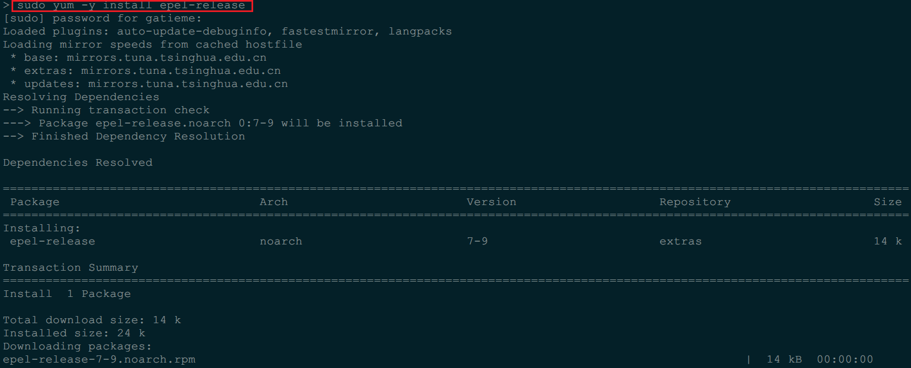
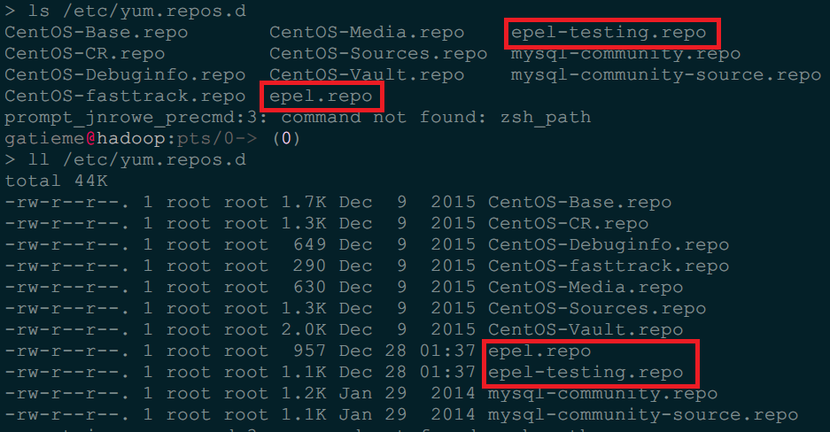
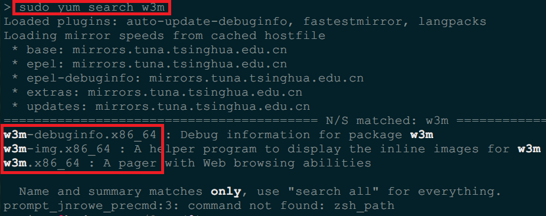

| CSDN | GitHub |
|:----:|:------:|
| [CentOS7/RHEL7安装EPEL扩展仓库步骤详解](http://blog.csdn.net/gatieme/article/details/70232358) | [`AderXCoding/system/tools/flashplayer`](https://github.com/gatieme/AderXCoding/tree/master/system/tools/epel) |


<br>
<a rel="license" href="http://creativecommons.org/licenses/by-nc-sa/4.0/"></a>
本作品采用<a rel="license" href="http://creativecommons.org/licenses/by-nc-sa/4.0/">知识共享署名-非商业性使用-相同方式共享 4.0 国际许可协议</a>进行许可, 转载请注明出处
<br>


#1	`EPEL` 仓库介绍
-------

##1.1	问题描述
-------


今天在 `CentOS7.2.1511` 安装 终端浏览器 `W3M` 的时候, 出现`No package w3m avaliable`


很奇怪, `CentOS`  源中怎么可能连 `w3m` 这种软件都没有装呢?

分析发现其系统中没有安装`EPEL` 扩展仓库

##1.2	原因解析( `EPEL` 扩展仓库)
-------


`EPEL` 是 `yum` 的一个软件源, 里面包含了许多基本源里没有的软件了, 但在我们在使用 `epel` 时是需要安装它才可以了, 下文来介绍 `CentOS7/RHEL7` 安装 `EPEL` 步骤

`EPEL`, 即 `Extra Packages for Enterprise Linux` 的简称, 是为企业级 `Linux` 提供的一组高质量的额外软件包, 包括但不限于 `Red Hat Enterprise Linux (RHEL), CentOS and Scientific Linux (SL), Oracle Enterprise Linux (OEL)`.


>本文地址[CentOS7/RHEL7安装EPEL扩展仓库步骤详解](http://blog.csdn.net/gatieme/article/details/70232358), 转载请著名出处


#2	为 `CentOS7/RHEL7` 安装 `EPEL` 仓库
-------


##2.1	方法一 : 命令安装
-------


```cpp
yum -y install epel-release
```




##2.2	方法二 : 手动安装
-------

针对系统架构选择相应的类型 : http://dl.fedoraproject.org/pub/epel/7/

我们使用的 `x86_64`, 就要进入该目录下寻找相应包, 安装方法如下 :

```cpp
rpm -vih http://dl.fedoraproject.org/pub/epel/7/x86_64/e/epel-release-7-2.noarch.rpm
```

或者：

```cpp
wget http://dl.fedoraproject.org/pub/epel/7/x86_64/e/epel-release-7-2.noarch.rpm
rpm -vih epel-release-7-2.noarch.rpm
```


接着更新元数据缓存(非必须):

```cpp
yum clean all && yum makecache
```

#3	验证 `EPEL` 仓库
-------

此时我们发现 `/etc/yum.repos.d/` 下多了两个 `epel` 的 `repo` 文件:

`epel.repo` 和 `epel-testing.repo`

```cpp
ll /etc/yum.repos.d/
```




`w3m` 是基础包中没有的, 而 `epel` 包中才有的软件包

```cpp
sudo yum search w3m
```




#4	参照
-------

[清华源--EPEL 镜像使用帮助](https://mirrors.tuna.tsinghua.edu.cn/help/epel/)

[Centos安装EPEL扩展源](http://www.centoscn.com/image-text/install/2014/0830/3609.html)

[Centos7.x RHEL 配置EPEL第三方YUM源](http://blog.csdn.net/u011435712/article/details/48751275)

[Extra Packages for Enterprise Linux (EPEL)](http://fedoraproject.org/wiki/EPEL)

[How To Install EPEL Repo on a CentOS and RHEL 7.x](https://www.cyberciti.biz/faq/installing-rhel-epel-repo-on-centos-redhat-7-x/)

<a rel="license" href="http://creativecommons.org/licenses/by-nc-sa/4.0/"></a>
<br>
本作品采用<a rel="license" href="http://creativecommons.org/licenses/by-nc-sa/4.0/">知识共享署名-非商业性使用-相同方式共享 4.0 国际许可协议</a>进行许可