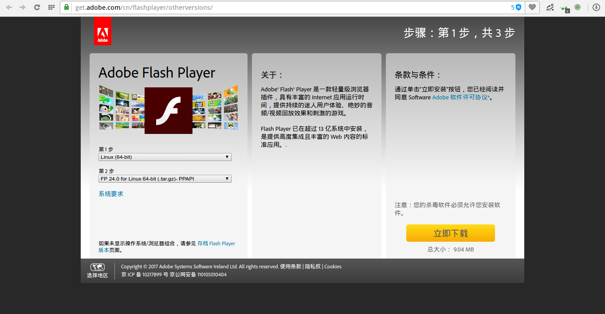
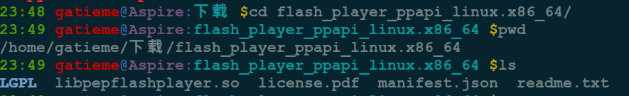
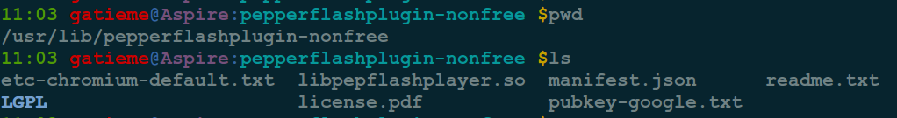

Ubuntu安装adobe flash player插件(PPAPI和NPAPI)
=======

| CSDN | GitHub |
|:----:|:------:|
| [Aderstep--紫夜阑珊-青伶巷草](http://blog.csdn.net/gatieme) | [`AderXCoding/system/tools`](https://github.com/gatieme/AderXCoding/tree/master/system/tools) |


<br>
<a rel="license" href="http://creativecommons.org/licenses/by-nc-sa/4.0/"></a>
本作品采用<a rel="license" href="http://creativecommons.org/licenses/by-nc-sa/4.0/">知识共享署名-非商业性使用-相同方式共享 4.0 国际许可协议</a>进行许可, 转载请注明出处
<br>


<a rel="license" href="http://creativecommons.org/licenses/by-nc-sa/4.0/"></a>
<br>
本作品采用<a rel="license" href="http://creativecommons.org/licenses/by-nc-sa/4.0/">知识共享署名-非商业性使用-相同方式共享 4.0 国际许可协议</a>进行许可


| Platform | Browser | Player |
|:------:|:---------:|:------:|
| Windows | Internet Explorer | ActiveX |
| Windows | Internet Explorer (embedded - Windows 8.1) | ActiveX |
| Windows | Edge (embedded - Windows 10) | ActiveX |
|---------|---------|------|
| Windows | Firefox | NPAPI |
| Windows | Chrome (embedded) | PPAPI |
| Windows | Opera, Chromium-based browsers | PPAPI |
|---------|---------|------|
| Macintosh OS X | Firefox, Safari | NPAPI |
| Macintosh OS X | Chrome (embedded) | PPAPI |
| Macintosh OS X | Opera, Chromium-based browsers | PPAPI |
|---------|---------|------|
| Linux | Firefox | NPAPI |
| Linux | Chrome (embedded) | PPAPI |
| Linux | Opera, Chromium-based browsers - PPAPI |
|---------|---------|------|
| ChromeOS | ChromeOS | PPAPI |


#1  问题
-------


##1.1  Linux下的Flash Player
-------


`Flash Player For Linux` 自 `11.2` 起已经停止更新, 目前 `Linux` 平台下面的 `Flash Player` 只能依靠 `Google Chrome` 的 `PPAPI(Pepper Flash Player)` 进行更新 `(Chrome Only)` `Adobe` 仅维护这个版本, 其它浏览器包括 `Chromium` 都只能使用 `Flash Player 11.2`
但由于 Chromium 宣布将抛弃旧的标准(NPAPI)，导致原本的 Flash Player 将无法在 Chromium 运行，所以决定在 Chromium 中使用 Pepper Flash Player ，这个Pepper Flash Player 是通过下载 Google Chrome 然后提取出来给 Chromium 使用的。

##1.2 NPAPI 和 PPAPI
-------

`NPAPI` 是当今最流行的插件架构, 由网景开发, 后 `Mozilla` 维护, 几乎所有浏览器都支持, 不过存在很大的安全隐患, 插件可以窃取系统底层权限, 发起恶意攻击.


`2010`年, `Google`在原有网景 `NPAPI(Netscape Plugin API)` 基础上开发了新的 `PPAPI(Pepper Plugin API)`, 将外挂插件全部放到沙盒里运行, `2012`年 `Windows、Mac` 版本的 `Chrome` 浏览器先后升级了 `PPAPI Flash Player`, 并希望今年底值钱彻底淘汰 `NPAPI`.

`PPAPI` 的 `flash` 相较于 `NPAPI` 来讲, 内存占用更大, 因为全在沙盒里面运行, 顺便一提 `flash` 每次更新基本上都是修补安全漏洞.


#2 安装PPAPI
-------


##2.1 源中安装PPAPI
-------

早期源中使用包 `adobe-flashplugin` 来安装 `PPAPI`. 但是后来此包废弃, 取而代之的是 `pepperflashplugin-nonfree`, 但目前测试的过程中, 此包也有问题

目前这个安装器已经收录于 `Ubuntu 14.04` 官方源(从 `Debian`源中导入)

`Ubuntu 14.04` 用户可以通过以下命令安装 `Pepper Flash Player For Chromium` :

```cpp
sudo apt-get install pepperflashplugin-nonfree
sudo update-pepperflashplugin-nonfree --install
```

如果你想使用 `Beta` 版的 `Google Chrome` 中的 `Pepper Flash Player`, 那么可以把第二个命令改为 :

```cpp
sudo update-pepperflashplugin-nonfree --install --beta --unverified
```

如果想使用非稳定版的 `Google Chrome` 中的 `Pepper Flash Player`, 那么可以把第二个命令改为 :

```cpp
sudo update-pepperflashplugin-nonfree --install --unstable --unverified
```


如果你想卸载这个 `Flash Player`, 那么请执行以下命令 :

```cpp
sudo update-pepperflashplugin-nonfree --uninstall
```

如果安装成功, 会将 `PPAPI` 安装到 `/usr/lib/pepperflashplugin-nonfree/`


如果安装过程中提示出错

````cpp
ERROR: failed to retrieve status information from google : W: There is no public key available for the following key IDs:
1397BC53640DB551
```

这是因为谷歌改变了它的签名密钥, 解决办法, 参见[PepperFlashPlayer](https://wiki.debian.org/PepperFlashPlayer)


```cpp
gpg --keyserver pgp.mit.edu --recv-keys 1397BC53640DB551
gpg --export --armor 1397BC53640DB551 | sudo sh -c 'cat >> /usr/lib/pepperflashplugin-nonfree/pubkey-google.txt'
```

##2.2	用二进制包安装
-------


如果提示无法下载和安装, 则我们需要自己下载二进制包, 完成安装.

###2.2.1 下载Adobe Falsh Player for Chromium(PPAPI)
-------


下载对应版本的[Flash Player](https://get.adobe.com/cn/flashplayer/otherversions/)



其中 `deb` 包已经无法下载, 因为其对应的 [adobe-flashplugin](https://launchpad.net/ubuntu/+source/adobe-flashplugin) 软件包已经不在源中了, 参见[ubuntu package搜索adobe-flashplugin](http://packages.ubuntu.com/search?keywords=adobe-flashplugin&searchon=names&suite=trusty&section=all)

其他 `rpm` 包均可下载安装

我们目前的环境是 `Ubuntu`, 官方没有提供 `deb` 包, 而 `apt` 的源也已经失效, 因此我们只能下载 `tar.gz` 格式的二进制包.


*	NPAPI

```
#NPAPI
wget https://fpdownload.adobe.com/get/flashplayer/pdc/24.0.0.221/flash_player_npapi_linux.x86_64.tar.gz
```

*	PPAPI
wget https://fpdownload.adobe.com/pub/flashplayer/pdc/24.0.0.221/flash_player_ppapi_linux.x86_64.tar.gz
```

```cpp
tar -zxvf flash_player_ppapi_linux.x86_64.tar.gz
```



主要是一个名为`libpepflashplayer.so` 的链接库.


###2.2.2 安装PPAPI
-------


安装 `PPAPI` 其实就是将 `flashplayer` 的链接库系统或个人的链接库目录, 或者安装到 `浏览器` 的链接库目录

为了兼容软件包 `pdate-pepperflashplugin-nonfree`


现在将 `libpepflashplayer.so` 文件从下载文件夹移动到 `/usr/lib/pepperflashplugin-nonfree` 目录.

你可以通过命令︰

```cpp
sudo mv ~/Downloads/flash_player_ppapi_*/libpepflashplayer.so /usr/lib/pepperflashplugin-nonfree /
```




#3	安装NPAPI
-------

##3.1 源中安装
-------

`NPAPI` 在源中由 `flashplugin-installer` 提供

```cpp
sudo apt-get install flashplugin-installer
```

安装过程中会下载 `flash_player_npapi_linux.tar.gz` 的包, 并自动安装到 `/usr/lib/flashplugin-installer/`


##3.2 二进制包安装
-------


###3.2.1 下载Adobe Falsh Player for Firefox(NPAPI)
-------

采用与 `PPAPI` 同样的方法安装

下载对应版本的[Flash Player](https://get.adobe.com/cn/flashplayer/otherversions/)


或者直接下载

```
#NPAPI
wget https://fpdownload.adobe.com/get/flashplayer/pdc/24.0.0.221/flash_player_npapi_linux.x86_64.tar.gz
```

###3.2.2 安装
--------

同样将二进制包中的链接库拷贝到 `/usr/lib/flashplugin-installer/`, 或者浏览器可以找到的其他目录即可


```cpp
cp flash_player_npapi_linux/* /usr/lib/flashplugin-installer/
```

#4	验证
-------

访问[adobe test page](http://www.adobe.com/software/flash/about/)


或者打开其他带 `flash` 的网页即可

#5 参照

参照

[安装铬的 Flash 播放器, 在 Ubuntu 中的歌剧 16.10](https://websetnet.com/zh/updated-install-flash-player-chromium-opera-ubuntu-16-10/)

[Opera帮助文档](http://www.opera.com/docs/linux/plugins/install/#flash)

http://blog.sina.com.cn/s/blog_6c9d65a10101hz8q.html

[PepperFlashPlayer-install-Debian](https://wiki.debian.org/PepperFlashPlayer/Installing)

[PepperFlashPlayer-Debian](https://wiki.debian.org/PepperFlashPlayer)

[pepper-flash-chromium-opera-ubuntu/](http://ubuntuhandbook.org/index.php/2016/10/pepper-flash-chromium-opera-ubuntu)

[askubuntu-lash-plugin-doesnt-appear-in-opera](http://askubuntu.com/questions/630835/flash-plugin-doesnt-appear-in-opera)

[askubuntu-opera-directory-at-usr-lib-is-missing](http://askubuntu.com/questions/580247/opera-directory-at-usr-lib-is-missing)
