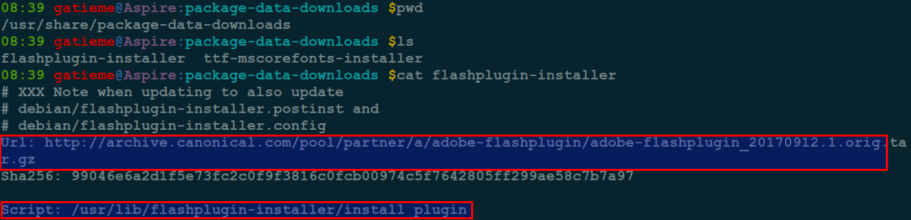
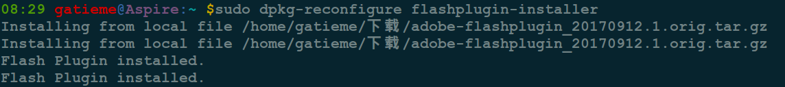

`Ubuntu` 更新卡在 `flashplugin-installer`
=======

| CSDN | GitHub |
|:----:|:------:|
| [`Ubuntu` 更新卡在 `flashplugin-installer`](http://blog.csdn.net/gatieme/article/details/78168076) | [`AderXCoding/system/tools/flashplayer/resolve_flashplugin_installer`](https://github.com/gatieme/AderXCoding/tree/master/system/tools/flashplayer/resolve_flashplugin_installer) |

<br>

<a rel="license" href="http://creativecommons.org/licenses/by-nc-sa/4.0/"></a>

本作品采用<a rel="license" href="http://creativecommons.org/licenses/by-nc-sa/4.0/">知识共享署名-非商业性使用-相同方式共享 4.0 国际许可协议</a>进行许可, 转载请注明出处, 谢谢合作

因本人技术水平和知识面有限, 内容如有纰漏或者需要修正的地方, 欢迎大家指正, 也欢迎大家提供一些其他好的调试工具以供收录, 鄙人在此谢谢啦

<br>


#1	问题发现
-------

之前的博文 [`Ubuntu` 安装 `adobe flash player` 插件(`PPAPI`和`NPAPI`)](http://blog.csdn.net/gatieme/article/details/56481893) 中讲解了如何安装 `adobe flash player for linux`, `Ubuntu` 可以使用源中 `flashplugin-installer` 提供 `NPAPI`.

```cpp
sudo apt-get install flashplugin-installer
```

安装过程中会下载 `flash_player_npapi_linux.tar.gz` 的包到目录 `/var/cache/flashplugin-installer`, 并自动安装到 `/usr/lib/flashplugin-installer` 目录下


但是后来的几次更新中发现, 每次更新管理器都会卡在 `flashplugin-installer` 这里. 结果软件中心就卡死在"正在应用更改", 取消也取消不了. 也不能安装或删除其他软件.


#2	方法一	动下载flash.tar.gz包并配置
-------


##2.1	获取下载链接-清除通知(非必须)
-------
在进入下载 `adobe-flashplugin_XXX.orig.tar.gz` 软件包时断网(或者进行网络切换), 则会下载中断, 并弹出"下载额外数据不成功"的通知.

移除"下载额外数据不成功"的恼人提示通知, 方法 :

```cpp
# 提示信息
cd /usr/share/package-data-downloads/
sudo rm -rf flashplugin-installer
```

该文本信息正是下载失败时候的提示信息, 其中指示了下在路径




其他信息可不必删除

```cpp
cd /var/lib/update-notifier/package-data-downloads/
sudo rm -rf flashplugin-installer
cd /var/lib/update-notifier/user.d/
sudo rm data-downloads-failed
```

##2.2	手动下载
-------


可以手动下载 `FLASH` 插件然后放到浏览器的 `plugins` 里面去解决这个问题


下载, 目前最新版是 `adobe-flashplugin_20170912.1.orig.tar.gz`, 请大家按需下载.

可以使用浏览器下载

```cpp
http://archive.canonical.com/pool/partner/a/adobe-flashplugin/adobe-flashplugin_20170912.1.orig.tar.gz
```

然后把 `/var/cache/flashplugin-installer` 里面的东西全部删除, 用下载软件事先下载好 `adobe-flashplugin_20170912.1.orig.tar.gz` 替换掉, 把它移动到 `/var/cache/flashplugin-installer`


##2.3	安装
-------

然后重新配置即可.

```cpp
sudo dpkg-reconfigure flashplugin-installer
```

中间会提示输入 `.tar.gz` 包所在的路径, 注意只输入所在目录即可





>*	对于 `ubuntu-restricted-extras` 中的其他软件包 `ttf-mscorefonts-installer` 也可以使用同样的方法.
>
>*	对于网上有些采用删除 `/usr/share/update-notifier/package-data-downloads-failed` 文件的方法是错误的, 治标不治本.
>
>*	其实最主要的执行文件是 `/usr/lib/update-notifier/package-data-downloader`, 大家看一下这个文件就明白了.
>
>*	"下载额外数据不成功"的恼人提示通知消不掉的问题, 已经被`ubuntu` 确认为 `bug`, 但现在依旧没有解决, 所以采用上面的方法手动删除相关文件可以解决这个问题.

#3	方法二	修改下载脚本
-------


`ubuntu` 是通过 `/usr/lib/update-notifier/package-data-downloader` 完成这件事的, 它是个 `python` 脚本, 里面用到了 `urllib`, 但是这个库不支持 `proxy`, 所以会导致 `deb` 安装失败.

等 `ubuntu` 解决这类问题之前, 需要自己先找个 `workaround` 的办法 :

打开 `/usr/lib/update-notifier/package-data-downloader` 找到下面这段 `Python` 代码 :

```cpp
for i in range(len(files)):  
        print "%s: downloading %s" % (relfile, files[i])  
        dest_file = urllib.urlretrieve(files[i])[0]  
        output = subprocess.check_output(["sha256sum", dest_file])  
        output = output.split(' ')[0]  
        if output == sums[i]:  
                command.append(dest_file)  
        else:  
                record_failure(relfile)  
                break
```

将 `urllib.urlretrieve` 改成 `wget`, 改之后如下 `Python`代码 :

```py
for i in range(len(files)):  
        print "%s: downloading %s" % (relfile, files[i])  
        #dest_file = urllib.urlretrieve(files[i])[0]  
        dest_file = files[i].split("/")[-1]  
        dest_file = '/tmp/' + dest_file  
        downf = "/usr/bin/wget %s -O %s" % (files[i], dest_file)  
        subprocess.call(downf, shell=True)  
        output = subprocess.check_output(["sha256sum", dest_file])  
        output = output.split(' ')[0]  
        if output == sums[i]:  
                command.append(dest_file)  
        else:  
                record_failure(relfile)  
                break  
```

剩下的事情就是在 `/etc/wgetrc` 里面配置代理(略)

#4	参考资料
-------

[经过几天的摸索，终于得出安装flashplugin-installer的方法](http://forum.ubuntu.org.cn/viewtopic.php?t=387865)


[每次更新管理器都会卡在 `flashplugin-installer` 这里](http://forum.ubuntu.org.cn/viewtopic.php?f=77&t=445807)

[`ubuntu` 安装 `flashplugin-installer` 失败解决办法](http://blog.chinaunix.net/uid-26824563-id-4785111.html)

<br>

*	本作品/博文 ( [AderStep-紫夜阑珊-青伶巷草 Copyright ©2013-2017](http://blog.csdn.net/gatieme) ), 由 [成坚(gatieme)](http://blog.csdn.net/gatieme) 创作, 

*	采用<a rel="license" href="http://creativecommons.org/licenses/by-nc-sa/4.0/"></a><a rel="license" href="http://creativecommons.org/licenses/by-nc-sa/4.0/">知识共享署名-非商业性使用-相同方式共享 4.0 国际许可协议</a>进行许可. 欢迎转载、使用、重新发布, 但务必保留文章署名[成坚gatieme](http://blog.csdn.net/gatieme) ( 包含链接: http://blog.csdn.net/gatieme ), 不得用于商业目的, 

*	基于本文修改后的作品务必以相同的许可发布. 如有任何疑问，请与我联系.
