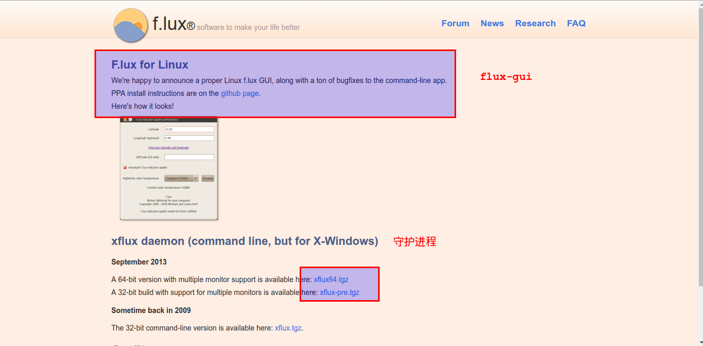
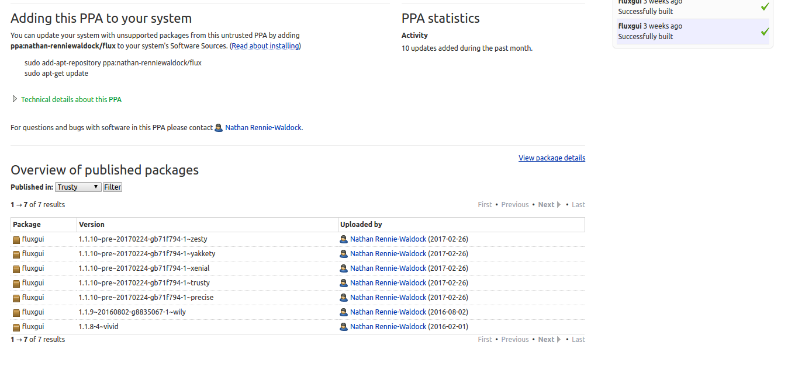

Ubuntu(护眼设置)安装屏幕色温调节软件F.lux
=======


| CSDN | GitHub |
|:----:|:------:|
| [Ubuntu(护眼设置)安装屏幕色温调节软件F.lux](http://blog.csdn.net/gatieme/article/details/62922164) | [`AderXCoding/system/tools/flux`](https://github.com/gatieme/AderXCoding/tree/master/system/tools/flux) |


<br>
<a rel="license" href="http://creativecommons.org/licenses/by-nc-sa/4.0/"></a>
本作品采用<a rel="license" href="http://creativecommons.org/licenses/by-nc-sa/4.0/">知识共享署名-非商业性使用-相同方式共享 4.0 国际许可协议</a>进行许可, 转载请注明出处
<br>


F.lux全天候保护你的眼睛, 护眼软件真是人性化, 在Win7体验了下, 果断Ubuntu也要装.

```cpp
环境：
Ubuntu 14.04  64位
```


#1	Flux介绍
-------


`f.lux` 是一款根据时间变化来改变屏幕色温的软件. 让你在深夜也能感受到太阳的温暖, 顺便还有助于睡眠.

`f.lux` - 随时间改变屏幕色温保护视力

在 `f.lux` 里，首先设置一个适合你的变化色温范围, 白天的色温控制在 `6500K` 以下, 晚上的色温控制在 `3500K` 以上, 对于我来说, `3500K` 过于偏黄, 设置为 `4200K` 是比较合适的. `+8` 是中国时区 `Latitude` 部分为你的经纬度

> 注意定位使用的是`google` 地图, 请自带 `FQ`, 如果没有可以搜索自己所在地区的经纬度后进行设置即可


那么，如何给自己一个比较明确的色温感念呢？看看维基的这张色温图和一些常见的例子：


```cpp
* 1700 K: 火柴光
* 1850 K: 蜡烛
* 2800 K: 钨灯 (白炽灯)
* 3350 K: 演播室”CP”灯
* 3400 K: 演播室檯灯, 照相泛光灯（不是闪光灯）, 等…
* 4100 K: 月光
* 5000 K: 日光
* 5500 K: 平均日光, 电子闪光 (因厂商而异)
* 5770 K: 有效太阳温度
* 6420 K: 氙弧灯
* 6500 K: 日光
* 9300 K: 电视屏幕（模拟）
```


#2	安装flux
-------

`Flux` 是跨平台的, `Windows` 下的安装机器简单, 但是相比较 `Linux` 下的安装就没那么容易了


`Linux` 使用 `flux`, 需要安装 界面`flux-gui` 以及守护进行 `xflux`.

官网 https://justgetflux.com/linux.html
有详细的安装流程




##2.1	安装flux-gui
-------

##2.1.1 使用PPA源安装flux-gui
-------


github https://github.com/xflux-gui/xflux-gui
PPA地址 https://launchpad.net/~nathan-renniewaldock/+archive/ubuntu/flux

```cpp
sudo add-apt-repository ppa:nathan-renniewaldock/flux
sudo apt-get update
sudo apt-get install fluxgui
```





###2.1.2	使用源码安装flux-gui
-------

如果已经使用了源进行安装, 请忽略此步骤, 此步骤我们使用源码来构建 `flux-gui`


```cpp
git clone git@github.com:xflux-gui/xflux-gui.git
cd xflux-gui
sudo python setup.py install
```


##2.2	安装守护进程
-------

从官网可以直接下载到守护进程 `xflux`

64位系统请使用


```cpp
wget https://justgetflux.com/linux/xflux64.tgz
```


32位系统请使用

```cpp
wget https://justgetflux.com/linux/xflux-pre.tgz
OR
wget https://justgetflux.com/linux/xflux.tgz
```

解压缩并安装 `xflux`, 将压缩包解压缩后, 将 `xflux` 拷贝到 `/usr/bin` 下即可

```cpp
tar -zxvf xflux64.tgz
sudo cp xflux /usr/bin
```


#3	运行
-------


直接运行 `fluxgui` 即可运行


经纬度获取

访问https://justgetflux.com/map.html

自备梯子`FQ`


#参考
-------

[f.lux - 全天候保护眼睛健康软件！自动调整屏幕色温减少蓝光防疲劳，长时间玩电脑必备！http://www.iplaysoft.com/flux.html](http://www.iplaysoft.com/flux.html)


[f.lux – 随时间改变屏幕色温](http://www.appinn.com/flux/)

[F.lux for Ubuntu](https://kilianvalkhof.com/2010/linux/flux-for-ubuntu/)

[Ubuntu14 安装f.lux的折腾](http://blog.csdn.net/u012365926/article/details/53207824)

[Linux下安装使用f.lux](http://blog.csdn.net/zhangxiao93/article/details/46923577)

[在Ubuntu14.04安装F.lux](https://my.oschina.net/u/2003106/blog/374003)

<a rel="license" href="http://creativecommons.org/licenses/by-nc-sa/4.0/"></a>
<br>
本作品采用<a rel="license" href="http://creativecommons.org/licenses/by-nc-sa/4.0/">知识共享署名-非商业性使用-相同方式共享 4.0 国际许可协议</a>进行许可
