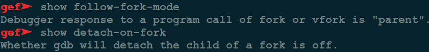
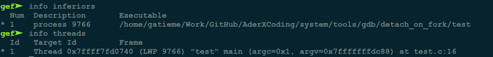
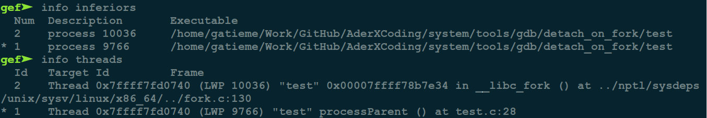
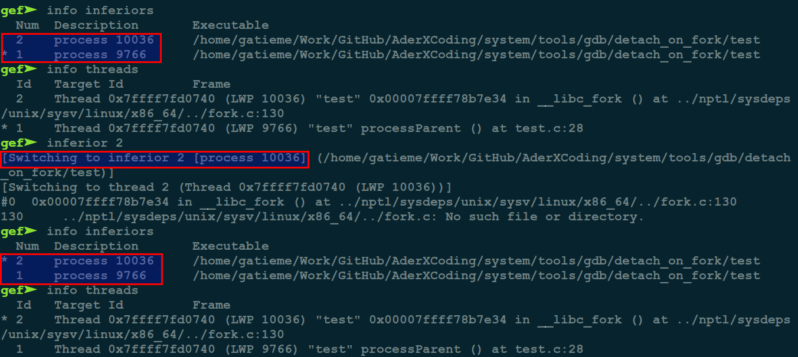
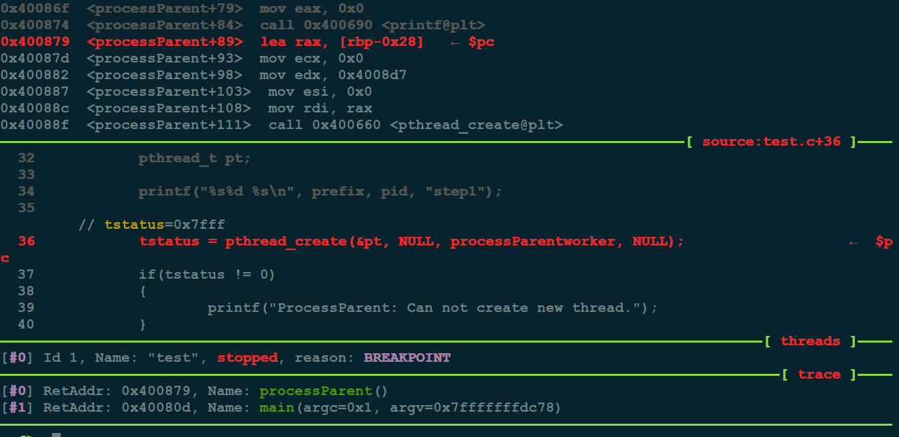
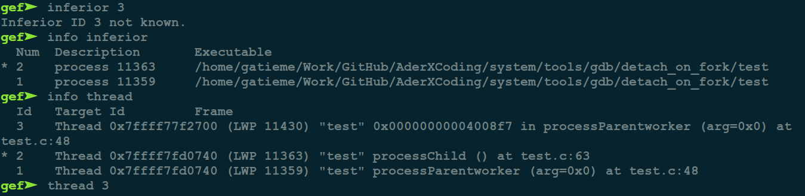
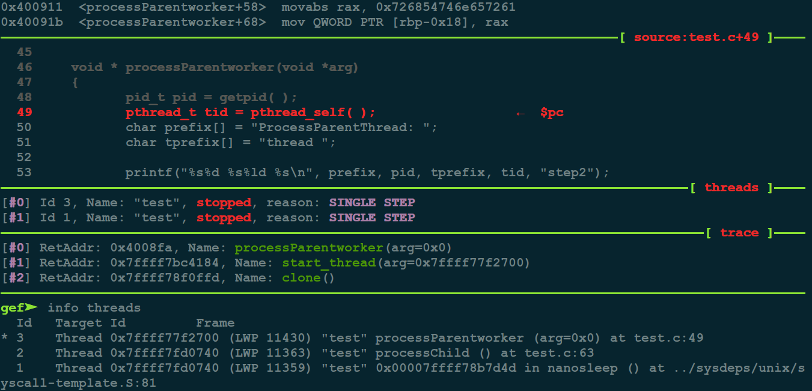

GDB 调试多进程或者多线程应用
=======

| CSDN | GitHub |
|:----:|:------:|
| [GDB 调试多进程或者多线程应用](http://blog.csdn.net/gatieme/article/details/78309696) | [`AderXCoding/system/tools/gdb/attach_on_fork`](https://github.com/gatieme/AderXCoding/tree/master/system/tools/gdb/attach_on_fork) |

<br>

<a rel="license" href="http://creativecommons.org/licenses/by-nc-sa/4.0/"></a>

本作品采用<a rel="license" href="http://creativecommons.org/licenses/by-nc-sa/4.0/">知识共享署名-非商业性使用-相同方式共享 4.0 国际许可协议</a>进行许可, 转载请注明出处, 谢谢合作

因本人技术水平和知识面有限, 内容如有纰漏或者需要修正的地方, 欢迎大家指正, 也欢迎大家提供一些其他好的调试工具以供收录, 鄙人在此谢谢啦

<br>


`GDB` 是 `linux` 系统上常用的 `c/c++` 调试工具, 功能十分强大. 对于较为复杂的系统, 比如多进程系统, 如何使用 `GDB` 调试呢?

考虑下面这个三进程系统 :


进程 `ProcessChild` 是 `ProcessParent` 的子进程, `ProcessParentThread` 又是 `ProcParent` 的子线程. 如何使用 `GDB` 调试 子进程 `ProcessChild` 或者子线程 `ProcessParentThread` 呢 ?

实际上, `GDB` 没有对多进程程序调试提供直接支持. 例如, 使用 `GDB` 调试某个进程, 如果该进程 `fork` 了子进程, `GDB` 会继续调试该进程, 子进程会不受干扰地运行下去. 如果你事先在子进程代码里设定了断点, 子进程会收到`SIGTRAP` 信号并终止. 那么该如何调试子进程呢? 其实我们可以利用 `GDB` 的特点或者其他一些辅助手段来达到目的. 此外, `GDB` 也在较新内核上加入一些多进程调试支持.

接下来我们详细介绍几种方法, 分别是 `follow-fork-mode` 方法, `attach` 子进程方法和 `GDB wrapper` 方法.


#1	follow-fork-mode方法
-------

>参考 [gdb调试多进程和多线程命令](http://blog.csdn.net/pbymw8iwm/article/details/7876797)

##1.1	follow-fork-mode方法简介
-------


默认设置下, 在调试多进程程序时 `GDB` 只会调试主进程. 但是 `GDB > V7.0` 支持多进程的分别以及同时调试, 换句话说, `GDB` 可以同时调试多个程序. 只需要设置 `follow-fork-mode` (默认值 `parent`) 和 `detach-on-fork` (默认值 `on` )即可.

| follow-fork-mode | detach-on-fork | 说明 |
|:---:|:---:|:----:|
| parent | on | 只调试主进程( `GDB` 默认) |
| child | on | 只调试子进程 |
| parent | off | 同时调试两个进程, `gdb` 跟主进程, 子进程 `block` 在 `fork` 位置 |
| child | off | 同时调试两个进程, `gdb` 跟子进程, 主进程 `block` 在 `fork` 位置 |

>设置方法

```cpp
set follow-fork-mode [parent|child]

set detach-on-fork [on|off]
```


查询正在调试的进程

```cpp
info inferiors
```

切换调试的进程

```cpp
inferior <infer number>
```

添加新的调试进程

```cpp
add-inferior [-copies n] [-exec executable]
```


可以用 `file executable` 来分配给 `inferior` 可执行文件.

其他 :

```cpp
remove-inferiors infno

detach inferior
```

`GDB` 默认支持调试多线程, 跟主线程, 子线程 `block` 在 `create thread`

查询线程

```cpp
info threads
```

切换调试线程

```cpp
thread <thread number>
```

##1.2	示例程序例程

```cpp
#include <stdio.h>
#include <pthread.h>

#include <unistd.h>

void processParent( );
void processChild( );

void * processParentworker(void *arg);

int main(int argc, const char *argv[])
{

	int pid;

	pid = fork( );

	if(pid != 0)	// fork return child pid in parent process
		processParent( );
	else		// fork return 0 in child process
		processChild( );

	return 0;
}

void processParent( )
{
	pid_t pid = getpid();
	char prefix[] = "ProcessParent: ";
	//char tprefix[] = "thread ";
	int tstatus;
	pthread_t pt;

	printf("%s%d %s\n", prefix, pid, "step1");

	tstatus = pthread_create(&pt, NULL, processParentworker, NULL);
	if(tstatus != 0)
	{
		printf("ProcessParent: Can not create new thread.");
	}

	processParentworker(NULL);
	sleep(1);
}

void * processParentworker(void *arg)
{
	pid_t pid = getpid( );
	pthread_t tid = pthread_self( );
	char prefix[] = "ProcessParentThread: ";
	char tprefix[] = "thread ";

	printf("%s%d %s%ld %s\n", prefix, pid, tprefix, tid, "step2");
	printf("%s%d %s%ld %s\n", prefix, pid, tprefix, tid, "step3");

	return NULL;
}

void processChild( )
{
	pid_t pid = getpid( );
	char prefix[] = "ProcessChild: ";
	printf("%s%d %s\n", prefix, pid, "step1");
	printf("%s%d %s\n", prefix, pid, "step2");
	printf("%s%d %s\n", prefix, pid, "step3");
}
```


主程序 `fork` 出一个子进程, 然后父进程在执行的过程中通过 `pthread_create` 创建出一个子线程.


输出：

```cpp
 ./test
ProcessParent: 7993 step1
ProcessChild: 7994 step1
ProcessChild: 7994 step2
ProcessChild: 7994 step3
ProcessParentThread: 7993 thread 140427861296960 step2
ProcessParentThread: 7993 thread 140427861296960 step3
ProcessParentThread: 7993 thread 140427853031168 step2
ProcessParentThread: 7993 thread 140427853031168 step3
```

##1.3	调试
-------


###1.3.1	开始调试
-------


首先调试主进程, `block` 子进程在 `fork` 的位置.

```cpp
set follow-fork-mode parent
set detach-on-fork off
```

```cpp
show follow-fork-mode
show detach-on-fork
```




接着在主进程 `fork` 的时候和三个进程(线程)的内部均设置断电. 下面分别跟踪三个进程

```cpp
# 在主进程fork的时候设置断点
b 16
# 在主进程pthread_create的时候设置断点
b 36
# 在父进程执行的开始位置设置断点
b 28
# 在子进程执行的开始位置设置断点
b 48
# 在子线程执行的开始位置设置断点
b 61
```

###1.3.2	调试父进程
-------

首先开始调试父进程

```cpp
# run 运行程序
r
```

进程停在了 `fork` 的位置


查看进程和线程的信息, 由于进程停在了 `fork` 的地址, 还没有创建子进程, 因此只有主进程



由于设置了 `follow-fork-mode = parent` 和 `detach-on-fork = off`. 因此在 `fork` 之后, `gdb` 进程会开始调试主进程, 而子进程会阻塞在 `fork` 之后的位置. 而我们在每个进程的执行函数路径的开始都打了断点, 那么我们继续执行, 进程将运行主程序, 走到 `ProcessParent` 的位置.

下面我们来验证一下

```cpp
#继续程序的执行
c OR continue
#也可以next执行
next
```

可以看到程序停在了主进程 `ProcessParent` 的开始位置.


现在我们查看进程和线程的信息, 此时父进程(`pid = 9766`)创建了子进程(`pid = 10036`), gdb 目前正在调试父进程

```cpp
info inferiors
info threads
```




###1.3.3	调试子进程
-------


下面我们开始跟进子进程, 之前通过 `info inferiors/threads` 来查看进程信息的时候可以看到, 进程的编号信息, 父进程(`pid = 9766`)编号为 `1`, 子进程(`pid = 10036`)编号为 `2`.

我们接着将 `gdb` attach 到子进程.

```cpp
inferiors 2
```



然后 continue 运行程序, 程序会停止在子进程 `ProcessChild` 的位置.

```cpp
continue
```


###1.3.4	调试子线程
-------

现在我们继续回到主线程然后待其创建子线程之后, 跟踪子线程.


由于在父进程的程序逻辑处 `pthread_create` 处设置了断点, 将会停在 `pthread_create` 的地方



接着往下执行, 这样子线程就会被创建, 然后我们查看进程和线程的信息


```cpp
info inferiors
info threads
```

我们可以查看到 `info inferiors` 不能看到父进程创建的子线程, 但是 `info threads` 可以看到.



然后开始调试子线程


```cpp
thread 3
```




#2	`Attach`子进程
-------


https://www.ibm.com/developerworks/cn/linux/l-cn-gdbmp/


众所周知, `GDB` 有附着(`attach`)到正在运行的进程的功能, 即 `attach <pid>` 命令. 因此我们可以利用该命令 `attach` 到子进程然后进行调试.

例如我们要调试某个进程 `process`, 首先得到该进程的 `pid`

```cpp
ps -ef | grep process
```

然后可以通过 `pstree` 可以看到该进程下的线程信息

```cpp
pstree -H pid
```

启动 `GDB attach` 到该进程

现在就可以调试了. 一个新的问题是, 子进程一直在运行, `attach` 上去后都不知道运行到哪里了. 有没有办法解决呢?

一个办法是, 在要调试的子进程初始代码中, 比如 `main` 函数开始处, 加入一段特殊代码, 使子进程在某个条件成立时便循环睡眠等待, `attach` 到进程后在该代码段后设上断点, 再把成立的条件取消, 使代码可以继续执行下去.

至于这段代码所采用的条件, 看你的偏好了. 比如我们可以检查一个指定的环境变量的值, 或者检查一个特定的文件存不存在. 以文件为例, 其形式可以如下 :

```cpp
void debug_wait(char *tag_file)
{
    while(1)
    {
        if (tag_file存在)
            睡眠一段时间;
        else
            break;
    }
}
```

当 `attach` 到进程后, 在该段代码之后设上断点, 再把该文件删除就 `OK` 了. 当然你也可以采用其他的条件或形式, 只要这个条件可以设置检测即可.

`Attach` 进程方法还是很方便的, 它能够应付各种各样复杂的进程系统, 比如孙子/曾孙进程, 比如守护进程(`daemon process`), 唯一需要的就是加入一小段代码.

#3	gdb swapper
-------


[Debugging with GDB学习记录（二）](http://blog.csdn.net/kafeiflynn/article/details/6712888)

[GDB调试及其调试脚本的使用](http://blog.csdn.net/longerzone/article/details/8867790)

[使用 GDB 调试多进程程序](https://www.ibm.com/developerworks/cn/linux/l-cn-gdbmp/)

<br>

*	本作品/博文 ( [AderStep-紫夜阑珊-青伶巷草 Copyright ©2013-2017](http://blog.csdn.net/gatieme) ), 由 [成坚(gatieme)](http://blog.csdn.net/gatieme) 创作, 

*	采用<a rel="license" href="http://creativecommons.org/licenses/by-nc-sa/4.0/"></a><a rel="license" href="http://creativecommons.org/licenses/by-nc-sa/4.0/">知识共享署名-非商业性使用-相同方式共享 4.0 国际许可协议</a>进行许可. 欢迎转载、使用、重新发布, 但务必保留文章署名[成坚gatieme](http://blog.csdn.net/gatieme) ( 包含链接: http://blog.csdn.net/gatieme ), 不得用于商业目的

*	基于本文修改后的作品务必以相同的许可发布. 如有任何疑问，请与我联系.