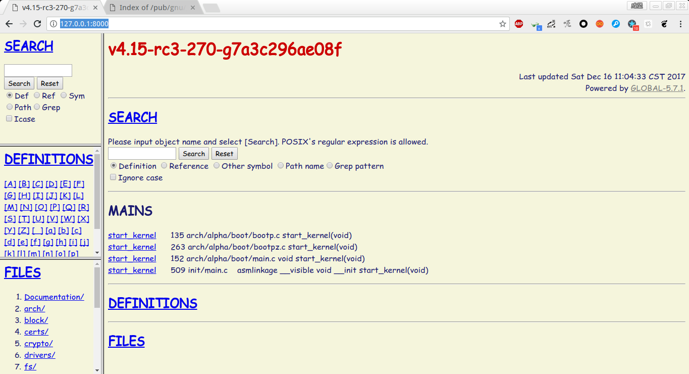
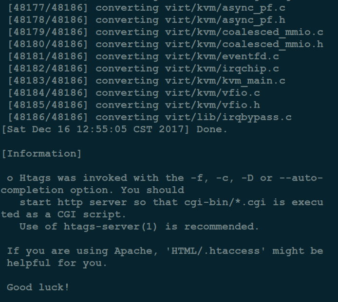
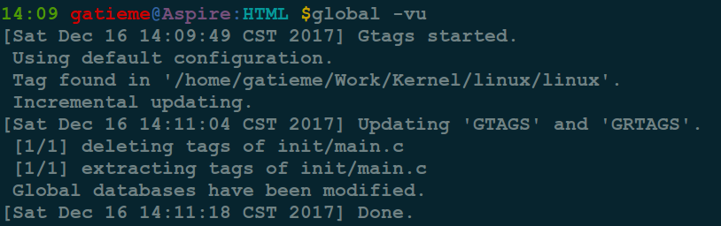

Ubuntu 安裝 GNU Global(gtags) 阅读内核源码
=======

| CSDN | GitHub |
|:----:|:------:|
| [Ubuntu 安裝 GNU Global(gtags) 阅读Linux内核源码](http://blog.csdn.net/gatieme/78819740) | [`AderXCoding/system/tools/global`](https://github.com/gatieme/AderXCoding/tree/master/system/tools/global) |


<br>

<a rel="license" href="http://creativecommons.org/licenses/by-nc-sa/4.0/"></a>

本作品采用<a rel="license" href="http://creativecommons.org/licenses/by-nc-sa/4.0/">知识共享署名-非商业性使用-相同方式共享 4.0 国际许可协议</a>进行许可, 转载请注明出处, 谢谢合作

因本人技术水平和知识面有限, 内容如有纰漏或者需要修正的地方, 欢迎大家指正, 也欢迎大家提供一些其他好的调试工具以供收录, 鄙人在此谢谢啦

<br>


#1	Global 简介
-------

##1.1	背景
-------

之前介绍过很多网页代码阅读工具了, 最近想看 `Linux` 内核代码, 本来想搭建一个 `LXR` 服务器.

[Ubuntu14.04搭建LXR本地服务器阅读Linux内核代码](http://blog.csdn.net/gatieme/article/details/53055190)

[工具之OpenGrok的搭建方法](http://blog.csdn.net/sauphy/article/details/50301815)

[Ubuntu环境下OpenGrok的安装及使用](http://blog.csdn.net/weihan1314/article/details/8944291)

但是想到了公司内部使用的 `GNU GLOBAL` 搭建的服务器. 遂百度之. 发现搭建 `GLOBAL` 比 `LXR` 简单的多, 而且同样功能强大, 适合个人或者小团队阅读代码. 既然 `LXR` 这条路走不通, 那咱就换条路走走. 果断用 `GLOBAL` 替代 `LXR`.


##1.2	Global
-------

摘要 : `GNU GLOBAL` 是一个源代码标记系统, 以同样的方式工作在不同的环境中, 如 `Emacs` 编辑器, `Vi` 编辑器, `Less viewer`, `Bash shell`, 以及各种 `web` 浏览器等等.


`GNU GLOBAL` 是一个源代码标记系统, 能够很方面的进行代码阅读和代码索引. `GNU GLOBAL` 以同样的方式工作在不同的环境中, 如 `Emacs` 编辑器, `Vi` 编辑器, `Less viewer`, `Bash shell`, 以及各种 `web`浏览器等等

使用 `GNU GLOBAL`, 在你的源代码中，你可以找到不同的对象并能够很轻松的移动它们, 如函数、宏、结构、类等. 这对大型项目非常有用, 特别是那种包含许多子目录, 许多 `#ifdef` 和很多 `main( )` 函数的项目.

它类似于 `ctags` 或 `etag`, 但有两点不同 :

*	独立的编辑器

*	处理定义和参考的能力

`GNU GLOBAL` 可以运行在 `UNIX (POSIX)` 兼容的系统, 比如`GNU` 和 `BSD`. `GNU GLOBAL` 支持的语言很多, 它自身支持  `C, C++, Yacc, Java, PHP4` 和汇编语言中符号的定义和引用, 还通过 `Exuberant Ctags` 支持 `40`余种语言的符号定义的索引.

作为 `GNU` 项目的一部分, `GNU GLOBAL` 是免费软件, 你可以自由复制, 修改和重新发布该计划下的 `GNU GPL`.

`Unix/Linux` 用户可以直接从仓库进行安装. 安装完不需要进行其它设置.

`Windows` 用户可以点击这里下载。

更多关于 `GNU GLOBAL` 的介绍请查看这里:

https://www.gnu.org/software/global/

#2	安装
-------

##2.1	使用自带的源安装 global
-------

```cpp
sudo apt-get install global
```


##2.2	编译安装global
-------

`Ubuntu 14.04` 自带的 `GLOBAL` 版本是 `5.7.1` 但是官网都已经是 `6.6`. 因此如果想用最新版的 `GLOBAL`， 就需要自己编译安装.

*	安装编译依赖的库

```cpp
sudo apt build-dep global
sudo apt install libncurses5-dev libncursesw5-dev
```

移驾至 `GNU GLOBAL` 官方下载最新的 `tar.gz` 包并解开.

```cpp
wget https://ftp.gnu.org/pub/gnu/global/global-6.6.tar.gz
```

*	编译安装

```cpp
./configure --with-sqlite3   # gtags可以使用Sqlite3作为数据库, 在编译时需要加这个参数
make -j4
sudo make install
```


#3	使用 GLOBAL
-------


假定接下来我们要生成 `Linux Kernel` 的解析 `html`
执行

```cpp
git clone git://git.kernel.org/pub/scm/linux/kernel/git/stable/linux-stable.git
```


当然也可以直接下载 `linux kernel tar` 包到本地后解压缩.

进入 `Linux Kernel` 所在的目录

*	执行 `gtags` 生成索引数据

```cpp
#  生成tag文件
gtags –v
```

当然，也可以加上 `--sqlite3` 参数, 下面是 `—help` 给出的参数帮助信息.

```cpp
Use Sqlite 3 API to make tag files. By default, BSD/DB 1.85 API is used.
To use this option, you need to invoke configure script with
--with-sqlite3 in the build phase.
```


`tag` 文件生成后, 执行 `htags` 命令生成 `HTML` 文件.

```cpp
htags -DfFnva -m "指定main函数的名称" -t '这里填入你想要的主页title'
```


##3.2	配置服务
-------


`GLOBAL` 自带了一个 `HTTP SERVER`, 可以直接使用 `htags-server` 启动


如果直接运行 `htags-server`, 我发现外网无法访问我的 `GLOBAL web` 服务器, 看了下帮助文件, 执行以下代码 :

```cpp
htags-server –b ip地址 端口号
```

如果不填端口号, 默认端口 `8000`, 如果你要在 `8080`端口打开服务, 好像要 `sudo`, 否则报错, 不知何故.





如果希望使用 `Apache` 服务了来访问 `web` 服务, 则需要在 `htags` 的时候添加 `-D` 或者 `-f` 选项.





更多帮助信息，请参考—help或查阅官方文档。
官方文档：http://www.gnu.org/software/global/globaldoc.html


##3.3	增量更新
-------

GLOBAL 支持增量更新, `global -u` 这个命令会自动向上找到 `project/GTAGS`, 并更新其内容. 而 `gtags` 的优势就在这里, 增量更新单个文件的速度极快, 几乎是瞬间完成.

```
global -vu
```

或者

```cpp
gtags -iv
```




#4	参考资料
-------

[GNU GLOBAL Source Code Tag System浏览源码，很方便](http://blog.csdn.net/sanlinux/article/details/5637852)

[在Emacs中使用GNU Global阅读代码](https://www.tuicool.com/articles/RbINZ3)

[vim中使用GNU Global](http://blog.csdn.net/up2wing/article/details/22829395)

[GNU Global源码分析工具使用笔记](http://blog.chinaunix.net/uid-20416834-id-120183.html)

[介绍一下gnu global，比cscope更方便更快速的索引工具](http://blog.csdn.net/zhengkarl/article/details/6901813)

[Ubuntu 14.04 安裝最新版 gnu global (gtags)](http://blog.csdn.net/vichie2008/article/details/50342393)

<br>

*	本作品/博文 ( [AderStep-紫夜阑珊-青伶巷草 Copyright ©2013-2017](http://blog.csdn.net/gatieme) ), 由 [成坚(gatieme)](http://blog.csdn.net/gatieme) 创作.

*	采用<a rel="license" href="http://creativecommons.org/licenses/by-nc-sa/4.0/"></a><a rel="license" href="http://creativecommons.org/licenses/by-nc-sa/4.0/">知识共享署名-非商业性使用-相同方式共享 4.0 国际许可协议</a>进行许可. 欢迎转载、使用、重新发布, 但务必保留文章署名[成坚gatieme](http://blog.csdn.net/gatieme) ( 包含链接: http://blog.csdn.net/gatieme ), 不得用于商业目的.

*	基于本文修改后的作品务必以相同的许可发布. 如有任何疑问，请与我联系.
