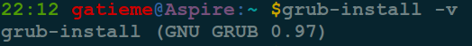
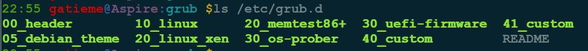
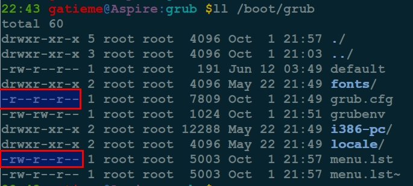
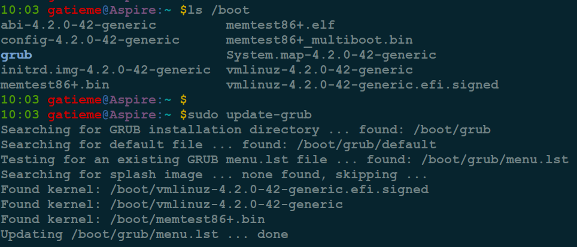
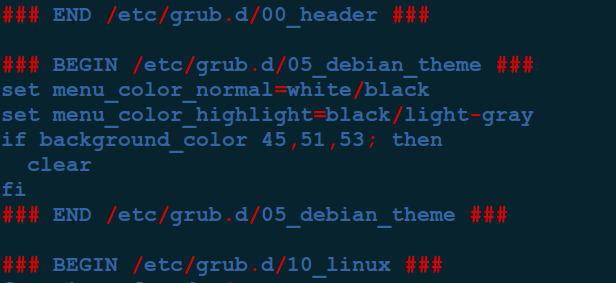

#1	Grub简介
-------


##1.1	GNU GRUB
-------


GNU GRUB（简称“GRUB”）是一个来自GNU项目的启动引导程序. GRUB是多启动规范的实现，它允许用户可以在计算机内同时拥有多个操作系统，并在计算机启动时选择希望运行的操作系统。GRUB可用于选择操作系统分区上的不同内核，也可用于向这些内核传递启动参数.

GNU GRUB的前身为Grand Unified Bootloader。它主要用于类Unix系统；同大多Linux发行版一样，GNU系统也采用GNU GRUB作为它的启动器。Solaris从10 1/06版开始在x86系统上也采用GNU GRUB作为启动器。


##1.2	grub Legacy和grub 2
-------


注意:目前 GRUB 分成 GRUB legacy 和 GRUB 2。版本号是 0.9x 以及之前的版本都称为 GRUB Legacy ，从 1.x 开始的就称为 GRUB 2

*	目前 GRUB Legacy 已经停止开发了，只是出于一个修复漏洞的状态，不再增加新的功能了，所有的开发都转移到 GURB 2 之上了

*	GRUB 2 是源自于一个名为 PUPA 的项目，目的是建立下一代的 boot loader

GRUB 2 几乎是从零开始开始开发的，它和 GRUB Legacy 不同的地方有很多，例如支持 scripts、国际化语言、动态加载模块、带有 resuce 模式等等，这些都是 GRUB Legacy 所没有的


虽然grub2是重写的grub，但是他借鉴了grub的一些特征，grub2改进如下：

1.	引导配置文件采用新名字grub.cfg，新的语法，加入许多新的命令

2.	grub.cfg	是用grub-mkconfig自动产生的，由update-grub维护，在执行update-grub之前修改的配置都不会 生效，这样可以很容易的应对内核升级这样情况。

3.	grub2中的分区号不再是以0开始，而是以1开始。

4.	配置文件是不可写的，而是修改文件后用命令自动更新

5.	grub2有更可靠的方法在磁盘上有多系统时发现文件和目标内核，可以用命令发现系统设备号或者UUID。

6.	更多的文件系统支持，如ext4 hfs ntfs

7.	grub2可以直接从lvm和raid读取文件

8.	在grub中的stage1 stage1.5 stage2已经被取消

9.	grub2引入很多设备模块，允许core镜像更小

10.	支持脚本，包括简单的语法

11.	在启动时没有选择菜单的话，按住shift即可强制显示菜单


可以使用`grub-install -v`来查看系统的grub版本




##1.3	GRUB2与GRUB的区别
-------

1.	GRUB2引导菜单启动项是从/boot自动生成的，不是有menu.lst配置的

2.	执行grub-update之后会自动更新启动项列表，自动添加有效的操作系统项目

3.	分区编号发生变化：第一个分区现在是1而不是0，但第一个设备仍然以0开始计数，如hd0

4.	配置文件的不同更为明显：

| 配置文件
|:------:|
| /boot/grub/menu.lst - 已经被/boot/grub/grub.cfg代替 |
| /boot/grub.cfg - 即使是root也不要编辑它，它在每次update-grub后自动生成 |
| /etc/default/grub - 改变引导菜单外观的主要配置文件 |
| /etc/grub.d/ - 各种用于生成grub.cfg的脚本文件，每次update-grub时会执行里面的文件 |


#2	选项与文档
-------


##2.1	启动选项
-------

如果您安装了Ubuntu/linux操作系统和Windows 7/8/10系统组成双系统.那么您的Grub启动选项应该为如下

```cpp
Ubuntu GNU/Linux  Ubuntu操作系统的启动项
Advabced options for Ubuntu GNU/Linux 高级选项,进入此处可以选择启动的内核版本.
memtest86 #内存测试,可以进入此模式运行行一些很耗系统资源的程序,测试系统在高负载的情况下主机是否运行稳定
Windows 7 (loader) (on /dev/sd**) ## /dev/sd**对应你Windows系统所在的分区
```

##2.2	相关文档
-------


[grub官方文档](http://www.gnu.org/software/grub/grub-documentation.html)


[中文版 info grub](http://g.51cto.com/linux/746)


[GRUB2配置文件"grub.cfg"详解(GRUB2实战手册)--金步国作品](http://www.jinbuguo.com/linux/grub.cfg.html)

#3	grub组件
-------

grub2的组件为grub-pc， 同时grub-common也会默认被安装，grub2是过渡期的虚拟组件，会被安全移除。


##3.1	grub工具命令
-------

| 工具包 | 功能 |
|:-----:|:---:|
| grub-install | 一个完整的grub配置脚本 |
| update-grub | update-grub主要是在每次配置文件有更新后生成新的grub.cfg, 其实update-grub是调用grub-mkconfig，在系统中还有一个update-grub2，发现他是调用update-grub |
| grub-mkconfig | 调用grub-mkdevicemap和grub-probe生成grub.cfg |
| grub-set-default | 设置在下次进入系统时从哪个内核选项进去 |
| grub-mkdevicemap | 为grub自动产生新的device.map，grub-mkdevicemap程序可以创建device.map文件，在执行grub-install时会自动执行他以创建映像关系，如果文件不存在，则会读取/boot/grub/devicd.map这个文件，如果映像文件存在，则grub读取他创建BIOS drives to OS drives |
| grub-setup | 被grub_install调用，安装grub |
| grub-probe | 从给定的设备上探测设备信息 |


其中**grub-install**完成如下工作

1.	安装grub到设备中，如果需要会创建/boot/grub目录

2.	他会把*.mod、*.lst、*.img从 /usr/lib/grub/i386-pc/ 目录复制到/boot/grub目录下，他会覆盖已有文件

3.	然后会调用grub_probe扫描计算机并收集磁盘和分区信息

4.	接着调用grub_mkimage构建一个新的new.img

5.	最后调用grub_setup把grub的boot.img写入MBR中，把core.img写进设备的第一个扇区。

>**注意**
>
>grub_install并不运行grub_mkconfig

**示例**

>grub-install -v

显示版本号

>grub-install /dev/sda

这表示你希望把grub安装进/dev/sda（把boot.img写进第一块硬盘的MBR），如果由于某些原因你想把grub安装到单独的boot分区，可以使用/dev/sdaX，grub2不建议这样，因为他会减小grub的可靠性，或者其他用户用grub-install把grub装进了错误的分区导致操作系统的危险性。

>grub-install --root-directory=/media/grub2 /dev/sda

创建一个大约60M的分区，用文件系统格式化分区，把他挂载到/media/grub2，/dev/sda是指把stage1写入MBR

```cpp
mke2fs /dev/fd0
mount -t ext2 /dev/fd0 /mnt
mkdir /mnt/boot
grub-install --boot-directory=/mnt/boot /dev/fd0
umount /dev/fd0
```
创建一个软驱启动盘


>**注意**
>
>grub-install只是一个脚本，内部真正执行工作的是grub-mkimage和grub-setup，因此你也可以直接用着两个命令安装grub，建议还是用grub-install，除非你非常熟悉grub内部


grub2有两中不同的引导方法，一个是直接加载操作系统，一个是连锁(chain-load)到另一个boot load，然后再从另一个boot load加载系统，一般来说第一个更常用，但是假如grub不支持所有的操作系统就需要这种方法


##3.2	Grub镜像
-------

grub2的镜像文件包括

| 镜像 | 描述 |
|:----:|:---:|
| boot.img | 在PC BIOS系统中，boot.img在grub启动的第一部分，他被写入MBR或者boot分区，因为PC的boot扇区只有512bytes，所以此文件精确到只有512bytes，他唯一的功能是从本地磁盘读取内核镜像第一个扇区位置然后跳到内核镜像，因为文件大小的限制，boot.img不能识别任何文件系统，所以当安装grub时，grub-setup把内核镜像第一个扇区的位置硬编码进boot.img中 |
| diskboot.img | 当从硬盘引导时此镜像作为内核镜像的第一个扇区的内容，他把剩余的内核镜像读入内存中然后启动内核 |
| cdboot.img | 原理同上 |
| pxeboot.img | 当从网络用PXE引导时用次镜像启动内核镜像 |
| kernel.img | 此镜像包含grub运行时包含的基本工具，框架驱动、文件句柄、环境变量、安全模式命令行解析器等，他可以直接使用，但是编译进所有的内核镜像中了 |
| core.img | 这是grub的内核镜像，他被grub-mkimage程序从kernel.img和一些模块动态编译而成，一般情况下他已经包含足够的模块去访问/boot/grub，模块机制可以使得内核镜像保持很小 |
| *.mod | 其余的一切是可以动态加载的一些模块，当需要他们时，他们是被自动加载编译进内核镜像的，但也可以使用insmod手动加载 |


grub legacy的镜像文件


| 镜像 | 描述 |
|:----:|:---:|
| stage1 | 他非常像grub2中的boot.img，他们有一样的功能 |
| *_stage1_5 | 在grub legacy中，stage1_5的作用是包含足够的系统代码从而可以使更大的stage2从普通系统上读入，他有点像grub2中的core.img但是core.img比他功能强多了，grub legacy可以只使用stage1和stage2在一些受限制的情况下工作，但是grub2没有core.img就不能工作 |
| stage2 | grub2没有stage2镜像，代替的是他运行时从/boot/grub加载模块 |

#4	配置Grub
-------


在早期的Ubuntu版本中，使用grub1作为默认的启动引导程序，如果想要修改系统启动菜单，直接编辑/boot/grub/menu.lst即可。

从9.10开始, Ubuntu使用grub2作为默认启动引导程序, 相对于grub的第一个版本，grub2改动很大。 grub2的新特性主要有：支持图形化界面，支持主题，模块化加载，跨平台兼容等，总而言之，功能的加强也使得grub2的配置变得更加复杂了


##4.1	grub配置文件组成
-------

grub2包含一个完全修改过的配置文件及目录，menu.list不再使用

grub2采用模块化的设计，主要配置文件是/boot/grub/grub.cfg，但是这个文件的权限是444，连root也不让修改，这是刻意为之的，不要修改文件权限，grub.cfg的内容更新由update-grub命令来更新，其实就是执行`grub-mkconfig -o /boot/grub/grub.cfg`来更新，此文件会在更新内核自动更新, 在/boot/grub目录下有很多模块文件，以在按需时自动加载模块每段模块配置的加载以### BEGIN xxx ###开始，以### END xxx ###结尾。

grub2主要有三部分组成：


| 配置文件 | 描述 |
|:------:|:----:|
|  /etc/default/grub | grub的默认配置文件，可以修改一些常见的参数 |
|  /etc/grub.d | 这个文件夹下面是一些生成grub.cfg文件的可执行脚本，可以修改 |
| /boot/grub/grub.cfg | 系统引导时读取的文件之一，由其他文件生成的，一般不在这里修改 |


##4.2	/etc/default/grub
-------

此文件包含menu.list的前半部分内容，以及每行内核配置后面追加的配置, 在更新时会合并到grub.cfg中

/etc/default/grub控制grub-mkconfig的操作，grub里面是以键值对存在的选项，如果值有空格或者其他字符需要用引号引起来，参数如下

| 参数 | 描述 |
|:------:|:----:|
| GRUB_DEFAULT | 默认的菜单选择项，值可以是数字，默认从0开始，值也可以是title后面的字符串，当值是‘saved’时有特殊含义：默认的菜单选则项会被保存在GRUB_SAVEDEFAULT中，下次启动时会从这个值启动。当值为saved是可以用grub-set-default和grub-reboot来设置默认启动项，grub-set-default直到下次修改前都有效，grub-reboot下次启动时生效 |
| GRUB_SAVEDEFAULT | 只有这个值是true，GRUB_DEFAULT是saved时才会起作用 |
| GRUB_TIMEOUT | 选择菜单的显示时间，默认是5，值是0表示不显示菜单选项，值是-1表示无限期的等待做出选择 |
| GRUB_HIDDEN_TIMEOUT | grub2第一次执行时会寻找其他操作系统，如果没有检测到则会将菜单隐藏，如果有其他操作系统才会显示菜单，如果参数大于0，则会等待响应的秒数，但是不会显示菜单，可以按住shift显示菜单 |
| GRUB_DISTRIBUTOR | 菜单中的描述名称，采用命令lsb_release判断，应该是红帽系列的，如果不是就归为Debian |
| GRUB_CMDLINE_LINUX | 此行将追加到所有的linux 定义内核行的后面，不论是救援模式还是一般模式 |
| GRUB_CMDLINE_LINUX_DEFAULT | 次选项只会追加在一般模式后面，同上 |
| GRUB_TERMINAL=console | 启用console，默认注释状态 |
| GRUB_DISABLE_LINUX_UUID=true | 在grub中指定root时可以使用UUID，默认注释 |
| GRUB_GFXMODE=640x480 | 图形化菜单的分辨率，默认注释 |
| GRUB_DISABLE_LINUX_RECOVERY=true | 禁止显示救援模式 |


定制自己的/etc/default/grub配置文件, 如下所示


```cpp
# If you change this file, run 'update-grub' afterwards to update


GRUB_DEFAULT=0
#设置默认启动项，按menuentry顺序如果要默认从第四个菜单项启动，数字改为3，若改为 saved，则默认为上次启动项


GRUB_TIMEOUT="10"
#设置进入默认启动项的等候时间，默认值10秒，按自己需要修改，单位为秒改改为零和负值为无限等待操作

GRUB_DISTRIBUTOR=`lsb_release -i -s 2> /dev/null || echo Debian` #获得发行版名称（比如Ubuntu, Debian

GRUB_CMDLINE_LINUX_DEFAULT="quiet splash"
#选择启动的环境，“quiet splash”为图像界面，“text”为文本界面

#GRUB_CMDLINE_LINUX="noresume" 
#手动添加内核启动参数，比如 acpi=off noapic 等可在这里添加
# Uncomment to disable graphical terminal (grub-pc only)

#GRUB_TERMINAL=console
#设置是否使用图形介面。前面有#注释（使用图形界面），前面没有#注释（仅使用控制台终端，不使用图形介面) )

# The resolution used on graphical terminal
# note that you can use only modes which your graphic card supports via VBE
# you can see them in real GRUB with the command `vbeinfo'
#GRUB_GFXMODE=640x480
#设定图形介面分辨率，如不使用默认。把前面#去掉，把分辨率改为800x600或1024x768

# Uncomment if you don't want GRUB to pass "root=UUID=xxx" parameter to Linux
#GRUB_DISABLE_LINUX_UUID=true
#取消注释以阻止GRUB将传递参数 "root=UUID=xxx" 传递给 Linux内核

# Uncomment to disable generation of recovery mode menu entrys
#GRUB_DISABLE_LINUX_RECOVERY="true"
#定是否创建修复模式菜单项，前面有#注释（建立修复模式）.前面没有#注释（不建立修复模式

# Uncomment to get a beep at grub start
#GRUB_INIT_TUNE="480 440 1" #当GRUB菜单出现时发出鸣音提醒，户无法看到屏幕特别有用,默认关闭
```


##4.3	/etc/grub.d/目录
-------

update-grub命令执行时会读取此目录下的文件，并将配置合并至grub.cfg中，grub.cfg中的菜单顺序是由此目录中的文件顺序决定的，文件开头数字较小的会先执行，全英文名字的文件将会在最后执行，自定义选项在40_custom中定义，或者建立一个新文件，此目录下的文件必须有执行权限才会被update-grub读取，并把配置合并到grub.cfg中。

| 配置文件 | 描述 |
|:------:|:----:|
| 00_header | 配置初始的显示项目，如默认选项，时间限制等，一般由/etc/default/grub导入，一般不需要配置 |
| 05_debian_theme | 配置引导画面，文字颜色等主题 |
| 10_linux | 定位当前操作系统使用中的root设备内核的位置 |
| 30_os-prober | 用来搜索linux和其他系统，此脚本中的变量用来指定在/boot/grub/grub.cfg 和 grub2菜单中的名称显示方式，可以修改/etc/default/grub光比这个脚本 |
| 40_custom | 用来加入用户自定义的菜单样板，将会在执行update-grub时更新至grub.cfg中 |
| 41_custom | 判断custom.cfg此配置文件是否存在，如果存在就加载它 |





##4.4	/boot/grub/grub.cfg
-------

主要配置文件是/boot/grub/grub.cfg



但是这个文件的权限是444，连root也不让修改，这是刻意为之的，不要修改文件权限

grub.cfg的内容更新由update-grub命令来更新, 我们从下图中看到系统中/boot中安装了4.2.0-42版本的内核, 而我们update-grub就会发现他们




其实就是执行如下操作


1.	备份/boot/grub/menu.lst文件到/boot/grub/menu.lst~, 以防止出错后无法恢复

2.	读取系统中安装的所有内核(一般在/boot目录下), 然后生成.lst文件

3.	生成grub.cfg， 其实就是执行grub-mkconfig -o /boot/grub/grub.cfg来更新
	*	首先读取`/etc/default/grub`设置基本的设置信息
	*	 在`/boot/grub.d`目录下有很多模块文件，以在按需时自动加载模块. 依照`/etc/grub.d`中的各段生成grub.cfg的基本信息, 每段模块配置的加载以### BEGIN xxx ###开始，以### END xxx ###结尾
	*	 读取`menu.lst`设置加载的内核的信息




在更新内核时会调用update-grub自动更新`grub.cfg`文件


#5	常见问题
-------

##5.1	修改等待时间
-------

>sudo gedit /etc/default/grub

修改文件中的：GRUB_TIMEOUT=10 （默认是为10秒的）

修改为：GRUB_TIMEOUT=X (X表示你要设置的秒数，设置为负数为一直等待操作) 修改后保存。终端输入：

##5.2	生成grub.cfg
-------


一般来说, update-grub会更新grub并生成grub.cfg

>sudo update-grub

当然也可以

>sudo grub-mkconfig -o /boot/grub/grub.cfg

##5.3	修改默认启动系统
-------

>sudo gedit /etc/default/grub

修改文件中的GRUB_DEFAULT=0

GRUB_DEFAULT=0 (0默认启动第1项，如果你的win是第5项，把这个0改为4) 保存文件后终端输入:


##5.4	修改默认分辨率
-------

>sudo gedit /etc/default/grub

修改文件中的 #GRUB_GFXMODE=640x480
把前面#去掉，把分辨率改为800x600或1024x768（或者修改为你屏幕的分辨率，但前提是分辨率为常见分辨率

>补充：深度操作系统2014下还需要同时修改 /var/cache/deepin/grub2.json 文件中的分辨率值，如 "Resolution":"1024x768"


##5.5	修复损坏的grub引导
-------

方法一

建议事先备份sda 的grub：

>dd if=/dev/sda of=./mbr.bak bs=512 count=1 

这样子是把你现有的分区跟引导信息保存下来了。找个linux的live进入linux，然后把刚才的mbr.bak还原回去。

>dd if=./mbr.bak of=/dev/sda  bs=446 count=1

方法二
重装Grub

##5.6	GRUB2降级到Grub legacy
-------

备份主要的 Grub2 目录及文件。

```cpp
sudo cp /etc/default/grub /etc/default/grub.old
sudo cp -R /etc/grub.d /etc/grub.d.old
sudo cp -R /boot/grub /boot/grub.old
```

移除 Grub2

```cpp
sudo apt-get purge grub2 grub-pc
```

此时，系统在另一启动装载程序前将无法启动。 当这些软件包被移除后，许多文件还会残留在“/boot/grub”目录下。
安装 Grub Legacy

```cpp
sudo apt-get install grub
```

Grub 安装后，用户仍需通过运行以下命令来创建 menu.lst 和 stage1/stage2 文件：

```cpp
sudo update-grub
```

这一步可以生成 menu.lst 文件。

```cpp
sudo grub-install /dev/sdX
```
选择正确的设备（sda、sdb、sdc），通常为你的深度操作系统所在的磁盘。在 /boot/grub 目录下创建 stage1 和 stage2 文件并写入 MBR。运行这一命令来阻止其自动升级：

```cpp
echo "grub hold" | sudo dpkg --set-selections
```


