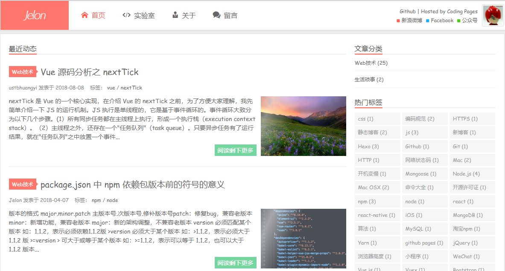

使用 Hexo 创建属于你自己的 GitHub Page 博客(一)
=======

| CSDN | GitHub | Hexo |
|:----:|:------:|:----:|
| [使用 Hexo 创建属于你自己的 GitHub Page 博客(一)](http://blog.csdn.net/gatieme) | [`AderXCoding/system/tools`](https://github.com/gatieme/AderXCoding/tree/master/system/tools) |

<br>

<a rel="license" href="http://creativecommons.org/licenses/by-nc-sa/4.0/"></a>

本作品采用<a rel="license" href="http://creativecommons.org/licenses/by-nc-sa/4.0/">知识共享署名-非商业性使用-相同方式共享 4.0 国际许可协议</a>进行许可, 转载请注明出处, 谢谢合作

因本人技术水平和知识面有限, 内容如有纰漏或者需要修正的地方, 欢迎大家指正, 也欢迎大家提供一些其他好的调试工具以供收录, 鄙人在此谢谢啦

<br>

#1  Hexo 简介
-------

`Hexo` 是一个快速、简洁且高效的博客框架.

*   `Hexo` 支持使用 `Markdown`(或其他渲染引擎)解析文章.

*   `Hexo` 生成静态网页的素服非常快, 在几秒内，即可利用靓丽的主题生成静态网页.

*   `Hexo` 用户量非常庞大, 有很多资料和主题可供参考和选择, 非常适配我这种前端技能几乎为 `0` 的宅男.

[`StaticSiteGenerators`](https://staticsitegenerators.net/) 网站收集整理的开源的静态网站生成器, 按照编程语言进行分类, 每个分类按照 `Star` 数进行排序. 可以看到 `Hexo` 的热度、`Star` 数量和更新支持情况都排在前三的.

[`Hexo Doc`](https://hexo.io/zh-cn/docs/) 也有详细的帮助文档方便我们使用.


#2  搭建 `Hexo` 环境
-------

##2.1 依赖环境
------- 

环境搭建：

Node.js：[下载地址](https://nodejs.org/)
Git：[下载地址](https://gitforwindows.org/)
markdown 编辑器 : [Sublime](http://www.sublimetext.com) 或者 [markdownpad](http://markdownpad.com/)


##2.2   安装 Hexo
-------

安装了 `Node.js` 之后, 我们就可以使用 `NPM`. `NPM` 是随同 `NodeJS` 一起安装的包管理工具, 能解决 `NodeJS` 代码部署上的很多问题.

```cpp
npm install -g hexo
```

##2.3   配置 `Hexo` 博客环境
-------


初始化博客


```cpp
hexo init blog
```

安装依赖库, 安装完成后, 将在 `blog` 目录下配置好生成静态博客的环境


```cpp
cd blog
npm install
```

生成静态网页


*   hexo generate (hexo g) 生成静态文件，会在当前目录下生成一个新的叫做public的文件夹/

*   hexo server (hexo s) 启动本地web服务，用于博客的预览

*   hexo deploy (hexo d)   部署播客到远端（比如github, heroku等平台）


可以在 [http://localhost:4000/](http://localhost:4000/) 查看


##2.4    配置主题
-------

[`Hexo Themes`](https://hexo.io/themes/) 官网收录了很多主题. 我本人挑选了 [`Xups`](http://jelon.top/)




#3  Github Pages设置
-------

##3.1   Github Pages 简介
-------

`GitHub Pages` 是 `GitHub` 为用户提供的免费空间免费稳定, 用来做搭建一个博客再好不过了.

每个帐号只能有一个仓库来存放个人主页, 而且仓库的名字必须是 `username/username.github.io`, 这是特殊的命名约定. 你可以通过 `http://username.github.io` 来访问你的个人主页.

这里特别提醒一下, 需要注意的**个人主页的网站内容是在 `master` 分支下的**.


##3.2   创建自己的 `Github Pages`
-------

注册及使用 `Github  Pages` 的过程并不是本文的重点, 这部分内容有很多资源, 在此不再详述, 可以参考 :

>[如何搭建一个独立博客——简明Github Pages与Hexo教程](http://www.jianshu.com/p/05289a4bc8b2)
>
>[使用GitHub pages 搭建一个心仪的个人博客](https://blog.csdn.net/xudailong_blog/article/details/78762262)
>
>[搭建 Github Pages 个人博客网站](https://blog.csdn.net/KNIGH_YUN/article/details/79774344)
>
>[利用github-pages建立个人博客
](https://blog.csdn.net/garfielder007/article/details/50224761)
>
>[傻瓜都可以利用github pages建博客
](https://www.jianshu.com/p/d658ba3b4351)

在这里我创建了一个 `github repo` 叫做 [`gatieme.github.io`](https://github.com/gatieme/gatieme.github.io) 创建完成之后, 需要有一次提交(`git commit`)操作, 然后就可以通过链接 [https://gatieme.github.io](https://gatieme.github.io/)访问了.

##3.3   部署Hexo到Github Pages
-------

下面我们就需要把本地 `web` 环境下预览到的博客部署到 `github` 上, 然后就可以直接通过 `http://gatieme.github.io` 访问了. 


1.  之前 `Github` 上创建的那个 `repo` 的 `master` 分支就用来存储中我们博客生成的 `html` 静态文件, 可以通过链接 [`https://gatieme.github.io`](https://gatieme.github.io) 来直接访问.

2.  那我们 `Hexo` 就是用来生成这些静态网页的, `Hexo -g` 会生成一个静态网站(`public` 目录下), 这个静态文件可以直接访问. 我们只需要将 `hexo` 生成的静态网站, 提交(`git commit`)到 `github` 上那个 `repo` 的 `master` 分支即可.

##3.4   使用 `hexo deploy` 部署
-------

```
# Deployment
## Docs: https://hexo.io/docs/deployment.html
deploy:
  type: git
  repo: git@github.com:gatieme/gatieme.github.io.git
  branch: master
```

然后在命令行中执行

```cpp
hexo d
```

即可完成部署.

#4  参考资料
-------


[使用Hexo + Github Pages搭建个人独立博客](https://www.cnblogs.com/dushao/p/5999593.html)


[hexo干货系列：（四）将hexo博客同时托管到github和coding](https://www.cnblogs.com/tengj/p/5352572.html)


[Hexo，创建属于你自己的博客](https://blog.csdn.net/tianbo_zhang/article/details/79137103)


<br>

*	本作品/博文 ( [AderStep-紫夜阑珊-青伶巷草 Copyright ©2013-2017](http://blog.csdn.net/gatieme) ), 由 [成坚(gatieme)](http://blog.csdn.net/gatieme) 创作.

*	采用<a rel="license" href="http://creativecommons.org/licenses/by-nc-sa/4.0/"></a><a rel="license" href="http://creativecommons.org/licenses/by-nc-sa/4.0/">知识共享署名-非商业性使用-相同方式共享 4.0 国际许可协议</a>进行许可. 欢迎转载、使用、重新发布, 但务必保留文章署名[成坚gatieme](http://blog.csdn.net/gatieme) ( 包含链接: http://blog.csdn.net/gatieme ), 不得用于商业目的. 

*	基于本文修改后的作品务必以相同的许可发布. 如有任何疑问，请与我联系.
