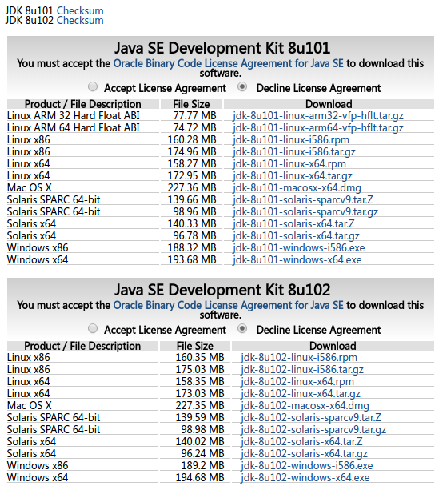
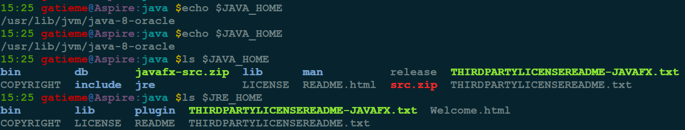
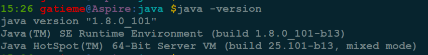

Ubuntu安装JDK
=======


想知道如何在Ubuntu 14.04中安装Java？


许多人比较厌恶Java, 但是很有可能因为某些原因你需要安装Java，尽管你很讨厌它. 在这篇文章中，我们将展示如何在Ubuntu 14.04安装Java（也可能在Linux Mint 17同样适用）。


#1	JRE vs OpenJDK vs Oracle JDK
-------


在我们继续了解如何安装`Java`之前, 让我们快速地了解`JRE`、`OpenJDK`和`Oracle JDK`之间的不同之处.


**JRE和JDK**


*	`JRE(Java Runtime Environment)`它是你运行一个基于Java语言应用程序的所正常需要的环境。如果你不是一个程序员的话，这些足够你的需要.

*	`JDK`代表`Java`开发工具包，如果你想做一些有关`Java`的开发(阅读程序), 这正是你所需要的.


**Open JDK和Oracle JDK**

*	`OpenJDK`是`Java`开发工具包的开源实现

*	`Oracle JDK`是`Java`开发工具包的官方`Oracle`版本

尽管`OpenJDK`已经足够满足大多数的案例，但是许多程序比如`Android Studio`建议使用`Oracle JDK`, 以避免UI/性问题.

#2	检查Java是否已经安装在Ubuntu上
-------


打开终端，使用下面的命令：

```cpp
java -version
```

如果你看到像下面的输出，这就意味着你并没有安装过Java:

```cpp
The program ‘java’ can be found in the following packages:
*default-jre
* gcj-4.6-jre-headless
* openjdk-6-jre-headless
* gcj-4.5-jre-headless
* openjdk-7-jre-headless
Try: sudo apt-get install
```


#3	在Ubuntu和Linux Mint上安装Java
-------

看了各种类型`Java`的不同之后, 让我们看如何安装他们.

在`Ubuntu`和`Linux Mint`上安装`JRE`


##3.1	安装jre
-------


打开终端，使用下面的命令安装JRE :

```cpp
sudo apt-get install default-jre
```


##3.2	安装OpenJDK
-------

在`Ubuntu`和`Linux Mint`上安装`OpenJDK`

在终端，使用下面的命令安装OpenJDK Java开发工具包：

```cpp
sudo apt-get install default-jdk
```

特殊地, 如果你想要安装`Java 8`, `Java 7`或者`Java 6`等等，你可以使用`openjdk-7-jdk/openjdk-6jdk`, 但是记住在此之前安装`openjdk-7-jre/openjdk-6-jre`


##3.3	安装Oracle JDK
-------


在`Ubuntu`和`Linux Mint`上安装`Oracle JDK`


###3.3.1	**使用源安装**
-------


使用下面的命令安装，只需一些时间，它就会下载许多的文件，所及你要确保你的网络环境良好：

```cpp
sudo add-apt-repository ppa:webupd8team/java
sudo apt-get update
sudo apt-get install oracle-java8-installer
sudo apt-get install oracle-java8-set-default
```

如果你想安装`Java 8(i.e Java 1.8)`, 在上面的命令中用`java7`代替`java8`.


###3.3.2	**通过bin包安装**
-------


此外可以用Linux上通用的bin包安装，下载官方bin包，终端下面安装解压，然后修改环境变量指向那个jdk便可

按照需要选择不同的版本, 下载bin包

```cpp
http://www.oracle.com/technetwork/java/javase/downloads/jdk8-downloads-2133151.html
```



将下载下来的`jdk-8u101-linux-x64.tar.gz`文件解压。

使用如下命令解压：

```cpp
sudo tar zxvf ./jdk-8u101-linux-x64.tar.gz
```

为了方便管理, 可将解压后的文件移至另一个文件夹, 笔者将文件移至了`/usr/java/jdk1.8.0_101`目录下.

为了方便下一步设置环境变量，将文件夹换了个短点的名字- jdk1.8

###3.3.3	设置环境变量
-------

编辑.bashrc文件


```cpp
JAVA_HOME=/usr/java/jdk1.8.0_101
JRE_HOME=$JAVA_HOME/jre
JAVA_BIN=$JAVA_HOME/bin
CLASSPATH=.:$JAVA_HOME/lib/dt.jar:$JAVA_HOME/lib/tools.jar:$JRE_HOME/lib
PATH=$PATH:$JAVA_HOME/bin:$JRE_HOME/bin
export JAVA_HOME JRE_HOME PATH CLASSPATH
```

如果是使用源方法安装的, 则默认的安装路径是在`/usr/lib/jvm/java-8-oracle`中, 则配置对应的JAVA_HOME即可

```cpp
JAVA_HOME=/usr/lib/jvm/java-8-oracle
```


为了让更改立即生效，请在终端执行如下命令：

```cpp
source ~/.bashrc
```




##3.4	验证
-------


通过以上步骤，JDK已安装完成。

输入以下命令验证`java -version`, 如图




#4	链接
-------


[Ubuntu 14.04 安装 JDK8](http://www.linuxidc.com/Linux/2014-09/106218.htm)

[Ubuntu 14.04 下载、安装、配置的相关知识](http://www.linuxidc.com/Linux/2014-04/100370.htm)

[Ubuntu 14.04系统下载地址](http://www.linuxidc.com/Linux/2014-04/100352.htm)

[Windows 7下硬盘安装Ubuntu 14.04图文教程](http://www.linuxidc.com/Linux/2014-04/100369.htm)

[更多Ubuntu相关信息见Ubuntu 专题页面](http://www.linuxidc.com/topicnews.aspx?tid=2)

[怎样在Ubuntu 14.04中安装Java](http://www.linuxidc.com/Linux/2014-09/106445.htm)

