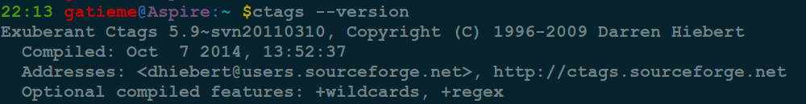
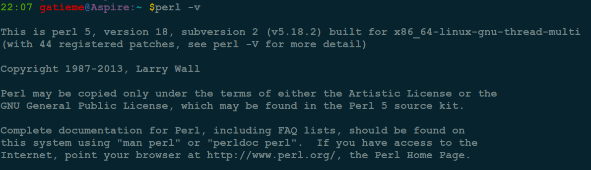
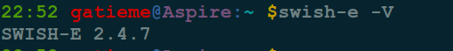
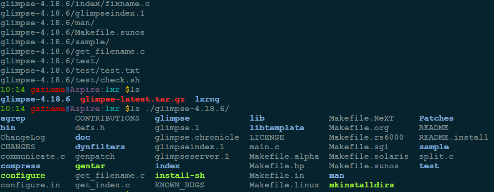
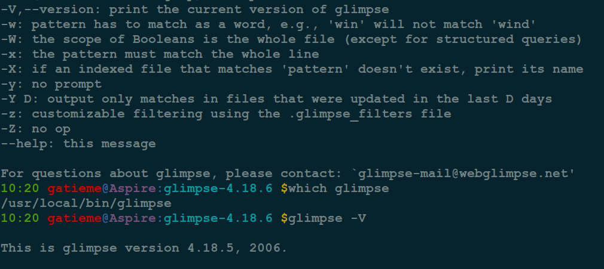
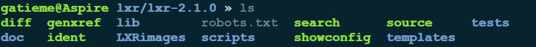
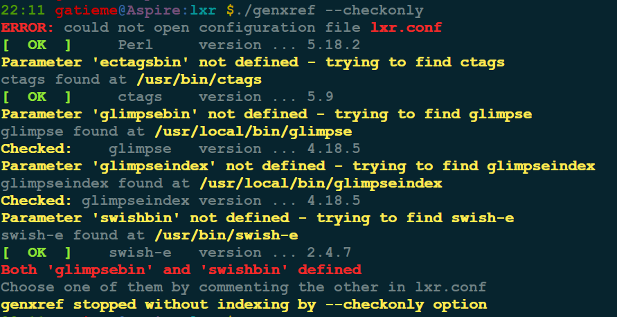

Ubuntu14.04搭建LXR本地服务器阅读Linux内核代码
=======

| CSDN | GitHub |
|:----:|:------:|
| [Ubuntu下apache的安装与配置](http://blog.csdn.net/gatieme) | [`AderXCoding/system/tools`](https://github.com/gatieme/AderXCoding/tree/master/system/tools) |


<br>
<a rel="license" href="http://creativecommons.org/licenses/by-nc-sa/4.0/"></a>
本作品采用<a rel="license" href="http://creativecommons.org/licenses/by-nc-sa/4.0/">知识共享署名-非商业性使用-相同方式共享 4.0 国际许可协议</a>进行许可, 转载请注明出处
<br>


我开始打算使用 `apache2 + mysql  + lxr` 搭建的. 毕竟嘛网上教程都是这个, 有点坑爹的是网上的教程都是以前的, 和现在的好多软件包不一样, 偶尔发现个2014年的博客看了下居然还是照搬他人的.

上面居然还能用
```cpp
sudo apt-get install lxr
```
表示呵呵了. 花了大量时间摸索着也没能用apapche2 搭建起来.

因为 `Apache2` 的 `mod_perl` 模块不能很好的工作, 当打开

```cpp
http：//localhost/lxr/source
```

时候出现的是 `source` 文件里面的内容, 而不是执行改文件（我没有找到好的解决方法)!

所以就放弃这个了, 自己使用 `lxr` 里面的 `install` 文档摸索着用 `ighttpd + mysql  + lxr` 搭建 `lxr` 本地服务器


#1	LXR(Linux Cross Referencer)介绍
-------

LXR 项目站点 : http://lxr.sourceforge.net/zh/index.php

源码下载 : http://sourceforge.net/projects/lxr

安装教程 : http://lxr.sourceforge.net/en/1-0-InstallSteps/1-0-install.php

`LXR` 是一个通用的源代码索引器和交叉引用器 它提供了一个基于 web 的可浏览任意定义以及任意标识的用法。 它支持很多种语言。

LXR 曾经被作为 “Linux 交叉引用器” 但是已经被证明它可以用来作为任意基于 Linux 内核的项目的交叉引用
它基于股票网站技术 （这意味着它的输出是标准的 HTML） 所以可以选择任意的可用 web 浏览器来作为他的客户端。 它被设计为不依赖 java 或者任何第三方客户端脚本，这样可以保证系统需求和依赖的最小化。

人们经常问起 LXR 与 LXRng （见于 http://lxr.linux.no） 之间的差别。 LXRng 是从 LXR 中 fork 出来带有实验性质的用来探索其他技术的分支。 它基于 ajax 并且依赖很多 CPAN 的包。 它使用了很多的客户端脚本，这意味着运算的负载被服务端和客户端一起分担了。
CAUTION!

It looks like lxr.linux.no has closed without notice some time during the first half of 2014. Whether there is a backup of LXRng is unknown.

在服务端， 任意的带有 cgi 能力的 web 服务器都能表现的很好。

在开发过程中，LXR 是一个很有价值的项目合成观察角色。 对于从头开始学习源代码的人来说，它也是一个很有用的工具。 否则，学习曲线会很陡峭。


#1	安装lxr
-------

*	检查并安装运行环境以及依赖包

*	安装lxr

*	配置lxr


##1.1	检查并安装运行环境以及依赖包
-------

| 包 | 描述 |
|:--:|:---:|
| mysql-server或者MariaDB | mysql服务器, 任选其一即可 |
| lighttpd或者apache2 | lighttpd或者apache2服务以及相应的服务模块, 任选其一即可, 如果选择了apache请安装 `libapache2-mod-perl2-dev |
| swish-e或者glimpse | 任选其一即可 |
| perl | 也是配置需要实际没有用到的，如果没有不能通过配置前的检查就不能往下执行 |

先安装需要的包 :

```cpp
#ctags swish-e perl
sudo apt-get install exuberant-ctags swish-e perl

# mysql-server | MariaDB | 任选其一
sudo apt-get install mysql-server
sudo apt-get install mariadb-server

#apache2 | lighttpd
sudo apt-get install apache2
sudo apt-get install lighttpd*
```


##1.1.1	安装并检查ctags
-------


LXR 要求ctags版本大于5.0

```cpp
sudo apt-get install exuberant-ctags

ctags --version
```



下载linux源文件：解压到后面需要配置的文件目录(自己定), 文件名改为相应的版本号例如 `linux-3.18` 改完 `3.18`


##1.1.2	安装并检查perl
-------


`ubuntu 14.04` 默认已安装了`perl`, `LXR-2.1.0` 要求`perl` 版本大于 `v5.10` 即可


```cpp
sudo apt-get install perl

perl -v
```




`LXR` 的很多配置都是通过 `perl` 来完成的, 因此我们需要安装一些其他的 `perl` 模块, 具体的信息参见[其他perl模块](带填入网站链接)


##1.1.3	安装并检查关系型数据库
-------


配置LXR需要数据库的支持, 可以使用 `mariadb`或`MySQL 4.X／5.x`、`Oracle`、`PostgreSQL` 和`SQLite`等, 任选其一即可, 我使用了`mariadb-5.5`

```cpp
sudo apt-get install mariadb-server
```

如果你希望安装10.0版本, 则14.04上需要添加源

```cpp
sudo apt-get install software-properties-common
sudo apt-key adv --recv-keys --keyserver hkp://keyserver.ubuntu.com:80 0xcbcb082a1bb943db
sudo add-apt-repository 'deb [arch=amd64,i386,ppc64el] http://mirrors.tuna.tsinghua.edu.cn/mariadb/repo/10.0/ubuntu trusty main'
```

具体信息请参见[`Ubuntu 14.04`(`Trusty`)安装`MariaDB 10`数据库](http://blog.csdn.net/gatieme/article/details/53048071)

自然我们也需要perl连接数据库的接口`Perl DBI drivers`, 这个我们会在后面讲解其他模块时候进行详细详解


##1.1.4	http服务器
-------


LXR将我们的源代码处理成为网站的形式, 自然就需要http服务器, 最常用的是`Apache httpd`, 当然也有很多用`Lighttpd`是替代选择的, 但是LXR从v2.0开始, 支持`Nginx`和`thttpd`等服务.


`http`服务器我选择的是 `apache2`


```cpp
sudo apt-get install apache2
```

详细信息请参见[Ubuntu下apache的安装与配置](http://blog.csdn.net/gatieme/article/details/53025505)


##1.1.5	索引系统`glimpse`或者`swish-e`
-------


glimpse(http://webglimpse.net)和swish-e(http://swish-e.org/), 建立索引数据的工具, 安装一个即可.

*	安装`swish-e`

`Swish-e`是一个快速, 灵活和自由开放源码的网页索引系统. `Swish-e`是适合收藏的`100`万或更小的网页文件. 使用`Gnome ™ libxml2`分析器和收集过滤器, `Swish-e`能索引的纯文本文件, 电子邮件, `PDF`格式, `HTML`格式, `XML`和`微软®Word`, `PowerPoint`, `Excel`和任何文件, 可以转换为`XML`或`HTML`文档. `Swish-e`也往往用做为数据库的功能补充, 如`MySQL®`数据库的非常快的全文检索


```cpp
sudo apt-get install swish-e
swish-e -V
```




*	安装`glimpse`


`Glimpse`除了对数据库建立检索信息, 其高级工具`webglimpse` 还包含了一个对你的 `Web` 服务器应用进行诊断的客户端工具.

`Glimpse` 允许你调试你的 `Web` 服务, `Firebug` 是客户端代码的调试, 而 `Glimpse` 是服务器端代码调试.


网址：http://webglimpse.net

首先下载源码包并解压

```cpp
wget http://webglimpse.net/trial/glimpse-latest.tar.gz
#下载完成后版本为glimpse-4.18.6

tar -zxvf glimpse-latest.tar.gz
```




进入glimpse目录, 编译并安装

```cpp
./configure --prefix=/usr/local
make
sudo make install
```


执行过程中可能还其他依赖包, 根据提示进行安装, 安装完成后使用

```cpp
glimpse --help
which glipmse
glimpse -V
```

来验证 `glimpse` 的安装





##1.1.6	其他perl模块
-------

>	**提示与建议**
>
> LXR的很多配置都是给予perl脚本来运行的, 因此我们在后期需要安装很多perl的模块, 包括数据库驱动`perl DBI`和`httpd modules`等, 而往往有时候我们并不知道这个perl模块的包名叫什么, 这时候就需要一些工具或者技巧来为我们助力
>
>
>参见[How to install Perl on Ubuntu Server?](http://superuser.com/questions/362990/how-to-install-perl-on-ubuntu-server)
>
>*	使用cpan来管理和安装perl模块
>
>	CPAN（Comprehensive Perl Archive Network）中译为“Perl综合典藏网”，“Perl综合档案网”或者“Perl程序库”。CPAN它包含了极多用Perl写成的软件和其文件
>	```cpp
>	sudo apt-get install cpanminus
>	```
>
>	安装后使用如下命令即可安装模块
>	```cpp
>	cpan App::cpanminus
>	```
>
>	比如安装File::MMagic和Perl DBI
>	```cpp
>	cpanm DBI
>	cpanm File::MMagic
>	```
>
>	有关cpan的文档可参考：http://www.cpan.org/modules/INSTALL.html
>
>
>*	使用apt-cache从源中搜索包
>	```cpp
>	apt-cache search perl <module-name>
>	```
>
>	比如安装
>	```cpp
>	apt-cache search perl DBD-mysql
>	apt-cache search perl DBD-Pg
>	```
>	libdbd-mysql-perl - Perl5 database interface to the MySQL database
>	libdbd-pg-perl - Perl DBI driver for the PostgreSQL database server
>
>	搜索出来以后直接用`apt-get install`安装即可


*	perl DBI数据库驱动和对应数据库的驱动

参见　http://dev.mysql.com/downloads/dbi.html

```cpp
cpanm DBI
```

或者

```cpp
########
# 安装dbi接口
########
apt-cache search perl dbi-perl
#输出
#libdbi-perl - Perl Database Interface (DBI)
sudo apt-get install libdbi-per
########

# 安装对应数据库的DBD driver
########
apt-cache search perl DBD-mysql
#输出
#libdbd-mysql-perl - Perl5 database interface to the MySQL database
#
sudo apt-get install libdbd-mysql-perl
```

*	perl File::MMagic module

```cpp
cpanm File::MMagic
```

或者使用如下命令安装File::MMagic

```cpp
sudo apt-cache search perl file mmagic
#输出
#libfile-mmagic-perl - Perl module to guess file type
#libfile-mmagic-xs-perl - Perl module to guess file type (à la mod_mime_magic)


apt-get install libfile-mmagic-perl
```


*	其他 `perl` 模块


如果你使用 `postgresql`, 请使用如下


安装数据库

```cpp
sudo apt-get install postgresql-8.3 postgresql-client-8.3
```

安装模块

```cpp
sudo apt-get install libxapian15 libsearch-xapian-perl libapache2-mod-perl2 libcgi-simple-perl libcgi-ajax-perl libhtml-parser-perl libtemplate-perl libterm-progressbar-perl libdevel-size-perl libdbd-pg-perl
```

##1.2	下载安装lxr
-------


###1.2.1	下载lxr的源代码
-------


下载地址  : http://sourceforge.net/projects/lxr/files/latest/download?source=files


下载完成后解压到`/usr/local/share`, (install文档建议目录), 但是为了方便管理我解压在了 `/opt` 下

解压后的目录如下图所示, `doc`中包含了所有的文档信息,  `INSTALL` 安装建议文件就在此目录





执行genxref检查lxr的配置环境

```cpp
./genxref --checkonly
```
这个是为了检查LXR配置环境，根据提示缺少什么再安装什么，执行后显示如下



可以看到

1.	我们需要先配置一份 `lxr.conf` 的配置文件

2.	由于我们同时安装了 `swish-e` 和 `glimpse`, 因此需要设置使用哪个


##1.2.2	生成配置文件
-------

可以使用 `scripts/configure-lxr.pl` 脚本来生成默认的配置文件, 执行如下命令

```cpp
./scripts/configure-lxr.pl -vv 
```


##1.4	下载安装lxrng
-------


网站 :
git	:

```cpp
```


#	参考
-------


[Ubuntu 14.04 搭建LXR 本地服务器](http://blog.sina.com.cn/s/blog_c3884f930102v6as.html)

[ubuntu 12.04上安装LXR 0.11(zz)](http://brucewuu.lofter.com/post/a6819_3aead51)

[Technical Writing's Rule Of Thumb + Local Web based Code Cross Reference (eg. LXR clone](http://memyselfandtaco.blogspot.com/2008/06/technical-writings-rule-of-thumb-local.html)

[Install. Instructions](http://lxr.sourceforge.net/en/1-0-InstallSteps/1-0-install.php)

[源码阅读工具 lxr 安装配置初探](http://blog.csdn.net/duyiwuer2009/article/details/8958232)