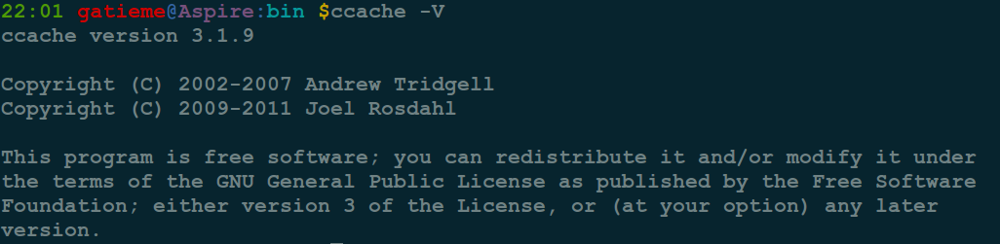
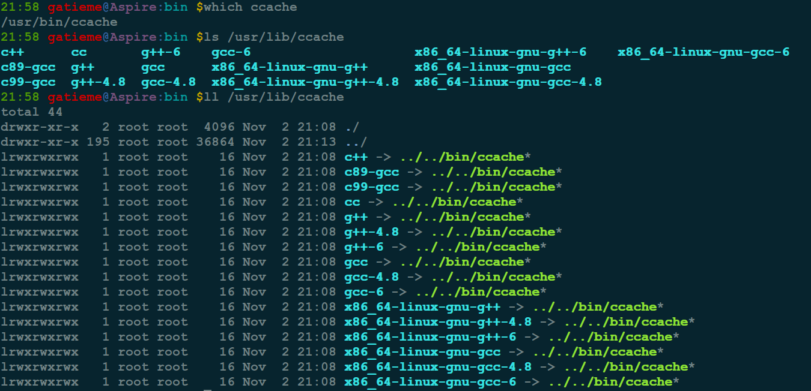

高速的C/C++编译缓存ccache
=======


| CSDN | GitHub |
|:----:|:------:|
| [Aderstep--紫夜阑珊-青伶巷草](http://blog.csdn.net/gatieme) | [`AderXCoding/system/tools`](https://github.com/gatieme/AderXCoding/tree/master/system/tools) |


<br>
<a rel="license" href="http://creativecommons.org/licenses/by-nc-sa/4.0/"></a>
本作品采用<a rel="license" href="http://creativecommons.org/licenses/by-nc-sa/4.0/">知识共享署名-非商业性使用-相同方式共享 4.0 国际许可协议</a>进行许可, 转载请注明出处
<br>


*	`ccache`的主页 : http://ccache.samba.org

*	`distcc`的主页 : http://distcc.samba.org

*	参照 : https://wiki.archlinux.org/index.php/Ccache#Change_the_cache_directory


#1	ccache介绍
-------


##1.1	背景
-------

在处理一些规模相对较大的工程时, 编译花费的时间可能会很长. 有时候我们会经常一遍一遍地编译相同的程序, 此时, 有了`ccache`情况就好多了.它将在第一遍编译时多花几秒钟, 但接下来就会使编译成倍（5-10倍）的提速.

`ccache`的基本原理是通过将头文件高速缓存到源文件之中而改进了构建性能, 因而通过减少每一步编译时添加头文件所需要的时间而提高了构建速度.以下来了解下如何同时使用 ccache 和distcc 来使开发环境达到最佳性能.

#1.2	引入ccache
-------
在标准的编译过程中, 在 UNIX 下使用 `C/C++` 开发应用程序通常需要用到一个编译器(如 gcc)以及一个编译工具(如 make).

make 和所有的 C 编译器的问题在于 C 预处理程序(preprocessor)和头文件的工作方式. 观察一个典型的 C 源文件, 您会发现其中有很多由 `#include` 所引用的各种头文件.每一次编译一个文件时, C 预处理程序(cpp)都会解析并引入每个头文件以及这些头文件引用到的任何文件.通过对内容进行解析, 预处理器cpp将源文件中所有的头文件和宏全部展开到一个预处理文件中, 这相当于将一个基本的 1-KB 大小的源文件转化为一个 8-KB 左右甚至更大的源文件, (可以在 gcc 编译时, 显式使用 gcc -E 来激活预处理), 在这个过程中, 会合并入几十个甚至几百个头文件. 在典型的开发项目中, 有很多与项目相关的头文件可能会在不同的源文件中多次被引入, 而且每个头文件本身也可能引用很多其他头文件.这就是我们使用了N年的C编译器的基本编译理念, 从C出现到如今, 它带给人们无数编译成果的同时, 也逐渐暴露出自身固有的缺憾.

在典型的编译过程中, make 工具只编译自上次编译后发生修改的文件, 这样就在很大程度上简化了编译过程. make 将必须被编译的文件限制在经过修改的那些源文件范围之内, 但是即使是使用 make, 仍然有相当的浪费.每一次编译项目时, 源文件在编译为汇编语言和最终的机器代码之前, 都要通过 cpp 进行解析. 对每一个文件来说, 每一次可能都要重新解析头文件, 由此上面提到的问题再次出现.从编译的全过程来看, 您最后可能多次解析了相同的头文件, 浪费了处理器周期, 更浪费了开发时间.

##1.3	ccache基本原理
-------

`ccache`("compiler cache"的缩写)也是一个编译器驱动器.

*	第一趟编译时`ccache`缓存了`GCC`的"-E"输出、编译选项以及.o文件到`$HOME/.ccache`.

*	第二次编译时尽量利用缓存, 必要时更新缓存.

所以即使使用了"make clean", 再次"make"也能从中获得好处. `ccache`是经过仔细编写的, 确保了与直接使用 GCC 获得完全相同的输出.

`ccache`工具会高速缓存编译生成的信息, 并在编译的特定部分使用高速缓存的信息, 比如头文件, 这样就节省了通常使用 cpp 解析这些信息所需要的时间.

举例编译`Example`, 假定 `foobar.h` 中包含对其他头文件的引用, ccache 会用那个文件的 cpp-parsed 版本（已编译过并被ccache缓存在cache中的备份）来取代 include 声明, 而不是真正去读取、理解并解释其内容, ccache 只是将缓存在高速缓存中最终的文本拷贝到文件中, 使得它可以立即被编译.

```cpp
Example：
#include　"foobar.h"
void　main(void)
{

}
```


#2	安装和使用ccache
-------


安装和使用 ccache很简单.首先说明一点, ccache它不会取代或者以任何方式影响您原来的使用编译器的方式, 而是担当了您与您的编译器之间的一个接口, 所以您可以根据需要选择是否使用它.要安装 ccache, 需要从 Samba 小组或者一个本地镜像直接下载源文件.解压出文件的内容： 

##2.1	安装
-------

`Ubuntu`安装

```cpp
sudo apt-get install ccache
```

`CentOS`安装

```cpp
sudo yum install ccache
```

源码编译安装


```cpp
wget https://www.samba.org/ftp/ccache/ccache-3.3.3.tar.gz
tar -zxvf ccache-3.3.3.tar.gz
cd ccache-3.3.3
./configure
make
make install
```




##2.2	配置ccache
-------

前面提到, ccache 是充当您与您的普通编译器之间一个借口来优化编译的.有两种方式使用ccache：



*	选择性使用ccache：

使用"ccache gcc"或"ccache g++"代替"gcc"或"g++" , 以 gcc 为第一个参数调用 ccache, 而不是调用 gcc.例如, 要在命令行中编译一个文件, 您通常会使用：

```cpp
gcc foo.c
```

要使用 ccache, 您应该输入：

```cpp
ccache gcc foo.c
```

像这样对一个文件进行单独的编译, 尤其是第一次使用 ccache 编译那个文件时, 您将不会看到有任何的帮助, 因为编译信息还没有被高速缓存.

*	ccache加入环境变量, 取代C编译器：

设置 CC 环境变量的值, 配置makepkg, 进入到你的/etc/makepkg.conf中加入下面几行：

```cpp
export CC="ccache gcc"
export CPP="ccache cpp"
export CXX="ccache g++"
```
或者直接在命令行输入：

```cpp
export set CC='ccache gcc'
```

`makepkg.conf`里还有不少东西可以修改, 详情参见原文：
http://wiki.archlinux.org/index.php/Makepkg.conf

*	配置 ccache 永久地取代主要编译器：

修改`~/.bash_profile`(或者类似的`~/.bashrc`和`~/.profile`)把`/usr/lib/ccache/bin`路径加到`PATH`下

```cpp
PATH=/usr/lib/ccache/bin:$PATH
```

这只是对`ccache`所自带的`gcc`起作用, 有时候我们需要使用交叉编译工具, 这时, 仅仅通过以上操作是无法执行`ccache`编译的, 通常会提示xxx路径没有这个编译工具, 这时需要这样做 :

```cpp
which ccache
```

查看安装路径, /home/用户名/ccache

```cpp
mkdir ~/.bin
cd ~/.bin/
ln -s /usr/bin/ccache gcc
ln -s /usr/bin/ccache g++
ln -s /usr/bin/ccache arm-linux-gcc
ln -s /usr/bin/ccache arm-linux-g++
```

同理, 其他编译工具类似方式指定. 比如我们要将交叉编译器绑定到`ccache`上

PATH设置, 将`~/.bin/`放在`arm-linux-gcc`等的PATH的前面.
如：原：PATH=$PATH:$HOME/bin
现：PATH=/home/用户名/.bin:$PATH:/home/用户名/ccache/bin
然后重启即可

E、$ which arm-linux-gcc
/home/<user>/.bin/arm-linux-gcc 确认
这样每次启动g++的时候都会启动/usr/lib/ccache/bin/g++, 而不会启动/usr/bin/g++, 效果跟使用命令行ccache g++效果一样.每次用户登录时, 使用g++编译器时会自动启动ccache.

如果您只是想为一个项目启用 ccache, 比如说编译 Perl 等第三方工具时, 那么您或者可以使用第二种方式, 或者可以告知配置脚本或 make 命令使用哪个 C 编译器.


##2.3	控制高速缓存
-------

高速缓存`ccache`的位置

*	默认情况下, `ccache` 使用当前用户主目录中的一个目录(`$HOME/.ccache`)来保持高速缓存信息.

*	在团队环境中, 您应该使用一个集中的位置来进行高速缓存, 这样在编译过程中每个人都可以使用高速缓存的信息.

另一个环境变量 `CCACHE_DIR`指定了高速缓存目录的位置.在单机环境中, 将这个环境变量设置为一个每一个需要它的人都可以访问的目录. 使用通过 `tmpfs` 挂载的目录可以获得更高的速度, 前提是您得有支持这一功能的存储器.您的速度可能会再提高 10% 到 25%.

如果您是在网络中多台机器上使用 ccache 进行分布式编译, 搭配 `distcc` 即可搭建分布式编译的环境, 那么要确保您共享的目录要通过 `NFS` 导出(`export`)并挂载到每一个客户机上. 如果您希望获得额外的加速, 同样可以使用 `tmpfs` 文件系统.

另外的一些选项让您可以更深入地控制高速缓存设置：

| 选项 | 描述 |
|:---:|:----:|
| CCACHE_LOGFILE | 定义了使用高速缓存时生成的日志文件所处的位置 |
| -s | 在 ccache 中使用 -s 命令行选项来获得关于高速缓存性能的统计数据 |
| -M | 使用 -M 命令行选项来设置高速缓存的最大大小.默认是 1GB.高速缓存的设置会写入到高速缓存目录, 所以您可以让不同的用户和组在不同的位置拥有不同大小的高速缓存 |
| -F | 选项设置高速缓存目录的最大文件数目, 按 16 进制舍入.和 -M 相同, 只是当您希望改变配置的时候才需要使用它 |
| -c | 选项清空缓存.您通常不需要使用这个选项, 因为 ccache 在执行过程中会更新信息, 但是, 如果您要重用一个没有为某个文件所使用的高速缓存目录, 那么就应该尝试使用这个选项 |
| -C | 选项完全清空高速缓存 |

一旦设置了初始化选项并配置了期望的目录和高速缓存大小, 就不需要再做任何改动.没有必要执行任何日常的维护.


##3.4	组合 ccache 和 distcc完成分布式编译
-------

您可能已经想到了 `distcc` 这一来自 `Samba` 小组的另一个工具, 它让您可以将编译过程分布到多台机器上.只需要为 `make` 添加多任务选项(使用 -j 命令行选项), 它就可以有效地提高同步编译的数目. `distcc` 系统的工作方式是, 每台主机上有一个后台进程, 接收最终预解析格式的源文件, 然后在本地进行编译, 返回生成的对象文件.

如果使用得当, 在每加入一个新的同样节点时, 编译时间通常应该会以稍微低于线性的比率下降, 不过您将只会在那些远不只一个源文件的项目上看到这样的影响, 因为 `distcc` 只是分布全部源文件.

由于 `distcc` 所分布的是解析过的文件, 所以您可以组合 `ccache`, 它可以加速 C 预处理过程部分, 同时 `distcc` 可以完成到对象代码的实际编译. 要以这种方式来使用 `distcc` 和 `ccache`, 需要在主机上配置 `distcc`, 在主要的开发机器上配置 `distcc` 和 ccache.
现在在希望要编译项目的机器上设置环境变量, 如下所示.
使用 `ccache` 和 `distcc` 所需要的环境变量：


```cpp
export  set  DISTCC_HOSTS='localhost atuin nautilus pteppic kernel'
export　set　CCACHE_DIR=/Data/Cache/CCache
export　set　CCACHE_PREFIX=distcc
export　set　CCACHE_LOGFILE=/Data/Cache/CCache.log
export　set　CC='ccache　gcc'
```

环境变量定义如下：

| 变量 | 描述 |
|:---:|:----:|
| DISTCC_HOSTS | 指定了将工作分布到哪些主机 |
| CCACHE_DIR | 指定了高速缓存目录的位置 |
| CCACHE_PREFIX | 定义了当 ccache 调用真实的编译器来编译源文件(预处理之后)时所使用的前缀 |
| CC | 设置首先使用的 C 编译器的名称(ccache) |

现在, 当运行 `make` 时, 如果使用了 -j 选项来指定要执行的同步编译的数目, 则首先使用 `ccache` 解析文件(如果需要, 使用高速缓存), 然后将其分布到某个 `distcc` 主机.

尽管 `distcc` 加速了编译过程, 但是它没有改变环境的基本限制.例如, 您不应该将 `make` 执行的同步作业的数目设置得大于可用 `CPU` 数目的两倍.例如, 如果您有四台两路机器, 那么将作业值设置为超过 16 的值时将不再会观察到有多大改善.

好了, 强大的ccache至此已经基本了解了, 想要更深入的理解还是在使用实践中获得吧.以上这些都是借鉴网上众前人帖子而总结出的一点经验, 实际操作使用时没必要这么深入, 就当他是一个小工具就可以了, 会用即可.贴出来梳理下思路, 以便对后来人有些帮助！

