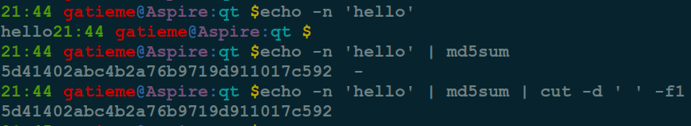
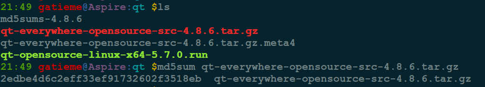
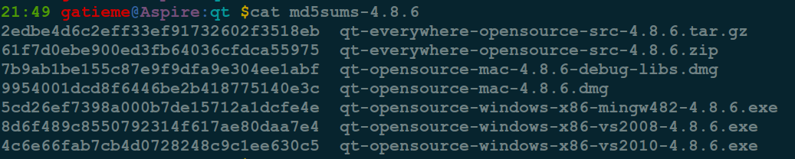
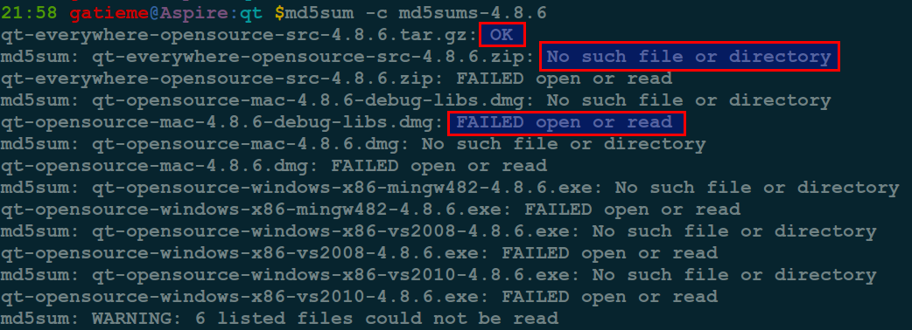

linux下使用md5sum计算和检验MD5码
=======

| CSDN | GitHub |
|:----:|:------:|
| [linux下使用md5sum计算和检验MD5码](http://blog.csdn.net/gatieme) | [`AderXCoding/system/md5sum`](https://github.com/gatieme/AderXCoding/tree/master/system/tools/md5sum) |


<br>
<a rel="license" href="http://creativecommons.org/licenses/by-nc-sa/4.0/"></a>
本作品采用<a rel="license" href="http://creativecommons.org/licenses/by-nc-sa/4.0/">知识共享署名-非商业性使用-相同方式共享 4.0 国际许可协议</a>进行许可, 转载请注明出处
<br>


#1	md5介绍
-------

在网络传输、设备之间转存、复制大文件等时，可能会出现传输前后数据不一致的情况. 这种情况在网络这种相对更不稳定的环境中，容易出现. 那么校验文件的完整性，也是势在必行的


#2	md5sum命令
-------

`md5sum`命令用于生成和校验文件的md5值. 它会逐位对文件的内容进行校验. 是文件的内容, 与文件名无关, 也就是文件内容相同, 其`md5`值相同. `md5`值是一个128位的二进制数据, 转换成16进制则是32（128/4）位的进制值.

`md5`校验, 有很小的概率不同的文件生成的md5可能相同.比md5更安全的校验算法还有SHA*系列的.

在网络传输时，我们校验源文件获得其md5sum，传输完毕后，校验其目标文件，并对比如果源文件和目标文件md5 一致的话，则表示文件传输无异常。否则说明文件在传输过程中未正确传输。

```cpp
用法：md5sum [选项]... [文件]...
显示或检查 MD5(128-bit) 校验和。
若没有文件选项，或者文件处为"-"，则从标准输入读取。

-b, --binary 以二进制模式读取
-c, --check 从文件中读取MD5 的校验值并予以检查
-t, --text 以纯文本模式读取(默认)

以下三个选项在进行校验时非常有用：

--quiet 不为校验成功的文件输出OK
--status 不输出任何内容，使用退出状态号显示成功
-w, --warn 对格式不准确的校验和行进行警告
--strict with --check, exit non-zero for any invalid input
--help 显示此帮助信息并退出
--version 显示版本信息并退出

校验和会按照RFC 1321 规范生成. 当进行检查时, 给出的输入格式应该和程序的输出样板格式相同. 默认的输出模式时输出一行校验和的校验结果, 并有一个字符来表示文件类型("*"代表二进制, " "代表纯文本), 并同时显示每个文件的名称.
```

可以使用`md5sum --help`查看其帮助信息


#3	示例
-------

*	获取字符串的MD5值 :

字符串"hello"的MD5：

```cpp
echo -n 'hello' | md5sum | cut -d ' ' -f1
```

得到的MD5值



```cpp
5d41402abc4b2a76b9719d911017c592
```

| 命令解释 | 描述 |
|:------:|:----:|
| md5sum| 显示或检查 MD5(128-bit) 校验和, 若没有文件选项，或者文件处为"-"，则从标准输入读取 |
| echo -n | 输出信息, 但是不打印换行符 |
| cut | cut用来从标准输入或文本文件中剪切列或域。剪切文本可以将之粘贴到一个文本文件, `-d`指定与空格和tab键不同的域分隔符. `-f1`表示第一个域 |


*	获取文件的MD5值：

我们使用了从`download.qt.io`下载的`qt-4.8.6`的源码包, 可以使用下面的命令卸载

```cpp
wget http://download.qt.io/archive/qt/4.8/4.8.6/qt-everywhere-opensource-src-4.8.6.tar.gz
```

检验文件`qt-everywhere-opensource-src-4.8.6.tar.gz`的`MD5`

```cpp
md5sum qt-everywhere-opensource-src-4.8.6.tar.gz | cut -d ' ' -f1
```



得到的MD5值：

```cpp
ee3d6e2ca498bc7685b7f17cdb5f2eea
```

*	使用MD5校验iso文件

进行md5的校对我们需要首先知道文件的md5值, 一般来说文件的下载地址会为我们提供检验用的md5文件, 一般来说这些文件是用如下的命令生成的

```cpp
md5sum qt-everywhere-opensource-src-4.8.6.tar.gz >qt-everywhere-opensource-src-4.8.6.tar.gz.md5
```

注意`qt-everywhere-opensource-src-4.8.6.tar.gz.md5`的内容是：

```cpp
2edbe4d6c2eff33ef91732602f3518eb  qt-everywhere-opensource-src-4.8.6.tar.gz
```

把qt-everywhere-opensource-src-4.8.6.tar.gz和其验证文件qt-everywhere-opensource-src-4.8.6.tar.gz.md5放到同一目录下, 然后使用用下面的命令进行检验

```cpp
md5sum -c qt-everywhere-opensource-src-4.8.6.tar.gz.md5
```


当然我们下载的文件, 用md5进行检验是检查下载文件的完整性, 自然不能用自己生成的md5校验文件, 一般来说文件的下载网站会为我们提供检验用的md5文件.

`qt-everywhere-opensource-src-4.8.6.tar.gz`的`md5`文件校验文件可以从http://download.qt.io/archive/qt/4.8/4.8.6/md5sums-4.8.6来下载

```cpp
wget http://download.qt.io/archive/qt/4.8/4.8.6/md5sums-4.8.6
```

其`md5sums-4.8.6`内容如下





```cpp
2edbe4d6c2eff33ef91732602f3518eb  qt-everywhere-opensource-src-4.8.6.tar.gz
61f7d0ebe900ed3fb64036cfdca55975  qt-everywhere-opensource-src-4.8.6.zip
7b9ab1be155c87e9f9dfa9e304ee1abf  qt-opensource-mac-4.8.6-debug-libs.dmg
9954001dcd8f6446be2b418775140e3c  qt-opensource-mac-4.8.6.dmg
5cd26ef7398a000b7de15712a1dcfe4e  qt-opensource-windows-x86-mingw482-4.8.6.exe
8d6f489c8550792314f617ae80daa7e4  qt-opensource-windows-x86-vs2008-4.8.6.exe
4c6e66fab7cb4d0728248c9c1ee630c5  qt-opensource-windows-x86-vs2010-4.8.6.exe
```


那么可以使用如下命令进行校验

```cpp
md5sum -c md5sums-4.8.6
```



