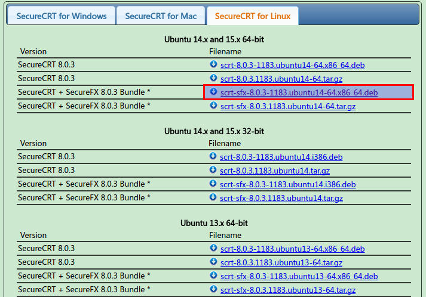
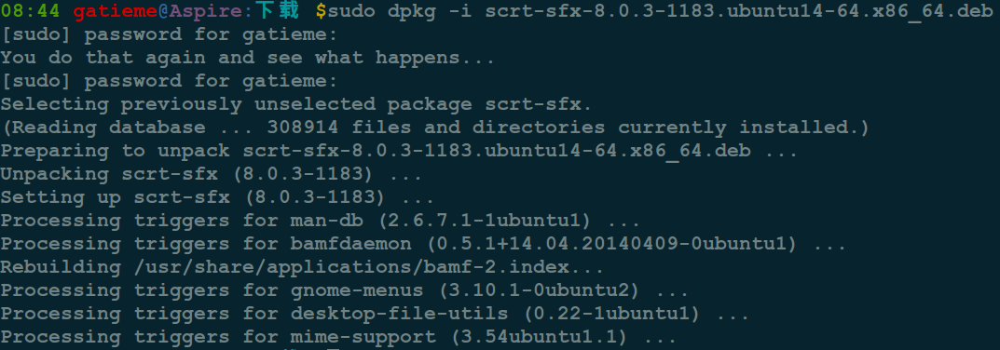
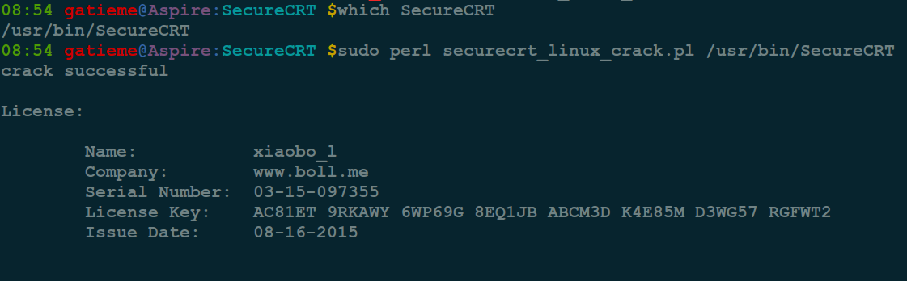
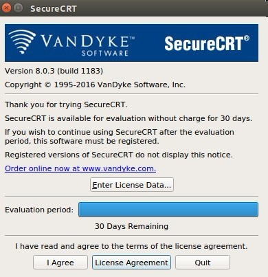
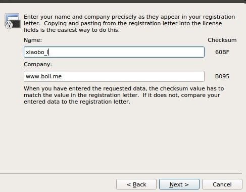
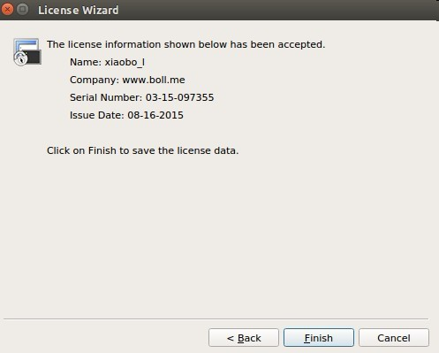

http://www.cnblogs.com/yinchengzhe/p/5926645.html

http://www.linuxidc.com/Linux/2014-10/108709.htm


在使用secureCRT前确保主机的ssh服务是启动状态。

#1	下载secureCRT包
-------

>**site**:  https://www.vandyke.com/download/securecrt/download.html



当前最新版本是8.0.3, 我下载的是SecureCRT + SecureFX 8.0.3 Bundle版本, 其中SecureFX是用来传输文件的工具

下载过程需要注册，直接注册就可以下载了.

#2	安装secureCRT & SecureFX
-------

```cpp
sudo dpkg -i scrt-sfx-8.0.3-1183.ubuntu14-64.x86_64.deb 
```



　　会自动完成安装。

　　出现如下信息表示安装成功


#3	破解
-------


##3.1	破解SecureCRT
-------


下载破解程序

```cpp
wget http://download.boll.me/securecrt_linux_crack.pl
```


生成秘钥

```cpp
sudo perl securecrt_linux_crack.pl /usr/bin/SecureCRT
```



执行破解

运行secureCRT

```
SecureCRT &
```
在弹出的界面点击Enter License Data...




在界面中选择EnterLicense Manually手动输入破解之后的license信息.


如果点击Enter License Data之后没有EnterLicense Manually按钮，直接点击next会在下一个界面看到。




破解成功之后如下所示：





##3.2	破解SecureFX
-------


用SecureCRT 实现 WIN7 与 Linux 双向通信的问题及文件互传问题解决 http://www.linuxidc.com/Linux/2014-08/105412.htm

如何使用SecureCRT6.6.2通过SSH方式登录Ubuntu系统 http://www.linuxidc.com/Linux/2011-03/33024p4.htm

SecureCRT 连接 Ubuntu http://www.linuxidc.com/Linux/2013-06/85824.htm

Ubuntu 12.04 + 虚拟机VMware 9 + Secure CRT + EditPlus 本地C++开发环境搭建 http://www.linuxidc.com/Linux/2013-05/84820.htm

利用SecureCRT在Linux与Windows之间传输文件 http://www.linuxidc.com/Linux/2014-08/105413.htm

使用SecureCRT在远程主机和本地之间传输文件 使用SecureCRT在远程主机和本地之间传输文件

更多Ubuntu相关信息见Ubuntu 专题页面 http://www.linuxidc.com/topicnews.aspx?tid=2