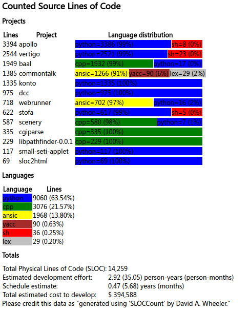
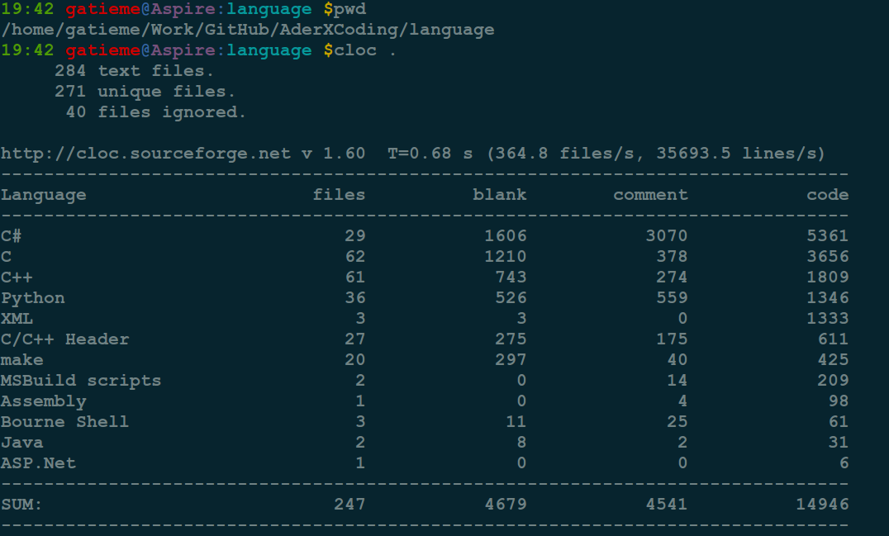
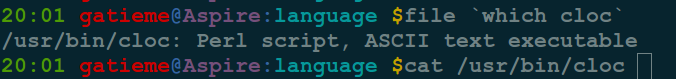
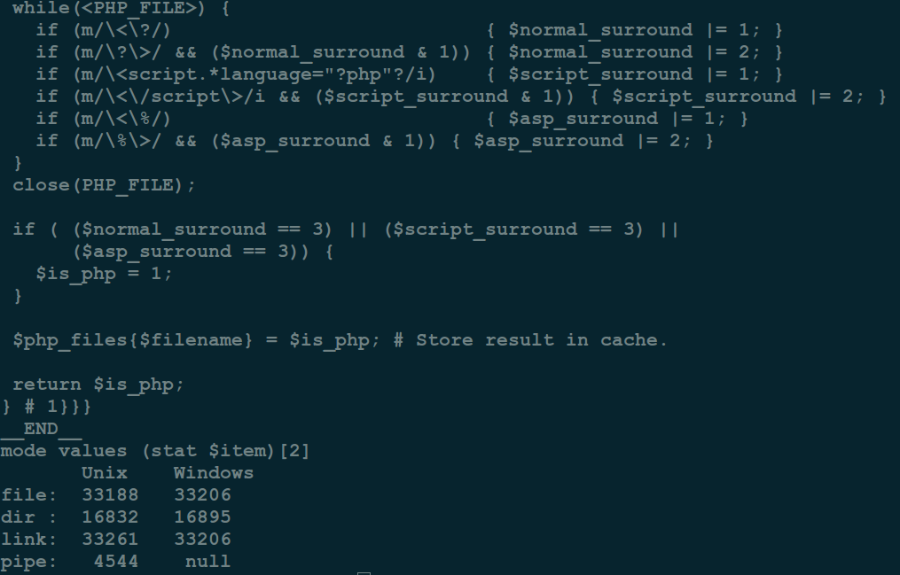

Linux下统计源代码的行数
=======

| CSDN | GitHub |
|:----:|:------:|
| [Linux下源代码行数统计工具(sloccount, cloc等)](http://blog.csdn.net/gatieme/article/details/52791294) | [`AderXCoding/system/tools/sourcecount`](https://github.com/gatieme/AderXCoding/tree/master/system/tools/sourcecount) |


<br>
<a rel="license" href="http://creativecommons.org/licenses/by-nc-sa/4.0/"></a>
本作品采用<a rel="license" href="http://creativecommons.org/licenses/by-nc-sa/4.0/">知识共享署名-非商业性使用-相同方式共享 4.0 国际许可协议</a>进行许可
<br>


在windows下总是有很多源代码统计工具, 比如`SourceCounter(源代码统计精灵)`等工具


之前我总是使用如下命令统计源代码的信息, 繁琐而可读性差

```cpp
find . -type f -name "*.[hc]" | xargs cat | wc -l
```

或者

```cpp
 find . -name "*.[hc]" | xargs -L 1 wc -l | awk '{print $1}' | while read num; do total=$((total+num)); echo $total; done
```


#1	sloccount源代码行数统计工具
-------

>sloccount=Count Source Lines Of Code


官网 : http://www.dwheeler.com/sloccount/

##1.1	**Ubuntu安装**
-------


```cpp
sudo apt-get install sloccount
```

##1.2	**使用**
-------

```cpp
sloccount  [--version]  [--cached]  [--append]  [  --datadir directory ]
       [--follow]  [--duplicates]  [--crossdups]  [--autogen]  [--multiproject]
       [--filecount] [--wide] [--details] [ --effort F E ] [ --schedule F E ] [
       --personcost cost ] [ --overhead overhead ] [  --addlang  language  ]  [
       --addlangall ] [--] directories
--cached
```

跳过计算过程，直接使用上次结果

| 参数 | 描述 |
|:---:|:----:|
| --multiproject | 如果该文件夹包括一系列的子文件夹，而它们中的每一个都是相对独立开发的不同的项目，那么使用"--multiproject"选项，评估将会正确的考虑到这一点 |
| --filecount | 显示文件数目而非代码行数 |
| --details | 显示每个源文件的详细信息 |
| --duplicates | 算上所有重复的(默认情况下如果文件有相同的内容，则只算一个) |
| --crossdups | 如果顶目录包含几个不同的项目，并且你想把不同的项目下重复的文件在每个项目中都算上一次，则使用该选项 |


#	1.3	**转换成html文件**
-------

有一个sloc2html.py可以把生成的结果转换为带图形统计结果的html文件. 缺点是对中文支持不好

例如：

```cpp
sloccount --wide --multiproject SourceDirectory > result.txt
sloc2html.py result.txt > result.html
```

再打开result.html即可看到结果形如：





>下载地址   http://www.dwheeler.com/sloccount/sloc2html.py.txt
>
>输出样例  http://www.dwheeler.com/sloccount/sloc2html-example.html

```cpp
wget http://www.dwheeler.com/sloccount/sloc2html.py.txt -O sloc2html.py
```


sloc2html.py文件源代码如下


```cpp
#!/usr/bin/env python
# Written by Rasmus Toftdahl Olesen <rto@pohldata.dk>
# Modified slightly by David A. Wheeler
# Released under the GNU General Public License v. 2 or higher
from string import *
import sys

NAME = "sloc2html"
VERSION = "0.0.2"

if len(sys.argv) != 2:
    print "Usage:"
    print "\t" + sys.argv[0] + " <sloc output file>"
    print "\nThe output of sloccount should be with --wide and --multiproject formatting"
    sys.exit()

colors = { "python" : "blue",
           "ansic" : "yellow",
           "perl" : "purple",
           "cpp" : "green",
           "sh" : "red",
           "yacc" : "brown",
           "lex" : "silver"
           # Feel free to make more specific colors.
           "ruby" : "maroon",
           "cs" : "gray",
           "java" : "navy",
           "ada" : "olive",
           "lisp" : "fuchsia",
           "objc" : "purple",
           "fortran" : "purple",
           "cobol" : "purple",
           "pascal" : "purple",
           "asm" : "purple",
           "csh" : "purple",
           "tcl" : "purple",
           "exp" : "purple",
           "awk" : "purple",
           "sed" : "purple",
           "makefile" : "purple",
           "sql" : "purple",
           "php" : "purple",
           "modula3" : "purple",
           "ml" : "purple",
           "haskell" : "purple"
          }


print "<html>"
print "<head>"
print "<title>Counted Source Lines of Code (SLOC)</title>"
print "</head>"
print "<body>"
print "<h1>Counted Source Lines of Code</h1>"

file = open ( sys.argv[1], "r" )

print "<h2>Projects</h2>"
line = ""
while line != "SLOC\tDirectory\tSLOC-by-Language (Sorted)\n":
    line = file.readline()

print "<table>"
print "<tr><th>Lines</th><th>Project</th><th>Language distribution</th></tr>"
line = file.readline()
while line != "\n":
    num, project, langs = split ( line )
    print "<tr><td>" + num + "</td><td>" + project + "</td><td>"
    print "<table width=\"500\"><tr>"
    for lang in split ( langs, "," ):
        l, n = split ( lang, "=" )
        print "<td bgcolor=\"" + colors[l] + "\" width=\"" + str( float(n) / float(num) * 500 ) + "\">" + l + "=" + n + "&nbsp;(" + str(int(float(n) / float(num) * 100)) + "%)</td>"
    print "</tr></table>"
    print "</td></tr>"
    line = file.readline()
print "</table>"

print "<h2>Languages</h2>"
while line != "Totals grouped by language (dominant language first):\n":
    line = file.readline()

print "<table>"
print "<tr><th>Language</th><th>Lines</th></tr>"
line = file.readline()
while line != "\n":
    lang, lines, per = split ( line )
    lang = lang[:-1]
    print "<tr><td bgcolor=\"" + colors[lang] + "\">" + lang + "</td><td>" + lines + " " + per + "</td></tr>"
    line = file.readline()
print "</table>"

print "<h2>Totals</h2>"
while line == "\n":
    line = file.readline()

print "<table>"
print "<tr><td>Total Physical Lines of Code (SLOC):</td><td>" + strip(split(line,"=")[1]) + "</td></tr>"
line = file.readline()
print "<tr><td>Estimated development effort:</td><td>" + strip(split(line,"=")[1]) + " person-years (person-months)</td></tr>"
line = file.readline()
line = file.readline()
print "<tr><td>Schedule estimate:</td><td>" + strip(split(line,"=")[1]) + " years (months)</td></tr>"
line = file.readline()
line = file.readline()
print "<tr><td>Total estimated cost to develop:</td><td>" + strip(split(line,"=")[1]) + "</td></tr>"
print "</table>"

file.close()

print "Please credit this data as \"generated using 'SLOCCount' by David A. Wheeler.\"\n"
print "</body>"
print "</html>"
```


#2	cloc代码行数统计工具
-------

cloc也可以用来统计源代码的行数, 其本质是一个perl的脚本


安装

```cpp
sudo apt-get install cloc
```


使用

进入到需要统计的目录执行

```cpp
cloc .
```





其本质是一个perl的脚本, 可以用

```cpp
file `which cloc`
```




可以使用

```
cat `which cloc`
```

查看其源代码的信息


