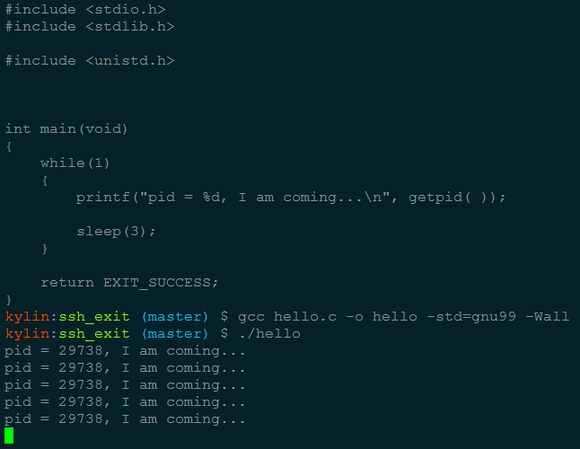
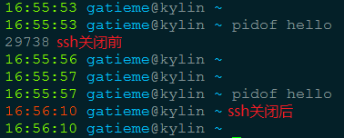
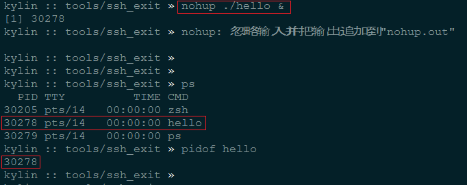
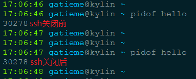
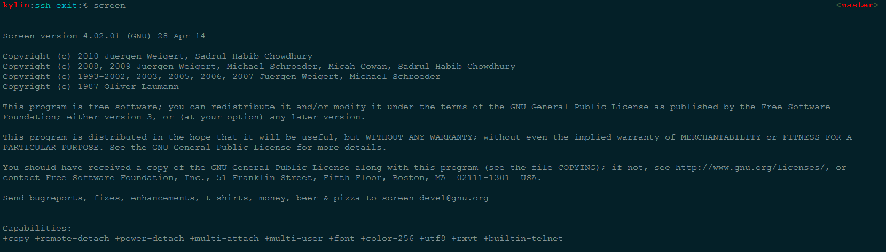
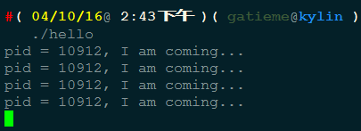
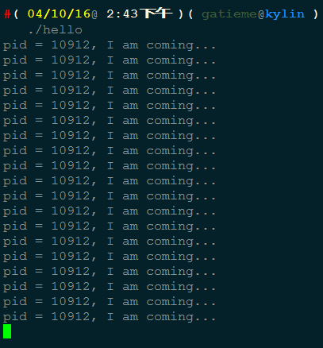

解决Linux关闭终端(关闭SSH等)后运行的程序自动停止
=======

| CSDN | GitHub |
|:----:|:------:|
| [解决Linux关闭终端(关闭SSH等)后运行的程序自动停止](http://blog.csdn.net/gatieme/article/details/52777721) | [`AderXCoding/system/tools/ssh_exit`](https://github.com/gatieme/AderXCoding/tree/master/system/tools/ssh_exit) |


<br>
<a rel="license" href="http://creativecommons.org/licenses/by-nc-sa/4.0/"></a>
本作品采用<a rel="license" href="http://creativecommons.org/licenses/by-nc-sa/4.0/">知识共享署名-非商业性使用-相同方式共享 4.0 国际许可协议</a>进行许可
<br>


#1	问题发现
-------


之前在服务器上起一个`python`的服务, 放到后台运行. 我关闭这个SSH之后，该服务不可用，再次登入到服务器，已经没有这个python进程.


为此我写了一个测试程序来描述此问题 :

```cpp
/////////////////////
//  hello.c
/////////////////////
#include <stdio.h>
#include <stdlib.h>

#include <unistd.h>


int main(void)
{
    while(1)
    {
        printf("pid = %d, I am coming...\n", getpid( ));

        sleep(3);
    }

    return EXIT_SUCCESS;
}
```


我们在一个ssh中编译后启动该进程 

```cpp
gcc hello.c -o hello -std=gnu99 -Wall
./hello
```



然后再开一个ssh, 我们用`pidof hello`来查看进程的pid信息, 显示出进程的pid为29738

接着我们关掉那个启动了`hello`的`ssh`, 重新用`pidof hello`再次查看进程信息, 发现进程已经没了





其他进程的影响


*	守护进程不受此影响, 因为守护进程比较特殊, 不属于sshd这个进程组  而是单独的进程组，所以就算关闭了ssh，和他也没有任何关系, 如果不这样的话, 你发现nfs服务没开. 你用ssh登录, 开启了守护进程, 如果ssh退出后守护进程也退出了, 那岂不是白忙活了

*	使用后台运行命令&, 不能将程序摆脱ssh进程组控制呢, 因为其本质仍然属于此进程会话组的进程

#2	问题定位
-------


通过上面问题的表象，可以发现是跟SSH关闭有关.为什么ssh关闭，会导致正在运行的程序死掉.通过查看相关的资料，发现真正的元凶是SIGHUP信号导致的.


在linux中，有下面几个概念：


| 概念 | 描述 |
|:-----:|:-----:|
| 进程组 | 一个或多个进程的集合，每一个进程组都有唯一一个进程组ID，即进程组 |
| 会话器 | 一个或多个进程组的集合，有唯一一个会话期首进程（session leader）. 会话期ID为首进程的ID |
| 控制进程 | 与控制终端连接的会话期首进程叫做控制进程 |

当前与终端交互的进程称为前台进程组.其余进程组称为后台进程组.

一般缩写：

```cpp
PID = 进程ID （由内核根据延迟重用算法生成）
PPID = 父进程ID（只能由内核修改）
PGID = 进程组ID（子进程、父进程都能修改）
SID = 会话ID（进程自身可以修改，但有限制，详见下文）
TPGID= 控制终端进程组ID（由控制终端修改，用于指示当前前台进程组）
```

会话和进程组的关系：

*	每次用户登录终端时会产生一个会话（session）. 从用户登录开始到用户退出为止，这段时间内在该终端执行的进程都属于这一个会话

*	每个进程除了有一进程ID之外，还属于一个进程组（Process Group）.进程组是一个或多个进程的集合，每个进程组有一个唯一的进程组ID.多个进程属于进程组的情况是多个进程用管道“|”号连接进行执行.如果在命令行执行单个进程时这个进程组只有这一个进程.

挂断信号（SIGHUP）默认的动作是终止程序.

*	当终端接口检测到网络连接断开，将挂断信号发送给控制进程（会话期首进程）

*	如果会话期首进程终止，则该信号发送到该会话期前台进程组

*	一个进程退出导致一个孤儿进程组中产生时，如果任意一个孤儿进程组进程处于STOP状态，发送SIGHUP和SIGCONT信号到该进程组中所有进程.


**结论**：因此当网络断开或终端窗口关闭后，也就是SSH断开以后，控制进程收到SIGHUP信号退出，会导致该会话期内其他进程退出.

**简而言之**：就是ssh 打开以后，bash等都是他的子程序，一旦ssh关闭，系统将所有相关进程杀掉！！ 导致一旦ssh关闭，执行中的任务就取消了


#3	解决的办法
-------

##3.1	nohup命令
-------

如果你正在运行一个进程，而且你觉得在退出帐户时该进程还不会结束，那么可以使用nohup命令. 该命令可以在你退出帐户/关闭终端之后继续运行相应的进程. nohup就是不挂起的意思.

我们现在开始启动服务 python pyserver.py，并且希望在后台运行.我们就可以使用nohup，命令如下：

```cpp
nohup ./hello &
```

此时默认地程序运行的输出信息放到当前文件夹的nohup.out 文件中去，加不加&并不会影响这个命令.只是让程序前台或者后台运行而已





然后另外一个ssh中, 我们用`pidof hello`来查看进程的pid信息, 显示出进程的pid为29738

接着我们关掉那个启动了`hello`的`ssh`, 重新用`pidof hello`再次查看进程信息, 发现进程仍然存在





| nohup命令 | 说明 |
|:------------:|:-----:|
| 用途 | 挂断地运行命令 |
| 语法 | nohup Command [ Arg ... ] [　& ] |
| 描述 | nohup 命令运行由 Command 参数和任何相关的 Arg 参数指定的命令，忽略所有挂断（SIGHUP）信号.在注销后使用 nohup 命令运行后台中的程序.要运行后台中的 nohup 命令，添加 & （ 表示“and”的符号）到命令的尾部 |

无论是否将 nohup 命令的输出重定向到终端，输出都将附加到当前目录的 nohup.out 文件中.如果当前目录的 nohup.out 文件不可写，输出重定向到 $HOME/nohup.out 文件中.如果没有文件能创建或打开以用于追加，那么 Command 参数指定的命令不可调用.如果标准错误是一个终端，那么把指定的命令写给标准错误的所有输出作为标准输出重定向到相同的文件描述符.


退出状态, 该命令返回下列出口值

| 退出值 | 描述 |
|:------------:|:-----:|
| 126 | 可以查找但不能调用 Command 参数指定的命令 |
| 127 | nohup 命令发生错误或不能查找由 Command 参数指定的命令， 否则，nohup 命令的退出状态是 Command 参数指定命令的退出状态 |


##3.2	screen命令
-------


如果想在关闭ssh连接后刚才启动的程序继续运行怎么办, 可以使用nohup.


但是如果要求第二天来的时候. 一开ssh, 还能查看到昨天运行的程序的状态,

然后继续工作，这时nohup是不行了, 需要使用screen来达到这个目的.


虽然nohup很容易使用，但还是比较“简陋”的，对于简单的命令能够应付过来，对于复杂的需要人机交互的任务就麻烦了


其实我们可以使用一个更为强大的实用程序screen.流行的Linux发行版通常会自带screen实用程序，如果没有的话，可以从GNU screen的官方网站下载

执行screen ， 按任意键进入子界面;





我用./hello命令开始执行,如果下班了，但是想关闭ssh以后./hello继续运行，那么按ctrl+a再按d   





这样暂停了子界面，会显示[detached]的字样，这时候 我回到了父界面；

用screen –ls查看目前子界面的状态screen -ls


```cpp
There is a screen on:
    10869.pts-14.kylin (Detached)
1 Socket in /var/run/screens/S-gatieme.
```

，这里的10869其实是子界面的pid号；


如果回到子界面 用screen –r 22292，一下子弹到了./hello的子界面；



