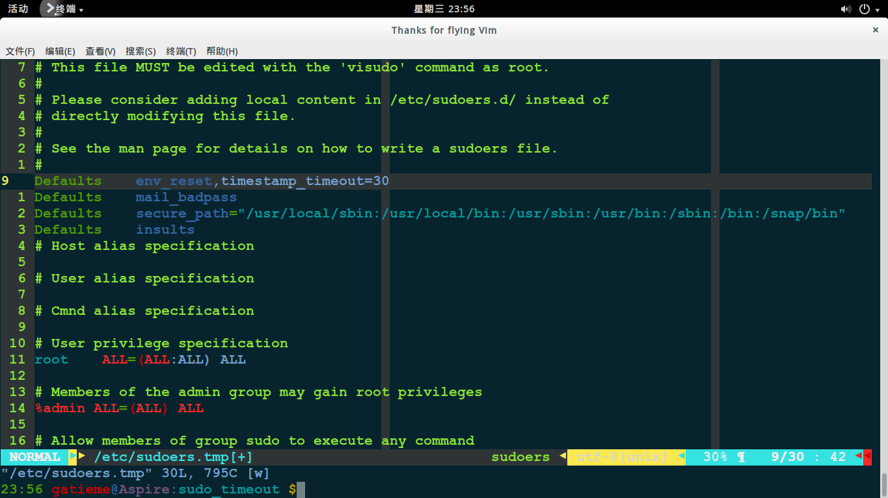
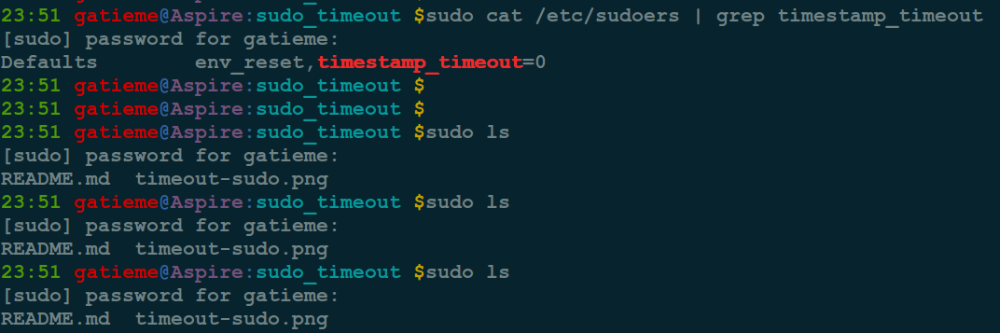
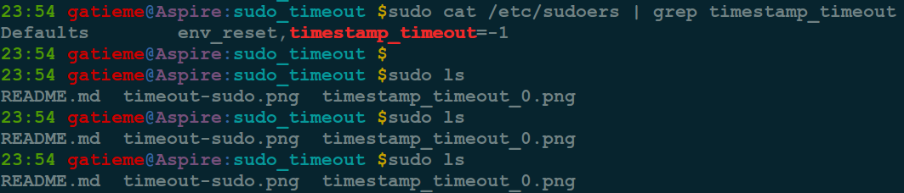

Linux设置sudo会话密码的超时时长
=======

| CSDN | GitHub |
|:----:|:------:|
| [Linux设置sudo会话密码的超时时长](http://blog.csdn.net/gatieme/article/details/71056020) | [`AderXCoding/system/tools/sudo_timeout`](https://github.com/gatieme/AderXCoding/tree/master/system/tools/sudo_timeout) |

<br>
<a rel="license" href="http://creativecommons.org/licenses/by-nc-sa/4.0/"></a>
本作品采用<a rel="license" href="http://creativecommons.org/licenses/by-nc-sa/4.0/">知识共享署名-非商业性使用-相同方式共享 4.0 国际许可协议</a>进行许可, 转载请注明出处, 谢谢合作
<br>


> `sudo` 命令是权限委派的命令, 可以为普通用户赋予 `root` 权限在实际应用中是非常常用的, 默认情况下 `sudo` 命令会话时间是 `5`分钟. 本文中, 我们将介绍在 `Ubuntu Linux` 中定制 `sudo` 密码会话超时的时间.


#1	`sudo` 的超时
-------

出于对系统安全问题的考虑, `Ubuntu` 系统一般在安装时就默认禁用`root` 帐号, 以 `sudo` 命令来代替所有需要管理员的操作.

在 `Ubuntu` 系统中, 默认的 `sudo timeout` 时间是 `5` 分钟, 但是有些用户觉得五分钟的时间太短, 每次都要输入密码也很麻烦. 那么, `Ubuntu` 系统中该如何修改 `sudo` 的默认 `timeout`时间呢?


#2	定制 sudo 超时时长
-------


要设置 `sudo` 密码超时值, 请使用 `passwd_timeout` 参数.


*	编辑 `/etc/sudoers`

首先使用超级用户打开 `/etc/sudoers`, 可使用`vim /etc/sudoers` 或者 `visudo` 命令打开 `/etc/sudoers` 文件, 如下所示 :

```cpp
sudo visudo
```

*	设置 `timeout` 时间

请找到下面行

>Defaults env_reset

改变此行为下面这样

>Defaults env_reset, timestamp_timeout=x

`x` 就是代表时间, 单位为分钟, 你可以设置为 `10` 或 `30` ，表示 `10` 分钟或半小时.




你可以以分钟设置为你所需的任何时间, 它会在超时之前一直等待.

*	如果要为每个执行的 `sudo` 命令弹出密码提示, 你也可以将时间设置为 `0`, 表示超时等待时间为 `0`, 则**每次使用 `sudo` 均要求输入密码**.





*	或者通过设置值 `-1`, 永久禁用密码提示. 这样当你在注销或退出 `terminal` 之前, 都会**记住密码**. 这时输入 `sudo -K`  就可以强制退出 `sudo`





#3	参考资料
-------

参照[Aaron Kili--How to Keep ‘sudo’ Password Timeout Session Longer in Linux](http://www.tecmint.com/set-sudo-password-timeout-session-longer-linux/), 
翻译geekpi, 校对：wxy, 译文 [如何在 Linux 中让 sudo 密码会话的超时更长些](https://linux.cn/article-8151-1.html)


<br>

<a rel="license" href="http://creativecommons.org/licenses/by-nc-sa/4.0/"></a>本作品采用<a rel="license" href="http://creativecommons.org/licenses/by-nc-sa/4.0/">知识共享署名-非商业性使用-相同方式共享 4.0 国际许可协议</a>进行许可, 转载请注明出处, 谢谢合作.
