终端的乐趣--Linux下有趣的终端命令或者工具
=======

| CSDN | GitHub |
|:----:|:------:|
| [终端的乐趣--Linux下有趣的终端命令或者工具](http://blog.csdn.net/gatieme/article/details/52144603) | [`system/tools/terminal`](https://github.com/gatieme/AderXCoding/tree/master/system/tools/terminal) |

#1  工具篇
-------

##1.1	tpp
-------


好,文艺程序员终极装X杀器来了!!!这是一个在终端上演示PPT的程序,要是哪天演讲的时候用它来展示,那真是狂拽酷炫叼炸天,分分钟惊艳全场!


那要怎么使用呢?
首先要安装:

>sudo apt-get install tpp

然后自己制作一个tpp演示文件,具体格式可在这里看到: [Nico Golde's website](http://www.ngolde.de/tpp.html)

这里贴一段我上面的tpp文件代码吧,这是一个最简单的tpp文件了

```cpp
--author Jiang Hang
--title A simple example
--date 2015.06.25
--bgcolor red
This is the abstract of this presentation.
It may consist of zero or more lines, and may be as long as you want.
--newpage agenda
--heading Agenda

  * Introduction

  * Concept

  * Implementation

  * Comparison with other implementations

  * Conclusions
--newpage intro
--heading Introduction

This is the introduction. And below, that's source code.

--beginoutput
#include <stdio.h>

int main(void) {
  puts("Hello World!");
  return 0;
}
--endoutput
```


##1.2	aview与jp2a
-------


你觉得在终端用ASCII 格式显示图片怎么样? 我们必须用 apt 或 yum 安装软件包 'aview'. (译者注: 'avieww' 不在 Fedora 的官方仓库中, 可以从 aview 的项目主页上下载源代码来安装. ) 在当前工作目录下有一个名为 'elephant.jpg' 的图片, 我想用 ASCII 模式在终端查看.


##1.3	slurm
-------


这是一个查看网络流量的一个工具.

安装后,先使用`iwconfig`查看网卡,

然后`slurm -i wlan0`

. -i后面的参数是网卡,回车后会出现下面的样子:

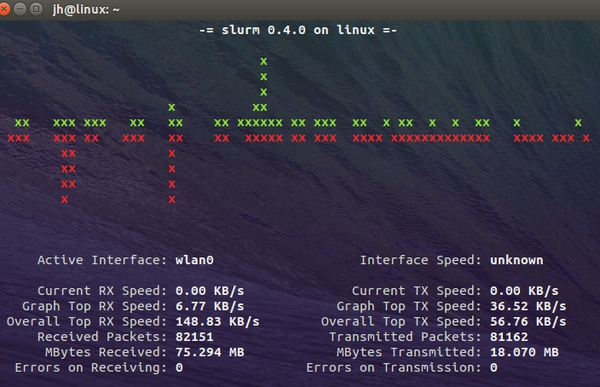

##1.4	iftop & iptraf
-------


再推荐两个查看网络流量的工具,iftop 和 iptraf :


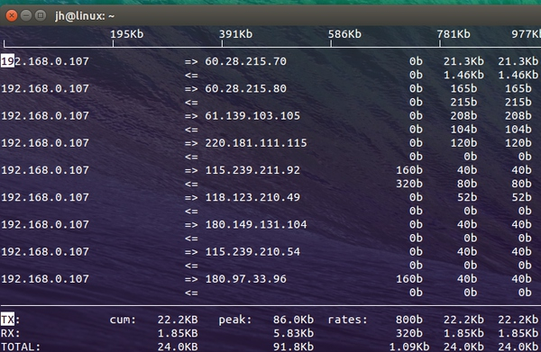


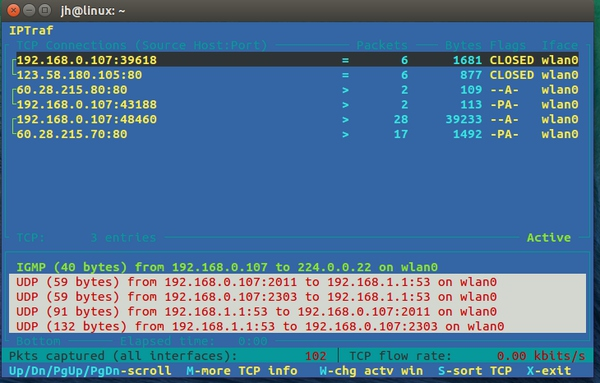

##1.5	htop & iotop

htop 和 iotop 用来查看进程，内存和IO负载

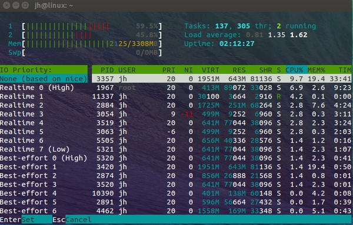


#2  有趣命令
-------

##2.1	sl (Steam Locomotive)蒸汽机
-------

看清楚了，不是ls，是‘sl’。

ls是linux命令最常用的一个命令，用来列表文件目录等。因为用的频繁，难免有着急打错的时候，一旦你敲成了`sl`，是，有些时候你可能会拼写成 ‘sl’ ,这时我们应该如何获得一些乐趣而不是看见“command not found”呢？

安装完`sl`, 会出现什么结果？后果很严重，是否还记得《盗梦空间》里突然一辆火车出现在梦境里的场景吗？这个命令的效果就是让你的屏幕上隆隆的驶过一辆蒸汽 机火车。有趣吧。


你可能了解 ‘ls’ 命令，并经常使用它来查看文件夹的内容。但
(In Debian like OS) 

>apt-get install sl 

(In Red Hat like OS)

>yum -y install sl 

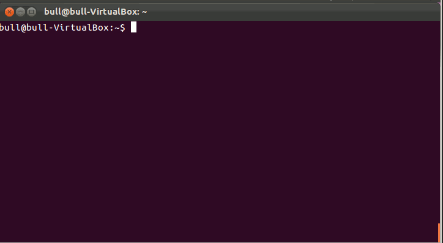


#2.2	cmatrix代码雨
-------


你可能看多好莱坞的电影‘黑客帝国’并陶醉于被赋予Neo的能看到在矩阵中任何事物的能力，或者你会想到一幅类似于‘Hacker’的桌面的生动画面。


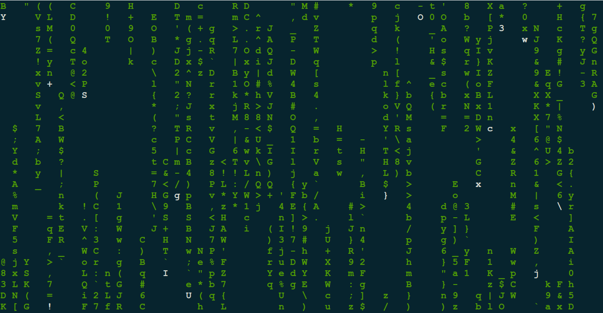


##2.3	linuxlogo
-------

这个大多数应该都知道吧
>sudo apt-get install linuxlogo


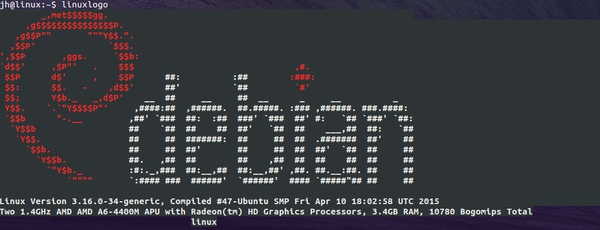


##2.4	love & fuck
-------


love, 赶紧试一下吧。很有爱啊

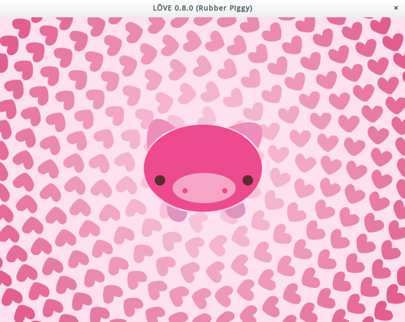


有个love自然就有fuck, 哈哈, fuck可比love实用多了


##2.5	figlet
-------

另一款在终端将字符进行图形化输出的软件.


##2.6	pv命令
-------

你也许曾经看到过电影里的模拟字幕, 它们好像是被实时敲打出来的. 如果我么能在终端里实现这样的效果, 那不是很好?
这是可以做到的. 

我们可以安装通过 'apt' 或者 'yum' 工具在 Linux 系统上安装 'pv' 命令. 安装命令如下.

[在基于 RedHat 的系统上]

>yum install pv

[在基于 Debian 的系统上]

>sudo apt-get install pv

'pv' 命令安装成功之后, 我们尝试运行下面的单行命令在终端查看实时文字输出的效果.

>echo "Tecmint[dot]com is a community of Linux Nerds and Geeks" | pv -qL 10


##2.7	toilet(厕所)命令
-------

有没有搞错，还有叫这个名字的命令？尽管这个名字本身就已经够搞笑了。那这个命令有什么特殊功能呢？肯定不是执行这个命令后你家马桶就能自动冲洗 了。它是能用字母拼写出更大字母的工具，具体拼出什么字由命令后面的参数决定，不仅如此，它还能打印出各种风格的效果，比如彩色，金属光泽等。


用单行脚本命令`toilet`在终端里显示一个添加边框的文本怎么样呢?

同样, 你必须保证`toilet`已经安装在你的电脑上.

如果没有的话, 请使用apt或yum安装.

(译者注: 'toilet' 并不在 Fedora 的官方仓库里, 你可以从 github 上下载源代码来安装)

>while true; do echo “$(date | toilet -f term -F border –Tecmint)”; sleep 1; done


或者

> toilet tecmint mmmmmmm " m # mmm mmm mmmmm mmm m mm mm#mm mmm mmm mmmmm # #" # #" " # # # # #" # # #" " #" "# # # # # #"""" # # # # # # # # # # # # # # # "#mm" "#mm" # # # mm#mm # # "mm # "#mm" "#m#" # # #


这个命令甚至提供了一些颜色和字体格式。

>toilet -f mono12 -F metal Tecmint.com

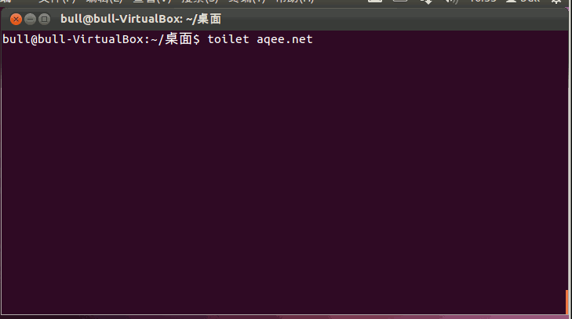
提示：Figlet 是另外一个与toilet产生的效果类似的命令。

##2.8	rig命令
-------


这个命令每次生成一个随机的身份信息和地址. 要运行这个命令, 你需要用apt或 yum 安装 'rig'.


##2.9	xeyes命令
-------

在上一篇文章中, 我们介绍了 'oneko' 命令, 它可以显示一个追随鼠标指针运动的小老鼠. 'xeyes' 是一个类似的图形程序, 当你运行它, 你可以看见小怪物的两个眼球追随你的鼠标运动.


##2.10	fortune
-------

试试你未知的运气，终端里有时也有好玩的。

>apt-get install fortune

##2.11	cowsay和xcowsay命令
-------

它可以显示一段预先确定的文本和一个字符构成的奶牛. 如果你想使用其它动物来代替奶牛怎么办? 查看可用的动物列表:


>cowsay -l


如何用ASCII描绘蛇吞象？


>cowsay -f elephant-in-snake Tecmint is Best


换作山羊又会怎样？


>cowsay -f gnu Tecmint is Best


其实让动物在终端里说话在Linux世界里有着悠久而辉煌的历史。下面这些真的是最应该知道的。

在用基于 Debian 的发行版? 试试输入“apt-get moo"。

>apt-get moo

想玩高端点的？你可以用管道把其他应用的输出放到 cowsay 中。试试`fortune | cowsay`, 非常有趣。

`xcowsay`是一个图形界面程序。它与cowsay类似只是以一种图形的方式来表达，可以说是X版本的cowsay。

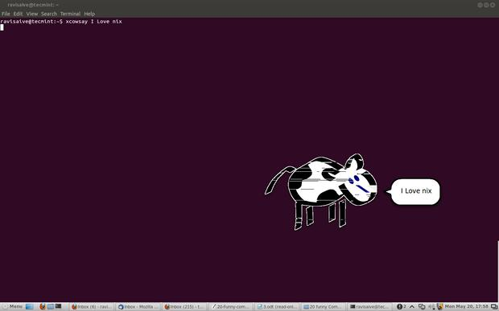


`cowthink`是另一个命令。运行`cowthink Linux is sooo funny`看看它与cowsay的不同吧。


##2.12  moo
-------

你今天咩咩了没有？呵呵


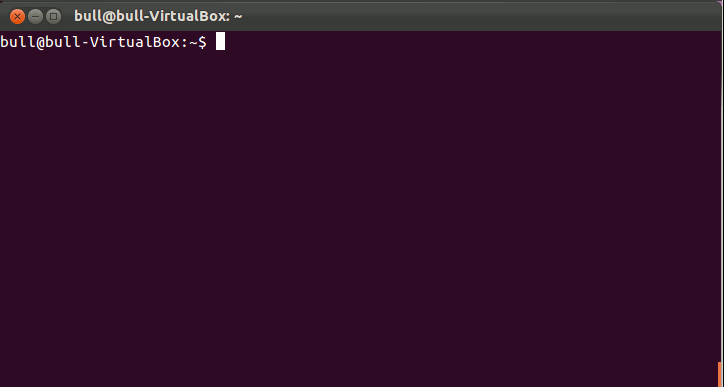


##2.13	sudo 请无情的侮辱我
-------


当你做错事时希望你的电脑骂你的人请举手。反正，我这样想过。试试这个：

输入`sudo visudo`以打开`sudoers`文件。在文件的开头你很可能会看见几行以"Defaults"开头的文字。在那几行后面添加"Defaults insults"并保存文件。

现在，只要你输错了你的 sudo 密码，你的系统就会骂你。这些可以提高自信的语句包括“听着，煎饼脑袋，我可没时间听这些垃圾。”，“你吃错药了吧？”以及“你被电过以后大脑就跟以前不太一样了是不是？”

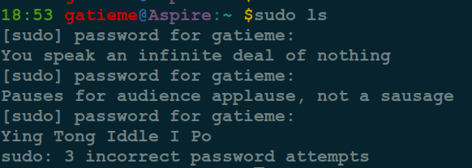


>apt-get insatll cowthink


##2.14	lolcat彩虹
-------


在你的Linux终端里有很多彩蛋真真是极好的……但是如果你还想要变得……更有魅力些怎么办？输入：lolcat。把任何一个程序的文本输出通过管道输入到lolcat里。你会得到它的超级无敌彩虹版。

把任何一个程序的文本输出通过管道输入到lolcat里。你会得到它的超级无敌彩虹版。


>echo "梦后楼台高锁，酒醒帘幕低垂。去年春恨却来时。落花人独立，微雨燕双飞.\n记得小苹初见，两重心字罗衣。琵琶弦上说相思。当时明月在，曾照彩云" |  lolcat


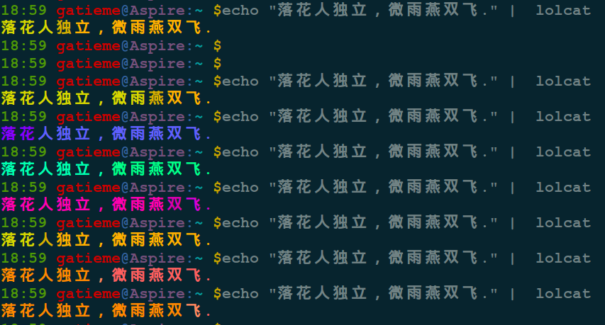

##2.15	Oneko追光标的小家伙
-------

接下来是"Oneko" -- 经典"Neko"的Linux移植版本。基本上就是个满屏幕追着你的光标跑的小猫。

虽然严格来它并不算是“彩蛋”，它还是很有趣的。而且感觉上也是很彩蛋的。


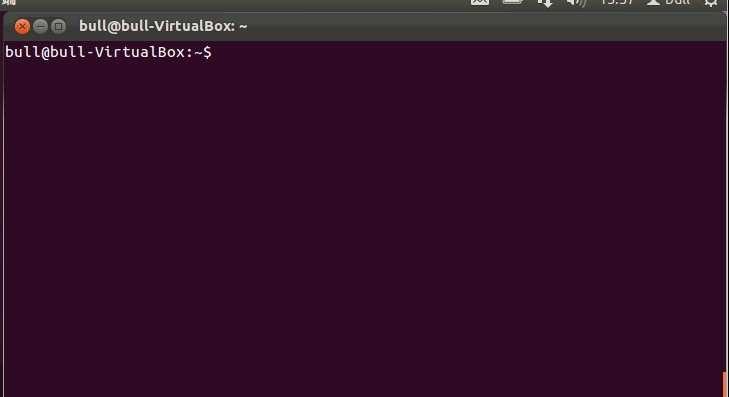

你还可以用不同的选项（比如“oneko -dog”）把小猫替代成小狗，或是调成其他样式。用这个对付讨厌的同事有着无限的可能。


##2.16	aafire燃烧的火焰
-------

有没有想过在你的黑白命令终端上燃起一团火将是什么样子，你只需要输入aafire命令，回车，奇迹就会出现。

>sudo apt-get install libaa-bin

执行效果
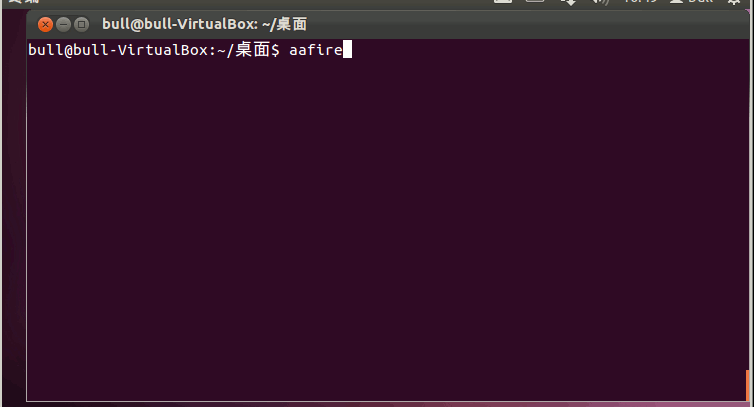


##2.17	ASCIIquarium
-------

ASCIIquarium

这真是一个不可思议的杰作，你的linux终端窗口竟然成了水族馆，里面有水，有石、有鱼、有兽。不多说，自己欣赏一下吧。

```cpp
cd /tmp
wget http://www.robobunny.com/projects/asciiquarium/asciiquarium.tar.gz
tar -zxvf asciiquarium.tar.gz
cd asciiquarium_1.1/
cp asciiquarium /usr/local/bin
chmod 0755 /usr/local/bin/asciiquarium
```


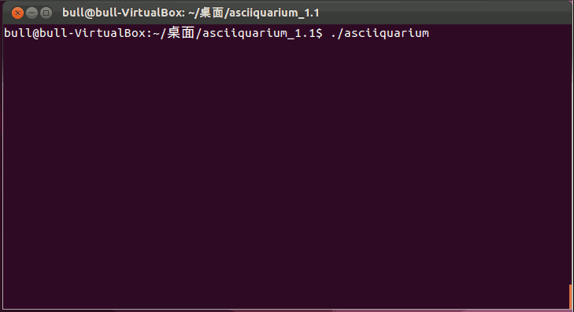


##2.18	ddate精心调制的混搭日历
-------

是否厌倦了千百年不变的 Gregorian Calendar(罗马教历)？准备好乱入了吗？

试试输入"ddate", 这样会把当前日历以Discordian Calendar（不和教历）的方式显示出来。你会遇见这样的语句：

>今天是Sweetmorn（甜美的清晨），3181年Discord（不和）季的第18天。”


##2.19	nmap快速进入黑客行话模式
-------

想不想尝试一下电影里超级黑客的感觉?

试试（通过添加"-oS"）把扫描器设置成"Script Kiddie"模式。然后所有的输出都会变成最3l33t的黑客范。

例如

>nmap -oS - google.com

赶快试试。我知道你有多想这么做。你一定会让安吉丽娜·朱莉（Angelina Jolie）印象深刻

##2.20  yes
-------

`yes`是一个非常有趣又有用的命令，尤其对于脚本编写和系统管理员来说，它可以自动地生成预先定义的响应或者将其传到终端


##2.21	bb

自己在命令行窗口里输入bb，看看会发生什么情况。

一款有意思的音乐播放器

>sudo apt-get install bb

执行效果

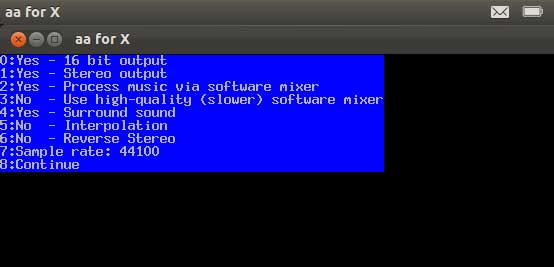


##2.22	rev
-------

字符串翻转.

##2.23	pi
-------

输出pi后面任意长度小数位数.

```cpp
pi 50
3.1415926535897932384626433832795028841971693993751
```

##2.24	乘法表
-------

> for i in {1..9}; do for j in $(seq 1 $i); do echo -ne $i×$j=$((i*j))\\t;done; echo;done

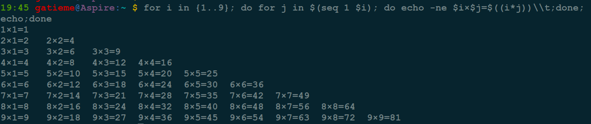

>for i in {1..12}; do for j in $(seq 1 $i); do echo -ne $i×$j=$((i*j))\\t;done; echo;done


##2.25	screenfetch
-------

screenfetch, 它可以在终端上生成漂亮的文本系统信息和ASCII艺术的发行版LOGO.

使用命令克隆screenFectch库:

>git clone git://github.com/KittyKatt/screenFetch.git screenfetch

复制文件到/usr/bin/目录，并设置执行权限:

>cp screenfetch/screenfetch-dev /usr/bin/screenfetch
>
>chmod +x /usr/bin/screenfetch

运行screenFectch:
screenfetch


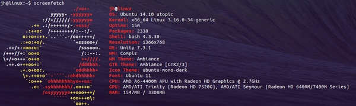


##2.26	Fork炸弹
-------

这是一段非常欠抽的代码。运行这个命令的后果自己负责。这个命令其实是一个fork炸弹，它会以指数级的自乘，直到所有的系统资源都被利用了或者系统挂起(想要见识这个命令的威力你可以试一次这个命令，但是后果自负，记得在运行它之前关掉并保存其它所有程序和文件)。


##2.27	while
-------

下面的”while“命令是一个脚本，这个脚本可以为你提供彩色的日期和文件直到你按下中断键(ctrl+c)。复制粘贴这个命令到你的终端。

>while true; do echo "$(date '+%D %T' | toilet -f term -F border --gay)"; sleep 1; done

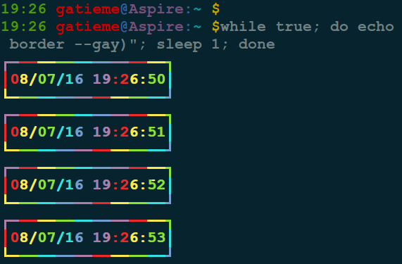

##2.28	espeak
-------


该命令可以阅读所输入的英语字符.

将你的多媒体音箱的音量调到最大，然后在将这个命令复制到你的终端，来看看你听到上帝的声音时的反应吧。


>espeak 'hell, world'

##2.29	Firefox 是个厚脸皮
-------

这一个不需要终端！太棒了！

打开火狐浏览器。在地址栏填上`about:about`, 你将得到火狐浏览器中所有的"about"页, 一点也不炫酷，是不是？

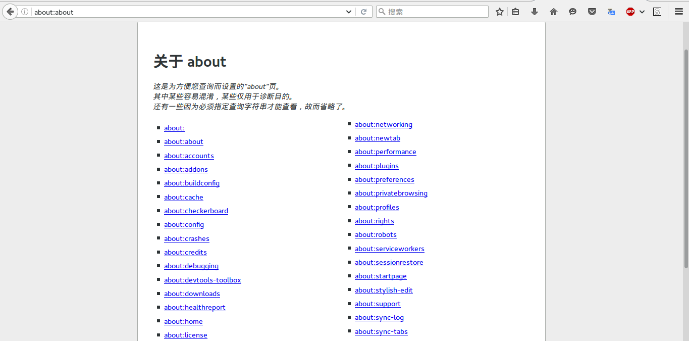

现在试试`about:mozilla`, 浏览器就会回应你一条从"Book of Mozilla（Mozilla 之书）"——这本浏览网页的圣经——里引用的话。

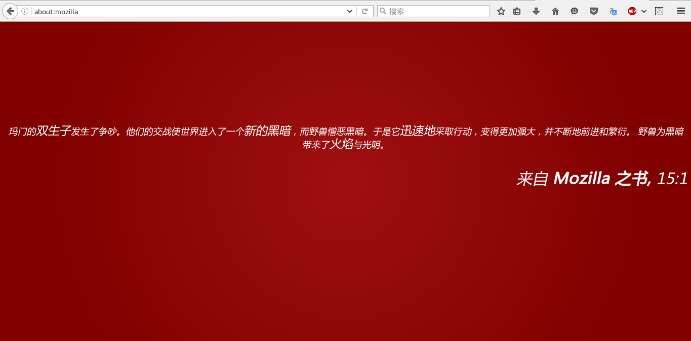

我的另一个最爱是`about:robots`, 这个也很有趣。


##2.30	hollywood好莱坞大片风格的终端既视感
-------

相信各位一定对好莱坞大片中电脑高手那闪现的屏幕印（tu）象（cao）深（bu）刻（neng），现在您也可以在自己的电脑上模拟这个场景了。

来自 Ubuntu 的 Dustin Kirkland 利用一个长途飞行的时间，编写了这个炫酷、有趣但也没什么实际作用的软件。不管怎样，现在您有了一个可以模拟电影中模拟黑客的软件了。

这个名为 hollywood 的小软件需要在 byobu 运行以取得最佳效果。

Ubuntu 下的安装方法：

```cpp
sudo apt-add-repository ppa:hollywood/ppa
sudo apt-get update
sudo apt-get install hollywood
sudo apt-get install byobu
```


[视频演示](https://www.youtube.com/watch?v=rVMn3xk5mcY)（[朝内镜像](http://v.youku.com/v_show/id_XODUyNTY1MjIw.html)，有 M.I. 的主题音乐哦～）

[项目首页及源代码下载](https://launchpad.net/hollywood)


byobu为了展示出黑客的feel, 附带了一系列的工具

| 工具 | 描述 |
|:---:|:----:|
| ccze | 安装实时检测网络带宽的小工具bmon |
| ccze | 为log日志记录颜色的小工具 |
| jp2a | 把图片转换成 ASCII字符 |
| speedometer | LINUX终端下的网络监测工具 |
| moreutils | 工具集合 |

```cpp
  - chronic: runs a command quietly unless it fails
  - combine: combine the lines in two files using boolean operations
  - errno: look up errno names and descriptions
  - ifdata: get network interface info without parsing ifconfig output
  - ifne: run a program if the standard input is not empty
  - isutf8: check if a file or standard input is utf-8
  - lckdo: execute a program with a lock held
  - mispipe: pipe two commands, returning the exit status of the first
  - parallel: run multiple jobs at once
  - pee: tee standard input to pipes
  - sponge: soak up standard input and write to a file
  - ts: timestamp standard input
  - vidir: edit a directory in your text editor
  - vipe: insert a text editor into a pipe
  - zrun: automatically uncompress arguments to command
```


#3	游戏
-------

##3.1	2048
-------


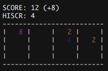

##3.2	俄罗斯方块：bsdtris
-------


##3.3	RPG游戏：nethack
-------

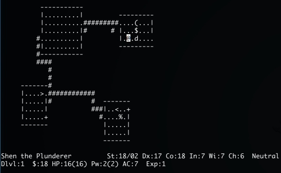

##3.4	星球大战
-------

telnet towel.blinkenlights.nl

>telnet towel.blinkenlights.nl

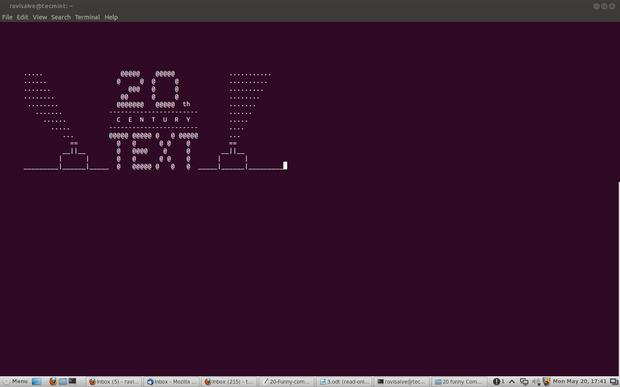
