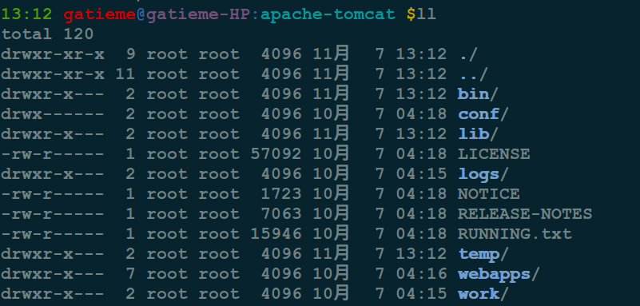
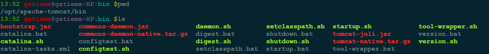
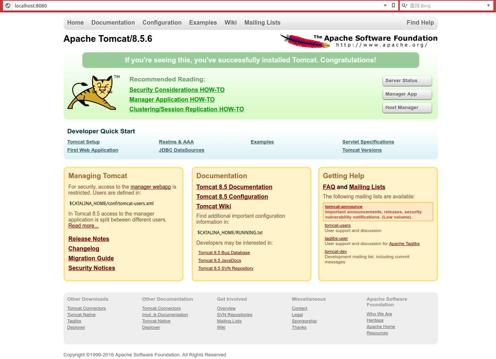
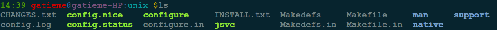

AderXCoding
=======

| CSDN | GitHub |
|:----:|:------:|
| [Aderstep--紫夜阑珊-青伶巷草](http://blog.csdn.net/gatieme) | [`AderXCoding/system/tools`](https://github.com/gatieme/AderXCoding/tree/master/system/tools) |


<br>
<a rel="license" href="http://creativecommons.org/licenses/by-nc-sa/4.0/"></a>
本作品采用<a rel="license" href="http://creativecommons.org/licenses/by-nc-sa/4.0/">知识共享署名-非商业性使用-相同方式共享 4.0 国际许可协议</a>进行许可, 转载请注明出处
<br>


#1	tomcat介绍
-------

`Tomcat` 是由 `Apache Foundation` 研发用于支持 `JSP(Java Server Page)` 的网络服务软件.


#2	安装tomcat
-------

##2.1	源方式(不推荐)
-------

`Ubuntu14.04` 的源中包含了 `tomcat 6/7` 两个版本, 大家可以选择任意一个进行安装.


*	安装 `Tomcat`

```cpp
sudo apt-get install tomcat6
```

或者

```cpp
sudo apt-get install tomcat7
```

稍等片刻, `Tomcat6` 即会被自动安装在 `/usr/share/tomcat6` 的目录中

设置 `Tomcat` 运行的 `JAVA` 环境
首先请确保 `Oracle/Sun` 的 `Java Development Toolkit` 已经安装.

如果尚未安装，参照[Java-Ubuntu中文](http://wiki.ubuntu.com.cn/Java)或者[Ubuntu安装JDK详解](http://blog.csdn.net/gatieme/article/details/52723931)

*	启动和停止Tomcat

要启动Tomcat，运行

```cpp
sudo /etc/init.d/tomcat6 start
```
此时打开浏览器，在地址栏内输入
http://localhost:8080

要停止Tomcat，运行

```cpp
sudo /etc/init.d/tomcat6 stop
```

*	`Tomcat` 配置文件路径

```cpp
Tomcat home directory : /usr/share/tomcat6
Tomcat base directory : /var/lib/tomcat6或/etc/tomcat6
```

*	设置Tomcat管理员帐号

`Tomcat` 的用户帐号信息都保存在 `tomcat-users.xml` 的文件中, 运行

```cpp
sudo nano /var/lib/tomcat6/conf/tomcat-users.xml
```

在</tomcat-users>的标签前添加一行

```cpp
<user username="用户名" password="密码" roles="admin,manager"/>
```

保存并关闭. 重新运行 `tomcat` 即可输入该用户名和密码，登录Tomcat的管理页面.

*	弊端

`Ubuntu` 默认把 `Tomcat` 分到2个目录, 在之后配置 `Eclipse Server` 时会把人逼疯的, 配置哪个路径都不对, `Eclipse` 无法识别安装的`Tomcat`.

解决方案：

```cpp
sudo ln -s /var/lib/tomcat6/conf /usr/share/tomcat6/conf
sudo ln -s /etc/tomcat6/policy.d/03catalina.policy /usr/share/tomcat6/conf/catalina.policy
sudo ln -s /var/log/tomcat6 /usr/share/tomcat6/log
sudo chmod -R 777 /usr/share/tomcat6/conf
```


##2.2	下载安装最新版本的Tomcat
-------

###2.2.1	官网的tomcat版本
-------


这种方法绕过 `Ubuntu` 自身的包管理器, 直接从 `Apache Tomcat` 的主页上下载并使用 `Tomcat` 软件, 该方法方便快捷的安装旧版或新测试版 `Tomcat` 而并不影响系统的稳定性, 轻松自在.

从 `tomcat` 的官方下载页面, 目前官网上提供如下几个版本以供下载

| 版本 | Documentation | Download |
|:---:|:----:|
| 6.0 | [tomcat-6.0-doc](http://tomcat.apache.org/tomcat-6.0-doc/index.html) | [download-60](http://tomcat.apache.org/download-connectors.cgi) |
| 7.0.72 | [tomcat-7.0-doc](http://tomcat.apache.org/tomcat-7.0-doc/index.html) | [download-70](http://tomcat.apache.org/download-70.cgi) |
| 8.0.38 | [tomcat-8.0-doc](http://tomcat.apache.org/tomcat-8.0-doc/index.html) | [download-80](http://tomcat.apache.org/download-80.cgi) |
| 8.5.6 | [tomcat-8.5-doc](http://tomcat.apache.org/tomcat-8.5-doc/index.html) | [download-80](http://tomcat.apache.org/download-80.cgi) |
| 9.0.0 | [tomcat-9.0-doc](http://tomcat.apache.org/tomcat-9.0-doc/index.html) | [download-90](http://tomcat.apache.org/download-90.cgi)

###2.2.2	下载安装 `tomcat 8.5.6`
-------


我选择下载了 `Tomcat 8.5.6` 版本.


下载 `8.5.6->Binary Distributions->Core` 分类中的 `zip` 或者 `tar.gz`包后, 本地解压缩并将新生成的目录重命名为`tomcat`, 以方便使用.

将这个文件夹移动至某路径`PATH`, 比如我以调动到了 `/opt/tomcat`, 参考以上设置环境变量和端口设置等步骤, 大功告成!

```cpp
tar -zxvf apache-tomcat-8.5.6.tar.gz -C /opt
cd /opt/apache-tomcat
```

###2.2.3	权限问题
-------

> **注意**
>
> 解压缩完以后发现, 有些目录 `cd` 没有权限
>
> 
>  ll发现是没有, 运行权限的
> 
>
> `linux`下
> `ls` 某文件夹需要文件夹有 `r` 读权限.
> `cd` 某文件夹 需要文件夹有 `x` 运行权限
>
> 则运行如下命令为他们增加运行权限即可
> ```cpp
> chmod +x ./*
> ```
>
> 同样想要运行bin下的脚本也需要运行权限, 因此
> ```cpp
> chmod +x ./bin/*.sh
> ```


###2.2.4	配置和运行
-------

`bin` 下存储了我们运行和配置 `tomcat` 所需要的脚本信息



| 脚本 | 描述 |
|:---:|:---:|
| daemon.sh | 守护进程(服务)的方式启动和关闭`tomcat`, 以`jsvc`管理`tomcat`, `jsvc`可以由`commons-daemon-native.tar.gz`编译出 |
| setclasspath.sh | 设置JAVA运行环境 |
| startup.sh | 启动tomcat |
| shutdown.sh | 关闭tomcat |
| version.sh | 显示版本信息 |
| configtest.sh | |
| tool-wrapper.sh | |
| digest.sh | |

*	配置JAVA环境变量

首先我们需要为tomcat配置JAVA的环境变量, 直接写到 `setclasspath.sh` 文件的开头即可, 我写入的内容如下所示


```cpp
#---------------------
# java path
#---------------------
JAVA_HOME=/usr/lib/jvm/java-8-oracle
JRE_HOME=$JAVA_HOME/jre
JAVA_BIN=$JAVA_HOME/bin
CLASSPATH=.:$JAVA_HOME/lib/dt.jar:$JAVA_HOME/lib/tools.jar:$JRE_HOME/lib
PATH=$PATH:$JAVA_HOME/bin:$JRE_HOME/bin
export JAVA_HOME JRE_HOME PATH CLASSPATH
```


*	直接运行

```cpp
./startup.sh 
```

*	关闭

```cpp
./shutdown.sh
```

打开http://localhost:8080




#2.2.5   配置启动脚本
-------


之前我们都可以将tomcat直接作为服务, 但是这种方式的tomcat, 没有服务脚本, 那么我们可以自己做一个

```cpp
#!/bin/sh
#
# /etc/init.d/tomcat8 -- startup script for the Tomcat 6 servlet engine
#
# Written by Miquel van Smoorenburg <miquels@cistron.nl>.
# Modified for Debian GNU/Linux	by Ian Murdock <imurdock@gnu.ai.mit.edu>.
# Modified for Tomcat by Stefan Gybas <sgybas@debian.org>.
# Modified for Tomcat6 by Thierry Carrez <thierry.carrez@ubuntu.com>.
# Modified for tomcat8 by Ernesto Hernandez-Novich <emhn@itverx.com.ve>.
# Additional improvements by Jason Brittain <jason.brittain@mulesoft.com>.
#
### BEGIN INIT INFO
# Provides:          tomcat8
# Required-Start:    $local_fs $remote_fs $network
# Required-Stop:     $local_fs $remote_fs $network
# Should-Start:      $named
# Should-Stop:       $named
# Default-Start:     2 3 4 5
# Default-Stop:      0 1 6
# Short-Description: Start Tomcat.
# Description:       Start the Tomcat servlet engine.
### END INIT INFO

set -e

PATH=/bin:/usr/bin:/sbin:/usr/sbin
NAME=tomcat8
DESC="Tomcat servlet engine"

if [ `id -u` -ne 0 ]; then
	echo "You need root privileges to run this script"
	exit 1
fi

# Make sure tomcat is started with system locale
if [ -r /etc/default/locale ]; then
	. /etc/default/locale
	export LANG
fi

. /lib/lsb/init-functions

if [ -r /etc/default/rcS ]; then
	. /etc/default/rcS
fi


case "$1" in
  start)
	log_daemon_msg "Starting $DESC" "$NAME"
	sh /opt/apache-tomcat/bin/startup.sh
	;;
  stop)
	log_daemon_msg "Stopping $DESC" "$NAME"
    sh /opt/apache-tomcat/bin/shutdown.sh
	;;
   status)
	set +e
	if [ "$?" = "0" ]; then

		if [ -f "$CATALINA_PID" ]; then
		    log_success_msg "$DESC is not running, but pid file exists."
			exit 1
		else
		    log_success_msg "$DESC is not running."
			exit 3
		fi
	else
		log_success_msg "$DESC is running with pid `cat $CATALINA_PID`"
	fi
	set -e
        ;;
  restart|force-reload)
	$0 stop
	sleep
	$0 start
	;;
  *)
	log_success_msg "Usage: $0 {start|stop|restart|status}"
	exit 1
	;;
esac

exit 0
```


###2.2.6	高级配置之jsvc启动
-------


```cpp
sudo apt-get install jsvc
```

或者直接用tomcat自带的源码包进行编译

```cpp
tar -zxvf commons-daemon-native.tar.gz
cd commons-daemon-1.0.15-native-src/unix
./configure  --with-java=$JAVA_HOME
make
```



https://segmentfault.com/a/1190000000760273
http://calvinliu.iteye.com/blog/1122974


<a rel="license" href="http://creativecommons.org/licenses/by-nc-sa/4.0/"></a>
<br>
本作品采用<a rel="license" href="http://creativecommons.org/licenses/by-nc-sa/4.0/">知识共享署名-非商业性使用-相同方式共享 4.0 国际许可协议</a>进行许可


