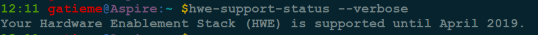
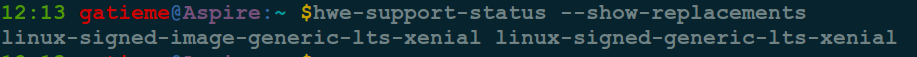
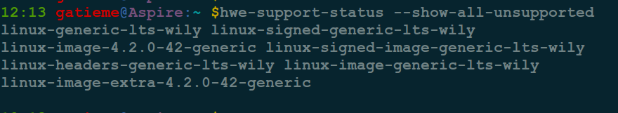
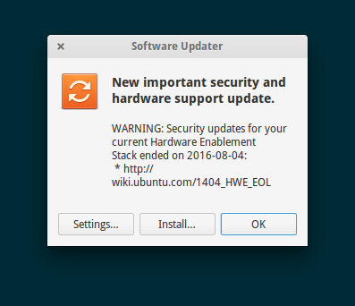
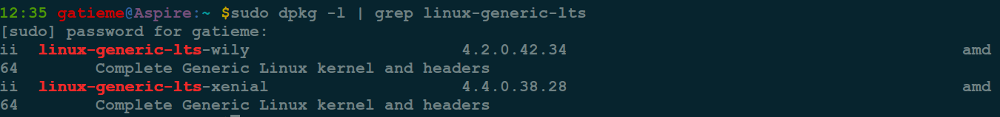

Ubuntu14.04更新硬件实现堆栈(HWE)
=======

| CSDN | GitHub |
|:----:|:------:|
| [Ubuntu14.04.4升级硬件实现堆栈(HWE)到14.04.5(Xenial Kernel-v4.4)](http://blog.csdn.net/gatieme/article/details/52744417) | [`AderXCoding/system/tools/ubuntu_hwe_upgrade`](https://github.com/gatieme/AderXCoding/tree/master/system/tools/ubuntu_hwe_upgrade)


之前使用的一直是Ubuntu14.04.4(Kernel 4.2), 现在Ubuntu16.04已经发布好几个月了, 但是为了稳定一直没更新, 前段时间看到Ubuntu 14.04.5发布了, 本次发布主要更新升级了硬件实现堆栈(HWE)

本次发布三大亮点：

*	更多更好的硬件支持

*	稳定更新，减少软件包的下载更新

*	保持系统稳定

*	详细的发布信息，可查看发布说明：

https://wiki.ubuntu.com/TrustyTahr/ReleaseNotes/ChangeSummary/14.04.5

下载地址：http://releases.ubuntu.com/trusty/


参照


| 参照 | 描述 |
|:---:|:---:|
| [1404_HWE_EOL](https://wiki.ubuntu.com/1204_HWE_EOL) | 详细的讲解了Ubuntu 14.04 HWE的信息 |
| [LTSEnablementStack](https://wiki.ubuntu.com/Kernel/LTSEnablementStack) | 详解的讲解了如何升级Ubuntu HWE |
| [
求助Ubuntu14.04.5 LTS软件源中提示hardware enablement stack升级的问题](http://forum.ubuntu.org.cn/viewtopic.php?p=3174908) | 如何升级14.04.4到14.04.5 |


#1  背景
-------

之前更新Ubuntu内核, 往往使用如下两个命令

| 更新 | 描述 |
|:----:|:----:|
| apt-get upgrade | 系统将现有的Package升级,如果有相依性的问题,而此相依性需要安装其它新的Package或影响到其它Package的相依性时,此Package就不会被升级,会保留下来 |
| apt-get dist-upgrade | 可以聪明的解决相依性的问题,如果有相依性问题,需要安装/移除新的Package,就会试着去安装/移除它. (所以通常这个会被认为是有点风险的升级) |


**upgrade 和 dist-upgrade 的区别**

apt-get upgrade 和 apt-get dist-upgrade 本质上是没有什么不同的。


只不过, `dist-upgrade`会识别出当依赖关系改变的情形并作出处理, 而`upgrade`对此情形不处理.

例如软件包 a 原先依赖 b c d，但是在源里面可能已经升级了，现在是 a 依赖 b c e。这种情况下，dist-upgrade 会删除 d 安装 e，并把 a 软件包升级，而 upgrade 会认为依赖关系改变而拒绝升级 a 软件包


**内核的升级**

使用dist-upgrade可能会升级内核, 但是内核的主版本号不会变, 只是不断在修订和修复bug.


就比如我系统安装的时候, 安装的是Ubuntu14.04.4, 系统的内核使用的是Linux-4.2.0的内核, 那么我更新之后, 内核可能从4.2.0-36到4.2.0-44, 但是内核版本没有变动

如果我想升级系统的内核, 那么只有如下几种方法


*   升级系统版本(比如14.04升级到16.04)

*   自己下载并编译新的内核

*   升级Ubuntu硬件实现栈

其中前两种方法不推荐, 自己新编译的内核，可能会导致某些开发库因为没有相应的适配所以无法正常使用, 同样Ubuntu跨版本升级, 往往导致很多兼容性问题, 请谨慎升级. 相比较来说, 升级硬件实现栈HWE则相对来说安全很多


#2	Ubuntu硬件实现栈HWE介绍
-------


Ubuntu硬件实现栈(HWE)是一个功能旨在提供硬件支持, 实现了在Ubuntu的新版本提供了Ubuntu的LTS版本. 这些硬件实现栈纳入安装选择Ubuntu LTS(长期支持)媒体发布. 硬件实现栈本身是由更新内核和图形叠加.

我们知道Ubuntu每隔半年会发布一个新版本, 然后每隔两年会发布一个LTS长期支持版, 发布的版本号往往用"年份.月份"来命名


```cpp
*   2004年发行第一个版本4.10

*   2005年4月发行第二个版本5.04

*   2005年10月发行第三个版本5.10

*   2006年6月发行第四个版本6.06 LTS  2

*   2006年10月发行第五个版本6.10

*   2007年4月发行第六个版本7.04

......

*   2016年四月发布16.04 LTS
```


每个LTS长期支持版的维护的周期都很长, 但是Ubuntu发布的周期又很快, 每个版本都重新维护很麻烦, 所以开发人员提供硬件实现栈HWE, 这样LTS可以使用主线版本的内核信息, 维护起来很方便


按惯例, Ubuntu 14.04 的第一个HWE 将使用Ubuntu 14.10内核, 版本更新为14.04.1, Ubuntu 16.04 的第一个 HWE 将使用 Ubuntu 16.10 内核, 版本为14.04.1, 正常来说如果第一个HWE版本被释放, 我们就可以认为此版本LTS已经趋于稳定了

>**参见**
>
>https://wiki.ubuntu.com/Kernel/LTSEnablementStack

下表将Ubuntu 14.04.x LTS的对应的硬件实现栈和EOL日期

| Ubuntu 14.04.x LTS Point Release | HWE Stack | EOL Date |
|:-------:|:-------:|:-------:|
| 14.04.1 | N/A | N/A |
| 14.04.2 | Ubuntu 14.10 Utopic HWE Stack (v3.16 kernel) | Aug 4, 2016 |
| 14.04.3 | Ubuntu 15.04 Vivid HWE Stack (v3.19 kernel) | Aug 4, 2016 |
| 14.04.4 | Ubuntu 15.10 Wily HWE Stack (v4.2 kernel) | Aug 4, 2016 |
| 14.04.5 | Ubuntu 16.04 Xenial HWE Stack (v4.4. Kernel) | April, 2019 |

我们可以看到14.04.4的支持和维护已经终止了(Aug 4, 2016 ), 但是14.04.5将采用16.04的新内核, 并最终维护到2019年, 所以还等什么呢, 速度升级吧.

你可以使用如下命令检查系统安装时的信息

```cpp
cat /var/log/installer/media-info
```


#3	升级HWE
-------


首先我们明确一点, 我们仅是升级Ubuntu14.04的HWE, 并不将14.04升级成16.04, 主要考虑的原因是16.04仍然不够稳定, 而且如果想要升级的话, 我们不如直接重新安装16.04系统, 使用更新管理器直接升级的话, 会有很多兼容性问题, 而且升级失败进不了系统的比比皆是, 相比较来说升级HWE则相对安全很多


##3.1	查看你的HWE的基本信息
-------


`hwe-support-status`命令行实用程序可以用来查看我们系统支持的状况, 在更新管理器核心包在Ubuntu 14.04提供. 它包括由其他更新管理器使用的中央逻辑和更新通知提醒我们EOL通知用户.


查看你的HWE的EOL支持日期

```cpp
hwe-support-status --verbose
```





如果您想查看你升级HWE的过程中那些包将会升级, 请使用如下命令
To determine which packages to upgrade use:

```cpp
hwe-support-status --show-replacements
```





如果您想查看那么包将不再支持(这些包通常是旧的内核的包)
To find out what packages are unsupported run:

```cpp
hwe-support-status --show-all-unsupported
```




##3.2	升级HWE
-------

DESKTOP桌面版, 请使用如下命令升级

```cpp
sudo apt-get install --install-recommends linux-generic-lts-xenial xserver-xorg-core-lts-xenial xserver-xorg-lts-xenial xserver-xorg-video-all-lts-xenial xserver-xorg-input-all-lts-xenial libwayland-egl1-mesa-lts-xenial
```


MULTIARCH DESKTOP桌面版, 请使用如下命令升级

>If you run a multiarch desktop (for example, i386 and amd64 on amd64, for gaming or Wine), you may find you need a slightly more involved command, like this:


```cpp
sudo apt-get install --install-recommends linux-generic-lts-xenial xserver-xorg-core-lts-xenial xserver-xorg-lts-xenial xserver-xorg-video-all-lts-xenial xserver-xorg-input-all-lts-xenial libwayland-egl1-mesa-lts-xenial libgl1-mesa-glx-lts-xenial libgl1-mesa-glx-lts-xenial:i386 libglapi-mesa-lts-xenial:i386
```

SERVER服务器版, 请使用如下命令升级

>Install the HWE kernel derived from 16.04 (xenial):

```cpp
sudo apt-get install --install-recommends linux-generic-lts-xenial
```


当然您也可以运行更新管理器, 让系统检查并提示您升级


```cpp
sudo rm /var/lib/update-notifier/disable-hwe-eol-messages
hwe-support-status
update-manager
```

然后一般会提示类似如下的对话框, 软件源提示"New important security and hardware support update."





Ubuntu14.04的主线支持信息和内核版本, 如下图所示


##3.3	验证EOL
-------


最后使用查看自己的HWE的EOL信息

```cpp
hwe-support-status --verbose
```


可以看到我们的支持日期是2019年


查看系统中的内核镜像信息

```cpp
sudo dpkg -l | grep linux-generic-lts
```




可以看到系统中安装了linux-generic-lts-xenial-4.4.0.38.28的内核


##3.4	卸载旧的HWE
-------

如果不确定新的HWE是否安装成功, 请慎用此命令

```cpp
sudo apt-get remove $(hwe-support-status --show-all-unsupported)
```


##3.5	使用新的HWE并验证
-------

一般来说安装好后重启, 系统会自己加载新的内核镜像, 如果没有加载可手动生成grub.cfg的信息, 参见[Ubuntu下grub配置详解](http://blog.csdn.net/gatieme/article/details/52722955)


如果grub没有被更新, 手动更新grub

```cpp
sudo update-grub
```

如果grub.cfg没有被生成, 使用如下命令手动生成

```cpp
grub-mkconfig -o /boot/grub/grub.cfg
```


然后reboot重新启动, 然后使用`uname -r`查看内核版本,　看到现在系统的内核是Linux-4.4


`lsb_release -a`查看系统的信息, 可以看到现在系统升级为`14.04.5`

