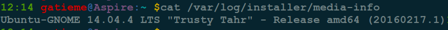
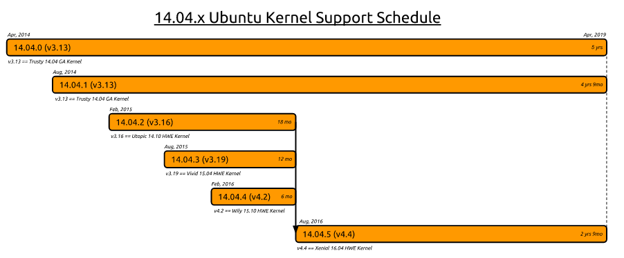
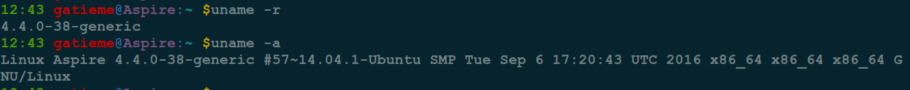

Ubuntu14.04更新硬件实现堆栈(HWE)
=======


之前使用的一直是Ubuntu14.04.4(Kernel 4.2), 现在Ubuntu16.04已经发布好几个月了, 但是为了稳定一直没更新, 前段时间看到Ubuntu 14.04.5发布了, 本次发布主要更新升级了硬件实现堆栈(HWE)

本次发布三大亮点：

*	更多更好的硬件支持

*	稳定更新，减少软件包的下载更新

*	保持系统稳定

*	详细的发布信息，可查看发布说明：

https://wiki.ubuntu.com/TrustyTahr/ReleaseNotes/ChangeSummary/14.04.5

下载地址：http://releases.ubuntu.com/trusty/


参照


| 参照 | 描述 |
|:---:|:---:|
| [1404_HWE_EOL](https://wiki.ubuntu.com/1204_HWE_EOL) | 详细的讲解了Ubuntu 14.04 HWE的信息 |
| [LTSEnablementStack](https://wiki.ubuntu.com/Kernel/LTSEnablementStack) | 详解的讲解了如何升级Ubuntu HWE |
| [](http://forum.ubuntu.org.cn/viewtopic.php?p=3174908) | 如何升级14.04.4到14.04.5 |


#1	HWE介绍
-------


Ubuntu硬件实现栈(HWE)是一个功能旨在提供硬件支持, 实现了在Ubuntu的新版本提供了Ubuntu的LTS版本. 这些硬件实现栈纳入安装选择Ubuntu LTS(长期支持)媒体发布. 硬件实现栈本身是由更新内核和图形叠加.


下表将Ubuntu 14.04.x LTS的对应的硬件实现栈和EOL日期

| Ubuntu 14.04.x LTS Point Release | HWE Stack | EOL Date |
|:-------:|:-------:|:-------:|
| 14.04.1 | N/A | N/A |
| 14.04.2 | Ubuntu 14.10 Utopic HWE Stack (v3.16 kernel) | Aug 4, 2016 |
| 14.04.3 | Ubuntu 15.04 Vivid HWE Stack (v3.19 kernel) | Aug 4, 2016 |
| 14.04.4 | Ubuntu 15.10 Wily HWE Stack (v4.2 kernel) | Aug 4, 2016 |
| 14.04.5 | Ubuntu 16.04 Xenial HWE Stack (v4.4. Kernel) | April, 2019 |

我们可以看到14.04.4的支持和维护已经终止了(Aug 4, 2016 ), 但是14.04.5将采用16.04的新内核, 并最终维护到2019年, 所以还等什么呢, 速度升级吧.


#2	升级HWE
-------


首先我们明确一点, 我们仅是升级Ubuntu14.04的HWE, 并不将14.04升级成16.04, 主要考虑的原因是16.04仍然不够稳定, 而且如果想要升级的话, 我们不如直接重新安装16.04系统, 使用更新管理器直接升级的话, 会有很多兼容性问题, 而且升级失败进不了系统的比比皆是, 相比较来说升级HWE则相对安全很多


##2.1	查看你的HWE的基本信息
-------


`hwe-support-status`命令行实用程序可以用来查看我们系统支持的状况, 在更新管理器核心包在Ubuntu 14.04提供. 它包括由其他更新管理器使用的中央逻辑和更新通知提醒我们EOL通知用户.


查看你的HWE的EOL支持日期

```cpp
hwe-support-status --verbose
```


如果您想查看你升级HWE的过程中那些包将会升级, 请使用如下命令
To determine which packages to upgrade use:

```cpp
hwe-support-status --show-replacements
```


如果您想查看那么包将不再支持(这些包通常是旧的内核的包)
To find out what packages are unsupported run:

```cpp
hwe-support-status --show-all-unsupported
```


你可以使用如下命令检查系统安装时的信息

```cpp
cat /var/log/installer/media-info
```




##2.2	升级HWE
-------

DESKTOP

```cpp
sudo apt-get install --install-recommends linux-generic-lts-xenial xserver-xorg-core-lts-xenial xserver-xorg-lts-xenial xserver-xorg-video-all-lts-xenial xserver-xorg-input-all-lts-xenial libwayland-egl1-mesa-lts-xenial
```


MULTIARCH DESKTOP

>If you run a multiarch desktop (for example, i386 and amd64 on amd64, for gaming or Wine), you may find you need a slightly more involved command, like this:


```cpp
sudo apt-get install --install-recommends linux-generic-lts-xenial xserver-xorg-core-lts-xenial xserver-xorg-lts-xenial xserver-xorg-video-all-lts-xenial xserver-xorg-input-all-lts-xenial libwayland-egl1-mesa-lts-xenial libgl1-mesa-glx-lts-xenial libgl1-mesa-glx-lts-xenial:i386 libglapi-mesa-lts-xenial:i386
```

SERVER

>Install the HWE kernel derived from 16.04 (xenial):

```cpp
sudo apt-get install --install-recommends linux-generic-lts-xenial
```





##2.3	验证EOL
-------


最后使用查看自己的HWE的EOL信息

```cpp
hwe-support-status --verbose
```

可以看到我们的支持日期是2019年


查看系统中的内核镜像信息

```cpp
sudo dpkg -l | grep linux-generic-lts
```


可以看到系统中安装了linux-generic-lts-xenial-4.4.0.38.28的内核


##2.4	卸载旧的HWE
-------

如果不确定新的HWE是否安装成功, 请慎用此命令

```cpp
sudo apt-get remove $(hwe-support-status --show-all-unsupported)
```


##2.5	使用新的HWE
-------

一般来说安装好后重启, 系统会自己加载新的内核镜像, 如果没有加载可手动生成grub.cfg的信息, 参见[Ubuntu下grub配置详解](http://blog.csdn.net/gatieme/article/details/52722955)


如果grub没有被更新, 手动更新grub

```cpp
sudo update-grub
```

如果grub.cfg没有被生成, 使用如下命令手动生成

```cpp
grub-mkconfig -o /boot/grub/grub.cfg
```


然后reboot重新启动, 然后使用`uname -r`查看内核版本




