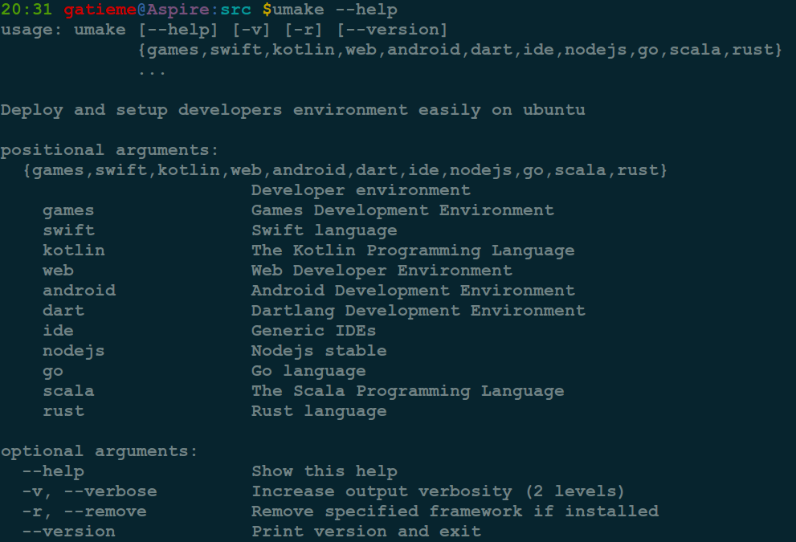

| CSDN | GitHub |
|:----:|:------:|
| [Ubuntu安装开发者中心Ubuntu Make(原Ubuntu Developer Tools Center)](http://blog.csdn.net/gatieme/article/details/52745534) | [`AderXCoding/system/tools/ubuntu_make`](https://github.com/gatieme/AderXCoding/tree/master/system/tools/ubuntu_make) |


#1	Ubuntu Make
-------


`Ubuntu Make`前身是`Ubuntu Developer Tools Center`. 可在`Ubuntu`平台上快速安装各种语言的开发环境.


这个工具是从`14.10`开始有的, 不过刚开始叫`Ubuntu Developer Tools Center`. 到`15.04`中就改名叫`Ubuntu Make`了

`Ubuntu Make`是一款命令行工具, 支持`Ubuntu 15.10`、`15.04`以及`14.04 LTS`.


#2	安装Ubuntu Make
-------


安装该工具, 只需要在终端应用依次执行下面的命令即可:

```cpp
sudo apt-add-repository ppa:ubuntu-desktop/ubuntu-make
sudo apt-get update && sudo apt-get install -y ubuntu-make
```

新版的umake版本为16.09, 增加了对苹果开源`Swift`语言开发环境的支持, 你可以在`Ubuntu`系统中使用`umake swift`命令快速搭建`Swift`编程语言开发学习环境, 这一功能由开发者Galileo Sartor实现. 除此之外，新版本还实现了对`Eclipse PHP`以及`Eclipse C/C++`集成开发环境部署的支持

>**参照**
>
>[Ubuntu-Make Wiki](https://wiki.ubuntu.com/ubuntu-make)
>
>[Ubuntu-Make GitHub](https://github.com/ubuntu/ubuntu-make)


#3	使用Ubuntu Make
-------


命令行终端工具名称为`umake`.


可以使用`umake --help`查看系统帮助




```cpp
usage: umake [--help] [-v] [-r] [--version]
             {games,swift,kotlin,web,android,dart,ide,nodejs,go,scala,rust}
             ...

Deploy and setup developers environment easily on ubuntu

positional arguments:
  {games,swift,kotlin,web,android,dart,ide,nodejs,go,scala,rust}
                        Developer environment
    games               Games Development Environment
    swift               Swift language
    kotlin              The Kotlin Programming Language
    web                 Web Developer Environment
    android             Android Development Environment
    dart                Dartlang Development Environment
    ide                 Generic IDEs
    nodejs              Nodejs stable
    go                  Go language
    scala               The Scala Programming Language
    rust                Rust language

optional arguments:
  --help                Show this help
  -v, --verbose         Increase output verbosity (2 levels)
  -r, --remove          Remove specified framework if installed
  --version             Print version and exit

Note that you can also configure different debug logging behavior using
LOG_CFG that points to a log yaml profile.
* Command 'games':
usage: umake games [-h] {superpowers,unity3d,stencyl,twine} ...

positional arguments:
  {superpowers,unity3d,stencyl,twine}
    superpowers         The HTML5 2D+3D game maker
    unity3d             Unity 3D Editor Linux experimental support
    stencyl             Stencyl game developer IDE
    twine               Twine tool for creating interactive and nonlinear
                        stories

optional arguments:
  -h, --help            show this help message and exit

* Command 'swift':
usage: umake swift [-h] {swift-lang} ...

positional arguments:
  {swift-lang}
    swift-lang  Swift compiler (default)

optional arguments:
  -h, --help    show this help message and exit

* Command 'kotlin':
usage: umake kotlin [-h] {kotlin-lang} ...

positional arguments:
  {kotlin-lang}
    kotlin-lang  Kotlin language standalone compiler

optional arguments:
  -h, --help     show this help message and exit

* Command 'web':
usage: umake web [-h] {firefox-dev,visual-studio-code} ...

positional arguments:
  {firefox-dev,visual-studio-code}
    firefox-dev         Firefox Developer Edition
    visual-studio-code  Visual Studio focused on modern web and cloud

optional arguments:
  -h, --help            show this help message and exit

* Command 'android':
usage: umake android [-h] {android-ndk,android-sdk,android-studio} ...

positional arguments:
  {android-ndk,android-sdk,android-studio}
    android-ndk         Android NDK
    android-sdk         Android SDK
    android-studio      Android Studio (default)

optional arguments:
  -h, --help            show this help message and exit

* Command 'dart':
usage: umake dart [-h] {dart-sdk} ...

positional arguments:
  {dart-sdk}
    dart-sdk  Dart SDK (default)

optional arguments:
  -h, --help  show this help message and exit

* Command 'ide':
usage: umake ide [-h]
                 {webstorm,atom,arduino,idea,datagrip,pycharm-educational,eclipse-cpp,pycharm-professional,sublime-text,visual-studio-code,phpstorm,eclipse,lighttable,idea-ultimate,eclipse-jee,rubymine,eclipse-php,clion,netbeans,pycharm}
                 ...

positional arguments:
  {webstorm,atom,arduino,idea,datagrip,pycharm-educational,eclipse-cpp,pycharm-professional,sublime-text,visual-studio-code,phpstorm,eclipse,lighttable,idea-ultimate,eclipse-jee,rubymine,eclipse-php,clion,netbeans,pycharm}
    webstorm            Complex client-side and server-side javascript IDE
    atom                The hackable text editor
    arduino             The Arduino Software Distribution
    idea                IntelliJ IDEA Community Edition
    datagrip            DataGrip SQL and databases IDE
    pycharm-educational
                        PyCharm Educational Edition
    eclipse-cpp         Eclipse C/C++ IDE
    pycharm-professional
                        PyCharm Professional Edition
    sublime-text        Sophisticated text editor for code, markup and prose
    visual-studio-code  Visual Studio focused on modern web and cloud
    phpstorm            PHP and web development IDE
    eclipse             Eclipse Java IDE
    lighttable          LightTable code editor
    idea-ultimate       IntelliJ IDEA
    eclipse-jee         Eclipse JEE IDE
    rubymine            Ruby on Rails IDE
    eclipse-php         Eclipse PHP IDE
    clion               CLion integrated C/C++ IDE
    netbeans            Netbeans IDE
    pycharm             PyCharm Community Edition

optional arguments:
  -h, --help            show this help message and exit

* Command 'nodejs':
usage: umake nodejs [-h] {nodejs-lang} ...

positional arguments:
  {nodejs-lang}
    nodejs-lang  Nodejs stable

optional arguments:
  -h, --help     show this help message and exit

* Command 'go':
usage: umake go [-h] {go-lang} ...

positional arguments:
  {go-lang}
    go-lang   Google compiler (default)

optional arguments:
  -h, --help  show this help message and exit

* Command 'scala':
usage: umake scala [-h] {scala-lang} ...

positional arguments:
  {scala-lang}
    scala-lang  Scala compiler and interpreter (default)

optional arguments:
  -h, --help    show this help message and exit

* Command 'rust':
usage: umake rust [-h] {rust-lang} ...

positional arguments:
  {rust-lang}
    rust-lang  The official Rust distribution

optional arguments:
  -h, --help   show this help message and exit
```


positional arguments:
  {games,swift,kotlin,web,android,dart,ide,nodejs,go,scala,rust}


| Developer environment | description |
|:---------------------:|:-----------:|
| games | Games Development Environment |
| swift | Swift language |
| kotlin | The Kotlin Programming Language |
| web | Web Developer Environment |
| android | Android Development Environment |
| dart | Dartlang Development Environment |
| ide | Generic IDEs |
| nodejs | Nodejs stable |
| go | Go language |
| scala | The Scala Programming Language |
| rust | Rust language |
