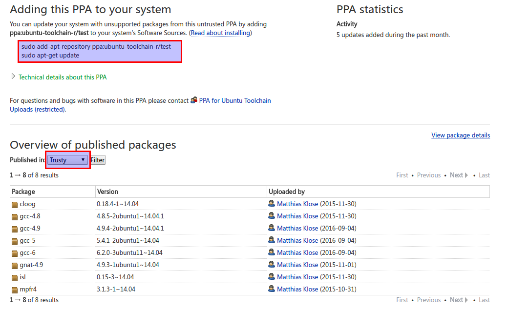
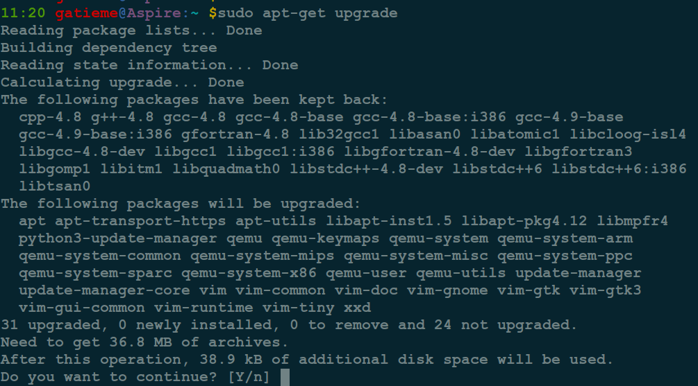
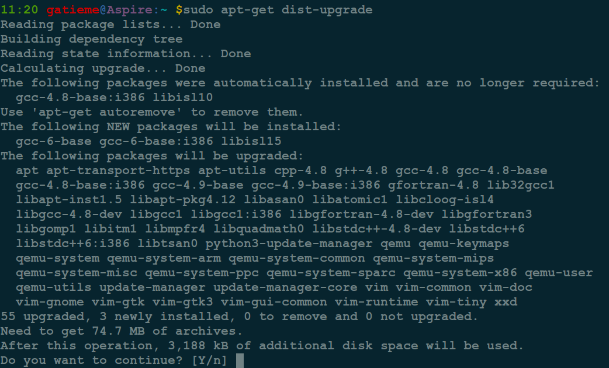
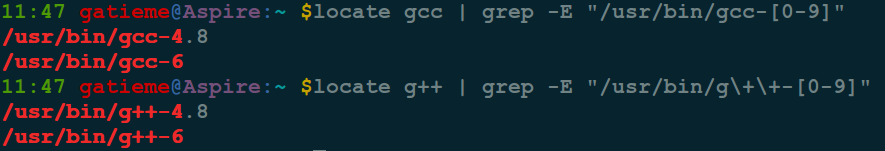
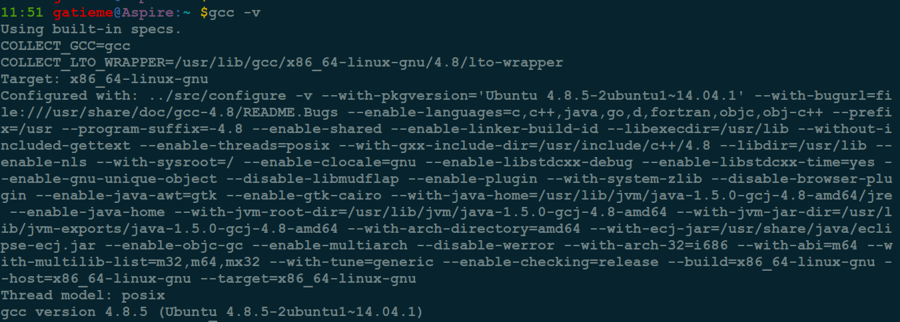
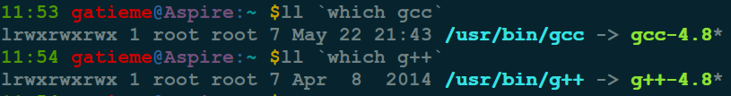
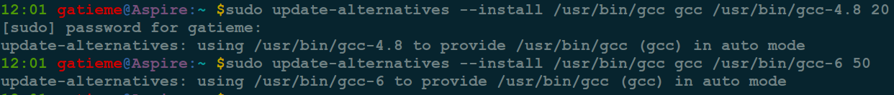
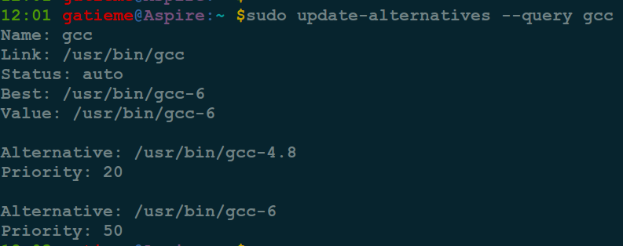
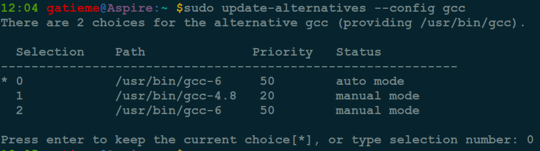
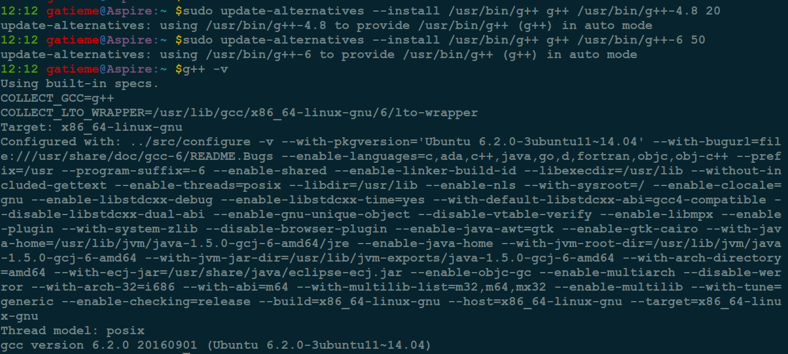

Ubuntu升级gcc版本
=======


| CSDN | GitHub |
|:----:|:------:|
| [Ubuntu升级gcc版本](http://blog.csdn.net/gatieme/article/details/52871438) | [`AderXCoding/system/tools`](https://github.com/gatieme/AderXCoding/tree/master/system/upgrade_gcc) |


<br>
<a rel="license" href="http://creativecommons.org/licenses/by-nc-sa/4.0/"></a>
本作品采用<a rel="license" href="http://creativecommons.org/licenses/by-nc-sa/4.0/">知识共享署名-非商业性使用-相同方式共享 4.0 国际许可协议</a>进行许可, 转载请注明出处
<br>


#1	问题发现
-------


目前正在使用Ubuntu 14.04 LTS, 虽然更新了HWE之后, 系统仍然在不断的维护he更新, 但是编译工具是不会更新的, 如果目前我还在使用Ubuntu 14.04, 是无法体验新版gcc的. 怎么办呢?


#2	问题解决
-------

其实, 在`toolchain/test`下已经有打包好的gcc, 版本有4.x、5.0、6.0等, 并为Ubuntu10.04~16.04军均提供了gcc包, 如下图所示




用这个PPA升级gcc就可以啦,


##2.1	添加源
-------

首先添加ppa到库：

```cpp
sudo add-apt-repository ppa:ubuntu-toolchain-r/test
sudo apt-get update
```


##2.2	安装新版gcc/g++
-------

默认在系统中安装的是gcc-4.8, 但现在都什么年代了万一有重要或者好玩的更新呢, 接着就可以选择安装gcc-4.9, gcc-5之类的啦!(注意目前gcc-5实际上是5.3.0，没有5.1或5.2可供选择)

```cpp
sudo apt-get install gcc-4.8 g++-4.8
sudo apt-get install gcc-4.9 g++-4.9
sudo apt-get install gcc-5 g++-5
sudo apt-get install gcc-6 g++-6
```

具体希望安装哪个版本, 大家可以自己选择


##2.3	更新系统(可选)
-------

下面这个过程是可选的(非必须), 当然我们也可以直接使用`upgrade`或者`dist-upgrade`更新来更新`gcc/g++`


```cpp
sudo apt-get upgrade
```




*	upgrade更新可以看到提示出`The following packages have been kept back`, 说明有部份packages的安装版比release版新, 因此我们使用`apt-get -u dist-upgrade`统一更新到发布的版本. 这条命令会强制更新软件包到最新版本，并动解决缺少的依赖包.


```cpp
sudo apt-get dist-upgrade
```




##2.4	刷新db并locate
-------

接着现在可以考虑刷新一下, 否则locate等命令是找不到的, 这个也是可选的(非必须)

```cpp
sudo updatedb && sudo ldconfig
locate gcc | grep -E "/usr/bin/gcc-[0-9]"
locate g++ | grep -E "/usr/bin/g\+\+-[0-9]"
```



通过locate可以发现, 我们系统中安装了gcc-4.8和gcc-6两个gcc版本


##2.5	切换gcc/g++版本
-------


出与安全和稳定性的考虑, 目前位置我们系统中`gcc -v`查看到的版本仍然是`gcc-4.8`, 因此需要我们自己做链接





我们正常使用的gcc/g++其实都是`/usr/bin/gcc`和`/usr/bin/g++`, 他们指向了`/usr/bin`下真正版本的`gcc/g++`程序





因此我们只需要将标准的`gcc/g++`连接到我们期望的`gcc/g++`程序即可, 我们有如下两种方式建立链接

*	自己通过ln命令创建链接

*	通过update-alternatives建立文件关联

**自己通过ln命令创建链接**


```cpp
cd /usr/bin
sudo rm gcc
sudo ln -s gcc-6 g++
sudo rm g++
sudo ln -s g++-6 g++
```

**通过update-alternatives建立文件关联**

如果安装了同一个软件的不同版本，可以使用update-alternatives命令设置默认使用哪个版本，典型的如在Ubuntu 14.04里安装了gcc-4.8和gcc-6, 想让gcc命令自动使用gcc-6版


*	首先要让系统知道我们安装了多个版本的gcc


```cpp
# 命令最后的 20和50是优先级，如果使用auto选择模式，系统将默认使用优先级高的
sudo update-alternatives --install /usr/bin/gcc gcc /usr/bin/gcc-4.8 20
sudo update-alternatives --install /usr/bin/gcc gcc /usr/bin/gcc-6 50
```





自此我们的系统就默认选择了优先级最高的gcc版本, 具体选择依配置而定, 可以使用`update-alternatives --config`修改配置


*	查询系统中安装有哪些版本

```cpp
sudo update-alternatives --query gcc
```



*	使用交互方式的命令选择默认使用的版本

```cpp
sudo update-alternatives --config gcc
```



同理修改g++的方式类似
```cpp
sudo update-alternatives --install /usr/bin/g++ g++ /usr/bin/g++-4.8 20
sudo update-alternatives --install /usr/bin/g++ g++ /usr/bin/g++-6 50
```



#3	参照
-------

其实我们还可以自己编译新的gcc/g++来使用, 但是此过程很繁琐, 且并不是我们今天内容的重点


[Ubuntu 14.04 LTS 版升级到 GCC 4.9.2](http://blog.sina.com.cn/s/blog_54dd80920102vvt6.html)


[Ubuntu 14.04 LTS 下升级 gcc 到 gcc-4.9、gcc-5版本](http://www.open-open.com/lib/view/open1454683984651.html)

[ToolChain - Ubuntu Wiki](https://wiki.ubuntu.com/ToolChain)

[ToolChain test builds](https://launchpad.net/~ubuntu-toolchain-r/+archive/ubuntu/test)

