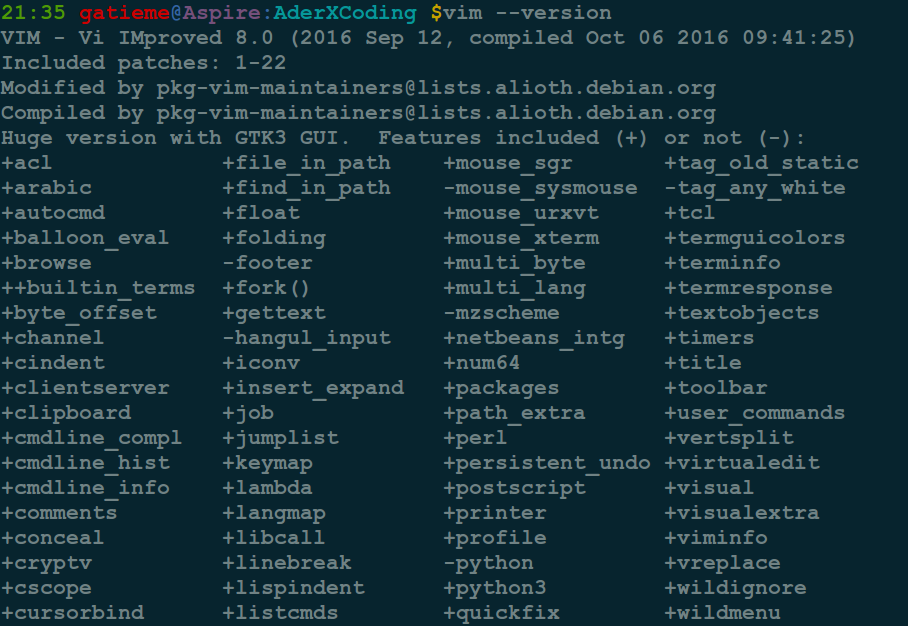

Ubuntu14.04升级vim7.4到8.0
=======

| CSDN | GitHub |
|:----:|:------:|
| [Ubuntu14.04升级vim7.4到8.0](http://blog.csdn.net/gatieme/article/details/52752070) | [`AderXCoding/system/tools/vim`](https://github.com/gatieme/AderXCoding/tree/master/system/tools/vim) |

<br>

> **参照**
>
>[VIM 8.0 IS RELEASED! INSTALL IT ON UBUNTU 16.04](https://itsfoss.com/vim-8-release-install/)


#1	vim8.0发布
-------


##1.1	vim8.0时代来临
-------

终于发布了Vim 8.0, 北京时间 2016年9月12日 22:12，Bram 更新了 8.0 的 Announcement：

```cpp
After more than ten years there is a major Vim release. It gives you interesting new features, such as channels, JSON, Jobs, Timers, Partials, Lambdas, Closures, Packages and more. Test coverage has been increased, many bugs were fixed, this is a rock stable version.

Among the new features are:

- Asynchronous I/O support, channels, JSON
- Jobs
- Timers
- Partials, Lambdas and Closures
- Packages
- New style testing
- Viminfo merged by timestamp
- GTK+ 3 support
- MS-Windows DirectX support
```

早在今年4月份，上述功能就开发出来了，到在5月份的 7.4.1829时就基本可用了（我也从那时开始使用），其后几个月陆续修正到 7.4.2367 （共计修正538项缺陷），7.4.2367之后打上8.0这个 tag，可以说是比较稳定的一个版本.


##1.2	功能更新
-------


Vim7.4.2364和Vim 8.0 的区别？

Vim 7.4.2367之后直接打上了 8.0的tag，离 7.4.2364只有3项小修正：分别修正了一些windows打包脚本的问题，以及测试用例的小问题，没啥大更新。

怎么体验一下 Vim 8.0 的各种新功能？


众所周知，Vim 可能受 NeoVim 的刺激， 加入了异步任务系统和 Timer，下面再介绍下这几个主要功能更新以及给Vim带来的影响：


*	异步任务

以前在 Vim 里面调用外部一个程序(比如编译，更新 tags，Grep ，检查错误，git/svn commit)等, 只能傻等着外部程序结束才能返回 Vim ，这也是 Vim 最受emacs诟病的地方，限制了很多可能性，导致NeoVim当年发布时，最先引入的新功能就是异步机制。如今 8.0中，可以在后台启动各种长时间运行的任务，并把输出重定向到 VimScript 里面的某个 callback 函数，和 nodejs的子进程管理模块类似，使得你可以一边浏览/编辑文件，一遍运行各种长时间编译类任务可以同时运行，并且把输出同步到 Vim 里的某个窗口中。

*	时钟机制

可以在 VimScript 中创建时钟，比如每隔100ms调用一下某个 VimScript 里面的函数，这样方便你定时检查各种状态，比如某项工作是否做完，或者某个与服务器的通信如何了。有这个机制配合 Python 可以实现纯脚本的终端，或者实现网络交互，实时读取一些股票信息并且显示在右下角之类的，这给 Vim 插件开发带来了更多可能性。

*	网络机制

可以用纯 VimScript + socket + json 和外部支持json的服务器进行通信，比如通知远程服务器做一件什么事情，或者查询个什么东西，不过使用 Timer + python 也可以达到同样的效果。


*	内置 JSON 支持

如今 JSON 使用得越来越广泛，为此 Vim 8.0 添加了 json_encode() 和 json_decode()


*	Packages（插件包管理)

Vim 有一个令人诟病的地方，其插件管理不甚方便。故此 Vim 社区出现了一些第三方插件管理工具. Vim 8.0自带插件包管理功能，相信会使插件的使用更加方便


*	GTK+ 3 支持

GTK+ 2 逐渐步入老旧之列，所以 Vim 8.0 带来了 GTK+ 3 支持。


*	Jobs、Timers、Partials、Window ID 等

Vim 8.0 不仅为用户，而且也为开发者添加了一些不错的特性。


##1.3	对 Vim 插件有何影响呢？
-------


总之 Vim 8.0 的这次更新，Vim带来了更多可能性，让各种插件能够完成很多以前做不了的事情，让 Vim 在保持小巧的情况下，跟 emacs 一样变得 “像个操作系统了” （这句话好像是 emacser 们最值得骄傲的地方），提供比以前好得多的体验，期待马上有人用 Python + timer 实现一个内嵌终端出来，再移植个 emacs的后台任务管理器之类的，以 Python的强大，外加 Vim 自身机制的提升，实现一个 org-mode之类的东西只是时间问题。

（当然，emacser 们十分迷恋的 org-mode，个人觉得有些过时了，今天这个时代，这类事情还是交给各种能在：手机+PC+WEB+云上同步的知识管理、日程管理/GTD 的专业软件去做吧）

除此之外，一些太老的插件比如判断版本号时没有考虑到8.0的可能需要稍加修改。


怎么取得最新的 Vim 8.0?

大家如果要试用 vim 8.0的话，可以自己下载代码编译

```cpp
git clone https://github.com/vim/vim.git 
```


Windows 下面有直接二进制下载：

```cpp
ftp://ftp.vim.org/pub/vim/pc/gvim80.exe
```

Windows 下还有每日的自动 daily build:
```cpp
https://github.com/vim/vim-win32-installer/releases/
```

Mac 下面使用的话，可以直接 brew 安装一个最新的vim，原来安装过的话，brew update一下即可。或者使用最新的 MacVim（整合了7.4.2364），同样和 8.0几乎没区别了


当然Ubuntu已经为我们提供了ppa源来安装

```cpp
sudo add-apt-repository ppa:jonathonf/vim
sudo apt update
sudo apt install vim
```

如果您想要卸载它, 请使用如下命令

```cpp
sudo apt remove vim
sudo add-apt-repository --remove ppa:jonathonf/vim
```





虽然vim版本升级了, 但是我们的插件也需要进一步更新啊, 希望我们的插件赶紧更新啊, 来支持更多的vim特性吧


广告时间，欢迎使用我开发的第N个 Vim 插件 asyncrun:
asyncrun - Run Async Shell Commands in Vim 8.0 and Output to Quickfix in Realtime

使用 :AsyncRun 命令可以跟以前！类似的运行各种 shell 命令，只不过是放到后台运行了，同时把这些命令的输出（stdout+stderr）重定向到当前 quickfix窗口，大家在 Quickfix 窗口里面可以实时看到后台命令的输出，以及执行情况（是否结束，退出码是多少）。

比如：后台异步运行编译任务，编译当前文件或者工程
:AsyncRun gcc % -o %<
:AsyncRun g++ -O3 % -o %< -lpthread
:AsyncRun make
:AsyncRun make -f makefile

在Vim里面异步提交工程, 并把提交结果实时显示在Quickfix中：
:AsyncRun git push origin master

绑定 F7为异步编译当前文件：
:noremap <F7> :AsyncRun gcc % -o %< <cr> 

命令的参数接受下面这些宏（和vim里面的 expand函数类似）：
%:p     - File name of current buffer with full path
%:t     - File name of current buffer without path
%:p:h   - File path of current buffer without file name
%:e     - File extension of current buffer
%:t:r   - File name of current buffer without path and extension
%       - File name relativize to current directory
%:h:.   - File path relativize to current directory
<cwd>   - Current directory
<cword> - Current word under cursor
<cfile> - Current file name under cursor

更多详细信息见项目文档，如果你还不知道怎么打开quickfix窗口，请使用命令：
:botright copen 10
即可打开 quickfix窗口，然后 cclose 就可以关闭（可以绑定到快捷键F10上）

各位使用的顺手的话，请为我投一票：
http://www.vim.org/scripts/script.php?script_id=5431

期待各大 Linux 发行版尽快跟进 vim的新 package，否则只能逼我在服务器上自己编译了。
最后，祝各位愉快的使用 Vim 8.0