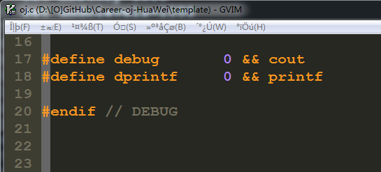
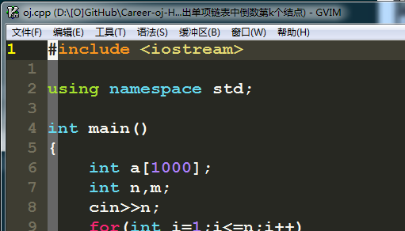

vim、gvim 在 windows 下中文乱码的终极解决方案
=======

| CSDN | GitHub |
|:----:|:------:|
| [vim、gvim 在 windows 下中文乱码的终极解决方案](http://blog.csdn.net/gatieme/article/details/55047156) | [`AderXCoding/system/tools/vim`](https://github.com/gatieme/AderXCoding/tree/master/system/tools/vim) |


在`windows`下`vim`的中文字体显示并不好, 所以我们需要调整字体显示编码为`utf-8`, 只有这样才能使用美观的中文.


这时候可能出现很多中文乱码. 如 : 文件显示乱码、菜单乱码、右键菜单乱码、conlse输出乱码、文件关联右键菜单乱码等等.



*	有个简单的方法解决乱码问题：删除vim下的lang目录。但这样所有菜单只能显示英文了


*	上面的方法终归治标不治本, 经过尝试, 总结下边的代码可以彻底解决这些问题。


```cpp
"  Gvim中文菜单乱码解决方案

" 设置文件编码格式
set encoding=utf-8
set fileencodings=utf-8,chinese,latin-1,gbk,gb18030,gk2312
if has("win32")
 set fileencoding=chinese
else
 set fileencoding=utf-8
endif

"解决菜单乱码
source $VIMRUNTIME/delmenu.vim
source $VIMRUNTIME/menu.vim

"解决consle提示信息输出乱码
language messages zh_CN.utf-8
```





Vim 有四个跟字符编码方式有关的选项，encoding、fileencoding、fileencodings、termencoding (这些选项可能的取值请参考 Vim 在线帮助 :help encoding-names)，它们的意义如下:

| 选项 | 描述 |
|:---:|:---:|
| encoding | Vim 内部使用的字符编码方式，包括 Vim 的 buffer (缓冲区)、菜单文本、消息文本等 |
| fileencoding| Vim 中当前编辑的文件的字符编码方式，Vim 保存文件时也会将文件保存为这种字符编码方式 (不管是否新文件都如此) |
| fileencodings | Vim 启动时会按照它所列出的字符编码方式逐一探测即将打开的文件的字符编码方式，并且将 fileencoding 设置为最终探测到的字符编码方式。因此最好将 Unicode 编码方式放到这个列表的最前面，将拉丁语系编码方式 latin1 放到最后面 |
| termencoding | Vim 所工作的终端 (或者 Windows 的 Console 窗口) 的字符编码方式。这个选项在 Windows 下对我们常用的 GUI 模式的 gVim 无效，而对 Console 模式的 Vim 而言就是 Windows 控制台的代码页，并且通常我们不需要改变它 |

用英文菜单和提示最好，可以免去下面对菜单和提示信息（B，C部分）的设置。如果用英文菜单和提示在安装gvim的时候，将支持本地语言的选项去掉。