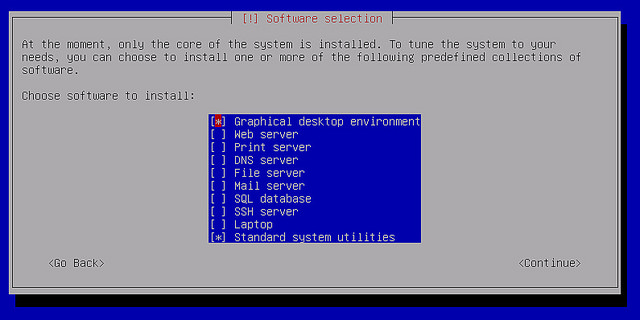
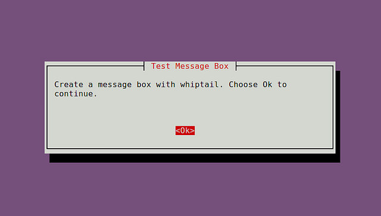
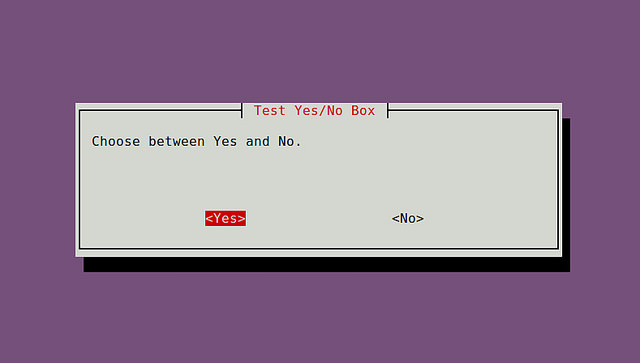
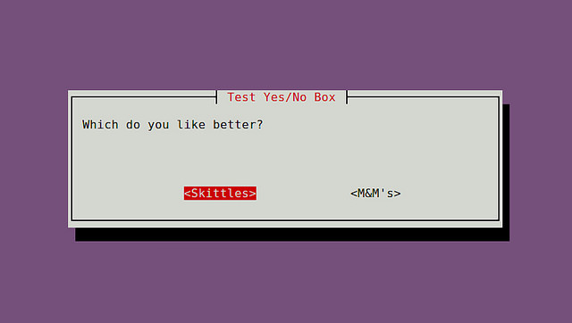
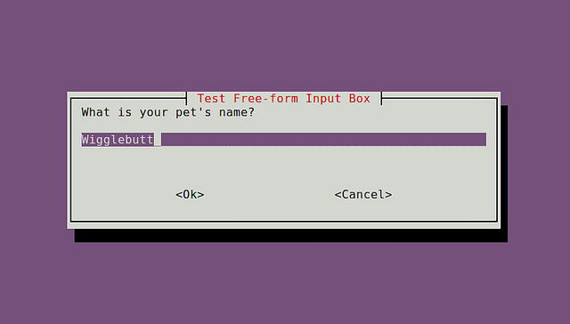
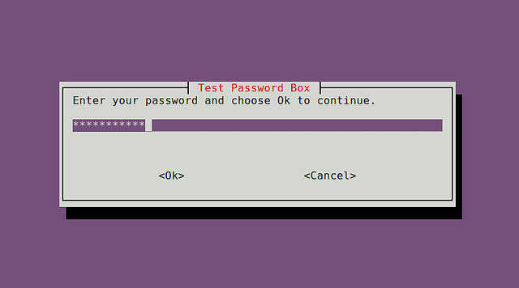
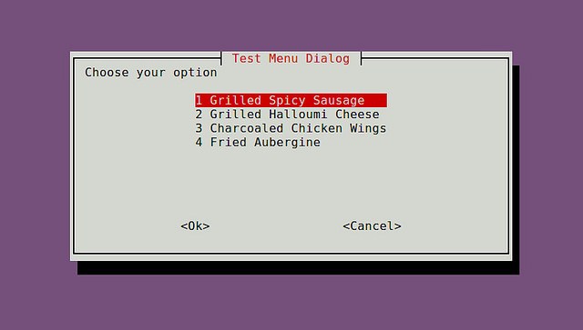
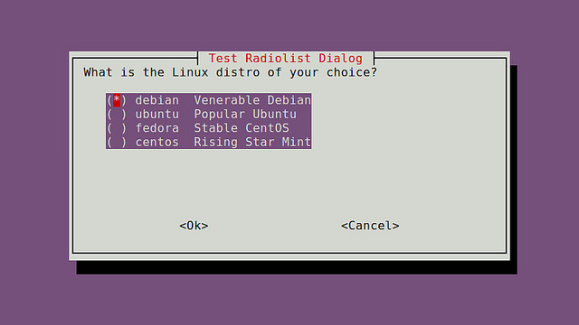
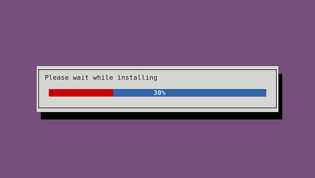

如何在交互式shell脚本中创建对话框
=======


| CSDN | Github |
|:-------:|:--------:|
| [Linux如何在交互式shell脚本中创建对话框](http://blog.csdn.net/gatieme/article/details/52738870) | [`AderXCoding/system/tools/whiptail`](https://github.com/gatieme/AderXCoding/tree/master/system/tools/whiptail) |


当你在终端环境下安装新的软件时，你可以经常看到信息对话框弹出，需要你的输入，比如：RHEL/CentOS自带的setup，对话框的类型有密码箱、检查表、菜单等等。他们可以引导你以一种直观的方式输入必要的信息，使用这样的用户友好的对话框的好处是显而易见的。如下图所示：




当你写一个交互式shell脚本，你可以使用这样的对话框来接受用户的输入。whiptail可以在shell脚本中创建基于终端的对话框，消息框的过程，类似于Zenity或xdialog GUI脚本代码。whiptail预先安装在所有的Linux发布版本中。


#1	创建一个消息框
-------


一个消息框中显示一个确认按钮继续任意的文本消息。

语法：


```cpp
whiptail --title "<message box title>" --msgbox "<text to show>" <height> <width> 
```

实例：

```cpp
#!/bin/bash
whiptail --title "Test Message Box" --msgbox "Create a message box with whiptail. Choose Ok to continue." 10 60
```





#2	创建一个yes/no对话框
-------


用户输入yes或no的对话框

语法：

```cpp
whiptail --title "<dialog box title>" --yesno "<text to show>" <height> <width>
```

实例：


```cpp
#!/bin/bash
if (whiptail --title "Test Yes/No Box" --yesno "Choose between Yes and No." 10 60) then
    echo "You chose Yes. Exit status was $?."
else
    echo "You chose No. Exit status was $?."
fi
```





或者，你可以是“--yes-button” ,"--no-button"选项。


```cpp
#!/bin/bash
if (whiptail --title "Test Yes/No Box" --yes-button "Skittles" --no-button "M&M's"  --yesno "Which do you like better?" 10 60) then
    echo "You chose Skittles Exit status was $?."
else
    echo "You chose M&M's. Exit status was $?."
fi
```





#3	创建一个表单输入框
-------


如果你想用户输入任意的文本，您可以使用一个输入框。

语法：

```cpp
whiptail --title "<input box title>" --inputbox "<text to show>" <height> <width> <default-text>
```

实例：


```cpp
#!/bin/bash
PET=$(whiptail --title "Test Free-form Input Box" --inputbox "What is your pet's name?" 10 60 Wigglebutt 3>&1 1>&2 2>&3)
 
exitstatus=$?
if [ $exitstatus = 0 ]; then
    echo "Your pet name is:" $PET
else
    echo "You chose Cancel."
fi
```





#4	创建一个密码框
-------


当用户需要输入敏感信息时密码框是有用的。
语法：

```cpp
whiptail --title "<password box title>" --passwordbox "<text to show>" <height> <width>
```

实例：

```cpp
#!/bin/bash
PASSWORD=$(whiptail --title "Test Password Box" --passwordbox "Enter your password and choose Ok to continue." 10 60 3>&1 1>&2 2>&3)
 
exitstatus=$?
if [ $exitstatus = 0 ]; then
    echo "Your password is:" $PASSWORD
else
    echo "You chose Cancel."
fi
```



#5	创建一个菜单栏
-------


当你想让用户选择一个任意数量的选择中，你可以使用菜单框。

语法：


```cpp
whiptail --title "<menu title>" --menu "<text to show>" <height> <width> <menu height> [ <tag> <item> ] . . .
```


实例：

```cpp
#!/bin/bash
OPTION=$(whiptail --title "Test Menu Dialog" --menu "Choose your option" 15 60 4 \
"1" "Grilled Spicy Sausage" \
"2" "Grilled Halloumi Cheese" \
"3" "Charcoaled Chicken Wings" \
"4" "Fried Aubergine"  3>&1 1>&2 2>&3)
 
exitstatus=$?
if [ $exitstatus = 0 ]; then
    echo "Your chosen option:" $OPTION
else
    echo "You chose Cancel."
fi
```





#6	创建radiolist对话框
-------


语法：

```cpp
whiptail --title "<radiolist title>" --radiolist "<text to show>" <height> <width> <list height> [ <tag> <item> <status> ] . . .
```


实例：


```cpp
#!/bin/bash
DISTROS=$(whiptail --title "Test Checklist Dialog" --radiolist \
"What is the Linux distro of your choice?" 15 60 4 \
"debian" "Venerable Debian" ON \
"ubuntu" "Popular Ubuntu" OFF \
"centos" "Stable CentOS" OFF \
"mint" "Rising Star Mint" OFF 3>&1 1>&2 2>&3)
 
exitstatus=$?
if [ $exitstatus = 0 ]; then
    echo "The chosen distro is:" $DISTROS
else
    echo "You chose Cancel."
fi
```




#7	创建一个表对话框
-------


当你想让用户选择一个列表中选择多个选项的清单对话框是有用的，radiolist对话框，只允许选择一个。
语法：

```cpp
whiptail --title "<checklist title>" --checklist "<text to show>" <height> <width> <list height> [ <tag> <item> <status> ] . . .
```

实例：


```cpp
#!/bin/bash
DISTROS=$(whiptail --title "Test Checklist Dialog" --checklist \
"Choose preferred Linux distros" 15 60 4 \
"debian" "Venerable Debian" ON \
"ubuntu" "Popular Ubuntu" OFF \
"centos" "Stable CentOS" ON \
"mint" "Rising Star Mint" OFF 3>&1 1>&2 2>&3)
 
exitstatus=$?
if [ $exitstatus = 0 ]; then
    echo "Your favorite distros are:" $DISTROS
else
    echo "You chose Cancel."
fi
```


#8	创建一个进度条
-------


进度条是一个用户友好的对话框。whiptail从标准输入读取一个百分数（0～100），显示一个表内相应的计数。
语法：


```cpp
whiptail --gauge "<test to show>" <height> <width> <inital percent>
```

实例：

```cpp
#!/bin/bash
{
    for ((i = 0 ; i <= 100 ; i+=20)); do
        sleep 1
        echo $i
    done
} | whiptail --gauge "Please wait while installing" 6 60 0
```



原文来自：http://www.ttlsa.com/shell/how-to-create-dialog-boxes-in-interactive-shell-script/

本文地址：http://www.linuxprobe.com/create-interactive-shell-script.html