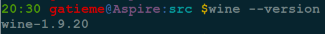
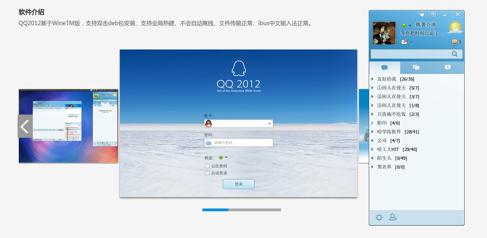
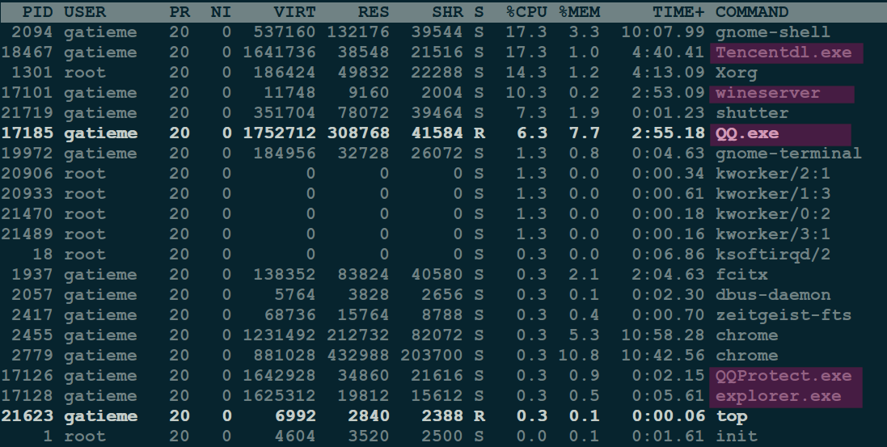

Ubuntu安装wine和Wine QQ
=======


| CSDN | GitHub |
|:----:|:------:|
| [Ubuntu安装wine和Wine QQ(2012国际版)](http://blog.csdn.net/gatieme/article/details/52770494#t4) | [`AderXCoding/system/tools/wine`](https://github.com/gatieme/AderXCoding/tree/master/system/tools/wine) |


<br>
<a rel="license" href="http://creativecommons.org/licenses/by-nc-sa/4.0/"></a>
本作品采用<a rel="license" href="http://creativecommons.org/licenses/by-nc-sa/4.0/">知识共享署名-非商业性使用-相同方式共享 4.0 国际许可协议</a>进行许可


<br>
>  参照
>
>[Wine--Ubuntu Wiki](http://wiki.ubuntu.org.cn/Wine)
>
>[QQ--Ubuntu Wiki](http://wiki.ubuntu.org.cn/QQ)
>
>[Wine--Wiki Winehq](https://wiki.winehq.org/Ubuntu)


#1	安装wine
-------

##1.1	安装源中的wine
-------

```cpp
sudo apt-get install wine
```
因为版本比较旧，所以通常不用，改用PPA中的wine。

##1.2	安装最新版 wine
-------

参见 https://wiki.winehq.org/Ubuntu

ubuntu 官方自带了 wine ，但是推荐用 winehq 官方提供的最新版本 wine ，新版本解决了很多以前显得麻烦的问题。

> PPA地址：
>
>https://launchpad.net/~wine/+archive/ubuntu/wine-builds

```cpp
sudo dpkg --add-architecture i386 

sudo add-apt-repository ppa:wine/wine-builds
sudo apt-get update
sudo apt-get install --install-recommends winehq-devel
```

要注意，若安装wine包是老的稳定版, 新开发版本是`wine-devel`, 经常有不少优化和修正。

如果愿意安装比`devel`稍微更 devel 的 staging 版本的话，可以试试wine-staging





#1.3	配置
-------

```cpp
winecfg
```

然后配置完成即可


#2	安装wine QQ 2012 国际版
-------


##2.1	备选方案
-------


| 方案 | 描述 |
|:---:|:----:|
| UKylin Wine QQ | Ubuntu Kylin麒麟团队做出的wine QQ安装包|
| longene-wine-qq | [longene](http://www.longene.org/)团队推出的QQ安装包, Longene是一个自由、开源的操作系统项目,致力于在Linux上兼容Windows应用 |
| winetricks-zh wine QQ |  你可以简单的理解为是winetricks的中文版，可以用wine实现安装迅雷/qq/网易云音乐/酷狗/美图秀秀等等，12月28日还更新了qq音乐 |

| 自己制作wine QQ | 自己通过最原始的方法, 制作wine QQ |


一些网友打包了些Wineqq，喜欢就拿去用吧
QQ是6.4版本和6.6版本，都有些缺陷，比如截不了图啊，键盘输不了密码之类的，下面是下载：

>QQ6.4_32位下载(*.tar.gz)：http://pan.baidu.com/s/1eQgU5xS
>
>QQ6.4_64位下载(*.deb)：http://pan.baidu.com/s/1mggLMB2

这个版本是我一直使用的版本，不过，安装包特别大，对吧。

>QQ6.6_32位下载(*.deb)：http://pan.baidu.com/s/1qWt4WUC
>
>QQ6.6_64位下载(*.deb)：http://pan.baidu.com/s/1sjnxtyl


>参见
>
> http://blog.csdn.net/gatieme/article/details/44856359#t35


下面我们开始安装

**注意**


如果您的电脑上安装了其他的wine QQ, 请先卸载, 使用通过`dpkg -l | grep qq`查看

##2.2	UKylin Wine QQ
-------


但是我们最终选定了`Ubuntu Kylin`的`WineQQ2012`国际版, 因为最稳定

>下载地址
>
>http://www.ubuntukylin.com/applications/showimg.php?lang=cn&id=23
>
>http://www.ubuntukylin.com/application/show.php?lang=cn&id=279


下载完成后是个`wine-qqintl.zip`的压缩包

```cpp
cd wine-qqintl
```

安装此目录下的所有文件

```cpp
sudo dpkg –i fonts-wqy-microhei_0.2.0-beta-2_all.deb

sudo dpkg –i ttf-wqy-microhei_0.2.0-beta-2_all.deb

sudo dpkg –i wine-qqintl_0.1.3-2_i386.deb
```


如果期间安装出错, 说明有某些依赖库没有安装, 则使用如下命令修复依赖关系

```cpp
sudo apt-get install -f
```




##2.3	longene-wine-qq
-------


`longene-wine-qq`是`longene`打包的wine QQ, 一直在不间断的更新, 但是由于使用的是新版的QQ, 所以可能在某些系统中有些不稳定

参见 http://www.longene.org/forum/viewtopic.php?f=6&t=30516


```cpp
+-----------------------------------------------------------------------+
| 作者：LongeneTeam
| QQ群：【Longene爱好者群】252714468
| 新浪微博：http://www.weibo.com/longene
| Email：linux@insigma.com.cn 
+-----------------------------------------------------------------------+
| 文章版权归原作者所有。 
| 大家可以自由转载这篇文章，但原版权信息必须保留。 
| 未经许可不得用于商业用途，任何个人、媒体、其他 
| 网站不得私自抄袭。 如需用于商业用途，请务必与原 
| 作者联系，若因未取得授权而收起的版权争议，由侵 
| 权者自行负责。 
+-----------------------------------------------------------------------+


本文链接：http://www.longene.org/forum/viewtopic.php?f=6&t=30516

+-----------------------------------------------------------------------+
```


Longene团队因为工作内容调整，已有多年未更新Wine QQ（Longene团队一直还是在从事Linux相关的工作），最近，Linux爱好者有关Wine QQ的呼声比较高，团队成员工作之余对QQ7.8版本进行了调试开发，目前已能初步运行使用。但是由于时间紧迫，还存在不少问题，请广大爱好者们多多包涵，我们也会不断地改进。欢迎大家测试使用、如有问题请及时反馈。
联系方法：linux@insigma.com.cn

Wine QQ 7.8下载

下载地址：[WineQQ7.8-20151109-Longene](http://www.longene.org/download/WineQQ7.8-20151109-Longene.deb)
百度网盘：[WineQQ7.8-20151109-Longene](http://pan.baidu.com/s/1kTu9ZUZ)

安装

```cpp
sudo dpkg -i WineQQ7.8-20151109-Longene.deb
```


使用top查看cpu和内存占用


