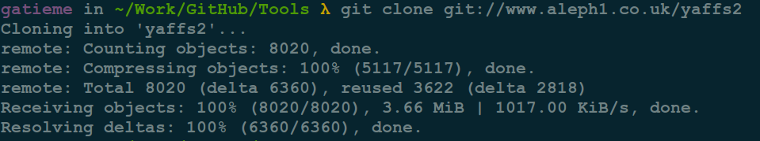
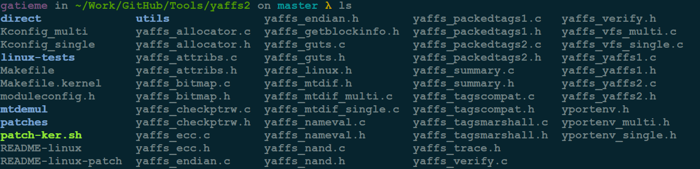
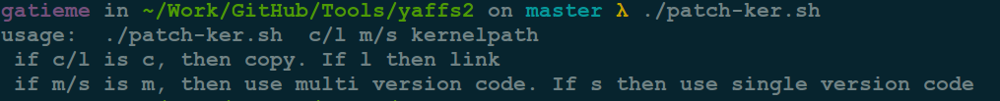
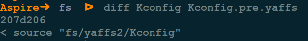
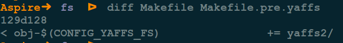
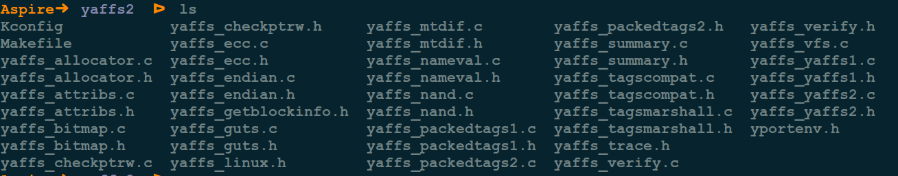
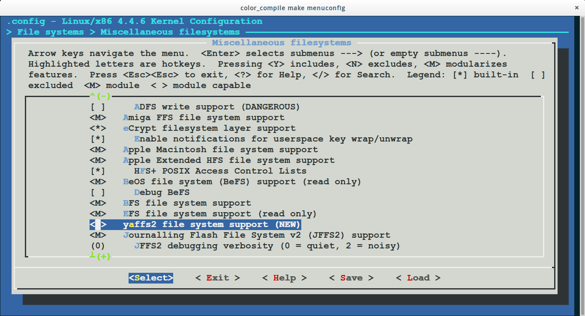
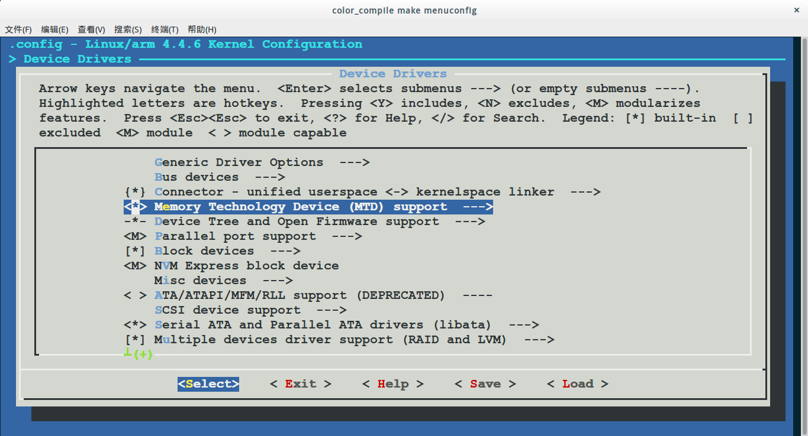
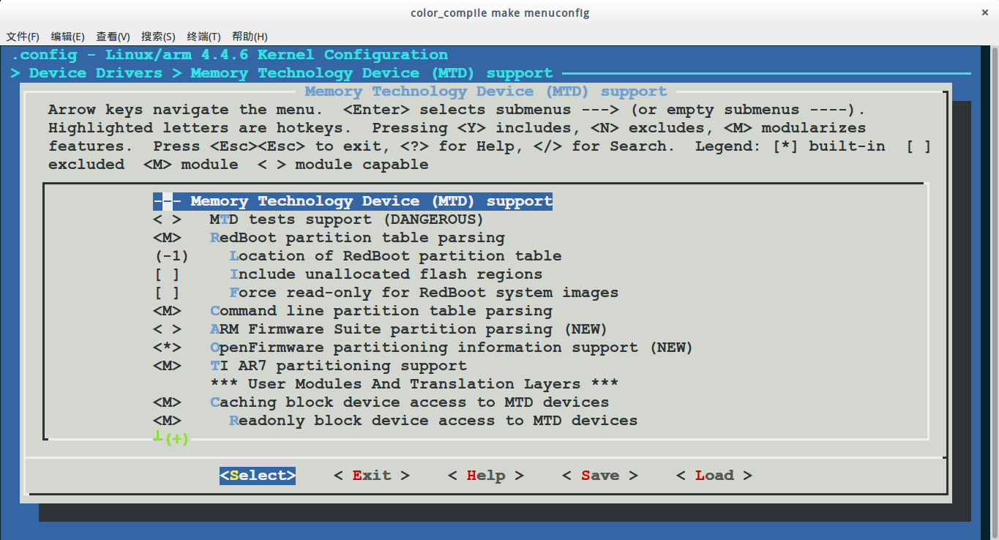

内核添加对yaffs2文件系统的支持
=======

| CSDN | GitHub |
|:----:|:------:|
| [内核添加对yaffs2文件系统的支持](http://blog.csdn.net/gatieme/article/details/53157829) | [`AderXCoding/system/tools/yaffs2`](https://github.com/gatieme/AderXCoding/tree/master/system/tools/yaffs2) |


<br>
<a rel="license" href="http://creativecommons.org/licenses/by-nc-sa/4.0/"></a>
本作品采用<a rel="license" href="http://creativecommons.org/licenses/by-nc-sa/4.0/">知识共享署名-非商业性使用-相同方式共享 4.0 国际许可协议</a>进行许可, 转载请注明出处, 谢谢合作
<br>


#1	yaffs介绍
-------


`YAFFS`,  `Yet Another Flash File System`, 是一种类似于 `JFFS/JFFS2` 的专门为 `Flash` 设计的嵌入式文件系统. 与 `JFFS` 相比, 它减少了一些功能, 因此速度更快、占用内存更少.  `YAFFS` 和 `JFFS` 都提供了写均衡, 垃圾收集等底层操作. 它们的不同之处在于 :

1.	`JFFS` 是一种日志文件系统, 通过日志机制保证文件系统的稳定性. `YAFFS` 仅仅借鉴了日志系统的思想, 不提供日志机能, 所以稳定性不如 `JAFFS`, 但是资源占用少.

2.	`JFFS` 中使用多级链表管理需要回收的脏块, 并且使用系统生成伪随机变量决定要回收的块, 通过这种方法能提供较好的写均衡, 在 `YAFFS` 中是从头到尾对块搜索, 所以在垃圾收集上 `JFFS` 的速度慢, 但是能延长 NAND 的寿命.

3.	`JFFS` 支持文件压缩, 适合存储容量较小的系统; `YAFFS` 不支持压缩, 更适合存储容量大的系统.

4.	`YAFFS` 还带有 `NAND` 芯片驱动, 并为嵌入式系统提供了直接访问文件系统的 `API`, 用户可以不使用 `Linux` 中的 `MTD `和 `VFS`, 直接对文件进行操作.  `NAND Flash` 大多采用 `MTD+YAFFS` 的模式.  `MTD`(`Memory Technology Devices`, 内存技术设备）是对 `Flash` 操作的接口, 提供了一系列的标准函数, 将硬件驱动设计和系统程序设计分开.

`YAFFS2` 是 `YAFFS` 的升级版, 能更好的支持 `NAND FLASH`, 我们采用最新的 `YAFFS2 `文件系统. 我们首先下载 `YAFFS `文件系统.

#2	内核添加对yaffs2文件系统的支持
-------


内核中默认是不支持 `yaffs` 文件系统的, 因此我们需要为内核打上 `yaffs` 的补丁

```cpp
File  systems  --->
	Miscellaneous  filesystems  --->
		<*>  YAFFS2  file  system  support
		[*]  Autoselect  yaffs2  format
```


##2.1	下载yaffs源码
-------

第一步, 我们需要 `YAFFS2` 的源码, 如果大家有兴趣想了解 `YAFFS2` 文件系统的驱动原理的话可以直接去访问他们的官网

官网地址 : www.yaffs2.net

有源码下载地址, 怕大家进去后难找, 直接贴出YAFFS2的最新源码地址吧 http://www.aleph1.co.uk/gitweb/?p=yaffs2.git;a=summary

直接点击, 点最新版本, 点击最右边的 `SNAPSHOT` 下载, 这个是目前最新的YAFFS2的源码了.

或者直接访问, 即可自动下载

http://aleph1.co.uk/gitweb?p=yaffs2.git;a=snapshot;h=HEAD;

下载后解压缩 `yaffs` 源代码

当然我们也可以使用git进行下载

*	普通用户使用

```cpp
git clone git://www.aleph1.co.uk/yaffs2
```

*	内部开发人员

`yaffs` 的开发人员会有自己的开发账户, 因此可以直接访问 `git` 进行下载

```cpp
git clone ssh://www.aleph1.co.uk/home/aleph1/git/yaffs2
```




##2.2	为内核打上patch
-------

第二步, 将下载下来的 `YAFFS2` 最新源码 `YAFFS2.tar.gz` 放入你 `LINUX` 的任意一个目录下, 执行 `tar zxvf YAFFS2.tar.gz` 然后进入 `YAFFS2` 源码包



由于最新的源码再执行脚本 `patch-ker.sh` 时 有四个参数, 可以追加：c,l,m,s,

```cpp
./patch-ker.sh  c/l m/s kernelpath
 if c/l is c, then copy. If l then link
 if m/s is m, then use multi version code. If s then use single version code
```



上面这段英文应该很好懂吧, 简而言之, C 是复制文件, L是链接文件, M是多种, S是单个的,

那么在这里, 我们只需执行

```cpp
./patch-ker.sh c m your-linux-kernel-directory
```


执行完这条命令之后, 你将会发现在 `kernel` 源代码目录下发现有了 `yaffs2` 目录了, 并且里面也出现了好多文件

1.	修改内核 `fs/Kconfig`, 增加了 `yaffs2` 下的 `Kconfig`

```cpp
# Patched by YAFFS
source "fs/yaffs2/Kconfig"
```



2.	修改内核 `fs/Makefile`, 增加了 `yaffs` 目录的信息

同时将原来的 `Makefile` 备份为 `Makefile.pre.yaffs`

```cpp
# Patched by YAFFS
obj-$(CONFIG_YAFFS_FS)          += yaffs2/
```




3.	在内核fs/目录下创建yaffs2子目录

*	将yaffs2源码目录下的Makefile.kernel复制为内核fs/yaffs2/Makefile文件

*	将yaffs2源码目录下的Kconfig文件复制到内核fs/yaffs2/目录下

*	将yaffs2源码目录下的*.c,*.h文件(不包括子目录下的文件)复制到内核fs/yaffs2/目录下




##2.3	配置内核
-------

最后就是配置编译内核, 让内核支持yaffs2文件系统


```cpp
```cpp
File  systems  --->
	Miscellaneous  filesystems  --->
		<*>  YAFFS2  file  system  support
		[*]  Autoselect  yaffs2  format


配置语言选项

Native  Language  support  --->
	(iso8859-1)  Default  NLS  Option
	<*>  Codepage  437(United  States,  Canada)
	<*>  Simplified  Chinese  charset(CP936,  GB2312)
	<*>  NLS  ISO8859-1  (Latin  1;  Western  European  Language)
	<*>  NLS  UTF-8
```



>注
>
>若在 `make menuconfig` 中没有出现 `yaffs2` 文件系统的支持, 请检查 `MTD` 的配置, `yaffs2` 依赖于 `MTD` . `MTD`中配置了 `linux` 内核对 `NANDFlash` 的支持.
>
>```cpp
>Device Drivers	--->
>	Memory Technology Device (MTD) support	--->
>
># 进一步把其中的NAND Flase的支持打开
>```
>
>
>
>


内核支持 `NandFlash` 和 `yaffs2` 文件系统，将内核烧入 `NandFlash`后, 再烧入 `yaffs2` 文件系统, 可以使用制作好的文件系统, 也可以自己制作

启动时（成功挂载文件系统）输出:

```cpp
yaffs:  dev  is  32505858  name  is  "mtdblock2"
yaffs:  passed  flags  ""
yaffs:  Attempting  MTD  mount  on  31.2,  "mtdblock2"
yaffs:  auto  selecting  yaffs2
yaffs_read_super:  isCheckpointed  0
VFS:  Mounted  root  (yaffs  filesystem)  on  device  31:2.
Freeing  init  memory:  196K
```

<br>

<a rel="license" href="http://creativecommons.org/licenses/by-nc-sa/4.0/"></a>本作品采用<a rel="license" href="http://creativecommons.org/licenses/by-nc-sa/4.0/">知识共享署名-非商业性使用-相同方式共享 4.0 国际许可协议</a>进行许可, 转载请注明出处, 谢谢合作.
