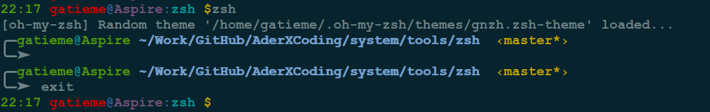
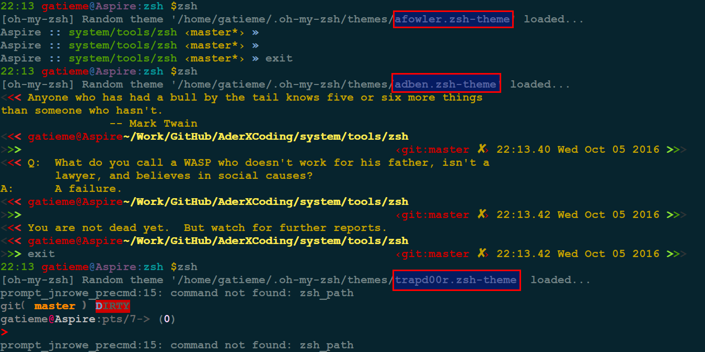

Linux终极shell-Z Shell-用强大的zsh & oh-my-zsh把Bash换掉
=======


| CSDN | GitHub |
|:----:|:------:|
| [Linux终极shell-Z Shell-用强大的zsh & oh-my-zsh把Bash换掉](http://blog.csdn.net/gatieme/article/details/52741221) | [`AderXCoding/system/tools/zsh`](https://github.com/gatieme/AderXCoding/tree/master/system/tools/zsh) |


大多数的Linux用户偏爱Bash，因为发行版通常默认的就是它。
Bash确实是不错的Shell，但仍有用很多不尽人意的地方，如自动补全的功能不够强大，定位较长路径不够方便，命令历史管理不够完善等。


今天我们介绍使用zsh，功能十分强大..推荐给大家！


#1	zsh介绍
-------

##1.1	Linux shell
-------


Linux/Unix提供了很多种Shell，为毛要这么多Shell？

难道用来炒着吃么？那我问你，你同类型的衣服怎么有那么多件？花色，质地还不一样。写程序比买衣服复杂多了，而且程序员往往负责把复杂的事情搞简单，简单的事情搞复杂。牛程序员看到不爽的Shell，就会自己重新写一套，慢慢形成了一些标准，常用的Shell有这么几种，sh、bash、csh等，想知道你的系统有几种shell，可以通过以下命令查看：

```cpp
cat /etc/shells
```


显示如下：


##1.2	zsh简介
-------


Zsh是一个Linux下强大的shell, 由于大多数Linux产品安装，以及默认使用`bash shell`, 但是丝毫不影响极客们对zsh的热衷, 几乎每一款Linux产品都包含有zsh，通常可以用apt-get、urpmi或yum等包管理器进行安装

Zsh具有以下主要功能

*	开箱即用、可编程的命令行补全功能可以帮助用户输入各种参数以及选项

*	在用户启动的所有shell中共享命令历史

*	通过扩展的文件通配符，可以不利用外部命令达到find命令一般展开文件名

*	改进的变量与数组处理

*	在缓冲区中编辑多行命令

*	多种兼容模式，例如使用/bin/sh运行时可以伪装成Bourne shell

*	可以定制呈现形式的提示符；包括在屏幕右端显示信息，并在键入长命令时自动隐藏

*	可加载的模块，提供其他各种支持：完整的TCP与Unix域套接字控制，FTP客户端与扩充过的数学函数

*	完全可定制化


##1.3	zsh与oh-my-zsh终极配置
-------

之前是因为看到这篇文章：[终极Shell——Zsh](http://linuxtoy.org/archives/zsh.html) 才选择使用zsh，被它的自动完成、补全功能吸引了。

<官网：www.zsh.org

这也是“工欲善其事，必先利其器"系列文章。

[选择oh-my-zsh](https://github.com/robbyrussell/oh-my-zsh)
oh-my-zsh是基于zsh的功能做了一个扩展，方便的插件管理、主题自定义，以及漂亮的自动完成效果。

在Github上找关于zsh的项目时发现的，试用了一下觉得很方便，不用像上面文章里面提到的那么复杂，配置一些插件的名称即可使用相应的功能。

>官网：https://github.com/robbyrussell/oh-my-zsh
>
>评价：https://github.com/robbyrussell/oh-my-zsh/wiki/Testimonials


#2	安装zsh
-------


##2.1	安装zsh
-------


对于一般的Ubuntu系统，配置好正确的源之后，就能直接键入以下命令安装：

```cpp
sudo apt-get install zsh
```

##2.2	配置zsh
-------


zsh的配置是一门大学问，这里不赘述，直接给出一个配置文件，大家可以下载后放入zsh配置文档直接使用。（我的一个法国朋友手配的，相当顺手）

把.zshrc拷贝到相应用户的home目录即可
(也可以把你的bash的配置文件(~/.bash_prorile或者~/.profile等)给拷贝到zsh的配置文件~/.zshrc里，因为zsh兼容bash)


##2.3	取代bash，设为默认shell
-------

```cpp
sudo usermod -s /bin/zsh username
```

或者

```cpp
chsh -s /bin/zsh
```

```cpp
chsh -s `which zsh`
```
如果要切换回去bash：

```cpp
chsh -s /bin/bash
```

当然你实在不愿意把zsh当成默认的shell, 而又想使用它, 那么你可以每次进入是都使用`zsh`进入, 而输入`exit`退出




##2.4	安装oh-my-zsh
-------

直接用zsh会很蛋疼，因为zsh功能很强大但是太复杂，所以需要oh-my-zsh来将它简单化


**直接用git从github上面下载包**

```cpp
git clone git://github.com/robbyrussell/oh-my-zsh.git ~/.oh-my-zsh
```

**备份已有的zshrc, 替换zshrc**

```cpp
cp ~/.zshrc ~/.zshrc.orig
cp ~/.oh-my-zsh/templates/zshrc.zsh-template ~/.zshrc
```

**直接使用脚本安装**


```cpp
cd oh-my-zsh/tools
./install.sh
```


你可以直接直接使用如下命令安装

**curl**


```cpp
sh -c "$(curl -fsSL https://raw.githubusercontent.com/robbyrussell/oh-my-zsh/master/tools/install.sh)"
```

**wget**

```cpp
sh -c "$(wget https://raw.githubusercontent.com/robbyrussell/oh-my-zsh/master/tools/install.sh -O -)"
```

其本质就是下载并执行了github上的install.sh脚本, 该脚本位于`oh-my-zsh/tools/install.sh`


**配置主题**

oh-my-zsh集成了大量的主题, 位于[`oh-my-zsh/theme`](https://github.com/robbyrussell/oh-my-zsh/), 相关文件在`~/.oh-my-zsh/themes`目录下，你可以随意选择，也可以编辑主题满足自己的变态需求，我采用了默认主题robbyrussell，不过做了一点小小的改动：

```cpp
PROMPT='%{$fg_bold[red]%}➜ %{$fg_bold[green]%}%p%{$fg[cyan]%}%d %{$fg_bold[blue]%}$(git_prompt_info)%{$fg_bold[blue]%}% %{$reset_color%}>'
#PROMPT='%{$fg_bold[red]%}➜ %{$fg_bold[green]%}%p %{$fg[cyan]%}%c %{$fg_bold[blue]%}$(git_prompt_info)%{$fg_bold[blue]%} % %{$reset_color%}'
```
对照原来的版本，我把 c 改为 d，c 表示当前目录，d 表示绝对路径，另外在末尾增加了一个「 > 」，


配置主题, 可以通过修改`~/.zshrc`中的环境变量`ZSH_THEME`来完成

```cpp
ZSH_THEME="agnoster" # (this is one of the fancy ones)
```

如果你觉得主题太多你可以选择使用随机模式, 来由系统随机选择


```cpp
ZSH_THEME="random" # (...please let it be pie... please be some pie..)
```




**配置插件**


修改`～/.zshrc`中`plugins`

```cpp
plugins=(git bundler osx rake ruby)
```


详细的主题信息, 可以参见[zsh主题介绍](https://github.com/robbyrussell/oh-my-zsh/wiki/themes)

**更新oh-my-zsh**

默认情况下, 您将被提示检查每几周的升级. 如果你想我ZSH自动升级本身没有提示你, 修改`~/.zshrc

```cpp
disable_update_prompt = true
```

禁用自动升级, 修改~/.zshrc

```cpp
disable_auto_update = true
```

当然你也可以选择手动更新

如果你想在任何时间点升级（也许有人刚刚发布了一个新的插件，你不想等待一个星期？)你只需要运行：

```cpp
upgrade_oh_my_zsh
```


**卸载oh-my-zsh**


如果你想卸载`oh-my-zsh`, 只需要执行`uninstall_oh_my_zsh zsh`， 从命令行运行. 这将删除本身和恢复你以前的bash或者zsh配置.

```cpp
uninstall_oh_my_zsh zsh
```


此外, 更多任性的功能, 速度来感受吧


1.	兼容 bash，原来使用 bash 的兄弟切换过来毫无压力，该咋用咋用。

2.	强大的历史纪录功能，输入 grep 然后用上下箭头可以翻阅你执行的所有 grep 命令。

3.	智能拼写纠正，输入gtep mactalk * -R，系统会提示：zsh: correct ‘gtep’ to ‘grep’ [nyae]? 比妹纸贴心吧，她们向来都是让你猜的……

4.	各种补全：路径补全、命令补全，命令参数补全，插件内容补全等等。触发补全只需要按一下或两下 tab 键，补全项可以使用 ctrl+n/p/f/b上下左右切换。比如你想杀掉 java 的进程，只需要输入 kill java + tab键，如果只有一个 java 进程，zsh 会自动替换为进程的 pid，如果有多个则会出现选择项供你选择。ssh + 空格 + 两个tab键，zsh会列出所有访问过的主机和用户名进行补全

5.	智能跳转，安装了autojump之后，zsh 会自动记录你访问过的目录，通过 j + 目录名 可以直接进行目录跳转，而且目录名支持模糊匹配和自动补全，例如你访问过hadoop-1.0.0目录，输入j hado 即可正确跳转。j –stat 可以看你的历史路径库。

6.	目录浏览和跳转：输入 d，即可列出你在这个会话里访问的目录列表，输入列表前的序号，即可直接跳转。

7.	在当前目录下输入 .. 或 … ，或直接输入当前目录名都可以跳转，你甚至不再需要输入 cd 命令了。

8.	通配符搜索：ls -l **/*.sh，可以递归显示当前目录下的 shell 文件，文件少时可以代替 find，文件太多就歇菜了。

9.	更强的别名

10.	插件支持